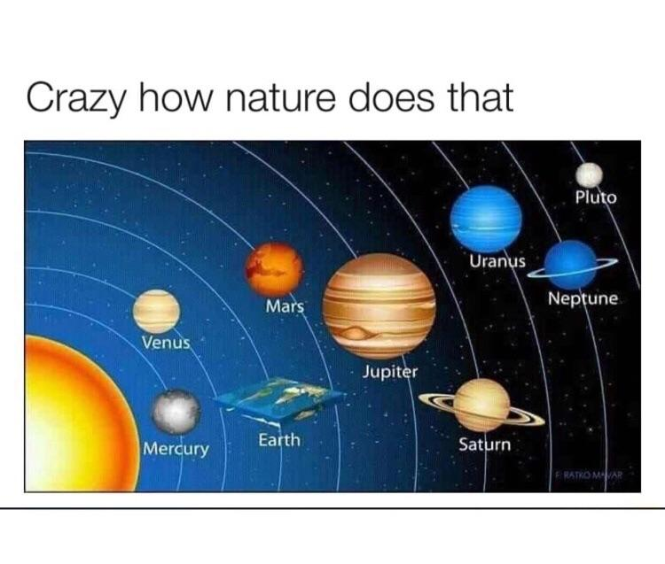
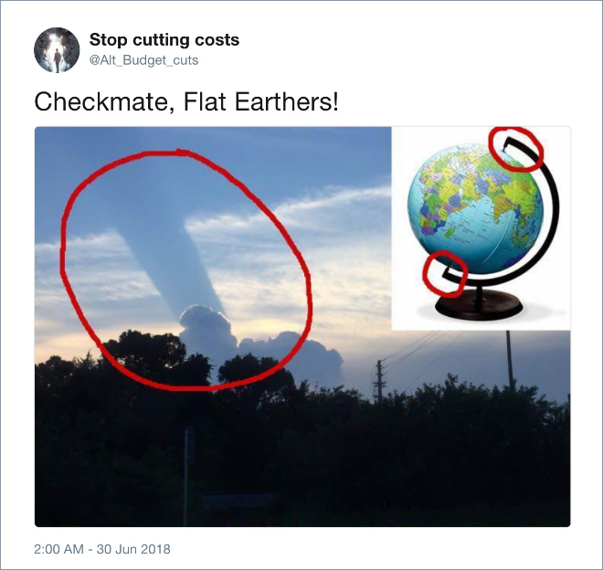
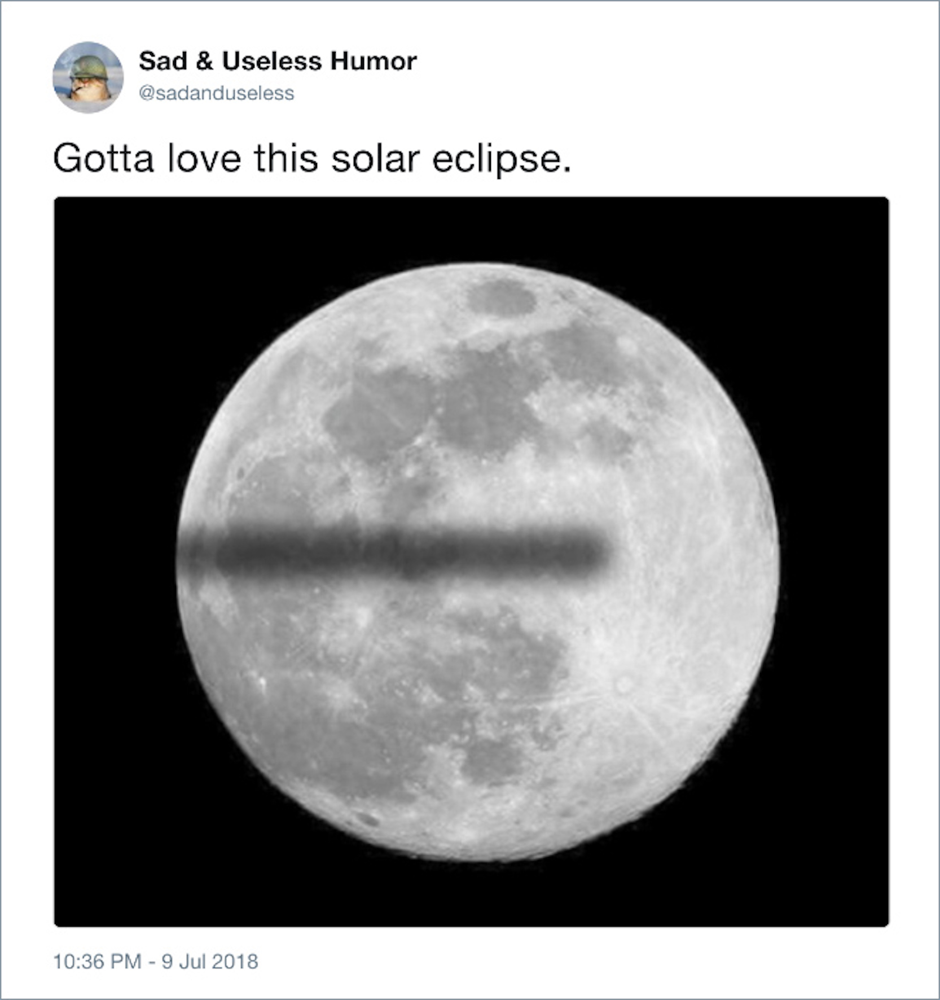

---
Pr-id: The Age of Total Images: Disappearance of a Subjective Viewpoint in Post-digital Photography
P-id: Theory on Demand
A-id: 35
Type: article
Book-type: anthology
Anthology item: article
Item-id: 05
Article-title: chapter 1
Article-status: accepted
Author: Ana Peraica
Rights: CC BY-NC 4.0
...

# Chapter 1: Flat Earth 

## New Flat Earthers 

At the time of this writing, people all over the world have celebrated the 50th
anniversary of Apollo 11, the famous spaceflight during which humans
first landed on the Moon. But there are still millions of people who are
skeptical that this Moon landing ever happened. In the past half century
of continuing space exploration, scientific records have failed to
convince a certain segment of the population to abandon their disbelief.
On the contrary, their skepticism has only increased, and not only
regarding our landing on the satellite Moon, but also the shape of the
planet Earth.[^ch01_1] In fact, a recent article published by *The Guardian*
newspaper refers to a YouGov poll which found that a third of all
Americans between ages 18 and 24 were unsure about the shape of our
planet.[^ch01_2] This is despite the vast amount of scientific proof that has
been provided over two thousand years by sources ranging from Pythagoras
to NASA. Other articles in the news media suggest that about two percent
of the population in the United States distrust the scientific fact that
the Earth is round.[^ch01_3] At first, this may not appear to be a
significant percentage. But when taking the entire United States into
account, two percent of the population refers to approximately 6.5
million people who do not believe that the Earth is round. And this
number does not appear to be decreasing. In the 21st century, the
theory that the Earth is flat has become the source of humorous Internet
memes. However, advocating this ‘flat Earth’ theory is far from
harmless.

Figure 3: Flat Earth internet meme.

Figure 4: Flat Earth internet meme.

Flat Earth theories are no mere comedy, and the argumentation which is
used in support of such theories must be taken seriously. As an
educator, I am convinced that such things should not go uninterpreted.
Thus, in this book I will ask the question: in the postdigital era, how
this division and interaction between human and nonhuman perception,
works on the rise of a belief in the flat Earth theory? As I begin to
explore this question, it is important to first define what is meant by
‘the flatness of the Earth’. In this book, I distinguish between three
positions: ontological, epistemological, and medial. From an ontological
position, to make the claim that the Earth is flat is to argue that our
planet is actually, in reality, physically flat. Those readers who are
convinced that this is indeed the case may stop reading now, as I will
not try to prove, and will do everything I can to disprove, such a
theory. From an epistemological position, to make the claim that the
Earth is flat is to argue not that the planet is flat, but that we may
experience it as flat, given a constrained view of the planet as a
whole. Such a theory would enforce relativist position in the theory of
knowledge, claiming that all our knowledge is partial and dependent of
our view-angle. And finally, from a medial position, to make the claim
that the Earth is flat is to argue that regardless of what shape the
planet does or does not in fact have, the only way we can approach its
shape is by the media, which determines our knowledge. In this case,
according to media theory, any flatness of the Earth is a problem of
mediation and the limitations of given media language. This media
position is the one which I will explore in this book. I will claim that
in post-digital media, the Earth is more frequently represented as a
flat plane than a round sphere and, further, that this process of
mediation eradicates the perspectival views of the human subject from
photography.

Throughout this book, in order to distinguish between the one and only
planet Earth and its many possible representations, I will use the
capitalized proper noun ‘Earth’ when referring to the planet and the
lowercase common noun ‘earth’ when referring to its representations.[^ch01_4]
In this chapter, I will begin to address this idea of the Earth and an
earth, laying down arguments for how the phenomenal world may appear to
be visually flat in the contemporary era, in order to be able to analyze
these representations in more detail in the upcoming chapters. My focus
in the first chapter will be on the question: How does our knowledge of
the Earth condition our representations for an earth and, vice versa,
how do these representations for an earth influence our knowledge of the
Earth?

Figure 5: Flat Earth internet meme.

Figure 6: Flat Earth internet meme.

##Down-Dimensioning 

Figure 7: The Cover of *Flatland* by William Abbott Abbott, 1884.

In order to understand the division between the reality of the planet
Earth which we inhabit and the ways in which one may perceive and
represent multiple earths, I will begin by introducing the novel
*Flatland*, written in 1884 by English schoolmaster and theologian Edwin
Abbott Abbott.[^ch01_5] Through the voice of his narrator, ‘Square’, Abbot
describes a hypothetical, multilayered universe. This four-dimensional
system has many populations living in it. They all live in the same
space and at the same time but are not necessarily able to perceive each
other. or the world works as hyperworld, in which, despite its
complexity, only one layer can be seen at the time. This is because each
group of beings is limited in the number of dimensions which they are
‘programmed’ to be able to perceive. That is, each class or demographic
of beings can only perceive one dimension less (-1) than it needs in
order to exist. In other words, in Pointland, a single being (the
universe in one) consists of a dot who has no dimension whatsoever. In
Lineland, beings are lines of a certain length who perceive themselves
as dots which have only a single dimension. In Flatland, which is more
advanced, beings have two dimensions and perceive themselves as lines.
Finally, in the last world described, the three-dimensional world of
Spaceland, is being clearly visible only from a next and fourth
dimension. However, Abbott does not elaborate on this last world in his
book, as obviously that is the space of the Square who would need to be
seen by someone in a higher dimension in order for his own world to be
defined. Reading the novel *Flatland*, we learn that the inhabitants are
confined to their world by their perception of that world, which
therefore does not necessary correspond to reality itself. Further, most
of the inhabitants stay assured and confident in the sense-data around
which they build their own understanding of the world. For example, in
Flatland, the inhabitants, like Square, perceive themselves as lines. To
be capable of distinguishing different shapes, some of which can be
dangerous, such as lines, the inhabitants introduce a strict law on the
colors they should be wearing. However, such a fully ordered world would
continue working according own principles in peace if there would not be
a main protagonist. Square somehow manages to grasp that there exists a
higher dimension beyond his direct and immediate experience, without
ever having directly perceived it, after establishing contact with this
dimension. And Square begins to share this knowledge with his fellow
citizens in Flatland. But because this population is not able to
perceive such a dimension for themselves, Square is misunderstood. And
the other inhabitants of Flatland fall back on their old belief that
there are hidden forces at work, controlling their world, rather than
dare to imagine that there is more to their world than meets the eye.
Abbott narrativizes this event through the character of the Cycle, who
rules Flatland, and prophecies the arrival of a new group of invaders,
giving the narrative both political and teleological significance.[^ch01_6]

Besides questions about how the world appears to Flat earthers, Flatland
tale also raises another question: how does the same world appear to
those who perceive an additional dimension? This question can be seen in
the way Sphere from Spaceland sees Square from Flatland: as a
two-dimensional spatial form, while Square from the Flatland sees
everyone in his land as lines. Sphere is thus empowered and can control
the population in the lower dimension, which, in turn is not able to
directly know the upper dimension. In the real, rather than fictional
world, each and every population must surpass its own image-space in
order to define where they live and their place in the world. In other
words, to define a space requires an additional dimension.[^ch01_7]

By stratifying dimensions in a formula ‘+1’, Abbott anticipates Austrian
mathematician and analytic philosopher Kurt Gödel’s incompleteness
theorem. Almost fifty years after Abbott wrote Flatland, Gödel argued
that in order to define a set we need at least one statement which does
not belong to that set and which cannot be proven by it.[^ch01_8] For Abbott,
such a mathematical statement is a dimension. Furthermore, Abbott’ novel
*Flatland* can also be read from the perspective of Benoit Mandelbrot’s
notion of the degree of resolution, to which I would come back later in
the book when I speak about scales of measurement.[^ch01_9] Here, the
perception of the size of an element, or its magnification, and
therefore the determination of whether something is a dot or a ball, a
line or a thread, depends upon the distance to it.[^ch01_10]

Abbott’s work reminds us not only on complexity of the world but also on
the cognitive distortion of individuals that might live in the
downgraded dimensions, under ideologies of any kind. In addition to
satirizing the stratification of the classes in Victorian society,
Abbott’s *Flatland* describes the ways in which religious practice and
cognitive ability may be entangled. To bring this discussion back to my
main theme about representing the shape of the planet, in Abbott’s novel
*Flatland* different population groups have different perceptions of the
world and experience the same world differently. An argument in favor of
the parallel existence of both conceptions of the planet is especially
visible in various phenomena lower dimension world ascribes to the
higher dimension one, decoding them as mystic. And indeed, by reviewing
the appearance in history of a thesis of the flat earth, even the
contemporary one, supports the thesis of the religious background of the
New Medievalism, I described in the Introduction.

##Debate on the Shape

The world described by Abbott has more dimensions than can be perceived
by its inhabitants. And for the most of human history, this has in fact
been the case. The people who lived in ancient civilizations such as
Egypt, Babylon, Mesopotamia, and early Greece thought that the world was
flat largely because they did not know about other places which were far
away.[^ch01_11] The territories which these peoples inhabited were relatively
small in size and thus appeared to be flat. It is no wonder then that an
idea of the Earth as flat is also present in writings of Thales,
Anaximander, Anaximenes, and other pre-Socratic philosophers. Their
ideas can also be traced in the writings of other authors. And the idea
of a flat Earth continued in works of Anaxagora, Leucippus, and
Democritus.

The idea of a spherical Earth originates in late Antiquity also with the
Greeks. It appeared in works by Pythagoras and Parmenides, followed by
the writings of Plato, Aristarchus, and Euclid. At 50 BCE Aristotle
formulated an argument which I will call the ‘argument from experience’
based on the observation that the stars ‘make it evident, not only that
the earth is circular, but also that it is a circle of no great size.
For quite a minor change of position to south or north causes a manifest
alteration of the horizon’, as he noted.[^ch01_12] Thus, Aristotle turned to
common sense, accessible and demonstrable types of evidence, and
empiricism. His claim was further proved by Erastothemes, whose
calculations Claudius Ptolemy later compiled in his *Almagest* or
*Syntaxis*.[^ch01_13] And Ptolemy’s as well as Aristotle’s description of the
world as a sphere would be generally accepted until the fall of the
Roman Empire.

But by that time, unfortunately, the idea that the world is flat came
back by way of the Germanic peoples that conquered Rome.[^ch01_14] This idea
aligned with the doctrines of Christianity which proposed the Earth as
fixed, immobile, and permanent. As such, a flat earth was soon accepted
in Christian societies. Because of its consistency of Christian dogma,
the idea become so popular that by the time of Saint Augustine it was
accepted as the only possible truth. And from the 4th to the 12th
century CE, only a few sources remain which questioned the shape of the
Earth.

The idea that the Earth is spherical in its shape was revived through
works by John Sacrobosco, Thomas Aquinas, Jean Buridan, and further
researchers whose names are today associated with the birth of modern
science, Galileo Galilei and Johannes Kepler. Yet, the processes of
again proving the thesis of a spherical Earth took centuries. It took
centuries for the sphericity of the Earth to be rediscovered. This was
first done by sailors who had direct experience with the shape during
their travels. As Richard Buckminster Fuller wrote:

> \[…\] the big thinking in general of a spherical Earth and celestial
> navigation was retained exclusively by the Great Pirates, in
> contradistinction to a four-cornered, flat world concept, with empire
> and kingdom circumscribed knowledge \[…\] Knowledge of the world and
> its resources was enjoyed exclusively by the Great Pirates, as were
> also the arts of navigation, shipbuilding and handling, and of grand
> logistical strategies and of nationally-undetectable, therefore
> effectively deceptive, international exchange media and trade
> balancing tricks by which the top pirate, as (in gambler’s parlance)
> “the house,” always won.[^ch01_15]

Indeed, it took even longer to prove for a second time that the Earth is
round than it did to conceive that the Earth is flat.

Figure 8: The Flat Earth map drawn by Orlando Ferguson in 1893.

In the centuries that followed, the roundness of the Earth became an
axiom of modern science. It was an unquestionable fact. At least, that
the Earth is round was a fact until some researchers began to challenge
it again. Samuel Birley Rowbotham-Parallax with *Zetetic Astronomy:
Earth Not a Globe* (1865), Alfred Russel Wallace with *Water Not Convex,
the Earth is not a Globe* (1870), and William Carpenter *One Hundred
Proofs the Earth is Not a Globe* (1885), for example, again started to
cultivate the idea that the Earth has a flat surface. Today, a sect of
the Flat Earthers even continues to use and expand upon arguments from
Wallace, Parallax, and Carpenter. Today the idea of the flat Earth is institutionalized by the
Flat Earth Society, as well as the members of other formal and informal
organizations, which promote the idea that the world is flat.[^ch01_16]
Besides holding meetings and attending conventions, promoters of this
idea also run several YouTube channels.[^ch01_17] Marc Sargent, a key figure
in the so-called Flat Earth Movement in California, is pictured at
conventions standing in front of an image of a flat earth, as he
describes the planet as being similar to this flat image, advocating for
such a flatness as an ontological conception.[^ch01_18] In just the last few
decades, this theory has gained a particularly large amount of
attention, reaching a peak in February 2019 according Google
trends[^ch01_19].

Figure 9: Azimuthal equidistant projection.

## Ontological Conception

Five hundred years after the Copernican Revolution, in which our
understanding of the solar system shifted from a Ptolemaic to a
heliocentric model, and the likes of Marco Polo, Christopher Columbus,
Bartolomeu Dias, Vasco da Gama, and Amerigo Vespucci, who sketched
sections of the planet after their long sails, we once again find
ourselves faced with the growing belief that the world is flat.[^ch01_20] The
comeback of the flat Earth conception of the planet may be related to
the rebirth of other Scholastic *doxa* or opinions, a kind of New
Medievalism, if you will.[^ch01_21] The relationship between such doxastic or
belief-based arguments and the Flat Earth Theory is quite evident. For
example, Flat Earthers rephrase the ‘Intelligent Design’ argument, which
refers to the existence of higher intelligence on the basis of
perfection of the world.[^ch01_22] This theory underlines, in essence, an
ontological idea that derives from a utilitarian principle which states
that everything in this world happens or exists for a reason or is
designed with a reason. From the ontological position of the Flat
Earthers, a spherical world would be impractical to use by God, here
pictured as a limited physical being, in his observation of humanity
because God would not be able to see everywhere all at once on a sphere
as easily as he would on a plane. Because it is implausible to think
that God would create a world which he cannot use, a spherical world
does not have a reason to exist. Some authors also find lines in support
of the flat earth theory in the Bible.[^ch01_23]

As presented in online videos, other arguments used by the Flat Earthers
to support their version of Intelligent Design are based on the direct
subversion of scientific authority, or by demonstrations of arguments
against scientific axioms.[^ch01_24] In addition to denying the shape of the
planet, Flat Earthers also deny certain axiomatic scientific knowledge,
such as the theory of gravity. Moreover, they propose pseudo-academic
theories to explain how things do not fall off the planet. To resolve
this problem, for example, they introduce a theory of continuous lifting
of the Earth’s crustal plates, which draws objects down to the ground by
their own weight and its force. This concept is also believed to explain
how water from oceans does not spill off the edge of the Earth.[^ch01_25]

The Flat Earthers, while advocating for their own representation and
conception of the Earth, also discredit the images from scientific
authorities which do not show the planet as being flat in shape. To
these sphere-sceptics, photographs of the planet do not and cannot prove
its dimensionality. Instead, they argue, these images depict the Earth
as a flat plane. And any image that shows otherwise must have been
either fabricated or manipulated. To conspiracy theorists with a strong
distrust in science, NASA is often the prime suspect or public enemy
number one. Flat Earthers even directly accuse this independent agency
of being the puppet-master behind the conspiracy of the so-called
‘spherical Earth’, and of secretly trying to control people through its
fake images of the Earth taken from space and by satellite.

## Media Argument 

The skeptical attitude of the Flat Earthers is reinforced by the fact
that, among the images of the Earth which are taken from outer space,
there are two principle types: images which are made using powerful
telescopes, and images which are visibly fused together from more than
one picture in order to produce a more encompassing view.[^ch01_26] Much of
the variation between photographic representations of the planet can be
explained by differences in the technology used to create the image,
especially the lens. Moreover, as not all the parts of the Earth can be
clearly seen from the point of view of a satellite or satellite system.
Due to the presence of clouds, barriers, shadows, or reflective
surfaces, there are always places in an image which must be completed or
reconstructed. Indeed, since The Blue Marble image of the Earth was
taken on December 7, 1972 from a distance of about 29,000 kilometers
from the planet’s surface by the crew of the Apollo 17 spacecraft, most
images released by NASA have been composites made from satellites at
shorter distances. In point of fact, while telephoto lenses cause less
distortion than wide angle lenses, they nevertheless produce notable
alterations to the measurement of reality by introducing an inherent
flattening distortion. That the Earth looks like an eating plate in
these images is a frequent objection made by Flat earthers, who notice
variations in the sizes of the Earth as a whole, as well as its parts,
but also in terms of color.[^ch01_27] Yet curiously enough, it was the
original photograph, and not the constructed photographic assemblages,
made on the photographic base, which had this visual flattening effect.
Thus, paradoxically, according the advocates for flat Earth theory, if
the image of the planet is recorded using a telephoto lense, then it is
shown as flat, but if it is made using a composite technique, then it is
untrustworthy. In comparison, composite photography, which combines more
than one photographic source into a single image, helps to create an
image of higher resolution, which is also sharper, thereby avoiding the
effect of making the Earth look like a flat round plate which is used
for eating or serving food.

The bigger problem, however, is that some images of the Earth are not
genuinely photographic but rather blended content. This can be done for
many reasons. For example, clouds may have obscured the view, such that
the image had to be ‘restructured’. Or the recording device may have
been too near to the ground. Compositing images which have been taken at
different times, and from various angles, distorts the relationship
between the subject position and the object recorded, a relationship
defined through focal distances, depth of field, and order of planes.
Moreover, in such an image, the position of the subjective view is
altered, and its original perspective is changed. What is problematic in
this is that the photographic image, which historically has been taken
to be indexical in relation to its reference, has been turned into a
composite, which serves another purposes, as for example navigation.
Although keeping the persuasive element of photographic image, these new
combo-images distort the photographic description of the visual
qualities of the photographic object, in a way other than by
photographer decision-making or in photographic postproduction.

## +1 Dimension Perspectives 

Yet another change in how the photographic space is being distorted
comes from the introduction of new ways in which to combine images by
merging materials together that have different qualities. Today, the
subjective view of the photographer and, therefore, for the viewer of
the photograph as well, has been largely eliminated in order to produce
a more ‘neutral’ view, contrary to previous use of perspectival system.

As Friedrich Kittler defines, perspective is a code for a transmission
among objects and subjects.[^ch01_28] Perspective system defines the space as
well as the distance between objects. It not only serves representation
but also metering of reality which is projected onto the flat screen or
a ‘veil’ as Alberti names it.[^ch01_29] Through a perspectival system,
distance can be measured by the size of the objects relative to the
vanishing point, which is usually located on horizon.

In linear perspective, a vanishing point is needed to separate image
from reality, as it provided a way of measuring in terms of distance,
size of objects, and the ratio between these elements. All measurements
in Western, linear perspective, are both fixed and calculable. For this
reason, a perspectival system can assist in the development of precise
knowledge about the reality which is being represented. And because of
this, perspective has long been at the center of research in science and
technology.[^ch01_30] Such an understanding of space continued to be present
in succeeding technologies based on mirrors and mirror-reflex systems,
leading to a line of historical development and media evolution from the
camera obscura to photography.[^ch01_31]

In principle, for more than a hundred-and-fifty years, photography has
served as a device of recording (and actually storing) physical reality,
being an epistemic tool by which we access it, in which it
simultaneously functions as a medium of transmission and a temporary
screen The limits of the world are no longer the limits of the language,
as Ludwig Wittgenstein noted, but ones of the physical screen. [^ch01_32]
Contemporary visualizations, which are tied to the screens which display
an image, even when exhibited or projected within a three-dimensional
environment, reinforce this idea that the Earth and its spaces are flat
by constructing those spaces within the orthogonal lines of a
perspective system. And even though images of the planet may represent
it as a sphere, they are screened and printed on flat media such as
paper or screen. Indeed, the digital world does not allow us a view
which encompasses depth or distance. The flatness of the screen only
supports the idea that the dimensionality of the world is just an
illusion of perception, as virtual reality.

Virilio observes that in post-digital images ‘depth no longer includes
the visual horizon, nor the vanishing point of perspective’, but rather
time becomes the most essential and important dimension.[^ch01_33] Our eyes
move to analyze the space, not only orthogonally but also in depth, by
focusing on various distances. But the interface, as a temporary image
interaction, is also connected to our understanding of space as well as
of time. The speed of the signal through the Internet or from a
television network, as well as the speed with which this signal is
carried through the device itself, has a temporal quality. This leads to
the progressive disappearance of space-time, providing no illusion that
the Earth is a sphere and that, hypothetically, one could travel around
it endlessly, thereby introducing not only the idea of the finiteness of
the planet but also the finiteness of the view. According to Virilio,
this acceleration towards instantness has destroyed the fixity of both
space and its visualizations.[^ch01_34] Our four-dimensional world, with its
three dimensions of space (height, width, depth), as well as the
temporal dimension, thereby becomes fixed or flattened.

The disappearance of perspective systems and the positioning of the
subject in relation to the image has lead to two phenomenon: first, the
absence of a measurement of distance between the subject and the
environment in the representation of space; and second, the separation
between a subject and objects. This denial of perspective in
post-digital photography disturbs our processes for rationalization of
the world. ‘Distances are no longer situated in any depth of field or
“perspective”’, as Paul Virilio concludes.[^ch01_35] Further, the use of
various technologies for transportation, such as airplanes, cars, trams,
and subway systems, as well as various technologies for communication,
such as cellphones, the Internet, and videotelephony, are all so
pervasive that it distorts our intuitive, embodied knowledge of space.

[^ch01_1]: See for example: Bill Kayasing, *We Never Went to the Moon:
    America’s Thirty Billion Dollar Swindle*, CreateSpace Independent
    Publishing Platform, 2017.

[^ch01_2]: Trevor Nace, ‘Only Two-Thirds of American Millennials Believe the
    Earth Is Round’, *Forbes,* 4 April 2018, https://www.forbes.com/sites/trevornace/2018/04/04/only-two-thirds-of-american-millennials-believe-the-earth-is-round/.

[^ch01_3]: Richard Sprenger, James Bullock, Alex Healey, Tom Silverstone and
    Katie Lamborn, ‘Flat Earth Rising: Meet the People Casting Aside
    2,500 Years of Science’, *The Guardian,* 5 February 2019,
    https://www.theguardian.com/science/video/2019/feb/05/flat-earth-rising-meet-the-people-casting-aside-2500-years-of-science-video.

[^ch01_4]: I refer here to the distinction Hubert Damisch made in his
    analysis of the visuality of clouds, using the formula /c/loud
    whenever he referred to its representation. See: Hubert Damisch,
    *Theory of the /c/loud*, Stanford, California: Stanford UP, 2008.

[^ch01_5]: Edwin Abbott Abbott, *Flatland: A Romance of Many Dimension*s, new
    introduction by Thomas Banchoff, New York and Dover: Princeton
    University Press, 1993.

[^ch01_6]: Abbott’s work reminds us not only on complexity of the world but
    also on the cognitive distortion of individuals that might live in
    the downgraded dimensions, under ideologies of any kind. In addition
    to satirizing the stratification of the classes in Victorian
    society, Abbott’s *Flatland* describes the ways in which religious
    practice and cognitive ability may be entangled.

[^ch01_7]: Thus, Bernhard Riemann assumed the fourth dimension in defining
    the mathematics of the real space.

[^ch01_8]: Also known as the Gödel’s second theorem.

[^ch01_9]: Rhonda Roland Shearer, ‘From Flatland to Fractaland: New
    Geometries in Relationship to Artistic and Scientific Revolutions’,
    *Fractals* 3.3 (1995): 617-625.

[^ch01_10]: Abbott’s understanding of epistemology in terms of geometry also
    had a direct impact on Einstein’s theory of relativity, as well as
    theories of hyper-dimensionality. R.R. Shearer, ‘From Flatland to
    Fractaland’.

[^ch01_11]: For more see: Dirk L. Couprie, *When the Earth was Flat: Studies in Ancient Greek and Chinese Cosmology*, Berlin: Springer, 2018.

[^ch01_12]: Aristotle, *On the Heavens*, part 13.

[^ch01_13]: Aristotle’s idea
    that that the Earth is a sphere not only competed with the idea that
    the Earth is flat, but also the idea that the Earth is a disc,
    presented, for example, by Thales, Anaximenes, Xenophanes,
    Anaxagora, Archelaus, Leucippos, and Democritus.

[^ch01_14]: For the history of the flat earth idea see Christine Garwood,
    *Flat Earth: The History of an Infamous Idea*, Thomas Dune Books,
    Macmillan, 2008.

[^ch01_15]: Richard Buckminster Fuller, *Operating Manual for Spaceship
    Earth,* Operating manual for the spaceship Earth, Lars Muller, 2008,
    9.

[^ch01_16]: Curiously enough, the segment of the population which believes
    the Earth is flat has announced their expedition to the North Pole
    in 2020, which reminds one of the expedition by Charles Marie La
    Condamine, Louis Godin, and Pierre Bouguer around the Earth in order
    to measure the Equator in 1735-7.

[^ch01_17]: These YouTube channels include, for example, ‘Globebusters’*,*
    https://www.youtube.com/playlist?list=PLTgEApRWdweuqSBj3H7qV\_GmggIJHz4ah.
    There are also web pages such as ‘Testing Globe’,
    www.testingtheglobe.com.

[^ch01_18]: See: Mark Sargent, *Flat Earth Clues: The Sky's The Limit*,
    Booglez limited, 2016.

[^ch01_19]: According Google Trends, the major interest in flat Earth was by
    inhabitants of New Zealand, followed by Australia and United States.
    See: https://trends.google.com/trends/explore?q=flat%20earth.

[^ch01_20]: This theory is challenged by Jeffrey Burton Russell states, ‘five
    hundred years after Christopher Columbus’ who claims the idea of the
    backward Medieval ages was introduced by Darwinists who wanted to
    stigmatize critics of their theory. Columbus, according Russell did
    not prove the Earth was round as it was already an accepted theory.
    Jeffrey Burton Russell, *Inventing the Flat Earth: Columbus and
    Modern Historians*, New York, Connecticut and London, Praeger, 1991.

[^ch01_21]: Among definitely medieval beliefs surely is the one by Gregory
    Garrett defining the new age as Era of New Luciferianism. See:
    Gregory Garrett, *The Flat Earth Trilogy Book of Secrets I*, Gregory
    Lessing Garrett, 2018.

[^ch01_22]: The Argument of Intelligent Design is derived from Descartes’
    *Mediations*, in which, by the very end of the argument he resolves
    the total skepticism by stating that the world is conceived so
    intelligently that it would be impossible it was not designed by a
    higher being. See Daniel Dennett, ‘Descartes’ Argument from Design’,
    *The Journal of Philosophy* 7 (2008): 333-346.

[^ch01_23]: See for example arguments of Eric Tabborn, *PROOF: Does God Say the Earth is Flat?: Ending the Debate Between the Flat Earth vs. the Globe*, publisher unknown, 2018. 

[^ch01_24]: See: Elaine Chadwick Clanton: *Flat Earth for Dummies 101:
    Definition of Dummy: Indoctrinated in Globe from Birth*, Elaine
    Chadwick Clanton, 2018; Brett Salisbury, Dr. Lawrence Cohen, Dr.
    John Mack, Captain Obvious, *Spherical Trigonometry for Dummies*,
    Createspace Independent Publishing Platform, 2015*.*

[^ch01_25]: For more arguments see: Kaleb Shuttleworth, *Planet or Plane?: A
    Debate of the 'Flat-Earth' Hypothesis*, unknown publisher, 2018.

[^ch01_26]: Today, images of outer space can be realized from Earth using
    super-powerful telephoto lenses the shaft for which can range up to
    seven meters in length. See for example Pan-STARRS camera, the
    largest digital camera in the world, and for astronomic/space data
    https://panstarrs.stsci.edu/

[^ch01_27]: This peculiar distortion of telephoto lenses and reality metering
    was analyzed on the Mantegna’s foreshortening of the body of Christ,
    in the image of Christ in the temple, by Richard Latto and Bernard
    Harper. ‘The Non-realistic Nature of Photography’, *Leonardo* 40.3
    (2007): 243-247.

[^ch01_28]: Kittler, *Optical Media*, 208.

[^ch01_29]: Flat screens also function aesthetically, as in the way Alexander
    R. Galloway defined ‘intraface’: ‘The *intraface* is the word used
    to describe this imaginary dialogue between the workable and the
    unworkable: the intraface, that is, *an interface internal to the
    interface*. The intraface is within the aesthetic. It is not a
    window or doorway separating the space that spans from here to
    there’. Alexander R. Galloway, *The Interface Effect*, Cambridge and
    Maiden, Polity, 2012, 40, original italics.

[^ch01_30]: Samuel Y. Edgerton, *The Mirror, the Window, and the Telescope*:
    *How Linear Perspective Changed our Vision of the Universe*, Cornell
    University Press, 2009; Martin Kemp, *The Science of Art: Optical
    Themes in Western Art from Brunelleschi to Seurat,* Yale University
    Press, 1992.

[^ch01_31]: See Anne Friedberg, *The Virtual Window: From Alberti to
    Microsoft*, Cambridge, MA: MIT Press, 2009, 39 and 61.

[^ch01_32]: Ludwig Wittgenstein, *Tractatus Logico Philosophicus*, London:
    Routledge, 2001, 68.

[^ch01_33]: Virilio, *Lost Dimension,* 66.

[^ch01_34]: Virilio, *Lost Dimension*.

[^ch01_35]: Virilio, *Lost Dimension*, 103. Thus, Virilio introduces two
    points: a false perspective and a negative horizon. A false
    perspective is ‘opto-electronic pseudo-perspective’, ‘a fantastic
    acceleration perspective, one ruled less by the vanishing point than
    b the simultaneous vanishing of all points…’. And a negative
    horizon, still, is based not on direct visuality of night and day,
    but indirect visuality. Virilio, *Lost Dimension*, 114.