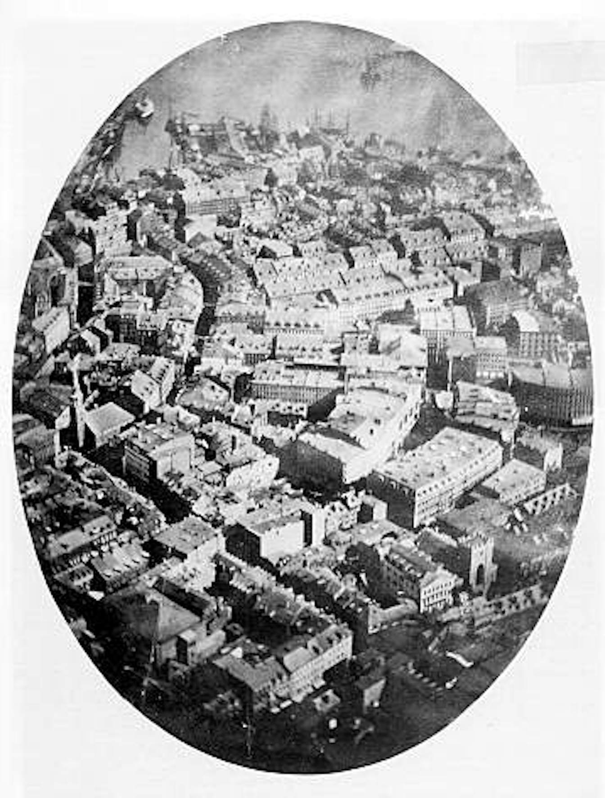
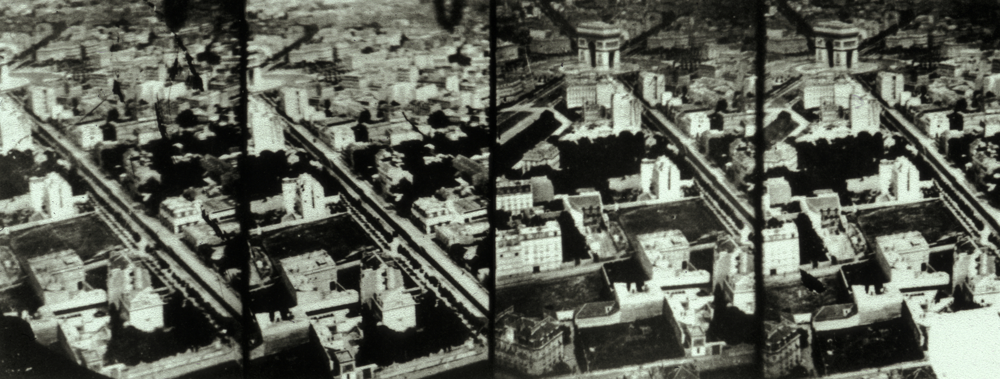
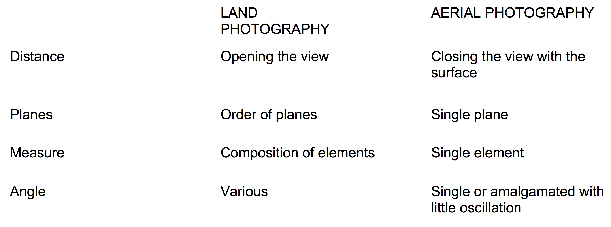
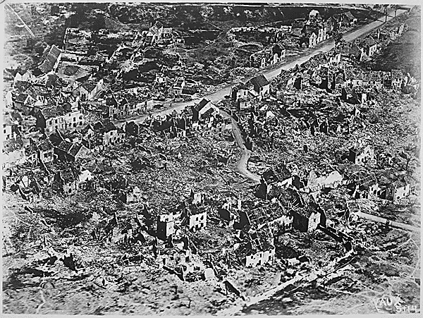
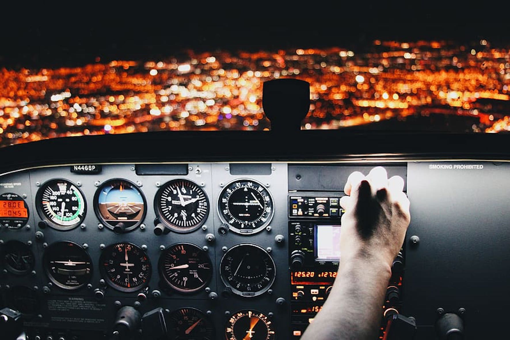

---
Pr-id: The Age of Total Images: Disappearance of a Subjective Viewpoint in Post-digital Photography
P-id: Theory on Demand
A-id: 35
Type: article
Book-type: anthology
Anthology item: article
Item-id: 07
Article-title: chapter 2
Article-status: accepted
Author: Ana Peraica
Rights: CC BY-NC 4.0
...

# Chapter 2: View from Above

## The Control-View 

A view of the Earth as seen from up above flourishes in contemporary
science and technology. Yet it can be traced back to the origins of
human culture. Such a view has held special importance, for example, in
the Egyptian idea of ‘The Eye of Horus’ as well as the Catholic idea of
‘The Omnipresent Eye’. Many authors from antiquity to today have written
about such an ‘Eye in the Sky’, including Hesiod, Callimachus,
Theocritus, Heliodorus, Diodorus Siculus, Plutarch, Pliny the Elder, and
Aulus Gellius. Indeed, as Hubert Damisch noted the metaphor of a god as
an all-seeing architect has existed since long before Plato’s
description in the *Timaeus*, in which god is described as a lonely
being creating the universe.[^ch02_1]

Further, an aerial view, or viewpoint seen at a high elevation, has
existed in some form even before the invention of technologies for
flight, although only at the level of predicting such a way of seeing.
As shown in archaeological artefacts, this bird’s eye view was already
introduced to visual culture in the Neolithic Age.[^ch02_2] And over six
thousand years later, during the Renaissance, it developed further into
a mathematically-based means of perspectival construction, which in turn
influenced the development of the discipline of cartography.[^ch02_3] At the
time, an aerial or bird’s eye view was of course impossible. Besides
perching at the summit of a mountain or atop a building, humans were
contained to a pedestrian or street-level point of view. Leonardo
Bufalini in *Roma* (1551), Etienne Dupérac in *Nova Urbis Romae
Descriptio* (1577), and Antonio Tempesta in *Recent prout hodie iacet
almae urbis Romae cum omnibus viis aedificiisque prespectus
accuratissime delineatus* (1593), all imagined the city of Rome from
above. The images by Bufalini, Dupérac, Tempesta, and others, while not
entirely abstracting their point of view as in a high angle oblique,
employed a low angle oblique to depict Rome from a perspective much
higher than that which was physically possible in their day. The motif
was simple: to represent an entire city or large structure all at once.

In order to imagine an objective space, a culture has to have an idea of
the absolute or total one. Absolute space consists of those parts of
space that are experienced by the viewer as well as those part of space
that are non-experienced. Such a space is said to exist a priori, a
prerogative of any perception of the given (visible) space in
particular. It is a space which Wilhelm Wurzer defines through concepts
of a priori perception and ‘transcendental apperception, by which
defines a priori perception’.[^ch02_4] James Elkins claimed the idea of the
absolute space did not exist as a concept in Renaissance, which was to
re-invent perspective, but emerged latter.[^ch02_5] Many authors refer to the
rise of the absolute space in Baroque illusionist paintings as
envisioning something like an aerial view. Certainly, the absolute space
of the Baroque period was connected to ideas of absolute power,
coinciding with a fully analytical perspectival model, Cartesian dualist
philosophy, and the rise of the idea of panoptic control. Martin
Heidegger referred to such a view as the rise of modernity itself.[^ch02_6]
It was by the end of the 18th century, he noted, that people began to
conceive of the world as such.[^ch02_7] Although Heidegger made no mention of
totality, he described the subjective view of the ‘world picture’
(*Weltbild*) for a given era, an image of what is not only seen but also
grasped as the whole. ‘The world does not change from an earlier
medieval into a modern one, but rather the fact that the world becomes
picture of all is what distinguishes the essence of the modern age’, he
specified.[^ch02_8] Yet this picture is not complete, because it is developed
in parallel to the subjectivization of the human.

As with all general theories, the world soon again became fragmented.
Relativism arose around 1620 in the Netherlands and reached its peak in
German and British Romanticism. When applied to images of the Earth, as
Christine Buci-Glucksmann analyzes, relativism predominantly describes
the point of view and the angle of view, which later was reformulated
into the epistemic perspectivism used in the wider implementation of
world explanation with it.[^ch02_9] An interest in maps was replaced by the
one more into intimate genre of the landscape. During Romanticism, the
genre of the landscape was the most popular way to represent space,
highlighting the position and interpretation of space through the
placement of the viewer. Some new geographic systems were introduced,
enforcing geocentrism, but also homocentrism and egocentrism.[^ch02_10] They
were consequences of the ‘Copernican turn’, commonly defined as this
positioning the subject at the very center of not only epistemology,
enforcing ontology based on a mere experience or phenomenology
(including consequently, science).[^ch02_11] With the innovation of flight,
however, Baroque idea of absolute space would again be revived.

## Early Flights

Taking images from the air was already a
practice in the 18th century with the early tests of hot air balloon
flight. In America, Benjamin Franklin was the first to witness the
flight of a balloon, he wrote in his notes.[^ch02_12] In France, the
Montgolfier brothers invented the first practical hot air balloon and
succeed in lifting themselves up off of the ground in 1783.[^ch02_13] And two
years later, American pioneering balloonist Thomas Scott Baldwin
described balloon flight in detail in his *Aeropaidia*.[^ch02_14] This book,
besides describing general phenomena connected to flying, pointed out
two visual phenomena that occurred along with the increased elevation of
the viewpoint from the Earth’s surface: confusing distortions of
measurement due to the curvature of the Earth, and changes to the colors
of the Earth as a the result of atmospheric density. The photographic
genre of aerial photography, when it fully emerged in the 19th
century, had to address both of these visual phenomena and their
respective image distortions.[^ch02_15]

Figure 12: James
Wallace Black, *View of Boston*, 1860.

The first aerial record to be made during a flight was taken only in
1857, some twenty years after the invention of photography.
Gaspard-Félix Tournachon, known by the mononymous pseudonym Nadar, took
this photograph while flying over Paris in his balloon. Unfortunately,
the technological constraints of the time, when photography was still at
its early stages of development, resulted in several difficult
conditions for taking the picture. The exposure time could last up to
twenty minutes (when using the wet-plate technique).[^ch02_16] Besides this
slow exposure, chemical instability might also be one of the reasons
that Félix Nadar’s earliest photographs have not survived. As Stephen
Bann explains, ‘the gas \[...\] from the balloon reacted with the
emulsion of photographic plates, and the result was a blackened
image’.[^ch02_17] The oldest surviving aerial photograph, therefore, in fact
dates to three years later. It was recorded by James Wallace Black while
flying in a hot air balloon over the city of Boston in the US.[^ch02_18]
Wallace’s photographs were shot in a low oblique view which distorted
the space depicted in the image. Further, Wallace merged aerial
photographs taken from different locations during his flight, producing
a kind of perspectival amalgam. A significant amount of information was
lost from the corners of these aerial photographs. This was due to the
relative positions of the many different points of view, in relation to
the curvature of the Earth’s surface, the curvature of the camera’s
lens, as well as the distance between the camera and the subject. Given
the long exposure time for these aerial photographs, these factors
shortened the depth of field. Consequently, the resulting amalgamated
images have faded edges, indefinite border, and vignette shape. Besides
these spatial and temporal distortions, the overall sharpness of the
image was also low and the exposure uneven, because some parts of the
photograph were overexposed and other parts were underlit. Nevertheless,
the end result was far more chemically stable than with the first aerial
photograph taken by Nadar.

Figure 13:
Gaspard-Félix Tournachon Nadar, *Aerial view of Paris*, 1868.

In aerial photography, depth is fixed on the object. The horizon is that
of a high oblique taken with the camera inclined about sixty degrees
from the vertical. And the vanishing point is that from a linear
perspective, which creates the illusion of a flat surface. To a certain
extent, this is similar to how space was interpreted in the 15th
century, an absolutistic rhizome seen from the perspective of a singular
authority or viewpoint.[^ch02_19] Since then, however, new techniques of
image-making have been developed which bypass the limitations of a
human-based point and angle of view, which relies today not upon the
integration of multiple viewpoints but rather their computation. In the
19th and 20th centuries, innovation in aerial imaging technologies
led to a new kind of totality, the totality of a computational view of
the world. And because this was not possible on the basis of any one
point or even angle of view to reach it, new technologies have been
created in order to compute recorded sections into a whole.

Although Nadar’s earliest aerial photographs have not survived, so that
Wallace’s aerial photographs are the are oldest which are today extant,
Nadar himself found a unique solution to the problem of perspectival
distortion: to employ sequential recording. Therefore, in a way, he
produced the first computed total image, and did so solely using
analogue photographic material. Such a way of recording, Nadar found, to
some extent corrected both the curvature of the Earth as well as the
problem of distributed points of view. This photomontage produced a more
map-like appearance to the aerial shot. Nadar’s technique was followed
by that of Arthur Batut, who went even further, carrying with him into
the sky a camera as well as an altimeter in order to measure the rate of
exposure for the photographic plate. Batut invented a process of image
correction for the raw aerial photograph by making an effective altitude
map. With this proto-computational process, Batut’s images would
influence the birth of the orthophoto method, leading to maps which are
produced from the original aerial photographic source, rather than just
measurements of the land from the ground.

With the further development of technologies for flight across the late
19th and early 20th centuries, photography from the air became
increasingly accurate. In Germany, Ferdinand von Zeppelin pioneered the
first rigid-structure airship between 1874 and 1893. In the succeeding
years, the Wright brothers in America continued to experiment with
flight, building the world’s first successful airplane, and undertaking
the first flight in 1903. Their endeavors led to the accelerated
development of a new aerial industry. And the first airplanes were
tested by 1906.[^ch02_20] Thus, historians usually consider military aviation
to have already been born by 1880, but it would not really be developed
until a short time period twenty-years before World War I. After WWI,
photographic technology was also miniaturized, so many planes were
supplied with cameras.[^ch02_21] In such military context, aerial photography
took over the role of the map, with each subsequent technological
innovation respectively informing use .[^ch02_22] For example, the
stabilization of flights in turn led to a better quality of record and,
eventually, to the automation of recording. In this regard, one crucial
test was Oscar Messier’s flight with an airborne camera. With the full
integration of automated recording, the military also began to use
aerial cameras to document the battlefield. And the numbers of such
photographs grew rapidly. By 1915, the British army, amidst war with the
Germans, shot about 1500 photographs in the field, making The Great War
also the first war to encompass an ‘image–coordinated action’.[^ch02_23]
Indeed, the innovation of this technology changed the entire course of
WWI, as Peter Sloterdijk claims, because the target was no longer a
person, but the landscape.[^ch02_24] Since WWI and WWII, the military
industrial complex has remained the largest investor in the research and
development of aerial photography. This funding, in turn, has led to the
complete panopticonisation of the land through photographs taken from
the sky.

And, unfortunately, these techniques were soon used for the purposes of
military intervention within the urban landscape. For example, Lucien Le
Saint, who worked for the army, was on the team which documented the war
damage. And in his film *Aerial views of Ypres* (1919), he recorded a
completely destroyed or flattened city.[^ch02_25] The power of such new
aerial photography came into full force by WWII, when many cities were
not only bombed, but this bombing was also simultaneously recorded.[^ch02_26]
Indeed, as Antoine Bousquet points out, ever since WWII we can speak of
a ‘martial gaze’ which combines photographic technology with the
purposes of military perception, used in order to attack or defend.[^ch02_27]
Apart from such visual phenomena, as Jussi Parikka also observers, when
aerial photography is applied in concert with aerial bombardment, the
landscape is not only literally flattened, but also represented as being
flat.[^ch02_28]

Table 2: Changes to image elements caused by
shifting the point of view from land to air.

## Expanding the Game? 

Aerial photography would become one of the most important photographic
genres of 19th century and would in turn inform the genres of other
artistic mediums. Besides Nadar, more and more artists were becoming
interested in making photographic records during flight.[^ch02_29] At the
beginning of the 20th century, at the early stage of aerial
photography, some famous photographers even joined the air force in
their respective countries so that they could have the opportunity to
take such pictures. This included American photographer Edward Steichen,
a pioneer in aerial intelligence during the WWI. The images recorded by
Steichen brought a further aesthetic element to this view from above, an
abstraction of territory, elevating not only the sensory perspective but
also the social position of the viewer.[^ch02_30] The effects of such images
on the general public, who themselves did not yet have their own
experiences of flight, as many if not most of us do today, was
significant enough that the famed author and benefactor to the arts
Gertrude Stein was herself convinced that the aerial view influenced the
rise of abstraction in painting.[^ch02_31] As Siegfried Kracauer later noted,
‘The ornament resembles aerial photographs of landscapes and cities in
that it does not emerge out of the interior of the given conditions, but
rather appears above them’.[^ch02_32] Aerial photographs actually look more
like maps, or what Claire Reddleman terms ‘cartographic
abstraction.’[^ch02_33]

Figure 14: Edward
Steichen, *Aerial view of ruins of Vaux*, France, 1918.

In fact, artists were fascinated by modern technologies for flight in
particular and aeronautics in general in many artistic and social
movements of the early 20th century. To name but a few, Constructivism
which originated in Russia and influenced the Bauhaus and De Stijl
movements, and Futurism which originated in Italy, were in one way or
another centered around the idea of the human surpassing his earthly
conditions and limitations to finally overtake the position once
reserved for the gods. Suprematists, in particular, were perhaps most
fascinated by this ‘new dimension,’ and introduced an aerial-like
imaging. In Russia Kazimir Malevich gave a speech praising aerial view
aesthetics.[^ch02_34] In 1916, Vassily Kandinsky painted *the Red Square from
Above*, a painting said to be composed from a ‘collapsing perspective,’
as if the artist was standing in the middle of the square.[^ch02_35]

Further exemplifying the appropriation and integration of the bird’s eye
view from aerial photography in other art forms and medias, in Hungary,
László Moholy-Nagy, while not taking to the skies himself as did many
other artists, used aerially recorded city imagery.[^ch02_36] At the
beginning of his movie *Impressions of the Old Part of Marseille*
(1929), Moholy-Nagy displayed a map of the French city of Marseille. In
succeeding shots, this map is then cut with a hole in the middle in
order to allow a view of the harbor. Seen through the hole, the first
shot is an aerial one, followed by shots of street angles. Throughout
the film, records from the sky are superimposed onto those at street
level, contrasting corrected and purified aerial vision from approximate
angular view and land view. Aside changing positions in heights,
Moholy-Nagy also shifted details, as for example portraits and
generalized views from above, strongly dividing the private vs objective
story, but also realistic vs abstract field.[^ch02_37] He used aerial shots,
and the interchange between wide-views and close-ups, to depict
different places of the harbor from the seashore to small dirty
streets.[^ch02_38] At certain moments, the film camera surveilled the local
population in upper view close-ups from the window. The aerial view here
contributed to a modernistic, abstract-geometric layout, especially in
places where the camera focused on the construction of building systems,
such as bridges and various console type of supports as pillars. This
‘Icarian’ view did not only have an influence on artworks by artists
such as Malevich, Kandinsky, and Moholy-Nagy, as Christine
Buci-Glucksmann recognized, but also on the work of Marcel Duchamp, who
used it to destroying the paradigm of the horizon to arrive at the ‘null
point’ or ‘zero forms’.[^ch02_39]

## Flattening the Ground 

The aerial or bird’s eye view, beyond influencing the birth of abstract
art, has also provoked changes in the paradigm of vision, which has
become increasing schematic, symbolic and, as such, nonhuman. Although
we tend to think about the development of unmanned aerial vehicles (or
UAVs) in the context of contemporary warfare, the first tests of such
flying devices were already done by the time modern artists recognized
the importance of the view of the Earth from the sky up above.[^ch02_40]
Image-led weapon and surveillance machines were perfected in the 1970s
during the Cold War. Although, before development of the global
positioning system (GPS) it was still impossible to send an automated
plane. With this invention the interest in using imaging the war led by
imaging greatly accelerated.[^ch02_41] And the initial use of image-lead
flying devices would be during the Gulf War (1990-91).

This was the first war that, according to Jean Baudrillard, ‘did not
took a place’, but rather brought together separate places within a
produced space with its victims as well as its attackers at distant
points on the planet.[^ch02_42] Thus, Paul Virilio defined it as the war in
two dimensions.[^ch02_43] At the time of the Bosnian War (1992-95), the first
planes that could operate on autopilot were not yet ready for
implementation. The first aerial photographs done using self-flying
planes were only during the Kosovo War (1998-99), which was followed
immediately by a NATO bombing campaign of Yugoslavia. And the use of
unmanned aerial vehicles in war came as a direct consequence of the 9/11
attack on the United States. The so-called ‘targeted killing’ program
was ordered by U.S. President Obama’s administration.[^ch02_44] Targeted
assassination by drones were at full force in the Afghanistan War
(2001-4). Since then, the
countries which are most often bombed remotely include Afghanistan,
Pakistan, and Yemen.

Besides passive surveillance, drone technology was autonomously,
physically engaging towards the viewed. Or, to paraphrase Virilio, the
visual field has become the battlefield.[^ch02_45] Literally, the targeting
of weaponry was integrated with the imaging of photography, such that
the eye itself, in essence, become a weapon, in a technologization of
the Evil Eye concept.[^ch02_46] In other words, the gaze of the drone or, as
the artist and geographer Trevor Paglen calls them, ‘the meat-eyes,’ is
not simply the a gaze which views but also a gaze which destroys.[^ch02_47]
And, as Grégoire Chamayou points out, these image technologies become
objects of ‘lethal surveillance’.[^ch02_48]

Moreover, these machines analyze and compute images autonomously of
human agents. As Harun Farocki stated, ‘The missile search-head reads
the images. Image processing presents itself’.[^ch02_49] Farocki further
described how ‘“The key to ‘intelligent weapons’ is image processing.
Images of the terrain it is to traverse are stored in a rocket. During
its flight, it photographs the terrain below and compares the two
images, the goal image and the actual image.’[^ch02_50] Empowered to make
complex decisions on their own, and even further equipped with such
features and functions as facial recognition, these intelligent weapons
have a degree of autonomy on par with robots. Yet, their analytic
functions are far from perfect.

The view from a drone is limited, and while the camera may be rotated,
it cannot simultaneously provide near and far vantages. Thus, a pilot
cannot maintain close and distant views of a subject or subjects at the
same time, or comparatively analyze both the context and the detail,
while making the final decision about what action to take. If they zoom
in, the wider picture is lost. And if they zoom out, the finer detail is
lost. This in turn can increase the likelihood of mistaken
interpretations about what is shown in an image, such as the
circumstances surrounding an event, or the identity of a person of
interest. And such mistakes can result in an unwanted fatality.

A pilot in the feature-length documentary film *Unmanned: America’s
Drone Wars* (2013), for example, states that she was not sure whether
the something which she had killed was a dog or a child. Given this
absence or variability of information during a combat situation, some
people have been killed not because of their identity, but for their
behaviors, which to a drone operator seemed suspicious. This ‘uncertain
or undeciding vision’ is even challenged by some artists. Tomas van
Houtryve, for example, addressed the ethics involved with distance in
war through his photographic series *Blue Sky Days* in 2015.[^ch02_51] By
recording images of gatherings such as weddings, funerals, and groups of
people at prayer, such as those which have become habitual targets for
foreign air strikes, and would be classified and not made available to
the public, only created in the public spaces of the US where foreign
air strikes do not occur, Houtryve points to the role of identification
in remote perception and its relativism when deprived of the context.
Such an aerial, bird’s eye, or eye-in-the-sky view cannot discriminate
between the objects, people, or things which are being perceived.

Errors are due mostly to the necessity of representing distance in war
as well as the compression and distortion from physical space to image
space. For the pilot of a drone, war can seem far away even though no
distance is crossed, and no place is experienced. For drone pilots, the
world they view on their monitors appears immediately before them, while
it is in fact thousands of miles away. Because there may often be an
entire ocean between the drone pilot and drone target, there are many
possible points in the chain of events in which technological may break
down. Physical distance between the body of the person who operates the
drone and the person who is the victim of the drone produces a gap
between visual space and real space which in turn leads to psychological
distance like that between the virtuality of a game and reality of the
environment, polluting them, to employ Virilio's expression.[^ch02_52]
Indeed, drone pilots often refer to their work as gaming and compare the
experience of running a drone strike to the experience of playing a
computer game. And these military officers are often recruited from
among video gamers.[^ch02_53] This collision between wargames and warfare is
perhaps best illustrated by the movie *Drone* (2013), in which a pilot
also plays games of war, and shifts back and forth from virtual to real
war.[^ch02_54] Because of the game-like experience of such warfare, questions
of its ethicalness can be more easily separated, both procedurally and
psychologically, to address the drone pilots and military
authorities.[^ch02_55] In *The* *Eye in the Sky* (2015), the screenwriters
criticize such ‘disgraceful \[behavior\] done from the safety of one’s
chair’.[^ch02_56] Situated in a military campus, or a castrum, such as Fort
Bragg in North Carolina, these pilots intervene in someone’s life while
their own combat experience is abstracted and schematized.

Comparing these different viewpoints, in the *The Eye in the Sky* the
director superimposes images from above as recorded by the drone as well
as from below as seen by a boy.[^ch02_57] The first view is aerial, the
second grounded. As Branden Hookway writes, the drone pilot’s ‘cockpit
is at once a sphere of inhabitation, an ergonomics of use, an assemblage
directed to weird control surfaces and the materiality of the air flow,
and a threshold between human and machine whose mediation is expanded in
trajectory of flight’.[^ch02_58] The ‘psychology of distance in war’ is,
reductively, that the further we are from the victim, the likely it is
that we will act harshly.[^ch02_59] And it is this distance which ‘has
influenced a construction of senseless jargon naming killing a “bug
splat”’.[^ch02_60]

Figure 15: Cockpit view.

## Counter-surveilling 

While military agencies have led the development of aerial photography
in a direction of total images useful for control, artists, to whom we
owe the invention of the photographic medium itself, have worked toward
the abolishment of this very control. Many contemporary artists and
artist groups, in a continuation of the investigations first begun by
pioneering aerial photographers Félix Nadar and Edward Steichen, raised
their voices in protest against this new classified and covert aerial
image culture. In order to critique this surveillance, artists have
developed own countersurveillance practices­­­­. One such project is the
Bureau of Inverse Technology’s *BIT Plane* from 1997.[^ch02_61] The artist,
Natalie Jeremijenko, constructed a small plane which could be used to
spy onto Silicon Valley. This twenty-inch plane, which may be seen as a
prototype model for the fly-drone, has entered the very production
center of the optical control technologies. Similarly, the Civil
Counter-Reconnaissance group, led by the artist Marko Peljhan, has
reverse-engineered military surveillance drones, and built their own
drone system using a vehicle bought on the Internet.[^ch02_62] In addition to
these artworks, there are also projects by System77, Nicolas Schaffer
(CYSP), The Surveillance Video Entertainment Network (SVEN), and others
that engage in some form of drone counter-surveillance. Some artists
construct drones themselves, while others hack or reprogram already
existing drones, and use these ‘zombie drones’ for alternative or even
opposing purposes.[^ch02_63]

In parallel to artistic counter-surveillance using actual drones, some
artists also map drone positions from land, making visible what is
otherwise invisible: the very presence and activity of drones in our
societies.[^ch02_64] Essam Adam Attia has created several works about drones
and their use, including *Drone Zones*, *The Drone Campaign*, and
*Children of Drones*. In *Drone Zones*, for example, Essam posted signs
in the public spaces of New York City which warned of ‘drone activity in
progress’, ‘drone strike zones’, and ‘statutes enforced by drone’.[^ch02_65]
Essam, who served for three years in the army as a geospatial analyst
before earning his BFA in photography, was even arrested by the NYPD’s
Bureau of Counter-Terrorism.

Other artists are also challenging the use of drones and drone-based
aerial photography in their artworks. James Bridle in *Drone Shadows*
(201-2015) produced a number of chalk drawings of drones on the streets
of various cities, reminiscent of the temporary marks used to outline
evidence at a crime scene, as a way to remind the public that drones are
out there and up. above.[^ch02_66] In another project, *Dronestagram*
(2012-2015), Bridle used images from Google Earth in order to point out
locations in which drone strikes were happening.[^ch02_67] He also added data
from the Bureau of Investigative Journalism, a nonprofit new
organization based in London, in the image description.[^ch02_68] On the
other hand, an artist Christopher Csíkszentmihályi has
reverse-engineered an unmanned roaming vehicle, so as to create what he
calls the *Afghan Explorer*, to be deployed in the killing zones of the
War on Terror in order to act as a global witness and overcome
restrictions on the free press.[^ch02_69] These artists and others are part
of a broader discourse about the panoptic construction of the total
image. And their artworks introduce questions about the reliability of
these images and the ethics of their use, serving as counter-total
image, its logical antipode.

## Ethics on Distances

This new form of warfare is referred to as ‘low-intensity conflict’
because it is asymmetrical, and conducted from only the side of one
group or territory. For this reason, the engagement of the United States
in Pakistan was often called a ‘cowards’ war’.[^ch02_70] Noam Chomsky has
written on this single sidedness:

> Warfare has moved away from man-to-man combat, and is now dominated by
> deadly missiles, bombing campaigns and by the latest terrible weapons:
> drones, which are synonymous with terrorism and absolute impunity—they
> kill without the invading nation having to risk its own soldiers. It
> is a one-sided war; a video game for one side, the horror of destroyed
> villages, murdered individuals and mutilated bodies for the
> other.[^ch02_71]

Central to the ethical issues which surround drone warfare is the
question of whether or not the right to intervene someone else’s life,
someone who is not informed about the action, and who may not
necessarily be given a fair court trial, the right to face their
accuser, or the right of self-defense. That is, the person, persons, or
population which is attacked may be deprived of their basic human
rights. In this sense, a war conducted by drones appears not all that
different from terrorism. The extended presence, in which a drone
navigated by a person in one country is acting by the will of the person
residing in another, leads to juridical complications. The chain of
responsibility is broken. Pilot and commander are not necessarily in the
same place. And how can a drone be held accountable for the actions of
someone who is playing a game in a faraway land? New vision-killing
technologies, which manipulate the perceptual distance between an armed
force and their target, also diminish the physical distances which they
represent so that those distances can be better navigated and
controlled. Much like how cultures down through history have imagined
their gods to view the world, such technologies present the Earth both
with a flat surface and as immediately present.[^ch02_72]

[^ch02_1]: Hubert Damisch, *Noah’s Ark: Essays on Architecture*, Cambridge,
    MA: MIT Press, 2016.

[^ch02_2]: As for example in the image which is an aerial view of the city of
    Çatalhöyük in Turkey, 6200 BC. See: Stephanie Meece, ‘A Bird’s Eye
    View - of a Leopard’s Spots: The Çatalhöyük “Map” and the
    Development of Cartographic Representation in Prehistory’, The
    British Institute of Archaeology at Ankara, 2006.

[^ch02_3]: Michael Bury, ‘The
    Meaning of Roman Maps: Etienne Duperac and Antonio Tempesta’, in
    *Seeing from Above: The Aerial View in Visual Culture*, London: IB
    Tauris, 2013, 26-46.

[^ch02_4]: Wilhelm S. Wurzer, *Panorama,* London and New York: Continuum,
    2002.

[^ch02_5]: James Elkins, *The Poetics of Perspective*, Ithaca and New York,
    Cornell University Press, 2018 (1994).

[^ch02_6]: Martin Heidegger, ‘The Age of the World Picture’, A.I. Tauber (ed)
    *Science and the Quest for Reality*, London: Palgrave McMillan,
    1997, 70-88.

[^ch02_7]: Heidegger, ‘The Age of the World Picture’.

[^ch02_8]: Heidegger, ‘The Age of the World Picture’, 84.

[^ch02_9]: Contrasting to the space of perspective, described by Alberti, the
    one of Baroque ecstasy found by Andrea Pozzo, describes a total
    place.

[^ch02_10]: Cosmogony defines the system of geocentric universe, cosmography,
    studying the planet, chorography (systematic geographic covering of
    the regions), defining landmaps, but also – ‘geosophy’ being the
    philosophical system of beliefs related to the earth, represented by
    John K. Wright. Besides Wright, Alexander Von Humboldt was writing
    in both cosmography, egocentricity and homocentric universe.

[^ch02_11]: Also observation by Mitchell. See: W.J.T. Mitchell, *Landscape
    and Power,* Chicago: University of Chicago Press, 2002. Thus, Edmund
    Husserl sees difference between pre-Copernican and post-Copernican
    world. Edmund Husserl, *Foundational Investigations of the
    Phenomenological Origin of the Spatiality of Nature*, Edmund Husserl
    Shorter Works, Notre Dame, Ind.: University of Notre Dame Press and
    Brighton, Sussex: Harvester Press, 1981.

[^ch02_12]: Abbott Lawrence
    Rotch, ‘Benjamin Franklin and the First Balloons’, *American
    Antiquarian Society*. April, 1907, 259-174,

[^ch02_13]: Martin van
    Creveld, *The Age of Airpower*, New York, Public Affairs, 2011.

[^ch02_14]: ‘Aeropaidia: containing the narrative of a balloon excursion from Chester, the
    eighth of September, 1785, taken from minutes made during the
    voyage: hints on the improvement of balloons to which is subjoined
    mensuration of heights by the barometer, made plain; with extensive
    tables. The whole serving as an introduction to aerial navigation.’
    ‘Aeropaidia’, https://archive.org/details/Airopaidia00Bald. It is
    important to distinguish the balloonist Thomas Baldwin from the
    inventor of the same name.

[^ch02_15]: Today, calibrations are used when taking an aerial and satellite photograph
    of a large-scale settlement. For example, with *Terrestrial Test
    Patterns Used for Aerial Imaging* from 2013, a huge calibration
    target was built on the ground which an unmanned camera could detect
    from a large distance into order to focus in on various object and
    thereby sharpen the image.

[^ch02_16]: Not interested
    studio photography, Nadar invested most of his energy in aerial
    photography. See: Félix Nadar, *When I was A Photographer,* trans.
    Eduardo Cadava and Liana Theodoratou, Cambridge, MA: The MIT Press,
    2015. Nadar’s interests in aerial technologies and archaeology
    merged in contemporary discussions on post-digital and post-human
    photography.

[^ch02_17]: Stephen Bann,
    ‘Aerial View’, in Dorrian & Frederic Poussin, *Seeing from Above*,
    86

[^ch02_18]: James Wallace,
    1860.

[^ch02_19]: For more on the amputation of the vanishing point, see Denis
    Cosgrove and William L Fox, *Photography and Flight*, London:
    Reaktion Books, 2010.

[^ch02_20]: In 1885 in France and, notably, in 1900-1914 in the UK.

[^ch02_21]: And a revolution in photographic technology came with the
    portable Leica camera.

[^ch02_22]: Antoine Bousquet, *Eyes of War: Military Perception from the
    Telescope to the Drone,* Minneapolis: University of Minnesota Press,
    2018,

[^ch02_23]: See: Hillel Schwartz, *Culture of the Copy*, New York: Zone
    Books, 1996.

[^ch02_24]: Peter Sloterdijk, *Terror from the Air,* Los Angeles:
    Semiotext(e), 2009.

[^ch02_25]: Lucein le Saint, ‘Aerial Views of Ypres’, YouTube, 1919,
    https://www.youtube.com/watch?v=8IslTVwW7nY.

[^ch02_26]: Leica’s Russian copy Zorgi and Fedj123 served the same purpose.
    Based on a camera found when the German plane crashed on Swedish
    border, company Hasselblads Fotografiska AB developed a camera that
    was commissioned by Swedish air forces to counter fight German
    Leica.

[^ch02_27]: Sloterdijk, *Terror from the Air*.

[^ch02_28]: Jussi Parikka, *A Geology of Media,* Minneapolis: University of
    Minnesota Press, 2015.

[^ch02_29]: Marc Dorrian and Frederic Poussin (eds) *Seeing from Above: The
    Aerial View in Visual Culture*, London: I.B. Tauris, 2013.

[^ch02_30]: Few artists also participated in the WWII. One of the most
    intriguing acts of the art-world was that Joseph Beuys a pilot
    during the WWII and has survived a crash of the plane in Tatar
    country where was rescued by shamans who had rubbed him with fat,
    wrapped him in blankets, both he later used as parts of his art
    installations. Still, later found letters witness the event hasn’t
    took the place. See:
    http://www.spiegel.de/international/germany/new-letter-debunks-myths-about-german-artist-joseph-beuys-a-910642.html.

[^ch02_31]: Allan Sekula, ‘The Instrumental Image: Steichen At War’,
    *Artforum* 14.4 (December 1975): 26-35.

[^ch02_32]: Siegfried Kracauer, *The Mass Ornament: Weimar Essays*, trans.
    Thomas Y. Levin, Cambridge, MA: Harvard University Press, 1995, 77.

[^ch02_33]: Reddleman, *Cartographic Abstraction in Contemporary Art*.

[^ch02_34]: Christina Lodder, ‘Malevich, Suprematism and Aerial Photography,
    *History of Photography* 28.1 (2004): 25-40.

[^ch02_35]: Among other reasons, Christina Lodder, finds reasons also in the
    relationship of the Russian spiritual relationship to the icon and
    aerial dematerialization as both, physically or spiritually,
    privileged views from above. Lodder, in Dorrian and Poussin, *View
    from Above.*

[^ch02_36]: Laszlo Moholy Nagy, *The New Vision: From Material to
    Architecture*, New York: Brewer, Warren and Putnam, 1932.

[^ch02_37]: László Moholy-Nagy, ‘Impressions of the Old Part of Marseille’,
    *YouTube*, https://www.youtube.com/watch?v=-gzEKwuh3ok.

[^ch02_38]: See: https://www.youtube.com/watch?v=FhrMGj73-eg. Apparently,
    this scenario was used by Leander Kruizinga, Vincent Bonefaas, and
    Daniël Oliveira Prinsand to make an animation movie in 2002. See:
    https://www.youtube.com/watch?v=hfQiMXKfZCo.

[^ch02_39]: See Duchamp’s *Analytical Chart No. 16* (1927) in which he
    directly refers to Suprematism as an idea of flying. Ten out of
    seven images represent flight. See: Christina Lodder, ‘Transfiguring
    reality: Suprematism and the Aerial View’. See also: Kazimir
    Malevich, *Non-Objective World* (1927). Art has certainly got used
    to this view quite early. Modernists, Kazimir Malevich and Vasili
    Kandinsky, among others, have been fascinated with the abstract
    insight of the aerial view. Malevich directly referred to the
    importance of the aerial view in his lecture in Warsaw, 1927. His
    opera *Victory over the Sun* (1913) directly refers to aerial power.
    Four of thirty-nine works at the *0,10 The Last Futurist Show*
    (1915) referred to the fourth dimension, she concluded, while
    *Analytical Chart No 16* is referring to Suprematism as directly
    connected to flight and flying, compared to both Futurism and
    Suprematism.

[^ch02_40]: By 1939, the USA constructed the first control plane for remote
    actions, but it was not fully functional.

[^ch02_41]: Leading to a SR-71 bomber.

[^ch02_42]: Jean Baudrillard, *The Gulf War Did Not Take Place*, Sidney:
    Power Publications, 2012.

[^ch02_43]: Virilio, *The Lost Dimension*.

[^ch02_44]: It was, however, operated by the United States Air Force, as journalists such as Chris Wood note. See: Chris Wood; *Sudden Justice: America's Secret Drone Wars* *(Terrorism and Global Justice)*, Oxford: Oxford University Press, 2015.

[^ch02_45]: Paul Virilio, *Pure War*, New York: Semiotext(e), 1998.

[^ch02_46]: All of these concepts serve to demonstrate the ways in which the
    eye of today’s drone, missile, and other intelligent weapons is not
    just that of a passive observer, but one which actively interferes
    with chain of causality in reality. Such a concept of vision is
    already present in the negative mythological concept of the ‘Evil
    Eye’, an autonomous and powerful all-observing eye, capable of
    intervening into reality affairs of what it observes. Similarly to
    the Evil Eye, the machine eye has a performance capacity. It changes
    the course of events according to the pre-programmed instructions,
    directions, or coding of its operator and designer as well as their
    political context or instigation.

[^ch02_47]: Trevor Paglen, ‘Operational Images’, *E-flux* 59 (November,
    2014), https://www.e-flux.com/journal/59/61130/operational-images/.

[^ch02_48]: Gregoire Chamayou, *A Theory of the Drone,* trans. Janet Lloyd,
    New York: The New Press, 2015.

[^ch02_49]: See: Martin
    Blumenthal-Barby, ‘“Cinematography of Devices”: Harun Farocki's
    Eye/machine’, *German Studies Review* 38.2 (2015): 332.

[^ch02_50]: For more on the work of Farocki, see: Thomas Elsaesser, ‘The
    Future of “Art” and “Work” in the Age of Vision Machines: Harun
    Farocki’, Randall Halle (ed) *After the Avant-garde: Contemporary
    German and Austrian Experimental Film,* Rochester: Camden House,
    2006.

[^ch02_51]: See Tomas Van
    Houtryve’s series of pictures:
    http://www.worldpressphoto.org/collection/photo/2015/contemporary-issues/tomas-van-houtryve.
    This series was awardded the second prize at *World Press Photo*
    *2015.*

[^ch02_52]: Virilio and Lotringer, *Pure War*.

[^ch02_53]: A number of
    recent movies, such as *The Eye in the Sky* (2015) as well as the
    earlier *Drones* (2013), address the chain of command which,
    although a canonical plotline for the filmic war genre, here deals
    particularly with the civilian casualties which may be incurred in
    parallel to drone raids. ‘By the time this arrives to TV there won’t
    be twelve, there won’t be babies’ – a pilot of the pilot – bomb
    comments in Drones.

[^ch02_54]: *Drone* (dir. Daniel Jewel, 2013).

[^ch02_55]: See for example
    the analysis by George Monbiot, ‘Deadly Drones: Cowards War’, *The
    Guardian*, 30 January 2012,
    https://www.theguardian.com/commentisfree/2012/jan/30/deadly-drones-us-cowards-war.

[^ch02_56]: In another
    dialogue in *The Eye in the Sky*, the Prime Minister of the United
    Kingdom says ‘Legally we don’t have a problem’, while an advisor in
    war room in London asks: ‘Has there ever been a British-led drone
    attack in a friendly country that is not at war?’.

[^ch02_57]: But, according to
    other confession of some pilots from the documentary, they can read
    up even the car’s registration label while others they can only see
    the silhouette. As we do not know how the drone’s view look like,
    there can only be an imagination of that. Comparing how the
    ‘cockpit’ of the real drone and the same instrument in the movie
    look like, differences are visible. Both the real and imaginary
    drone, from documentary *Rise of Drones* (2013) and fiction movie
    *Eagle Eye* (2008) show the low image resolution, still – the
    abstract data presented is quite different. Whereas the real
    document provides only longitudes and latitudes, as well as the
    zooming distances, the cockpit in the movie buffers sound and shows
    different sound controls, as; volume, pitch etc… Still, as most of
    drones are having propellers, it is quite unimaginable how it would
    record sounds or other machine sounds.

[^ch02_58]: Branden Hookway,
    *Interface*, Cambridge, MA: MIT Press, 2014, 6.

[^ch02_59]: *Psychological Distance Psychology* is an important factor when
    addressing the effect of *distance in war*. See for example: Paul
    Joseph (ed) *SAGE Encyclopedia of War: Social Science
    Perspective*, Thousand Oaks, SAGE, 2016.

[^ch02_60]: See the
    \#NotABugSplat-project, which is a collaboration of Pakistani,
    American and French artists using large scale printed posters which
    can be visible clearly from satellite. See more at:
    https://notabugsplat.com.

[^ch02_61]: Bureau of Inverse Technology and Natalie Jeremijenko, ‘Bit
    Plane’, 1997, https://anthology.rhizome.org/bit-plane
    https://dronecenter.bard.edu/interview-natalie-jeremijenko/.

[^ch02_62]: One of the
    interesting pieces, here, also is by the collective Apsolutno, who
    have exhibited, on *World Information.org* the audio piece derived
    from the black box of the NATO plane bombing Serbia, which they
    bought on the free market.

[^ch02_63]: One such a case is a zombie drone or a drone which is hijacked by
    Skyjack or similar program, to be overtaken and lead by another
    agent, who can then commit crimes being uncaught. See: ‘Hacking
    Drone Security’,
    http://hub.jhu.edu/2016/06/08/hacking-drones-security-flaws/.

[^ch02_64]: In addition to
    media artists, military agencies, such as those in Iran, have also
    hacked or reprogrammed existing drones.

[^ch02_65]: He has also produced posters on the anniversary of the
    Constitution and Occupy Wall Street, warning that NYPD drone strikes
    are against civilians.

[^ch02_66]: *Drone shadows*
    were produced in London, 2012 (produced with Einar Sneve
    Martinussen), Istanbul, 2012, Brighton, 2013, New York, 2013,
    Brisbane, 2013, Brixton, 2013, London, 2014, Berlin, 2015,
    Karlsruche, 2015

[^ch02_67]: Trevor Paglen, *Dronestagram*,
    http://booktwo.org/notebook/dronestagram-drones-eye-view/.

[^ch02_68]: Dronestagram, as
    opposite to Dronestagram, was used for sharing the most beautiful
    images made by drones, see: http://www.dronestagr.am/.

[^ch02_69]: Christopher Csíkszentmíhalyi, *Afghan Explorer*, 2001. See:
    http://www.fondation-langlois.org/html/e/page.php?NumPage=365.

[^ch02_70]: Stephen Graham,
    *Cities Under Siege: The New Military Urbanism*, London: Verso,
    2011, xv.

[^ch02_71]: Noam Chomsky, *On
    Western Terrorism: From Hiroshima to Drone Warfare*, London: Pluto
    Press, 2013.

[^ch02_72]: Such a view can also be political, because the ‘The hegemonic
    sight convention of visuality is an empowered but unstable,
    free-falling, and floating bird’s-eye view that mirrors the present
    moment’s ubiquitous condition of groundlessness’. Emmelhainz,
    ‘Images do not Show’, 137.