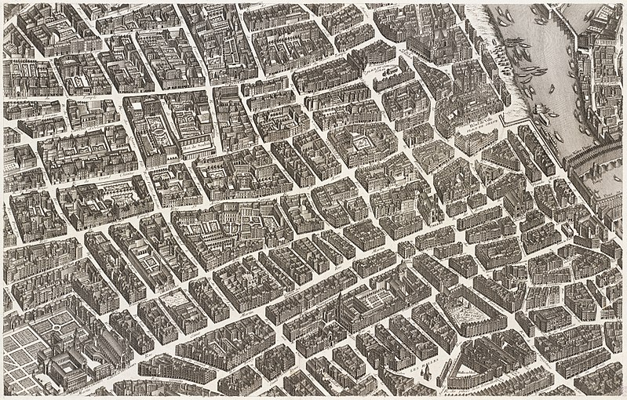
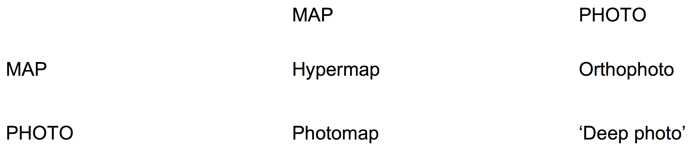
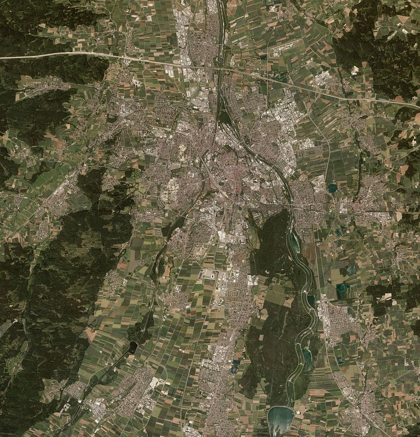
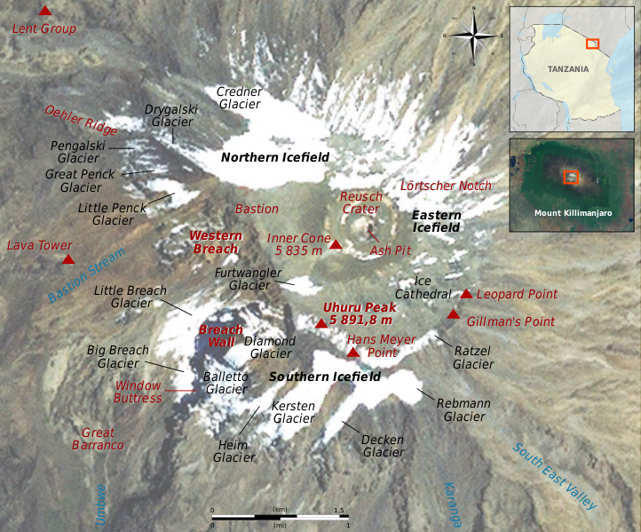

---
Pr-id: The Age of Total Images: Disappearance of a Subjective Viewpoint in Post-digital Photography
P-id: Theory on Demand
A-id: 35
Type: article
Book-type: anthology
Anthology item: article
Item-id: 11
Article-title: chapter 6
Article-status: accepted
Author: Ana Peraica
Rights: CC BY-NC 4.0
...

# Chapter 6: Computing Photographs and Maps

## Datascapes

Qualities of maps and landscapes have somewhat interchanged. Previously
uncoded, landscapes have also become coded, carrying various types of
information, not belonging to the realistic view, as landmarks,
name-tags and various measures. Both landscapes and maps are today
carrying a growing amount of data, in different layers. One could say
that the landscape and map when placed together has become a datascape,
in terms both of machine vision and data visualization. None of them are
concrete but can also be just a set of data. Some of these Arjun
Appadurai defined as ‘five dimensions of global cultural flows that can
be termed (a) ethnoscapes, (b) mediascapes, (c) technoscapes, (d)
financescapes, and (e) ideoscapes’.[^ch06_1] Each of them refers to a
different type of the abstract landscape forming a context of life;
habits, media, finances and ideology. Contemporary studies of such
datascapes underline that data is not that distinct from the vision,
although there is a substantial difference between processes of
visualization and vision. As Steve F. Anderson notes, there is no longer
a great difference between data and vision, capturing and looking.[^ch06_2]

Like with the mappae mundi of medieval Europe described before, today’s
imaging technologies are used to compute, assemble, and overlap a
variety of information into a single image. Consisting of many layers,
they do not have any fixed visual layout, but are an abstract dataset,
adapting to the user. Some of these layers, indeed, may be visually
descriptive, as landscapes once were, especially when photography is
being applied onto maps. Yet, new spatial data is not fully, but only
partially visible. While being complex and inclusive, new total images
of maps are merely possibly visible by the act of using of the map, or
the act by which the map automatically maps the user, even without their
knowledge. And moreover, the part of the set appears as invisible, thus
counting more precise placement of the person in terms of relative
distance to satellites, or by using GPS technologies, there is no need
for visualization of the abstract space of the map. Thus, contrary to
previous conceptions, today it is the general sense of the space that is
lost, as the space becomes an aggregation of geographical or conceptual
data.

## Montaging Techniques 

The combining of various materials in order to make a photo-like image
is not a post-digital invention. Indeed, photomontage techniques, where
the photographer combined several photographs into one, are as old as
photographic technology itself. At first, the reason to produce such
montages lay in the limitations of the photographic medium. The problem
of slow exposure time, for example, made it impossible to simultaneously
produce images of the land and accompanying sky. In the late 19th
century, photographers such as Oscar Rejlander and Henry Peach Robinson
would combine several photographic negatives in order to produce one
compact visual artefact in positive.[^ch06_3] Results, overall, were
consistent. Aside from combining negatives, photographers also used a
number of post-production methods, such as retouch, shading, and
tinting. Nevertheless, the merits of photomontage were often debated and
criticized for distorting the truth claim of the photographic medium.
And an idealistic duel between Realists and Pictorialists, who denied
the obligatory realism of photography, marked the 19th century
discussion about photography.[^ch06_4] Photomontage was thus seen by many
historians as a pictorial tool which destroyed the epistemic nature of
photography, and made out of it yet another device for rhetoric and
other literary figurations.

Geographic photomontage was used for the epistemic purpose of describing
space. This contrasted with the deliberate use of photomontage for
either rhetoric argument or poetical parable, as with the Pictorialists,
or the use of this technique for political activism, as with Modernists
such as John Hartfield, Hannah Höch, and others.[^ch06_5] Such spatial
descriptions were also amplified, as Rudolf Arnheim writes: ‘The simple
example of this innovation is the photomontage, which juxtaposes
fragments of totally different spatial systems. The sizes of various
pictorial objects can no longer be compared within the represented
space’.[^ch06_6] Yet not all photomontages led to impossible or unnatural
descriptions of space. Some afforded great accuracy. And in the
geographic information science of today, photomontage served the purpose
of acquiring knowledge, not necessarily about reality itself, but rather
about data and its many potential re-interpretations.

## Proto-computational Methods

The oldest compositional method used to merge or, in a sense, compute
photographs, is the panorama. Underlying the process of production of
the panoramic image was the idea of seeing without being seen. In
general, the object of ordinary panorama showed landscape and some
portion of the sky. In the 19th century, the photographic imagination
culminated with the innovation of the extended horizontal image of the
panorama, which in the beginning were produced by painting and later
photographically. The panorama evolved at the very moment that interest
in landscape painting was slowly starting to fade away until finally,
with the invention of the reproductive medium of photography, the
landscape as an artistic and image genre was relegated to the amusements
and crazes of the wealthy and elite.[^ch06_7] Across the 19th century,
panoramas became extremely popular, and many different panoramic forms
were invented.[^ch06_8] By 1870, the panorama and its variants were being
mass produced and toured all over Europe. Audiences for the panorama,
which at the time either remained largely in one place or had little
experience travelling, even to nearby cities or to other places within
their own home city, were fascinated by the way other places looked.[^ch06_9]
Indeed, as Walter Benjamin wrote, ‘The interest of the panorama is in
seeing the true city-the city indoors.’[^ch06_10] He also noted:

> Just as architecture, with the first appearance of iron construction,
> begins to outgrow art, so does painting, in its turn, with the first
> appearance of the panoramas. The high point in the diffusion of
> panoramas coincides with the introduction of arcades. One sought
> tirelessly, through technical devices, to make panoramas the scenes of
> a perfect imitation of nature.[^ch06_11]

Figure 23: *Turgot map of Paris*.

At this historical moment, the emancipated masses of emerging societies
had started to appropriate and recycle image genres that had long been
reserved for the upper classes, producing from them a new kind of
culture, a culture today known as popular culture. Panoramic images
would eventually become a form of mass entertainment. But in those cases
in which the panorama represented historical and archeological sites,
its topographical and geographical aesthetic is undeniable, and it
served to educate a population which, at that time, was still
predominantly stationary in their habitat.[^ch06_12]

With most early panoramic devices, a wide-angle view was achieved not by
the audience moving their gaze in relation to the image, but by moving
the image itself within the exhibition venue. Another type of moving
panorama dates to the last few decades of the 18th century. Such a
panorama was one of the first image genres to afford immersion within a
total image. This immersion worked in one of several ways: either by
moving the image mounted onto a panel around the audience, or by moving
the audience standing on a stage inside the image.[^ch06_13] These immersive
techniques from panoramic photography would have a profound influence on
later visual culture. In fact, the panorama anticipated virtual reality
in one key respect: enlarging what is visible but doing so at a cost to
the depth of the image. Because panoramic photography followed from the
painted panorama, the image was made in a certain way. Firstly, the
photographer rotated the camera around, with their own self as the axis,
like the center point of a circle or semicircle, while photographing the
world not which they might see at first glance, but which they saw while
pivoting. Secondly, the full size of the objects in view were recorded
within the picture plane. Objects were not visually cut. Thus, multiple
images could be merged together more easily. And thirdly, the panoramic
photograph had no central focus, distinguishing it from landscape
painting, which may be created from a single vantage point.

With a panorama, the photographer described the space through a fluxing
perspective, in contrast to the fixed perspective of the Renaissance.
This movement introduced a cinematic experience to the experience of the
photographic image which, at the same time, maintaining its frozen
reality. There are a number of ways for a photographer or photographers
to create such an image. Of course, these are besides pivoting on one’s
feet while taking the shot, as one might when using the ‘pano’ function
of a smart phone camera today. According to Rob Towley, these panoramic
techniques include: tiled constructions, planimetric, and diagrammatic,
peripheral or rollout photography, and topological photography.[^ch06_14] And
each of these served a different purpose. In addition to these various
ways of recording a panorama, there are also several ways to create
overlapping images, such as the stereographic overlap (in which images
are set in proximity to each other in order to construct the illusion of
dimensionality) and sidelap or lateral overlap (in which images are
placed one next to another).[^ch06_15] While not yet computational, all of
these techniques can be understood to be proto-computational method,
advancing the consequential image scanning, as sectioning the image in
equal sub-sections.[^ch06_16]

Of these panoramic techniques, tiled constructions appear as complex
panoramic images, while panoramas merge images in one row, tiled
constructions do it in more. With a planimetric image, the image is
recorded via the strategic movement of the camera from the left to the
right side, much like as with a scanner for a computer. With a
diagrammatic image, on the other hand, the image is recorded through
multiple perspective views to construct a flat diagram, which can
produce quite a confusing effect, similar to the paintings of Cubism in
the early 20th century. Each of these techniques may be applied for
different purposes or to various extents. Aerial photographs, for
example, consist of organized tiles of joined images. Photogrammetric
images, in contrast, consist of a complex system of images which are
merged one to another to make a three-dimensional object. Such
photographs do not necessarily need to be photographed systematically,
using neutral settings, or the same lenses. Rather, with the aid of
computational photography and even artificial intelligence, diverse
photographs can also be merged from archived sources of varying age and
quality. For example, Bundler, software program written by Noah Snavely,
is a structure-from-motion (SfM) system for unordered image collections,
such as images from the Internet. It ‘takes a set of images, image
features, and image matches as input, and produces a 3D reconstruction
of camera and scene geometry as output’.[^ch06_17]

Table 5: Provisory
explanation of variants between photographs and maps.

## Orthophotos

Another way of computing images is to correct photographs according to
or along with another visual, non-photographic material. Among the most
known of such corrective computational or pre-computational photographic
techniques is the orthophoto. An orthophoto is a ‘planimetrically
accurate photo image’, or an image which functions like a map. And it
can be used to visually depict the planet Earth in a way similar to
using a camera with a telephoto lens and images which have been taken
from an altitude or distance from the surface of the Earth of 45,000
km.[^ch06_18] As such, it was not possible to record an orthophoto until the
innovation of flying machines in the early 20th century.

Figure 24: Geodaten Bayern, *Orthophoto of Augsburg*, 2012.

In contrast to panoramic photographs, which are recorded as a series of
horizontal images, orthophotos are correcting photograph via
orthographic projection, where all of the projection lines are
perpendicular to the projection plane, in order to represent
three-dimensional objects in two-dimensional space. Because this
photographic image aligns with a map projection, it may be utilized to
measure the true distances between features. Orthophotos do not indicate
a distance between the object and the subject as active perception, as
there is no subject angle by which a distance can be metered, but
depicts only distances on the surface of the image itself, standing for
real place distances. Such an orthophotographic view is planimetric, in
that it extracts only the horizontal position of features on the Earth’s
surface, and reveals these geographic objects, natural and cultural
physical features, and other entities independent of elevation. Thus,
orthophotographic techniques are used to correct the curvature of the
Earth on a flat map.

Since the earliest beginnings of aerial photography, as described in
Chapter 2, various mechanisms and methods have been used to correct the
subjective human view with objective computational views. Aside from
early efforts by Nadar and Batut, the first endeavor to automate
orthophotography was in the 1920s. This coincided with several key
innovations in cartography, including the stereo comparator,
auto-stereography, auto-cartography, and aero-cartography. The first
orthophotographic images were produced by 1931 by Otto Lacman, the
author of a treatise on orthophotography.[^ch06_19] But only after World War
II was the orthophotoscope constructed, a ‘photomechanical or
optical-electronic device that creates an orthophotograph by removing
geometric and relief distortion’.[^ch06_20] Meanwhile, more and more
photographic images were being geometrically corrected or
‘ortho-rectified’ so that the scale of the photograph would be uniform.
Soon after, a matching projector, call an orthoprojector, was invented
to assist in the production of accurate orthogonal projection. And the
first such map to be converted from a photograph was taken in 1960, a
map of the Union of Soviet Socialist Republics (USSR), which at that
point presented a selection of the whole.[^ch06_21] Most orthophotos today
are made by using large-size cameras.[^ch06_22]

## Photomaps and Photorealist Maps 

Orthophotographs made from photographic images can reference the Earth
with greater accuracy than maps based on graphic prints could in the
past. Yet, due to the intervention of computational processes, digital
orthophotos (DOP) mask their origins in photographs while still
retaining this realistic effect. Photomaps, in contrast, are actual
cartographic products made on the basis of a photographic preparation.
Photomaps have been produced for a long time. In the 19th and even
20th centuries, with the beginning of experiments in combining maps
and photographs, photographic images would be covered with a thin sheet
of paper and geographical lines would be traced over them. Later, such
lines were carved directly into the material upon which the photograph
was mounted. Then, the entire construct, photograph, map, and all, would
be re-photographed in order to produce a new image. Today, however, a
special kind of film is required to make a photomap, a type of film
which is having equal density, so that lines can gradually be separated
out according to scale. Usually such film is combined with reversal
film, which can be used for large projections, recording the same images
on both.

In addition to orthophotos and photomaps, there are also photographs
which encompass some elements from map making, such as place or name
tags, topographic borders or marks, or other geographic information.
These photorealistic maps look more truthful and trustworthy than do
photomaps, more objective, even like they are not coded, because of the
seductive effect of the photographic image. However, here the photograph
is also just a layer in a more complex system. And some photorealistic
maps also have amplified elements, such as color or shape, which further
distinguish them from photographs.

## Hypermaps 

Beyond the orthophoto, photomap, and photorealist map, all of which to
some extent de-photographise some photographically recorded reality by
diminishing the indexical or realistic effect of the photograph, there
are other ways of preserving the post-digital photograph as an authentic
carrier of geographical information. One such way is the hypermap.
Hypermaps are systems of images which include many layers of
information, some or none of which may be photographic in nature.[^ch06_23]
Viewers or users of a hypermap can therefore zoom into different areas
of space or layers of information, which may connect to place-tags or
other geo-information, a large amount of data which enhances the user’s
search return through a ‘hypergeo model’.

Figure 25: Mount Kilimanjaro Summit photomap.

Hypermaps are a hybrid between photograph and map which gain layers of
information because of how they fuse these several kinds of mediation
together. But hypermaps also loose information from these various media
forms, including the indexicality of the photograph, as well as the
precision of the map. This loss is most significant in relation to
photography, because the photograph has to be corrected in order to
simulate the flat, two-dimensional visual space of the map. Indeed, only
the ‘realistic effect’ remains from the photograph in a hypermap which,
according Rob Tovey, may be present in cartographic, scanned,
diagrammatic, peripheral, and topological information.[^ch06_24] Here, the
vision and mediation of the photographic eye is combined with the
visualization and abstraction of the cartographic gaze. But this
simultaneity between photographic techniques and map making contaminates
the overall epistemic value of the hypermap.

One of the most important kinds of information that is lost in this
process of hybridization is the subjectivity of the author. In a
hypermap, photographs are computed and merged in order to achieve a
non-subjective view. Hypermaps and their depiction of absolute space
erase the presence of the subject by failing to provide the viewer with
any immediate information about the point of view of the image author.
Moreover, the hypermap describes everything but the subject, either by
re-distributing the subject through the act of use, or by describing
only the world around the subject, as if the total image is a donut and
the subject is its absent hole.

## ‘Deep Photo’

In addition to hypermaps, as well as other possible combinations of maps
and photographs, there are systems which can be used to merge various
layers of photographically-based imaging into a single view. These deep
photographs are a kind of ‘complex image’, including more data than what
is seen at the first place, to employ a concept by Oliver Grau.[^ch06_25] And
while not as axiomatic or transparent as basic photography, deep photos
can in fact be used to attain an even greater degree of veracity in the
objective depiction of reality. This is because the very process which
is involved in creating such a total image eliminates the role of the
subjective and thus interpretative. These images are recorded
systematically and with precision. In many cases, they describe reality
by measuring it rather than interpreting it. And this, in turn, supports
more objective meanings.

Deep photography has many currently emerging subtypes. However, the
categories for these are not yet stable enough for them to be
distinguished as genres. In metrophotography and photogrammetry,
however, various layers of information are embedded, such that they can
be classified as a type of deep photography.[^ch06_26] Perhaps the most
significant characteristic of the deep photo is that it has a resolution
far beyond that which naked human vision can itself be capable of
achieving. Deep photos are merged from big data which has a photographic
origin. So they have far more detail and description than ordinary
photographs. For example, the largest deep photograph made by a single
artist to date is *Mont Blanc Under Snow* by Filippo Blengini.[^ch06_27] This
365-gigapixel assembly is made out of 70,000 individual photographs. The
image offers the viewer a detailed close-up with better image quality
than with those images taken by satellite.[^ch06_28] With the previous record
holder for ‘largest image,’ a 360-degree panorama of the city of London
recorded from BT Tower, it is possible to see almost every house within
the line of sight, but from a low oblique view.[^ch06_29] For the low
oblique, the camera has depression angle of about 60 degrees, showing
only a relatively small area of the surface of the Earth, in perspective
that is neither fully aerial nor landed human.

Among other methods of image computation and merging with
non-photographic materials, deep photographs can also be made by
overlapping the very same frame recorded across three or more different
exposures. This process is usually known as bracketing. Through
bracketing, the photographer repeatedly shoots the same visual scene,
and with each shot alters the parameters of the exposure, such as white
balance, or some other parameter. By so doing, the depth of field,
exposure details, and contrast relationships may be manipulated. The
recorded images, which are usually made with a camera fixed upon a
tripod in order to stabilize the long exposure times which provide
greater detail, are then superimposed over and under one another as
layers within the same image. This produces an evenly sharp image that
would otherwise be impossible to record. In addition, by taking multiple
exposures, the photographer may choose those with the best quality, even
without necessarily merging it with others. Such a practice was
especially common in landscape and, most of all, architecture
photography.

Today, this bracketing technique is an automated feature which is built
into most if not all digital cameras, including the phone, tablet, and
laptop cameras which are supported by high dynamic range (HDR)
photography or Google Pixel. Bracketing can be used to alter more
elements in an image than just the exposure and depth of field.
Bracketing can be used to widen the field (such as in panoramic
photography), change the image spectrum (multi-spectral images, a kind
of hyper-photo), produce higher resolution (deep photography), create a
parallax image (stereo-photography), and erase or generate objects
(post-production). These are more or less the features of all so-called
‘cognitive cameras’, plenoptic cameras which through the programming of
their functionality can be used to extract information out of an image
sequence, rather than just conjoin images.[^ch06_30] A plenoptic or
light-field camera is defined by several key features and functions.
Most essentially, it captures the light which emanates from a scene,
including the intensity of light as well as the direction in which these
light rays are travelling. This contrasts with other types of cameras,
such as the analogue or digital camera, which primarily are defined by
the medium with which they record, such as through a chemical process or
onto a memory chip, respectively. Beyond this essential feature of light
detection and tracking, the plenoptic camera has the same
functionalities as other photographic cameras in terms of automatically
producing a frozen image or sequence of images. And because the
mechanism of such a camera works largely independently from human
intervention, as with the loading and reloading film or the changing of
settings, the time between taking pictures is shortened, which in turn
leads to greater image stabilization (IS) and reduced blurring or noise.
With the aid of plenoptic photography, an amateur photographer can
produce images which appear as though they have been created by a
professional photographer. In most digital single lens reflex (DSLR)
cameras, images are computed on the micro, or data level, beyond either
the vision or control of the camera user. Therefore, an amateur
photographer often remains unaware of this process.

Today, post-digital photographs include a vast amount of photographic as
well as non-photographic information which has been synthesized into a
single visual artefact. Such artefacts cannot be seen all at once, which
is certainly how photographs used to be perceived, but rather is
user-directed in terms of which layer is looked at. In fact, the user
creates the image through the very act of use, zooming in to see the
narrow details, and zooming out as well as moving in various planar
directions to see a wider picture. Such images are also compressed. And
they have to be decoded or processed otherwise. For this reason, these
photographs do not have a single meaning or message but a multitude of
possible meanings and messages which are created by each user. It may be
concluded, therefore, that the total image is a post-digital photograph
which contains more visual data about some place than any single one
viewer could naturally perceive on their own, whether in terms of the
view angle of the camera or cameras, the wave-length of the light, or
additional information such as maps, tags, and geolocations. Indeed,
with the total image, we have entered into what Hito Steyerl calls ‘the
age of post-representation’ in which the world is simultaneously
represented by many visual techniques.[^ch06_31]

## Dangerous Places and Comfortable Spaces

Commonly, images of the Earth or of the layers of its atmosphere which
are taken from planes in the air can be photorealistic. But such images
become more and more abstract when taken by satellites in space. As
Bruno Latour notes: ‘By looking at the satellite image we extract
ourselves from our particular point of view, yet without, bouncing up to
the bird's eye view; we have no access to the divine view, the view from
nowhere’.[^ch06_32] Different systems of coding and transmission are used
with new technologies from radar to infra-vision. And the more the
aerial view is coded, the less realistic is the image. Indeed, these new
kinds of images do not at first sight appear to be as substantially
coded as maps, because to one degree or another they still represent the
Earth indexically, or at least with some factual connection, such as by
incorporating aerial photographs. Even so, the overall lack of realism
in such a total image, because it encompasses a view extended beyond
that which the naked human eye could naturally perceive by using
technology, in turn minimizes the viewers’ obligatory relationship to
the subject of the image. In erasing the place of the subject in the
view, and thereby any possibility for the audience to relate to that
subject, whether through abjectification or empathy, the total image
becomes a symptom of the pathological forces in contemporary
culture.[^ch06_33] With everyday experience which is increasingly abstracted
from the Earth through using and interaction with such images, whether
you ‘Choose Destination’ or ‘Explore Nearby’ with Google Maps, or if you
share where you are ‘Traveling To’ on Facebook, it becomes that much
more difficult to connect with the concreteness of life. And this is the
tragedy of such technological innovations as the deep photograph and
computational methods.

With the innovation of aerial photography, it is the map that become
real. But in turn, such photography also introduced an abstract vision,
as abstracting from a human position. Reality, when perceived through
several mapping tools, also becomes digital, James Bridle notes.[^ch06_34]
Today, the augmented or virtual space of maps which provides the user
with an experience other than reality, in turn separates the user from
the once-necessary process of verifying for themselves the reality which
they perceive and navigate.[^ch06_35]

The space in which we live today is a space which is computed,
assembled, and multi-perspectival. Maps are no longer necessarily
objective, because they are based on data, and at the moment in which a
user views or interacts with the map, they are viewing or interacting
with data this data that has already in some way gone through a process
of selection and interpretation. As computed photographs and maps, once
being closely tied to physical reality, have become yet another tool of
visualisation, we have dived into virtual space. Neither landscapes nor
maps do necessarily mean a real place. They are not settled on one side
while reality on the other anymore, but everything is fully integrated
inside the map, from cars driving, over taxi services and apartment
rentals, restaurant working hours. Both are combining a part of material
reality with the abstracted one. In many cases it is impossible to split
the cartographic reality from the geographical one.[^ch06_36]

In parallel to a great precision of the place, a new generation of fully
places that emancipated from physical reality, such as virtual places
are expanding our perception of the real space, and overlapping with the
real ones in many cases, changing their (also spatial) meanings, as in
augmented reality.[^ch06_37] The world of today is a super-networked
self-organizing datascape, rather than a fixed reality. There are many
interpretations of reality co-existing, each presented as a total and
unique one. So, all images of it are distorted and our visual conception
of reality, by mapping it.

[^ch06_1]: Arjun Appadurai, *Modernity at Large: Cultural Dimensions of
    Globalization* (Public Worlds, Vol. 1), Minneapolis: University of
    Minnesota Press, 1996, 33.

[^ch06_2]: Steve F. Anderson,
    *Technologies of Vision: The War between Data and Images*,
    Cambridge, MA: MIT Press, 2017.

[^ch06_3]: See for example
    Henry Peach Robinson’s *Figures in Landscape*, Gelligynan Series
    (photomontages), 1880.

[^ch06_4]: See: Dawn Ades,
    *Photomontage*, London: Thames and Hudson, 1976; Robert Sobieszek,
    ‘Composite Imagery and the Origins of Photomontage, Part I: The
    Naturalistic Strain’, *Artforum* 17.1 (1978): 58-65; Robert
    Sobieszek, ‘Composite Imagery and the Origins of Photomontage, Part
    I: The Formalist Strain’, *Artforum* 16.2 (1978), 41-43; Richard
    Hiepe and C. A. Haenlein, *Dada: Photographie und Photocollage,*
    Hannover: Kestner-Gesellschaft, 1979.

[^ch06_5]: See: Kristin
    Makholm, ‘Strange Beauty: Hannah Höch and the Photomontage’, *MOMA*
    24 (1997): 19-23; John Heartfield, ‘Photomontages of the Nazi
    Period’, London: Gordon Fraser Gallery & Universe Books, 1977;
    Magdalena Dabrowski, ‘Photomonteur: John Heartfield’, *MOMA* 13
    (1993): 12-15; Ades, *Photomontage.*

[^ch06_6]: Rudolf Arnheim, ‘Inverted Perspective in Art: Display and
    Expression’, *Leonardo* 5.2 (1972): 125-135.

[^ch06_7]: As Walter Benjamin
    described and categorized: ‘There were panoramas, dioramas,
    cosmoramas, diaphanoramas, navaloramas, pleoramas, fantoscope,
    fantasma-parastases, phantasmagorical and fantasmaparastatic
    experiences, picturesque journeys in a room, georamas; optical
    picturesques, cineoramas, phanoramas, stereoramas, cycloramas,
    panorama dramatique’. Walter Benjamin, *The* *Arcades Project,*
    trans. Howard Eliand, Cambridge: Harvard University, Belknap Press,
    2002, 527.

[^ch06_8]: There were also a great number of more or less successful products
    which had to do with the original wide-scene view, such as the
    diorama, neoreama, cyclorama, eidophisikon, cosmorama, nahrama,
    phosporama, kineorama, myorama, sensorama, pleorama, mareorama, and
    more.

[^ch06_9]: See Paul Mellon
    Sawyer, ‘Panorama as a Global Landscape’*,* *YouTube,*
    https://www.youtube.com/watch?v=ldLvpyoby-g.

[^ch06_10]: Benjamin, Arcades
    Project, 532.

[^ch06_11]: Benjamin, *The*
    *Arcades Project,* 5. Moreover, one of Parisian arcades is actually
    called the Panorama.

[^ch06_12]: More on history
    of panorama: see Erkki Huhtamo, *Illusions in Motion*: *Media
    archaeology of the moving panorama and related spectacles*,
    Cambridge, MA: MIT Press, 2018; Oliver Grau, *Virtual Art: From
    illusion to immersion,* Cambridge, MA: MIT Press, 2003. See also:
    Wurzer, *Panorama*.

[^ch06_13]: Type of latter
    panorama in which the public is freely moving is quite near the
    effect of the virtual reality. As Grau notes, distances are assumed
    rather than experienced, blurring the relationship between the image
    and real space, as naturally filling the observer’s field of vision.
    Grau, *Virtual Art.*

[^ch06_14]: Rob Tovey,
    ‘Photomaps: A Visual Taxonomy’, *Visual Communication*, 17.2 (2018):
    209-220.

[^ch06_15]: When using
    stereographic, the parallax is 5-10 degrees, while with lateral
    overlap it must be larger, up to 30%.

[^ch06_16]: Similarly, photogrammetric techniques may also be used to produce
    an objective viewpoint and obtain reliable information about
    physical objects and the environment. In photogrammetry, the
    photographer or photographic system fuses images together in order
    to produce a third dimension by employing several movements of
    recording: from up to down, meander (from outer to inner, in order
    not to step in), snake-shape (left-right and then righst-left), and
    from distant to close. The recorded data is then assembled in
    alignment with how its author may choose to visualize the object,
    rather than how the object appears to vision.

[^ch06_17]: 'Bundler', https://www.cs.cornell.edu/\~snavely/bundler/.

[^ch06_18]: The minimal distance to record the full image of the Earth is
    35,786 kilometers.

[^ch06_19]: Otto Lacman, *Equalizer for non-flat terrain. Image measurement
    and aerial photography*, 1931, 10-12.

[^ch06_20]: Definition of orthophotoscope from ESRI,
    https://support.esri.com/en/other-resources/gis-dictionary/term/d307b618-60b9-4efc-9afc-9c47918e54b4.
    Overlapping photographs scanned for the overlap, area is sequenced
    into smaller sections which are scaled.

[^ch06_21]: Cartography in the USSR was so well developed as a field that
    they released maps of the entire world soon after the first
    orthophoto was taken. See:
    https://www.nationalgeographic.com/news/2017/10/maps-soviet-union-ussr-military-secret-mapping-spies/.

[^ch06_22]: Cameras used today can record up to 450 megapixels in single
    shot.

[^ch06_23]: Menno-Jan Kraak and Rico Van Driel, ‘Principles of Hypermaps’, *Computers &
    Geosciences* 23.4 (1997): 457-464.

[^ch06_24]: Rob Tovey, ‘Photomaps: A visual Taxonomy’, *Visual Communication*
    17.2 (2018): 1-12.

[^ch06_25]: Oliver Grau, ‘Images (R)-Evolution: Media Arts Complex Imagery
    Challenging Humanities and Our Institutions of Cultural Memory’,
    *Leonardo Electronic Almanach* 20.2 (2014): 72-86.

[^ch06_26]: Yet another form, which serves 3D construction metrophotography,
    or latter photogrammetry, being the latest of genres merging
    photographs with maps, are based on projective geometries, used in
    measurement of the architecture, while orthophoto merges analyses
    landscape in general. Rules for shooting images to be
    photogrammetrically. processed to have changed with the development
    of equipment, but in general they are recorded to be overlapped, in
    order of producing a higher precision.

[^ch06_27]: Whereas the largest montaged image from multiple sources by this
    date is Pan Starrs, made out of 3 billion separate sources and in 2
    petabyte size. See:
    https://www.ifa.hawaii.edu/info/press-releases/panstarrs\_release/.

[^ch06_28]: Recorded using
    a Canon 70D DSLR, a Canon EF 400mm f/2.8 II IS, and a Canon Extender
    2X III on a special robotic mount.

[^ch06_29]: This image
    consists of more than 48,000 images.

[^ch06_30]: Jin-Li Suo, Xiangyang Ji, and Qionghai Dai ‘An Overview of
    Computational Photography’, *Science China* *Information Sciences*
    55.6 (2012): 1229.

[^ch06_31]: Hito Steyerl,
    ‘Digital Debris: Spam and Scam’, *October* 138 (Fall, 2011): 70-80.

[^ch06_32]: Bruno Latour and Emilie Hermant, ‘Paris: Invisible City’, Liz
    Carey-Libbrecht (trans.), 1998.
    http://www.bruno-latour.fr/sites/default/files/downloads/viii\_paris-city-gb.pdf,
    9. Section published as: Bruno Latour, ‘Introduction: Paris –
    Invisible City: The Plasma’, *Culture and Society*, Elsevier, 3.2
    (2012), 91-93.

[^ch06_33]: Dorrian and Poussin, *Seeing from Above. *

[^ch06_34]: Bridle, *New Dark
    Age. *

[^ch06_35]: Tim Mehigan,
    *Frameworks, Artworks, Place: The Space of Perception in the Modern
    World,* Rotterdam: Rodopi, 2008.

[^ch06_36]: Bridle, *New Dark
    Age. *

[^ch06_37]: Cosgrove, *Social
    Formation and Symbolic Landscape*, Cosgrove, *Geography and Vision.*
