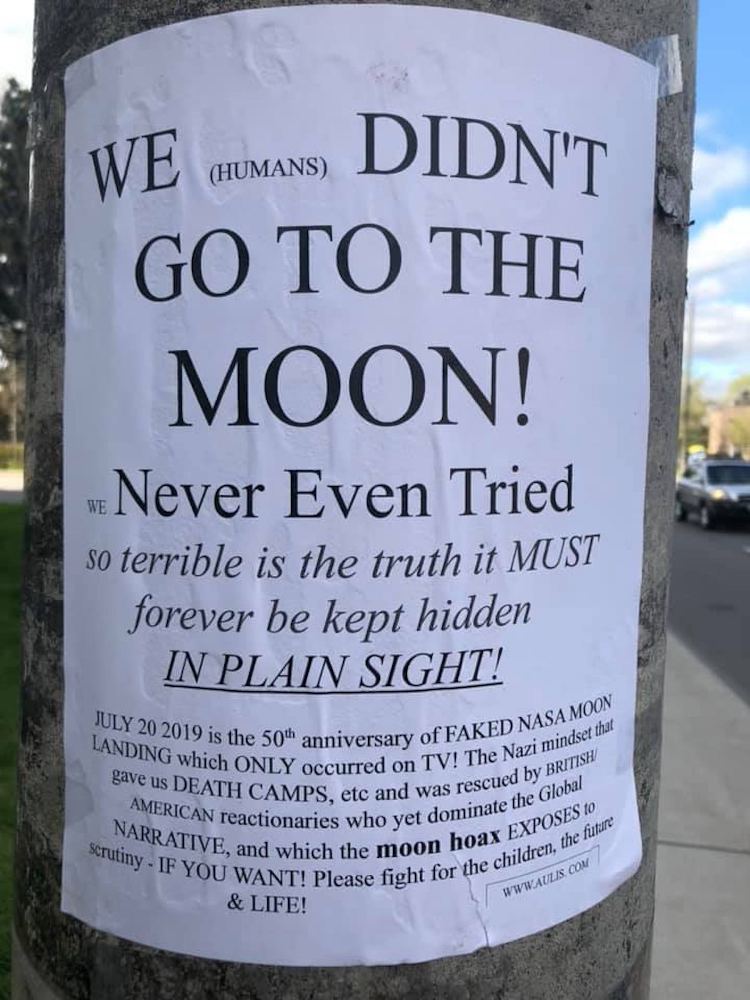

---
Pr-id: The Age of Total Images: Disappearance of a Subjective Viewpoint in Post-digital Photography
P-id: Theory on Demand
A-id: 35
Type: article
Book-type: anthology
Anthology item: article
Item-id: 14
Article-title: conclusion
Article-status: accepted
Author: Ana Peraica
Rights: CC BY-NC 4.0
...

# Conclusion: So, the Earth Is Flat…?

## Assembled Perspective

Our ideas about the Earth, and about both our space and place in
relation to the world, changed with the innovation and introduction of
each new imaging technology, from the map and landscape, to various
globes, to today’s post-digital photography. Starting with the
balloon-mounted photographic apparatus in the 19th century, and
continuing with air, drone, and satellite imaging in the 20th and
21st centuries, post-digital photographs of our home planet, like
those which constitute Google Earth or virtual globes, are not captured
but rather assembled. By the time they reach our eyes, these images have
been adjusted, with the density, opacity, saturation, and transparency
of the output images much transformed from the input images or original
real-world source images. These images have also been layered with other
images, as well as information such as maps and tags, with all of these
many layers have been flattened together. And, perhaps most
significantly, these images have been corrected, frequently in terms of
their perspective, using a polyperspectival system which affords
multiple, simultaneous points and angles of view, in order to make a
more total image of the Earth by combining human and machine vision.

The view which is constructed through these post-digital photographs of
the Earth is total, at least in so far as that it extends the function
of human vision, such that we can explore the whole of our world by the
use of this technology, and from a perspective or view that the
constraints of our bodies and eyes could not achieve. Yet, while this
space may at first sight appear to be systematic, and to represent space
with the linear perspective found in the architectural plans, drawings,
or paintings of the early Renaissance, it is aggregated out of countless
perspectives. This totality is, thus, not homogeneous. It is assembled.
The total image is composed out of many different parts, which are
automatically or algorithmically combined into a whole, across various
angles, distances, and perspectives, each with their own respective
interpretations and subjectivities. It is not the world unique, total
sphere, but as a fragmentary experience, rather cartographically and
with different borders which are not existing on the planet, as viewed
from above. And it is changing with each new use.

The quantity and kind of information which is contained in any
post-digital photograph of the Earth makes it impossible to see this
total image all at once. As James Bridle rightly notes, ‘The aggregation
of complex systems in contemporary networked applications means that no
single person ever sees the whole picture’.[^concl_1] Thus, despite the sheer
volume of total images which exist in the post-digital age, when
compared and contrasted to the pictures of the planet in Antiquity and
the Medieval Period, we are actually losing any totalizing view or
perspective. In the total images of today, there is in fact no totality.
Instead, space and place as they are represented are more fragmented
than ever before. Through such technology, the audience, interactor, or
viewer can only experience and come to know the world as if it is a
broken vase, that has pieces lost or missing, and having no idea of what
the object actually looks like, also no possibility for piecing it
together. As Fredric Jameson argues, this almost
schizophrenic *decentering* and *dispersion* of the subjective view also
brings alienation.[^concl_2] And such a growing inability and incapacity to
locate for ourselves a place in the world plays an important part in the
burgeoning systematic failure of a globalized society to preserve
culture, heritage, and personhood between all its differences and
diversity.[^concl_3]

## Assembled World 

A major problem for post-digital contemporary perception is that the
world appears sequenced, as it is visually indeed assembled, more over
it appears overly close, so no distance needed in order to construct a
perception is possible. This fractioned appearance reintroduced along
with the total image is a concept of absolute space and New Medievalism,
elaborated in the Introduction and Chapter 8.[^concl_4] The theory of
assemblage is often used to analyze perspective and space in the various
forms of images from the Medieval Period, Modernity, and their
combination in the post-digital age. Yet, in addition to being applied
by philosophers in their analysis of more general, cultural. patterns,
assemblage logic has many variants when applied to media: from bricolage
to collage and from photomontage to filmic montage. Gilles Deleuze and
Félix Guattari, followed by Manuel deLanda and Saskia Sassen, have
theorized on assemblage in a wider context.[^concl_5] Following Deleuze and
Guattari’s famous theorizing on assemblage, deLanda introduced the model
of an ‘abstract machine’, which he applied in his theory of society and
which, in turn, Sassen applied to practical concepts.[^concl_6] With these
analyses, the focus of contemporary theories of assemblage have shifted
from material and medial processes in visual culture to a political and
social perspectives. These social theories of assemblage are now being
practically applied in the analysis of the hybrid geographies which
combine maps with photographs. Here, concepts such as
‘territorialization’ and ‘deterritorialization’ refer to the degree of
indexicality between the total image and the reality which is being
represented.[^concl_7]

## The Loss of the Common World 

Figure 27: *We Have
Never Been to the Moon*, street poster and internet meme.

In the real world, such processes of fragmentation also are progressing.
For example, more and more countries are withdrawing from international
organizations, such as with the USA and Israel leaving the United
Nations Educational, Scientific and Cultural Organization (UNESCO) in
December 2018, and the UK leaving the EU in January 2020. Yet, at the
same time we have never lived in time having more total consequences.
While the whole Earth and people all over the world are impacted by
climate change and the climate crisis, not everyone shares the total
view of the planet. As Timothy Clark writes, ‘No-one sees the Earth
globally and no-one sees an ecological system from nowhere’.[^concl_8] Indeed,
even the governments and corporations in both larger or smaller nations
which occupy a particular territory behave as if they are isolated
rather than connected to the whole. But whatever fate is made by the
human species will be the grand master narrative produced, claims Clive
Hamilton.[^concl_9] None will be spared. At least regarding global warming, as
Hamilton writes, ‘there are no more enclaves’.[^concl_10] Enclaves,
uncontaminated by the virus that is the confidence of one group in their
own dominion over another group, will vanish. And if the difference and
diversity in humanity is further dispersed and distributed, then this
will be at least in part due to the seduction of a total image of the
world, an image which does not provide a real picture of how things are,
but an image which we construct according to our own attitudes, beliefs,
and desires.[^concl_11]

## Loss of Place 

In addition to a loss of totality in the total view in the total images
of the post-digital age, the idea of place is being lost; that is, place
is being overproduced, becoming redundant. With the datafication of
geography and programmability of images in terms of integrating a
realistic effect, the impetus for us to use technology in order to
achieve better and better estimation and identification of the
real-world geographic locations for objects has led to another function
in the combination of map and landscape: the need to capture places.

But does the precision of this location in turn lead to a loss in our
sense of place? There are several recent changes of human conditions
which today shape our belief of reality, framing it down to a small
scale. Overall, humanity is losing its physical contact with the
surrounding world. We have lost our joy, which is characteristic of
children and scientists alike, in simply observing nature, the way
Aristotle did in what I described as his ‘argument from experience’,
which is characterized by naïve realism and interpreted in the framework
of limited knowledge. In previous eras, this curiosity has led each of
us to learn, sometimes completely on our own and independent of any
given education, about phenomena such as the horizon of the Earth, the
movement of the Earth around the sun which is made visible in changes to
the shadows of objects, the turning of the seasons which can be seen in
movements of the constellations in the night sky, and solar as well as
lunar eclipse and their various shadows. In addition, there are
agricultural and urbanization factors which limit our access to nature
and influence this detachment. The human race has cultivated more than
half of the planet, in many places making views of the horizon literally
inaccessible. Today, in or near cities, there is also light pollution,
and the sky is obfuscated with smog, to such an extent that the stars
may not be visible at all. Because of the speed of transport and
communication technologies, even the very idea of the space as existing
from a departure to an arrival point has all but disappeared. Paul
Virilio thus observed that here ‘depth no longer includes the visual
horizon, nor the vanishing point of perspective’, but rather speed
becomes the most essential and important dimension.[^concl_12]

Time is essential element in our perception of the world which is in
front of us. Our eyes move to analyze the space, not only in terms
orthogonals but also depth, by focusing on various distances. The
interface, as a temporary form-image, is also connected to our
understanding of time as well as of space. The speed of the signal
through the Internet or from a television network, as well as the speed
with which this signal is carried through the device itself, has a
temporal quality. This, leads to progressive disappearance of
space-time, providing no illusion that the Earth is a sphere and that,
hypothetically, one could travel around it endlessly, thereby
introducing not only the idea of the finiteness of the planet but also
the finiteness of the view. And again, according to Virilio, the speed
and acceleration towards instantness have destroyed fixity of both the
space and its visualizations.[^concl_13] In addition they have set the place
in motion, so it is impossible to capture it. It is not that our
four-dimensional world, with its three dimensions of space (height,
width, depth), as well as the temporal dimension, is thereby fixed or
flattened, but it has sliced into layers in which it has been decoded,
and such layers do not describe general categories.

## Reality Effect

The subjective view angle of humans, and thus the human condition as
well, is radically dismissed in total images also because the
trustworthiness and truthfulness of these images cannot be verified.
Consequently, the very concept of the view angle, as it has been
understood in Western culture and thought for the past five hundred
years, is disappearing right before our very eyes.

As such, the total image is at once convincing and dangerous. Jean
Baudrillard was right: with the image, reality disappears.[^concl_14] Instead,
indexicality in the total image is merely a realistic effect or style
which is applied to the image by the layering of photographs. Through
the computational processes of artificial intelligence which combine
multiple photographs together, as well as many other kinds of
information, the photograph loses its original indexicality, or at least
the indexicality takes on more of a symbolic quality, as the indexical
realism of photography is being merged with the data systems of mapping.
In post-digital photography, the connection between the image and its
reference, such as between Google Earth and the Earth itself, is based
more on indirect resemblance than direct relation, as has already been
suggested by Baudrillard.[^concl_15] By confusing the chain of custody for
photographic evidence from firsthand witnesses, human or machine, its
credibility in relation to space becomes lost. Thus, indexicality in the
total image no longer serves as proof to the viewer that the something
being represented actually exists in reality, as has long been the role
of indexicality in photography.

And it only because of this effect, as Allen Carlson notes, that we are
‘picturing and perceiving nature as if it were a landscape painting, as
a grandiose project seen from a specific standpoint and distance’.[^concl_16]
Photographic realism is just one element in the total image. As I have
described across the proceeding chapters, in many if not most instances,
photographs become just one layer of material out of many within a
complex system. In fact, in many cases the outcome of this process does
not make visible any photograph at all. In photomaps, for example,
photographs are first added and later discarded. In photomontage, they
are stretched or merged. And in orthophotography, they are corrected so
that their scale is uniform. Indeed, more often than not, photographs
camouflage more complex data. When integrated into maps, however, and
both corrected and layered, the photograph becomes less of a medium and
more of a style for providing a realistic effect. The photograph is
appropriated for the total image because of its visual qualities which
carry or convey the natural world to the eye in a way which we recognize
as being like our own human way of seeing. Consequently, as an epistemic
genre, photography today has acquired a secondary value beyond the
indexical. Indeed, the medium has become a ‘slave’ to our culture of
hyper-visualization as it is used less for itself and more in more for
complex interpretations of reality. Indeed, it is as if the photographic
medium has been ‘hacked’ and opened up to intrusion from a ‘virus’ of
substantially different media types, whether map, landscape, globe, or
just raw data.

The consequences of utilizing photography for its realistic effect in
our representations of the world may be far reaching. By introducing
complex, non-mimetic models of reality, we distance ourselves from
reality even further. The post-digital photographic reality has by now
become completely un-checkable, leading even to the production of
landscapes which have no relation to reality at all. As Trevor Paglen
addresses the issue, ‘As “landscape” in art has moved far outside the
frames of painting and photography, a lot of artists are turning towards
geography for methodological and analytic inspiration’.[^concl_17] Today the
landscape exists no longer as an object but as something abject. Rather,
our relationship to these new datascapes, at least in terms of
cognition, is projective. That is, this landscape itself is a projection
of our selves. And each of these projections is individual.
[]{#_Toc30753600 .anchor}Today, total images of the Earth no longer help
us to learn about the world. Rather, they function as a barrier between
us and the planet, an illusion, which breaks us away from our own human
processes of discovery, exploration, and navigation. As with other
images of the Earth taken from the air and from space, which some people
believe are proof that the surface of the planet is flat, in the
post-digital age the total image serves not only to explain our habitat,
but to falsely stabilize its ever dynamic and shifting qualities.

[^concl_1]: Bridle, *New Dark
    Age*, 40.

[^concl_2]: Fredric Jameson, *Postmodernism, or, the Cultural Logic of Late
    Capitalism*, Durham: Duke University Press, 1991*,* 413.

[^concl_3]: Many places on the Earth are being erased from maps. According the
    artwork of Columbian-born American filmmaker Maurizio Arango, being
    part of the project *Victims Symptom* I have curated which only used
    few concepts of victimology to show how the number of victims is
    being reported in media, there are many places of the planet which
    are erased from media maps. They are not being reported thoroughly
    even in cases of events with large fatalities. See: Ana Peraica,
    *Victims Symptom: PTSD and Culture*, Amsterdam: Institute of Network
    Cultures, 2009.

[^concl_4]: Grau, *Virtual
    Art*.

[^concl_5]: Deleuze and
    Guattari analyze assemblage in territorial, statist, capitalist and
    nomadic layer, as well as their amalgams, in a constant change of
    predicate logic functions. deLanda furthermore is defining parts of
    the assemblage as coded, arbitrary and variable, contrary to
    stratum. Deleuze and Guattari, *Thousand Plateaus*; Saskia Sassen,
    *Territory Authority, Rights: From Medieval to Global Assemblage*,
    Princeton, NJ: Princeton University Press, 2008; deLanda,
    *Assemblage Theory. *

[^concl_6]: deLanda, *Assemblage Theory*; Sassen, *Territory Authority, Rights.*

[^concl_7]: Throughout *Anti-Oedipus*, Deleuze and Guattari analyze various
    types of deteritorialization, from relative to absolute. See: Gilles
    Deleuze and Felix Guattari, *Anti-Oedipus: Capitalism and
    Schizophrenia*, Minneapolis: University of Minnesota Press, 1984,
    130-149 and 192-200.

[^concl_8]: Timothy Clark, *Ecocriticism on the Edge: The Anthropocene as a
    Threshold Concept*, New York: Bloomsbury, 2015, 18.

[^concl_9]: Clive Hamilton,
    *Defiant Earth: The Fate of Humans in the Anthropocene,* New Zealand
    and Australia: Allen and Unwin, 2017, Chapter 3, unpaginated.

[^concl_10]: Hamilton, *Defiant Earth,* Chapter 2, unpaginated.

[^concl_11]: Hamilton, *Defiant Earth*, 54.

[^concl_12]: Virilio, *Lost Dimension,* 66*.*

[^concl_13]: Virilio, *Lost Dimension*, 140.

[^concl_14]: He writes: ‘This is also true of geographic and spatial
    exploration: when there is no longer any virgin territory, and thus
    one available to the imaginary, *when the map covers the whole
    territory, something like the principle of reality disappears*.’
    Jean Baudrillard, *Simulacra and Simulation*, Sheila Faria Glaser
    (trans.), Ann Arbor, Minnesota: University of Michigan Press, 1994,
    123.

[^concl_15]: Jean Baudrillard,
    *The Evil Demon of Images*, Sydney: The Power Institute of Fine
    Arts, 1987.

[^concl_16]: Allen Carlson,
    ‘Appropriation of the Nature Environment’, in Alex Neil and Aaron
    Ridley (eds), *Arguing about Art, Contemporary Philosophical
    debates*, London: Routledge, 155-166.

[^concl_17]: Michael Dear, ‘An Interview with Trevor Paglen’, in *GeoHumanities: Art, History, Text at the Edge of Place*, Michael Dear, Jim Ketchum, Sarah Luria, Doug Richardson. Routledge, 2011, 24.
