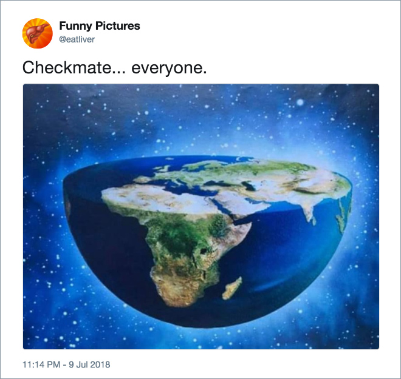
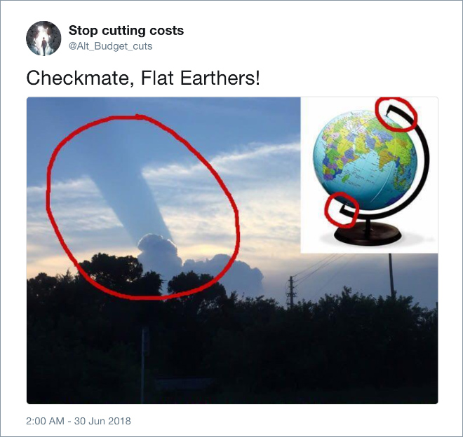
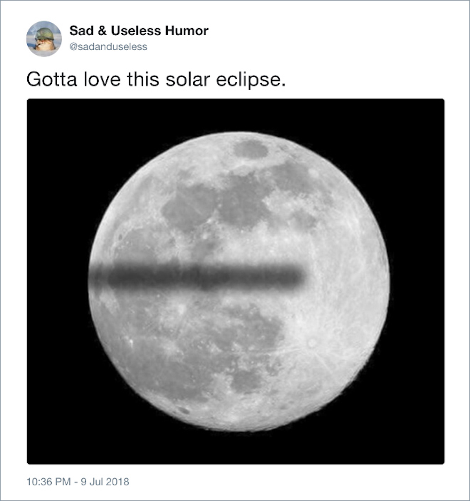
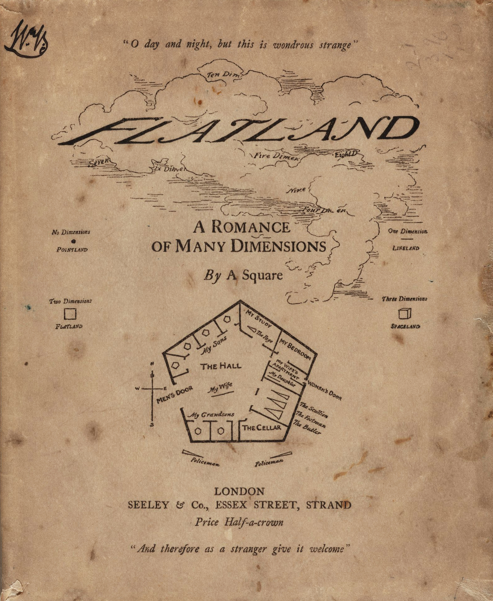
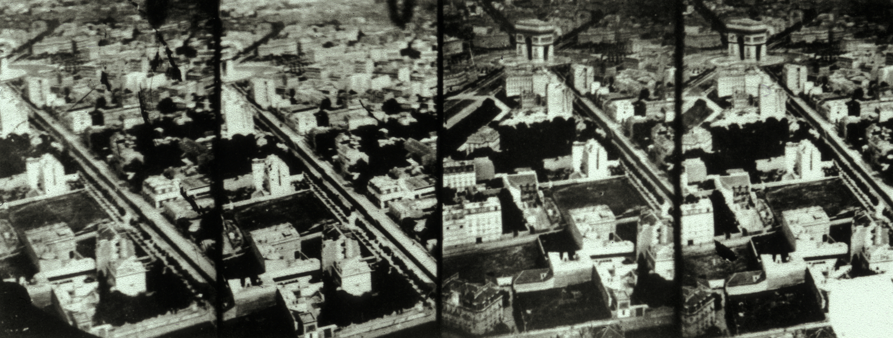
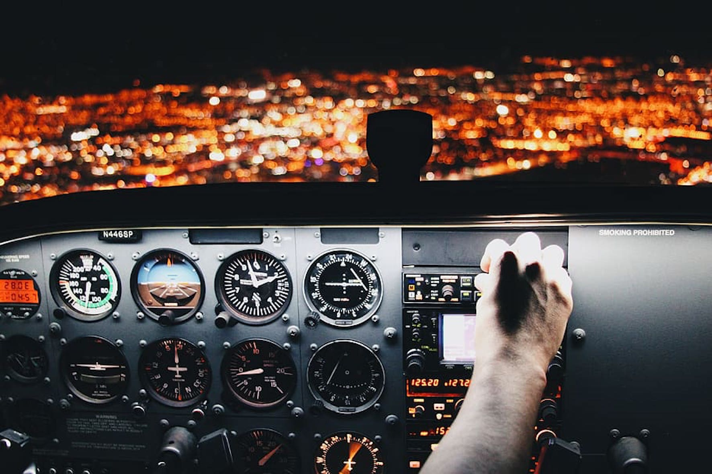
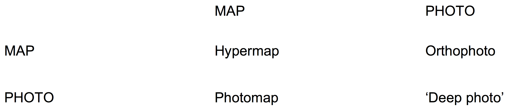
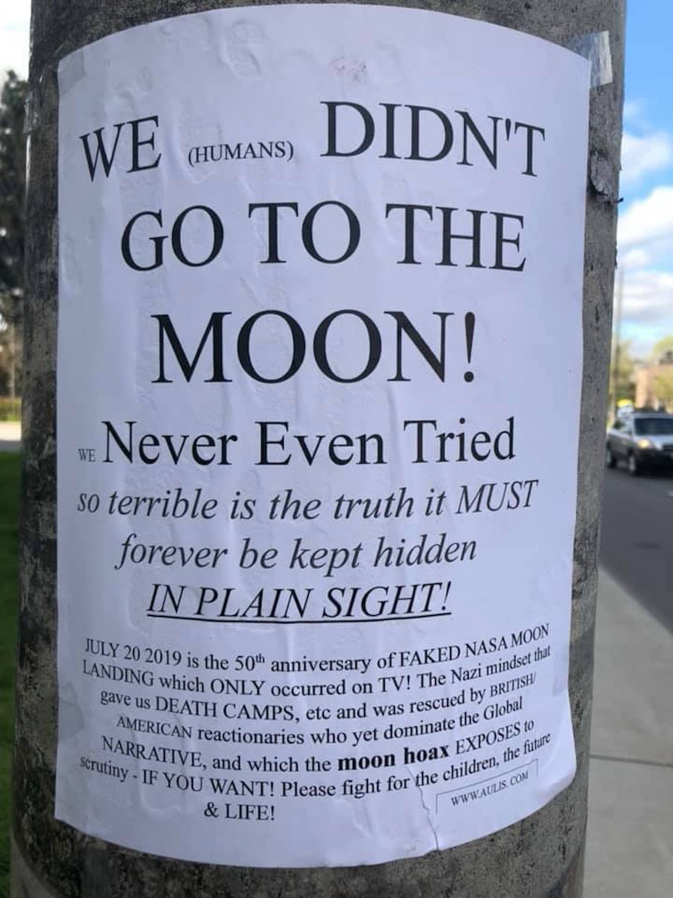

# The Age of Total Images: Disappearance of a Subjective Viewpoint in Post-digital Photography

## By Ana Peraica

# Colophon

Theory on Demand #35
 **The Age of Total Images: Disappearance of a Subjective Viewpoint in Post-digital Photography**

Author: Ana Peraica
 
 Editing: Devon Schiller
 Production: Sepp Eckenhaussen
 Cover design: Katja van Stiphout
 
 Published by the Institute of Network Cultures, Amsterdam, 2019
 ISBN

**Contact**
 Institute of Network Cultures
 Phone: +3120 5951865
 Email: info@networkcultures.org
 Web: http://www.networkcultures.org

This publication is published under the Creative Commons
Attribution-NonCommercial-NoDerrivatives 4.0 International (CC BY-NC-SA
4.0) licence.

This publication may be ordered through various print-on-demand-services
or freely downloaded from http://www.networkcultures.org/publications.

# Table of Contents

<a href="ch004.xhtml">Preface</a>

<a href="ch005.xhtml">Introduction</a>

<a href="ch006.xhtml">1\. Flat Earth </a>

<a href="ch007.xhtml">
Corrolary: Physical Globes and Digital Projections </a>

<a href="ch008.xhtml">2\. View from Above</a>

<a href="ch009.xhtml">3\. Image of the Globe</a>

<a href="ch010.xhtml">4\. Landscapes and Maps</a>

<a href="ch011.xhtml">5\. Datafied Landscapes and Located Maps </a>

<a href="ch012.xhtml">6\. Computing Photographs and Maps</a>

<a href="ch013.xhtml">7\. Perspectival Losses</a>

<a href="ch014.xhtml">8\. Polyopticon</a>

<a href="ch015.xhtml">Conlusion: So, the World Is Flat...?</a>

<a href="ch016.xhtml">Bibliography</a>

<a href="ch017.xhtml">List of Images</a>

# Preface

> This appropriating mirror-play of the simple onefold of earth and
> sky, divinities and mortals, we call the world. The world presences by
> worlding. That means: the world's worlding cannot be explained by
> anything else nor can it be fathomed through anything else. This
> impossibility does not lie in the inability of our human thinking to
> explain and fathom in this way. Rather, the inexplicable and
> unfathomable character of the world's worlding lies in this, that
> causes and grounds remain unsuitable for the world's worlding. As soon
> as human cognition here calls for an explanation, it fails to
> transcend the world's nature, and fells short of it.
> - Martin Heidegger, 'The Thing'.[^pref_1]

I came to realize this book unexpectedly. In 2018, during the process of
analyzing the historical and technological development of post-digital
photography, I studied a variety of what seemed at first to be
disconnected areas of thought, including theories on the Anthropocene,
artificial intelligence, cartography and geography, the perception and
sociality of space, and beyond. Upon revisiting my notes, I realized
that hidden within were at least two manuscripts. So, I decided to
divide the single research project into two separate books: *Postdigial
Arcadia* and *The Age of Total Images*. However, each has as its focus
the consequences of post-digital photography for our understanding of
the world. This is a major theme in all of my scholarly works. Each book
is written in the domain of media epistemology and, therefore, in media
ontology as well. That is, I describe the space of existence separate
from a mediated space, and that theory will come back several times and
twist around various topics in this book too.

During the preparation of this manuscript, I had no access to funding or
research facilities because I am not a tenured scholar. Consequently, it
was a great challenge for me to do this research. I would like to thank
to Prof. Dr. Michael Punt, at *Leonardo Electronic Reviews*, for
assigning me books to review that so perfectly suit my areas of
interest, as well as for his help in gaining access to the literature
that I needed to write this book. I would also like to express my
gratitude to Prof. Dr. Oliver Grau and Wendy Coones, in the Department
of Image Science at Danube University Krems, for connecting me to many
great minds in the fields of image science and new media art, as well as
for coordinating my teaching in the international graduate programs
Media Art Histories and Media Arts Cultures so that I could also attend
conferences and exhibitions which relate to my focus. Also, I would like
to thank to dr. Oksana Sarkisova from Visual Studies Platform (VSP) and
OSA Archivum for organizing and supporting my visiting fellowship at
Central European University in Budapest. Their amazing offline and
online library helped me a lot in formulating my thesis. Many thanks
also go to Prof. Dr. Geert Lovink, a dear friend, and the editor of this
book series, as well as to artist Patrick Lichty, who always gives
constructive feedback and provides useful references. My former student
Devon Schiller has edited the manuscript and has done a splendid job
with his supreme language sense as well as his ability with questioning
and theory. And let us not forget Sepp Eckenhaussen, who produced the
work. Big thanks also goes to Clement Valla, an artist who permission to
reproduce his artwork.

Finally, I would like to thank to my mother Dragica, my Dalmatian Jere,
and Marin Krpetić, each of whom helped me to remain sane and stay
organized over the last few years as I was working on this book and
living among the noise produced by over-tourism of Diocletian’s palace
in Split, Croatia.

[^pref_1]: Martin Heidegger, ‘The Thing’ in Martin Heidegger, trans. Albert
    Hofstadter, *Poetry, Language, Thought*, New York: Harper and Row,
    1971, 177.

# Introduction

> The crisis of physical dimensions, just as a crisis of measurement, is
> tied up with the crisis of determinism and affects today the whole
> ensemble of representations of the world. - Paul Virilio, *The Lost
> Dimension*.[^intro_1]

## Planet Earth as a Filmic Character 

Figure 1: Astronaut in Space.

In the blockbuster film *Gravity* (2013), the actress Sandra Bullock
plays an astronaut who is lost in space.[^intro_2] Constantly throughout the
film, the viewer sees the planet Earth behind her back. These images, we
learn from the film description, were taken from NASA and Roscosmos, the
American and Russian space agencies, respectively, chosen for their
likeness to the views of astronauts while on missions in space. From the
perspective of visual studies, these images are particularly
interesting. Not only do they recall the iconic representations of the
Earth, such as those from the Apollo missions, but they also serve to
create a scale of the distance between the protagonist in outer space,
played by Bullock, and the Earth. In addition to being a persistent
reminder in the filmic narrative about Bullock’s characters’
motivations, these images of the Earth are also a visual backdrop for
all of the events in the film. Constantly present in a film that has
only few protagonists, the Earth itself becomes the movie character
itself, as Bullock struggles to get back home to the planet which
appears so close and yet so far away.

Our home planet has been a character in other movies as well. For
example, in *The Great Dictator* (1940), Charlie Chaplin plays with the
globe as if being a ball.[^intro_3] Comparing the filmmakers’ approaches to
the two films, the contrasts do not end at the level of filmic genre,
with one film being a work of science fiction, and the other one of
comedy. There are also significant differences in how the planet is
represented. In *Gravity* (2013), the Earth stands for itself, appearing
as a background, a two-dimensional planar image, while in the *The*
*Great Dictator* (1940), the Earth is a model of itself, appearing as a
ball, a three-dimensional globular object. Although in both movies the
Earth is present via representations, we are led to believe that in
*Gravity* we confront the image of the planet itself and not one in a
studio. Beyond the illusion of the science fiction genre, this belief in
the reality of the Earth is supported by a call upon the authority of
science in general and, here, astronomy in particular. In the *Great
Dictator*, on the contrary, there is no call upon such authority, but
just a cynical reference to the politics while Earth appears in the form
we actually know it, as an experience of the globe. Thus, between the
two films we can also differentiate two epistemic relations to our
knowledge about the Earth, one based on the authority of science, and
the other based on everyday lived experience.

Figure 2: Still from *The Great Dictator* (dir. Charlie Chaplin).

It is often taken for granted that in photography ‘seeing is believing’.
But there are differences in the ways in which we assign truth and trust
to photographic images. For example, most of us are more likely to
believe a scientific than a popular image. Therefore, we are more likely
to trust an astrophotographic record than an image of an unidentified
flying object (UFO). Although, in reality, we cannot verify for
ourselves that the object in an astrophotographic record actually exists
any more than we can that UFOs do or do not exist. None of us have ever
seen either a planet or a starship with our naked eyes. Such images
belong to a field of view beyond unaugmented, unprostheticized human
vision. Moreover, given the ‘light time delay’, or the delay which is
caused by the time it takes for light to travel from a celestial object
in outer space to the Earth, a telescope does not provide an image of
the world which currently exists, but rather one which is already
long-vanished.[^intro_4] Thus, even when using a telescope while in the employ
of science, we can only capture an illusion of existence.

Although it is not as problematic to try to see the Earth from space as
it is to see distant celestial objects from Earth, there are still many
reasons to be skeptical not only of popular imagery but also of
scientific photography. For example, it is difficult to discriminate by
the naked eye which picture among many pictures of the Earth that are
present online are authentic. Some of these online images are in fact
recorded by NASA, while others which can be found on the Internet cannot
be traced back to their origin. In both cases, we are not able to access
the original, which we would need to do in order to be able to validate
for ourselves the truthfulness and trustworthiness of the record. For
many other images of the Earth which we might come across online,
whether in a Google search or on social media, there is no proof of
veracity, neither photographer nor publisher given, no signature of
authority. And if we go directly to NASA’s online image and video
library or image archive, many if not most images of the Earth and of
outer space have been adjusted to at least some degree or other. Thus,
our regular experience of images of the planet, whether in film or
online, may be confusing. In this book, I will analyze the rise of such
images in society for the general population, as well as consequences
that untestable, unverifiable images of the planet are having on general
understanding of it. Thus, I will address two types of images: those
which have a truth-claim grounded in scientific authority, and those
based on either no experience or only limited experience.

## Prothesis of the Eye

A large number of photographs do not show a view comparable to that of
human experience. Whereas most conventional photography is used to
record what may be naturally perceived, an ever-increasing segment of
photographic practices focus on what may be recorded through a complex
assemblage of machinic and computational processes. This development was
already began in the 19th century with the merging of optical and
photographic technologies. It sped up in the 20th century as the power
of lenses enhanced not only distant recordings of celestial bodies from
space and ground telescopes but also recording of the Earth from outer
space. In parallel, innovations in lens technology have amplified our
knowledge about both the microscopic and macroscopic worlds as we have
become capable of recording all manner of things from the atomic to the
astronomic level. The clash between these two completely different
strata of universe, the micro and macro, both of which are beyond the
capacity of the human gaze, were recorded in the movie *Powers of Ten
and the Relative Size of Things in the Universe* (1977) by Charles
Ormond Eames, Jr. and Bernice Alexandra ‘Ray’ Kaiser Eames.[^intro_5]
Anticipating deep photography in video form, this short movie has had
many reinterpretations and reiterations in the past half century. The
Eames husband and wife industrial design team employed a system of
exponential powers to visualize the importance of scale. Through the
movie, the viewer is taken on a visual odyssey from the picture of the
couple laying on the grass, far out into the distant galaxy, and then
comes back again through the skin of a person and into his sub-atomic
constellation. Such a view, which was based on the available scientific
knowledge of the day, has further evolved in subsequent decades. Today,
the power of a lens has grown to such an extent, as with the Event
Horizon Telescope (EHT), that lens technology has made possible the
recording of a black hole 55 million light years away.[^intro_6] And at the
same time, photographic apparatuses can now be used to record the
tiniest of details, down to even an atom’s shadow.[^intro_7]

What such a view affords is an image which, even though it still is
indexical, does not seem to be representational, but rather abstract.
Despite its appearance to the naked human eye, however, such an abstract
image, recorded with the aid of an extremely powerful lens, is perhaps
the most real image of them all. But such images can be confusing not
only because they are difficult to compare with reality, but also
because the macro or micro have this strange resemblance to each other,
as the Eames’ *Powers of Ten* exemplifies. The abstract patterns which
are shown in such images, whether a distant and outer view of the human
environment, or the near and inner view of the human body, look like
each other to a non-specialist, untrained eye.

## Total Images

One reason why such aerial photographs seem so foreign to our everyday
experience is that neither a human angle of view nor the subject of
human vision is held in common. It is a vision fitting for machines not
humans. And there is a considerable difference between machine and human
vision. To briefly compare images which are produced through naked and
supported vision: The human view is at once both selective and dynamic;
that is, humans cannot simultaneously see details and the whole. Given
the many biological, cognitive, and neurobiological factors involved in
human vision, such as attention, focus, interpretation, and memory,
there is great variability in what we see and how we see it.[^intro_8] Such
variability would be considered errors or glitches in machine vision,
would be considered unacceptable, and would be corrected during the
stages of design and implementation. This difference between naked human
and supported machine vision is perhaps best exemplified in the scope of
the angle or field of view. Human vision lacks an overall sharpness, and
the ability to provide an image that is both detailed and wide. The eye
in the sky of airplane, drone, or satellite post-digital photography
suffers from no such limitation.

The space of the world is continuous, but human vision, however, is
constrained in various ways. For example, humans cannot see behind their
own back without the help of a smart phone camera, mirror, or some other
device. However, a so-called round camera system can achieve a
360-degree view by incorporating multiple lenses. Even before the
invention of the round camera, the prosthetic view of photographic
technologies has been extended in three principle techniques: by
elevating or raising the position of the photographer and, consequently,
of the viewer, thereby widening the angle or field of view; by combining
a number of image together through computational or pre-computational
processes and practices; and by layering other kinds of information over
the original photographic record. Through these techniques, any
subjective point or angle of view is dismissed, replaced by a
more-than-human view.[^intro_9] The view in such a image is not described by
the position of the author of the image. Rather, the view is dispersed
uniformly throughout the space of the image and activated by the
navigation of the user.

Discriminating between human and nonhuman images on the basis of
appearance, especially in terms of the wideness of the visual field, I
propose a concept of ‘the total image’. The notion of such an image has
already been employed by Ingrid Hoelzl and Remi Marie to describe the
unique effects of Google Street View, which to date marks the furthest
step taken in the totalization of cartographic or geographic
imagery.[^intro_10] Expanding on their definition in this book, I use the term
total image to mean any and all images which are liberated from the
constraints of naked human vision and, particularly, the angle of view
(AoV) or ‘view-angle,’ sometimes called the field of view (FoV), which
is the extent of a given scene which can be imaged. A total image,
therefore, is the result of a long process of research and development
in image technologies in order to extend human vision to the point of
being able to see the whole of our world all at once.[^intro_11]

Only a few theoreticians have described the various levels of such total
images. For example, Christine Buci-Glucksmann defines the view from
above via the narrative on Icarus, referring to an ‘Icarian gaze’.[^intro_12]
Icarus, son of Daedalus, fashioned a pair of wings from feathers and
wax, but flew too close to the sun, until the wings melted and he fell
to his death in the sea. This Icarian gaze ‘opposes the vision dependent
on heaviness and its constraints - horizons, orientations between the
above and below - with a “being in trajectory”’.[^intro_13] The early aerial
views, whether the view from the top of the hill to the view from low
altitude flight, the low or the high oblique, is best described by *Ola
Söderström* concept of the ‘zenithal gaze’.[^intro_14] In order to describe
the view of the surface of the Earth as seen from space, such as during
the Apollo space missions, Denis Cosgrove referred to an ‘Apollonian
view’.[^intro_15] Views which simulate this view from high up above, like in a
map, Claire Reddleman defines as ‘the view from nowhere’, ‘a highly
abstract viewpoint \[which\] is the signature viewpoint of modern
cartography’.[^intro_16] Also regarding maps, Alberto Toscano and Jeff Kinkle
elaborate on ‘cartographies of the absolute’.[^intro_17] Irmgard Emmelhainz
also writes about a groundless view, which diverges point of view and
synthetic image, describing them as tautological or self-referential.

## Human Photographic Condition 

Aerial, drone, and satellite images afford an enhanced and extended
perspective on the Earth, which is not only foreign to humans, but also
surpasses the human. Indeed, this view as only been see by a chosen few,
those astronauts who have journeyed beyond the boundaries of our home
planet. Yet, such images have a bigger purpose, inspiring us to imagine
more things than in heaven and Earth than we have dreamt in our
philosophy, and transcend the ‘human condition’, as Hannah Arendt once
called it in her comments about the Sputnik mission.[^intro_18] Arendt notes:

> The most radical change in the human condition we can imagine would be
> an emigration of men from the earth to some other planet. Such an
> event, no longer totally impossible, would imply that man would have
> to live under man-made conditions, radically different from those the
> earth offers him.[^intro_19]

Yet with photographic record of such a view it is not only human but
also a ‘human photographic condition’, as a specific limited view-frame
of humans, that is changed, to paraphrase Joanna Zylinska.[^intro_20] Human
photographic condition is the one tied to human natural way of living,
perspectival ground views, the cut-out of the view-frame, contrary to a
full-round, 360-degree vision. This, ordinary, earthly, human frame, is
contrasted by the nonhuman one which refers to both assisted and
automated recordings made from non-natural positions. A new, nonhuman
condition lifts the position of the viewer, deliberates the image of the
perceptual shortening, and merges multiple viewpoints into a single
image. By doing so, it undoes the human, earthly, limited, and singular
act of vision, producing an unearthly, unlimited, multiplied act of
visualizing in its place.

With the nonhuman photographic condition, the view is extended beyond
the limitations of the human body and eyes. But, perhaps even more
significantly, this set of circumstances or factors also affects the
role and importance of subjectivity, especially regarding interpretation
during the imaging process, through the introduction of a polyfocal
perspective which distorts the order of planes and distances, even with
the photographic camera which is a perspectival tool. Images are
computed to lay the non-perspectival and thus non-relativist scene, the
one human race never had. They are corrected to fit the frame of the
non-perspectival and non-placeable intelligence. Automated and precise,
the new view is also dropping the living limits of the human. Besides a
viewing- subject dropout, the total image is pointing to a nonhuman
creator, or at least above the human one, as its goal is to simulate the
neutrality and objectivity of the image, as demanded by epistemological
theories of photography, which are derived from non-locality and
omnipresence. This nonhuman aspect is consisting of the simulation of
the above the human being, being it physical power or the metaphysical
instance, rather than a machine. Thus, all enhancements of the powers of
vision from above and from outside of the Earth are necessarily
non-human too, since the very beginning of conquering this position. By
means of this conquering, total view is also in-human by its politics.

## Post-digital Divide

The novelty of the total view comes from both its usefulness for control
as well as its seeming perfection. On the one hand, the limitations of
natural human sight were one of the reasons for the invention and
development of such assisting, prosthetic technology in the first place.
On the other hand, the application and integration of this technology
has also deepened the divide between human and machine vision.

With the photographic gaze in traditional analogue photography, the two
eyes work together in simultaneous action, with one eye looking through
the viewfinder of the camera, while the other looks out into the
landscape to control the indexical relationship between the view in the
photograph and the reality of the world. With post-digital photography,
however, the photographer no longer plays the part of the epistemic
guarantor. And they do not themselves witness to the veracity of the
image. Consequently, the parameters of the photographic medium itself
have been disturbed: most importantly, the photographic claim to
knowledge and truth. In essence, the truth-claim of post-digital
photography is framed by the fact that humans cannot produce objective
knowledge, even when using camera. Only machines can be objective, with
their non-subjective, non-human artificial intelligence.

## Images by Machine and for the Machine

The post-digital age is characterized by the clear and present divide
(and collaboration), rather than integration, between naked human and
supported machine vision.[^intro_21] New imaging techniques and technologies
only serve to strengthen this divide as well as the dualistic opposition
between the subjective and objective. And, I suggest, this age is also
characterized by a hierarchical dynamic between these natural and
unnatural ways of seeing, with the human subordinated below the machine,
if not enhancing the machine working independently.

Photography in the post-digital age with both its deep combining and
division between the human and machine, is characterized by two
essential effects. The first effect centers around the integration of
human and machine vision, and the second around an emancipated machine
vision made by and for machines. As defined by David Berry and Michael
Dieter, the integration of human and machine vision is ‘a cultural
condition which enhancements algorithmic logic, and mediated
perception’, emancipated machine vision in and of itself is
characterized by a space without time following from the introduction of
digital technologies.[^intro_22] Joanna Zylinska, one of the premier theorists
on post-digital photography, describes the first effect as one in which
human and nonhuman photography, in order to act together, enable
different ‘modes of visuality and self-identification’.[^intro_23] The second
effect, however, is marked by the complete absence of humans and,
consequentially, of humanity. Yet the first effect, which collapses the
flow between natural and unnatural perception, is a prerequisite for the
second, in which control over the medium of photography is handed over
in its entirety to machines. Unmanned photography, or photography which
is not conducted by humans, has thus slowly become fully nonhuman, a
technology that works independently from its creators.[^intro_24]

Photography done by machine no longer needs a photographer. Now, machine
vision leads human vision, as even digital cameras guide a photographer
where to point and shoot, offering a set of targeting tools, and have
automatic settings. It is the machine that controls each step in the
process of making an image, a process where photographers once exercised
their free and creative will. Today, the machine is the one responsible
for major decisions and actions of focusing, calculating, and measuring,
thus literary commissioning, but also editing as suggesting the points
of the image junction to produce a complex photographic visualization.
Machines today do not even need the photographer to press the button.
But photography does not only not need a photographer. Today, it does
not need a viewer either. Images are not made for humans but also for
another machine that will process them. We have arrived in an era of
automated photography in which images are being made by machines and for
them too. Such images Paul Virilio refers to as ‘images without
spectators’ or ‘images created by machine for machine’.[^intro_25] Such a
photograph challenges contemporary visual culture because it is not
meant neither for ordinary human affairs and sciences.

Against the emergence of new visual technologies and visualization
techniques, good old human photography simply cannot compete. Without
authors and audience, photographic image is no longer merely an
aesthetic product, having a long-lasting purpose of musealization, but
also a functional, and use- or purpose-oriented one. Images travel
between one and other machine to produce a deep learning conclusion, or
to select images. [^intro_26] In order to explain the intentionality of the
machine image, Friedrich Kittler used concept of the ‘operational
images,’ while Vilém Flusser referred to ‘technical images,’ which are
themselves the end of linearity of history, existing on the basis of the
text.[^intro_27] Operational images or ‘image acts’ as Horst Bredekamp has
named them, are used in data collecting, analyzing, reconstructing and
visualization.[^intro_28] And it is not only photography, but also the other
means of visual representations that are failing to become fixed
products but are rather becoming that what Marta Jecu names catalytic,
or trajectory entities.[^intro_29] Photography and photography-based
technologies have become expanded the function of the medium for storing
visual memories, an immediate memorizing tool itself, or even a tool of
a complex information storage. In addition, they have become an active
agent which creates several types of visualities by rendering new from
old visual information.

##Nonhuman Photography

For not being objects of ordinary human affairs and sciences, but
trajectory objects, nonhuman photography is often not taken seriously
enough in analysis of contemporary visual culture. Yet, new images are
fully integrated in our daily experience, also changing our
understanding of the world. The reason for negligence of the role the
post-digital photography has to our lives may also lie in the fact that
it is not produced by humans and is thus disregarded as relevant in
terms of its emancipated intentions, means and purposes. Thus, Zylinska
asked for:

>Embracing nonhuman vision as both a concept and a mode of
>being in the world will allow humans to see beyond the humanist
>limitations of their current philosophies and worldviews, to unsee
>themselves in their godlike positioning of both everywhere and
>nowhere.’[^intro_30]

Finally each of these technologies influences our
understanding of the world.

The use of nonhuman photography changes significantly all of the visual
relationships in traditional photography, such as the plane, depth, and
scale of the land, by introducing a multifocal perspective which
distorts the distance and the order of planes in the image. In order to
achieve a more total image, one which encompasses still more space,
these images not only record from nature, but are also computed. And
during these computational processes, more of the visual relationships
from traditional photography are dismissed. Artificial intelligence can
now be used to correct non-perspectival and non-placeable images and
align them within a ‘view from nowhere’. Images are adjusted, layered,
and corrected *ab ovo* or from the very beginning. Therefore, these
images fall outside the limits of the human. And once these photos begin
to be computed by machines, there can no longer be the same truth claim
about the object or objects being represented in the image.

Due to biological constraints, humanity does not have the ability to
compare between technical and natural vision. These changing conditions
do not support a consistent and reliable system of guaranties for the
validity of an image, such as scientific authority, political
institution, the credibility of the publisher, or as authors of the
second order that justify the image in a certain discourse, on which I
was writing elsewhere.[^intro_31] Scholars in disciplines such astronomy,
criminology, ethnology, history, and medicine consider the truthfulness
of the photograph to be foundational in their research. But with
nonhuman photograph, the causal relationship between the image and its
reference has been interrupted, and what is seen cannot be believed. We
may then ask ourselves several questions: Firstly, is the existence of
an object beyond its visual representation necessary or merely
contingent? Secondly, are qualities of such an object based on a
trustworthy and truthful vision, or are they being interpreted through
visualization, and so only causally related to the object’s existence?
To simplify these questions: How do we see the world we live in? And how
does our vision influence the way we know the world?

## Limits of Scientific Authority 

Each prospective change of technology brings a subsequent change in the
culture, writes Edward Shanken.[^intro_32] With the miniaturization of the
camera and automation of its functions, the prosthetic which is
photographic technology records beyond the capacity of human vision,
while continuing to revolutionize our relationship to reality. Aerial,
drone, and satellite images, when combined into complex post-digital
photographs, such as hypermaps, can serve as assistants which help us to
locate ourselves, navigate our surroundings, and predict the weather,
constantly intervening in our daily lives. All of the newly innovated
functionalities of photographic technology, such as memory
externalization, nonhuman automatization, and prosthetic extension,
which characterize photography in this post-digital era, also change our
actual reality. Still, they are no longer photographic visions referring
to the physical reality in the indexical sense once recognized by
semiotics of photography.[^intro_33] Rather, they become visualizations of
some weak reality, reduced on a mere effect of realism of the
photographic image.

Accordingly, photography does not necessarily record a reality, though
its relationship to it remains epistemic (as it continues to bring
‘some’ knowledge, at least on the metaphorical level). Today it also
actively produces reality as such. Thus, photographic reality can be
taken as yet another one in the object-orientated-ontologies defined by
Graham Harman, or as Manuel deLanda named it ‘flat ontology’, producing
hyperobjects.[^intro_34] According them the new reality of objects would be
real, independently our implementation of them, and they can actively
produce it. Thus, any change in photographic medium or technology, will
act on its production. But what happens when humans’ sense of reality is
dependent solely on images that are not made by or for humans at all?
How do these images influence our knowledge about the world, in these
post-digital times?

For example, there are a wide range of images of the Earth used today,
including globes, landscapes, maps, and photographs, the various hybrids
of these, and their digital or virtual iterations. Some of these image
forms, genres, or types are integrated into satellite monitoring
systems, others into smart phone applications, and some into both. But
during the processes for many if not most such complex systems, the
shape of the Earth is corrected, its sphericity dismissed, and flatness
embraced, if only for the practical reason of efficient computability.
Yet, all such representations continue to inform and influence our
understanding of the world, especially where they are implemented with
tools for our physical navigation, impacting our attitudes, beliefs, and
desires toward the planet. Thus, it comes as no surprise that the aerial
or bird’s eye view from up above in the sky or in space has challenged
our thinking about who we are and how our planet looks alike. Since the
idea of the known world as a spherical shape was first introduced in
Antiquity, our ideas as well as our representations for the planet have
changed.

## New Medievalism

The idea that the planet we live on is flat is only one among many
various beliefs from the Medieval Period which some individuals and
communities have started to believe in again in the late 20th and
early 21st centuries. James Bridle calls this era the ‘New Dark
Age’.[^intro_35] The such a Dark Age indeed becomes visible in the
surveillance logic of big brother and the eye in the sky. But can also
be seen in economic segregation as well as the large migration and
movement of entire populations. To this list can also be added the
growing distrust in science and religious fundamentalism in the last
decades, as is evident in the belief that chemtrails of condensed water
vapor created by airplanes traveling at high altitudes are damaging to
our health, or that vaccines cause autism, and on and on.

All such tendencies lead to the rise of a ‘New Medieval Age’, as I
termed this phenomenon in my previous book, *Culture of the
Selfie*.[^intro_36] As my book was published a year earlier than Bridle’s, now
I will further distinguish my earlier concept of ‘New Medievalism” from
Bridle’s latter concept ‘New Dark Age’.[^intro_37] There are several avenues
of inquiry from which to approach how a conception of the world from the
Medieval Period has returned, including educational, medial,
philosophic, religious, and technological, to name but a few. It is
possible, for example, to analyze the level of the education of
disbelievers, in particular their mandatory education syllabus. Besides,
an independency of the education can be taken into the account, as well
as the impact from the religion, or families and societies in shaping
belief systems. It is also possible to analyze general policy and
investment in public education, and more general socio-political
atmosphere surrounding the education process. The status of the public
science in a certain culture can also be taken into comparison,
forwarding questions if the science is meeting the criteria of the
publicity and accessibility. Besides, the percentage of sceptics in a
certain population can be screened as well. From there yet other
questions may be raised – what the impact of the Internet on the
disbelief in science is, that besides the shape of the Earth also
challenges medical recommendations for vaccinating children and
chemotherapy use in cancer cure etc. Finally, it is possible to approach
the problem by analyzing dominant visual culture and the hegemonic
elements embedded in it, which is the approach taken in this book.

## A Note on the Organization of this Book and the Definition of Terms

Through the fields of art history, media theory, photographic theory,
and visual studies, I will begin my analysis in Chapter 1 by addressing
some of the reasons how and why flat Earth theories have reemerged in
the 20th and 21st centuries. In Chapter 2, I will elaborate on the
historical development of aerial photography, and in Chapter 3, imaging
of the planet from space. For this discussion, I will draw upon a
diverse range of images and media, encompassing aerial photography from
the civilian, geological, and military sectors, sculpted globes and
digital globes, as well as drone and satellite imaging. Then, in Chapter
4, going beyond the photographic medium and all its varieties over the
past hundred-and-fifty years, I will analyze maps which simulate this
aerial or bird’s eye view from above. In Chapter 5, I will further
distinguish between two types of representations of space, the landscape
and the map, as well as their contemporary hybridization. In Chapter 6,
expanding upon these foundational genres, I will catalogue and
categorize the diverse image forms where aerial photography and map
making are in some way combined, such as the orthophoto, photomap, and
hypermap, as well as computational photography and deep photographs. And
lastly, in Chapters 7 and 8, I will discuss the problems of perspective
and of perspectival systems in the aerial view from the Medieval Period
to the post-digital age, along the theme of control by viewing from
above.

Since its invention in the early 19th century, the photographic medium
has for the most part been characterized by its indexical or factual
relationship to reality. And today, photographs may be constructed out
of many different kinds of materials. Overall, my analysis will
encompass two types of representations: photographs and image constructs
that might look alike photographs. Such constructs can be made on
photographic and non-photographic base. Photography-based constructs, on
one hand, are visual artefacts which are made out of the photographic
medium, either as an element or as a layer, while constructs made on
non-photographic base ones made from various materials.

To briefly introduce the terminology and typology for such
photography-based constructs, as I will explore over the course of this
book: I will deal here with image constructs, made out of photographic
and non-photographic base. When an image is made on the photographic
base, it can range from panoramic image and 360 images, connected by
sides, photogrammetric image resulting from tiled constructions, to
overlapping constructions of deep photo and GAN photography. When a
photograph would be made out of photographs from various sources,
assembling them, I will name it *pseudo-photographs*, while when made
out of the photographic material of the same record - *deep
photographs*. To briefly define, pseudo-photographs are visual artefacts
in which a photographic realistic appearance was attributed to an
artefact made out of photographic material which is not necessarily
related to the same reality, or if it relates – the representation
significantly oscillates from it because of interventions on the image.
The most common example of pseudo-photography is today a product of
neural software, creating images from other images.[^intro_38] Each section of
the process of recording can be modified by computer calculus by
specifically programmed computers as Halide.[^intro_39] Such software can
change the appearance of the photo, as for example coloring the black
and white pixels, enhancing the mobile phone image into a quality of a
professional shooting. Still, the empowering is commonly not done in
production, but rather post-productive choice made upon a number of
deeply recorded images or by computing them (as in case of wrong
exposure, motion blur, changing illumination).

To be able to clearly distinguish combinations with non-photographic
materials, I will refer to genres - *orthophotographs* or *orthophotos*,
that would be corrected, map-like photographs, *photographic maps* (or
*photomap*) that would be maps looking like photographs, or photographs
corrected to match the map that would present itself as rather more
truths-worthy than the optical record itself, *photomaps* that are maps
made on photographic basis and *hypermaps* which are the maps including
a photo as one among layers. Also, in contrast to geographic analysis of
photomaps, I will use the definition of orthophoto maps differently from
that of photomap, although some authors warn orthophoto was yet another
stage of developing of photomaps (the other two stages being
planimetric, preceding photomaps, and satellite view, succeeding
it).[^intro_40] These objects, named MLO (*map-like objects*) Dahlberg defines
as ‘mosaicked image tied to a coordinate base’, and I will be
investigating rather as photo-alike objects, as they actually employ and
engage photographic realism as a bare effect in suggesting a certain
conceptualization of reality.[^intro_41] In order to maintain clearance I will
use, at many places, charts and tables.

Table 1: Nomenclature and branching of total
images.

In order to compare and contrast the many differences between various
images of the Earth and ways of perceiving it, for my analysis, I will
bring together many different theoretical frameworks, including: space
and place, art historical space studies of pre-photographic landscape,
autonomous photographic theory of space (predominantly epistemology),
measured space in metric and military photography. I will also approach
different histories of the medium of photography, and the genre of
aerial recording in social urbanism, military studies, sociology, and
geography. I will lay down visual, and more specifically landscape,
theories of space from above in historical perspective, so as to be able
to analyses how the view from above changed our perception of our
habitat, but also how it was schematized further to satisfy utilitarian
ends, no longer matching the strong epistemic ties among the photograph
and photographed.

Through these themes I will analyze the most radical of influences of
representation onto the object: the image that attempts to bring out the
definition of totality, either as being recorded from above of the
object, or ones overlapping in situ, or by assembling multiple views on
the horizontal axis, in order to provide a larger amount of data than
the ‘ordinary’ photography would. I will address whether or not and to
what degree this visual episteme provides sufficient grounds for
different belief systems. The two already mentioned questions,
ontological and epistemic, oriented the other way around and having a
strong political resonance appear as assumptions in Frederic Jameson’s
theory of cognitive mapping.[^intro_42] According his hypothesis, the
inability to map and have a total picture is a reason for the social
disintegration, whereas the cognitive mapping in a total image results
in identification with ideology. Although I will not deal with political
theory, in the closing words of this book, I will nevertheless draw upon
theory from the disciplines of philosophy and sociology in order to
analyze the role and importance of total images in totalitarian systems,
also referring to assembled totality of today’s world. While I will not
focus on political ideologies per se, I will trace the historical
development of total images in our visual culture, and find the moments
when these images either follow from or lead to conflict in our ideas
and ideals about the world.

Although I will refer to the theme of flat Earth many times, starting
with the next chapter, my purpose in this manuscript is not to question
whether or not the Earth itself is actually flat; it is not. Rather, my
purpose is epistemic, relating to this knowledge and the degree of its
validity or invalidity. How does post-digital photography inform or
inspire our perception and understanding of the planet? Further, how
have views of the world been imagined and constructed at different times
across history? And how have these views changed our knowledge about the
Earth and how do they now?

[^intro_1]: Paul Virilio, *The Lost Dimension*, trans. Daniel Moshenberg, New
    York: Semiotext(e), 1991.

[^intro_2]: *Gravity*, directed by Alfonso Cuarón, starring Sandra Bullock and
    George Clooney, 2013.

[^intro_3]: *The Great Dictator*, directed by Charlie Chaplin, starring
    Charlie Chaplin, Paulette Goddard, and Jack Oakie, 1940.

[^intro_4]: Carl Sagan similarly writes that ‘telescopes are time machines’.
    Carl Sagan, *Pale Blue Dot: A Vision of The Human Future in Space*,
    New York: Ballantine Books, 1997, 47.

[^intro_5]: Charles and Ray Eames, *Powers of Ten and the Relative Size of
    Things in the Universe*, 1977, available at:
    https://www.eamesoffice.com/the-work/powers-of-ten/.

[^intro_6]: ‘Event Horizon Telescope’, https://eventhorizontelescope.org/.

[^intro_7]: Ker Than, ‘First Picture of an Atom’s Shadow: Smallest Ever
    Photographed: Technique Might Help Turn Atoms into Vehicles for
    Secret Messages’, *National Geographic News*, 13 July 2012,
    https://www.nationalgeographic.com/news/2012/7/120710-first-picture-atom-shadow-photograph-science-nature-smallest/.

[^intro_8]: See: Eric Kandel, *Reductionism in Art and Brain Science: Bridging
    the Two Cultures*, New York: Columbia University Press, 2018.

[^intro_9]: For more on theories of objectivity, see my book: *Fotografija kao
    Dokaz*, Zagreb: Multimedijalni Institut, 2018.

[^intro_10]: Writing: ‘Google's achievement in building the 'total image' of
    our world has gone much further than being an interactive mapping
    tool.’ Ingrid Hoelzl and Remi Marie, *Soft Image: Towards a New
    Theory of the Digital Image*, Chicago: Intellect, Chicago University
    Press, 2015, 24.

[^intro_11]: By such an expansion, I will refer also to reverberating the
    political idea and practice of totalitarianism, relying on Jean Luc
    Nancy’s definition of the total human as free from alienation,
    emancipated from natural, economic, and ideological subjection. Jean
    Luc Nancy, *After Fukushima: The Equivalence of Catastrophes*, New
    York: Fordham University Press, 2014.

[^intro_12]: Christine Buci-Glucksmann, ‘Icarus Today: The Ephemeral Eye’,
    *Public* 18 (1999): 53–77.

[^intro_13]: Describing the Icarian as ‘aeriality that re-examines and accepts
    a world without height or base, a world cosmically liberated from
    weight to become the object of artistic experimentation and
    conceptualization’, Buci-Glucksmann asks ‘have we not all become
    Icarian in the enchanted world of virtual map-worlds from which we
    cannot fall?’ Buci-Glucksmann, ‘Icarus Today’, 58.

[^intro_14]: Ola Söderström, ‘Paper Cities: Visual Thinking in Urban
    Planning’, *Ecumene* 3.3 (1996): 249–281.

[^intro_15]: Denis Cosgrove, *Apollo’s Eye: A Cartographic Genealogy of the
    Earth in the Western Imagination*, Baltimore, MD: John Hopkins
    University Press, 2001.

[^intro_16]: Claire Reddleman, *Cartographic Abstractions in Contemporary
    Art*: *Seeing with Maps*, London: Routledge, 2018, 11.

[^intro_17]: Alberto Toscano and Jeff Kinkle, *Cartographies of the Absolute*,
    John Hunt Publishing, 2015.

[^intro_18]: Hannah Arendt, *The Human Condition*, Chicago, University of
    Chicago Press, 1998 (1958); Zylinska. *Nonhuman Photography*.

[^intro_19]: Arendt, *Human Condition*, 10. Notably this discussion was so
    intriguing and influential that an asteroid was named after Arendt
    in 1990.

[^intro_20]: Arendt, *Human Condition.*

[^intro_21]: See: Peter McLaren and Petar Jandrić, *Postdigital Dialogues on
    Critical Pedagogy, Liberation Theology and Information Technology*,
    London: Bloomsbury, 2020.

[^intro_22]: David Berry and Michael Dieter, *Postdigital Aesthetics: Art,
    Computation and Design*, London: Palgrave Macmillan, 2015.

[^intro_23]: Joanna Zylinska, *Nonhuman Photography*, Cambridge, MA: MIT
    Press, 2017, 5.

[^intro_24]: Zylinska, *Nonhuman Photography.*

[^intro_25]: Paul Virilio, *The* *Vision Machine,* Bloomington and
    Indianapolis: Indiana University Press, 1994.

[^intro_26]: Such as GANs, Generative Adversarial Network-programs.

[^intro_27]: Friedrich Kittler, *Optical Media: Berlin Lectures 2009,* Cambridge: Polity
    Press, 2012; Vilém Flusser, *Into the Universe of Technical Images*.
    University of Minnesota Press, 2011.

[^intro_28]: Horst Bredekamp, *Image Acts: A Systematic Approach to Visual
    Agency*, trans. Elizabeth Cregg, Berlin: De Gruyter, 2017.

[^intro_29]: Marta Jecu defines postdigital architecture through a concept of
    catalytic space, having a mere purpose-function, staying unconsumed
    in the process, contrary to lived space that is altered by social
    processes, revoking thus again the difference of space and place and
    establishing the place/space mediation. ‘The interplay between
    digital, biological, cultural, and technological elements, between
    conceptual and real space, between embodied and virtual media are
    manifestedly post-digital'. Marta Jecu, *Architecture and the
    Virtua*l, Bristol and Chicago: University of Chicago Press, 2016,
    13.

[^intro_30]: Zylinska, *Nonhuman Photography*, 15, original Italics.

[^intro_31]: Peraica, *Fotografija kao dokaz*.

[^intro_32]: Edward Shanken, ‘Virtual Perspective and the Artistic Vision: A
    Genealogy of Technology, Perception and Power’, in M. Roetto (ed)
    *Seventh International Symposium on Electronic Art (ISEA)
    Proceedings*, Rotterdam: ISEA96 Foundation, 1996.

[^intro_33]: See, for example: Clive Scott, *The Spoken Image: Photography and
    Language*, London: Reaktion Book, 1999.

[^intro_34]: Graham Harman, *The Quadruple Object*, Winchester and Washington:
    Zero Books, 2011; Manuel deLanda, *Intensive Science and Virtual Philosophy,* London:
    Bloomsbury Academic, 2013.

[^intro_35]: James Bridle, *New Dark Age: Technology and the End of the
    Future*, London and Brooklyn: Verso, 2018.

[^intro_36]: See my: *Culture of the Selfie*, Institute of Network Cultures,
    Amsterdam, 2017.

[^intro_37]: New Medievalism is defined on the basis the theme of
    *acheiropoieton*, a God-made image in selfies, as well as the
    dismissal of perspectival knowledge as a visual and demonstrative
    way of measuring the space around us in technologies of selfies.

[^intro_38]: Neural network creates photorealistic images people are not real;
    DIY Photography
    https://www.diyphotography.net/neural-network-creates-photo-realistic-images-people-arent-real/.

[^intro_39]: Computational photography already has made an impact on
    commercial photography, as for example in services as Meero, that
    function as platform photographing. In Meero, photographers are
    serving as input to machines, providing an amount of RAW images of a
    certain kind which are latter processed by AI. See:
    https://www.meero.com/en/technology.

[^intro_40]: R.E. Dahlberg, ‘The Design of Photo and Image Maps’, *The
    Cartographic Journal* 30 (1993): 112-118. 

[^intro_41]: Dahlberg, ‘The Design of Photo and Image Maps’.

[^intro_42]: The concept of cognitive mapping was first used by Edward Toi,
    back in 1948, to be redefined as cognitive by Jameson and mental by
    Lynch. Kevin A. Lynch: *Image of the City*, Cambridge, MA: MIT
    Press, 1960. Jameson also refers to writings of Lynch, see Fredric
    Jameson: *Cognitive mapping*, in Nelson, C Grossberg, L (eds)
    *Marxism and the Interpretation of Culture*, Chicago: University of
    Illinois Press, 1999, 347-60. See also: Fredric Jameson, *The
    Geopolitical Aesthetic: Cinema and Space in the World System*,
    Bloomington, Indiana University Press, 1995.

# Chapter 1: Flat Earth 

Figure 3: Flat Earth internet meme.

## New Flat Earthers 

At the time of this writing, people all over the world have celebrated the 50th
anniversary of Apollo 11, the famous spaceflight during which humans
first landed on the Moon. But there are still millions of people who are
skeptical that this Moon landing ever happened. In the past half century
of continuing space exploration, scientific records have failed to
convince a certain segment of the population to abandon their disbelief.
On the contrary, their skepticism has only increased, and not only
regarding our landing on the satellite Moon, but also the shape of the
planet Earth.[^ch01_1] In fact, a recent article published by *The Guardian*
newspaper refers to a YouGov poll which found that a third of all
Americans between ages 18 and 24 were unsure about the shape of our
planet.[^ch01_2] This is despite the vast amount of scientific proof that has
been provided over two thousand years by sources ranging from Pythagoras
to NASA. Other articles in the news media suggest that about two percent
of the population in the United States distrust the scientific fact that
the Earth is round.[^ch01_3] At first, this may not appear to be a
significant percentage. But when taking the entire United States into
account, two percent of the population refers to approximately 6.5
million people who do not believe that the Earth is round. And this
number does not appear to be decreasing. In the 21st century, the
theory that the Earth is flat has become the source of humorous Internet
memes. However, advocating this ‘flat Earth’ theory is far from
harmless.

Figure 4: Flat Earth internet meme.

Flat Earth theories are no mere comedy, and the argumentation which is
used in support of such theories must be taken seriously. As an
educator, I am convinced that such things should not go uninterpreted.
Thus, in this book I will ask the question: in the postdigital era, how
this division and interaction between human and nonhuman perception,
works on the rise of a belief in the flat Earth theory? As I begin to
explore this question, it is important to first define what is meant by
‘the flatness of the Earth’. In this book, I distinguish between three
positions: ontological, epistemological, and medial. From an ontological
position, to make the claim that the Earth is flat is to argue that our
planet is actually, in reality, physically flat. Those readers who are
convinced that this is indeed the case may stop reading now, as I will
not try to prove, and will do everything I can to disprove, such a
theory. From an epistemological position, to make the claim that the
Earth is flat is to argue not that the planet is flat, but that we may
experience it as flat, given a constrained view of the planet as a
whole. Such a theory would enforce relativist position in the theory of
knowledge, claiming that all our knowledge is partial and dependent of
our view-angle. And finally, from a medial position, to make the claim
that the Earth is flat is to argue that regardless of what shape the
planet does or does not in fact have, the only way we can approach its
shape is by the media, which determines our knowledge. In this case,
according to media theory, any flatness of the Earth is a problem of
mediation and the limitations of given media language. This media
position is the one which I will explore in this book. I will claim that
in post-digital media, the Earth is more frequently represented as a
flat plane than a round sphere and, further, that this process of
mediation eradicates the perspectival views of the human subject from
photography.

Figure 5: Flat Earth internet meme.

Throughout this book, in order to distinguish between the one and only
planet Earth and its many possible representations, I will use the
capitalized proper noun ‘Earth’ when referring to the planet and the
lowercase common noun ‘earth’ when referring to its representations.[^ch01_4]
In this chapter, I will begin to address this idea of the Earth and an
earth, laying down arguments for how the phenomenal world may appear to
be visually flat in the contemporary era, in order to be able to analyze
these representations in more detail in the upcoming chapters. My focus
in the first chapter will be on the question: How does our knowledge of
the Earth condition our representations for an earth and, vice versa,
how do these representations for an earth influence our knowledge of the
Earth?

Figure 6: Flat Earth internet meme.

##Down-Dimensioning 

In order to understand the division between the reality of the planet
Earth which we inhabit and the ways in which one may perceive and
represent multiple earths, I will begin by introducing the novel
*Flatland*, written in 1884 by English schoolmaster and theologian Edwin
Abbott Abbott.[^ch01_5] Through the voice of his narrator, ‘Square’, Abbot
describes a hypothetical, multilayered universe. This four-dimensional
system has many populations living in it. They all live in the same
space and at the same time but are not necessarily able to perceive each
other. or the world works as hyperworld, in which, despite its
complexity, only one layer can be seen at the time. This is because each
group of beings is limited in the number of dimensions which they are
‘programmed’ to be able to perceive. That is, each class or demographic
of beings can only perceive one dimension less (-1) than it needs in
order to exist. In other words, in Pointland, a single being (the
universe in one) consists of a dot who has no dimension whatsoever. In
Lineland, beings are lines of a certain length who perceive themselves
as dots which have only a single dimension. In Flatland, which is more
advanced, beings have two dimensions and perceive themselves as lines.
Finally, in the last world described, the three-dimensional world of
Spaceland, is being clearly visible only from a next and fourth
dimension. However, Abbott does not elaborate on this last world in his
book, as obviously that is the space of the Square who would need to be
seen by someone in a higher dimension in order for his own world to be
defined. Reading the novel *Flatland*, we learn that the inhabitants are
confined to their world by their perception of that world, which
therefore does not necessary correspond to reality itself. Further, most
of the inhabitants stay assured and confident in the sense-data around
which they build their own understanding of the world. For example, in
Flatland, the inhabitants, like Square, perceive themselves as lines. To
be capable of distinguishing different shapes, some of which can be
dangerous, such as lines, the inhabitants introduce a strict law on the
colors they should be wearing. However, such a fully ordered world would
continue working according own principles in peace if there would not be
a main protagonist. Square somehow manages to grasp that there exists a
higher dimension beyond his direct and immediate experience, without
ever having directly perceived it, after establishing contact with this
dimension. And Square begins to share this knowledge with his fellow
citizens in Flatland. But because this population is not able to
perceive such a dimension for themselves, Square is misunderstood. And
the other inhabitants of Flatland fall back on their old belief that
there are hidden forces at work, controlling their world, rather than
dare to imagine that there is more to their world than meets the eye.
Abbott narrativizes this event through the character of the Cycle, who
rules Flatland, and prophecies the arrival of a new group of invaders,
giving the narrative both political and teleological significance.[^ch01_6]

Figure 7: The Cover of *Flatland* by William Abbott Abbott, 1884.

Besides questions about how the world appears to Flat earthers, Flatland
tale also raises another question: how does the same world appear to
those who perceive an additional dimension? This question can be seen in
the way Sphere from Spaceland sees Square from Flatland: as a
two-dimensional spatial form, while Square from the Flatland sees
everyone in his land as lines. Sphere is thus empowered and can control
the population in the lower dimension, which, in turn is not able to
directly know the upper dimension. In the real, rather than fictional
world, each and every population must surpass its own image-space in
order to define where they live and their place in the world. In other
words, to define a space requires an additional dimension.[^ch01_7]

By stratifying dimensions in a formula ‘+1’, Abbott anticipates Austrian
mathematician and analytic philosopher Kurt Gödel’s incompleteness
theorem. Almost fifty years after Abbott wrote Flatland, Gödel argued
that in order to define a set we need at least one statement which does
not belong to that set and which cannot be proven by it.[^ch01_8] For Abbott,
such a mathematical statement is a dimension. Furthermore, Abbott’ novel
*Flatland* can also be read from the perspective of Benoit Mandelbrot’s
notion of the degree of resolution, to which I would come back later in
the book when I speak about scales of measurement.[^ch01_9] Here, the
perception of the size of an element, or its magnification, and
therefore the determination of whether something is a dot or a ball, a
line or a thread, depends upon the distance to it.[^ch01_10]

Abbott’s work reminds us not only on complexity of the world but also on
the cognitive distortion of individuals that might live in the
downgraded dimensions, under ideologies of any kind. In addition to
satirizing the stratification of the classes in Victorian society,
Abbott’s *Flatland* describes the ways in which religious practice and
cognitive ability may be entangled. To bring this discussion back to my
main theme about representing the shape of the planet, in Abbott’s novel
*Flatland* different population groups have different perceptions of the
world and experience the same world differently. An argument in favor of
the parallel existence of both conceptions of the planet is especially
visible in various phenomena lower dimension world ascribes to the
higher dimension one, decoding them as mystic. And indeed, by reviewing
the appearance in history of a thesis of the flat earth, even the
contemporary one, supports the thesis of the religious background of the
New Medievalism, I described in the Introduction.

##Debate on the Shape

The world described by Abbott has more dimensions than can be perceived
by its inhabitants. And for the most of human history, this has in fact
been the case. The people who lived in ancient civilizations such as
Egypt, Babylon, Mesopotamia, and early Greece thought that the world was
flat largely because they did not know about other places which were far
away.[^ch01_11] The territories which these peoples inhabited were relatively
small in size and thus appeared to be flat. It is no wonder then that an
idea of the Earth as flat is also present in writings of Thales,
Anaximander, Anaximenes, and other pre-Socratic philosophers. Their
ideas can also be traced in the writings of other authors. And the idea
of a flat Earth continued in works of Anaxagora, Leucippus, and
Democritus.

The idea of a spherical Earth originates in late Antiquity also with the
Greeks. It appeared in works by Pythagoras and Parmenides, followed by
the writings of Plato, Aristarchus, and Euclid. At 50 BCE Aristotle
formulated an argument which I will call the ‘argument from experience’
based on the observation that the stars ‘make it evident, not only that
the earth is circular, but also that it is a circle of no great size.
For quite a minor change of position to south or north causes a manifest
alteration of the horizon’, as he noted.[^ch01_12] Thus, Aristotle turned to
common sense, accessible and demonstrable types of evidence, and
empiricism. His claim was further proved by Erastothemes, whose
calculations Claudius Ptolemy later compiled in his *Almagest* or
*Syntaxis*.[^ch01_13] And Ptolemy’s as well as Aristotle’s description of the
world as a sphere would be generally accepted until the fall of the
Roman Empire.

But by that time, unfortunately, the idea that the world is flat came
back by way of the Germanic peoples that conquered Rome.[^ch01_14] This idea
aligned with the doctrines of Christianity which proposed the Earth as
fixed, immobile, and permanent. As such, a flat earth was soon accepted
in Christian societies. Because of its consistency of Christian dogma,
the idea become so popular that by the time of Saint Augustine it was
accepted as the only possible truth. And from the 4th to the 12th
century CE, only a few sources remain which questioned the shape of the
Earth.

The idea that the Earth is spherical in its shape was revived through
works by John Sacrobosco, Thomas Aquinas, Jean Buridan, and further
researchers whose names are today associated with the birth of modern
science, Galileo Galilei and Johannes Kepler. Yet, the processes of
again proving the thesis of a spherical Earth took centuries. It took
centuries for the sphericity of the Earth to be rediscovered. This was
first done by sailors who had direct experience with the shape during
their travels. As Richard Buckminster Fuller wrote:

> \[…\] the big thinking in general of a spherical Earth and celestial
> navigation was retained exclusively by the Great Pirates, in
> contradistinction to a four-cornered, flat world concept, with empire
> and kingdom circumscribed knowledge \[…\] Knowledge of the world and
> its resources was enjoyed exclusively by the Great Pirates, as were
> also the arts of navigation, shipbuilding and handling, and of grand
> logistical strategies and of nationally-undetectable, therefore
> effectively deceptive, international exchange media and trade
> balancing tricks by which the top pirate, as (in gambler’s parlance)
> “the house,” always won.[^ch01_15]

Indeed, it took even longer to prove for a second time that the Earth is
round than it did to conceive that the Earth is flat.

Figure 8: The Flat Earth map drawn by Orlando Ferguson in 1893.

In the centuries that followed, the roundness of the Earth became an
axiom of modern science. It was an unquestionable fact. At least, that
the Earth is round was a fact until some researchers began to challenge
it again. Samuel Birley Rowbotham-Parallax with *Zetetic Astronomy:
Earth Not a Globe* (1865), Alfred Russel Wallace with *Water Not Convex,
the Earth is not a Globe* (1870), and William Carpenter *One Hundred
Proofs the Earth is Not a Globe* (1885), for example, again started to
cultivate the idea that the Earth has a flat surface. Today, a sect of
the Flat Earthers even continues to use and expand upon arguments from
Wallace, Parallax, and Carpenter. Today the idea of the flat Earth is institutionalized by the
Flat Earth Society, as well as the members of other formal and informal
organizations, which promote the idea that the world is flat.[^ch01_16]
Besides holding meetings and attending conventions, promoters of this
idea also run several YouTube channels.[^ch01_17] Marc Sargent, a key figure
in the so-called Flat Earth Movement in California, is pictured at
conventions standing in front of an image of a flat earth, as he
describes the planet as being similar to this flat image, advocating for
such a flatness as an ontological conception.[^ch01_18] In just the last few
decades, this theory has gained a particularly large amount of
attention, reaching a peak in February 2019 according Google
trends[^ch01_19].

Figure 9: Azimuthal equidistant projection.

## Ontological Conception

Five hundred years after the Copernican Revolution, in which our
understanding of the solar system shifted from a Ptolemaic to a
heliocentric model, and the likes of Marco Polo, Christopher Columbus,
Bartolomeu Dias, Vasco da Gama, and Amerigo Vespucci, who sketched
sections of the planet after their long sails, we once again find
ourselves faced with the growing belief that the world is flat.[^ch01_20] The
comeback of the flat Earth conception of the planet may be related to
the rebirth of other Scholastic *doxa* or opinions, a kind of New
Medievalism, if you will.[^ch01_21] The relationship between such doxastic or
belief-based arguments and the Flat Earth Theory is quite evident. For
example, Flat Earthers rephrase the ‘Intelligent Design’ argument, which
refers to the existence of higher intelligence on the basis of
perfection of the world.[^ch01_22] This theory underlines, in essence, an
ontological idea that derives from a utilitarian principle which states
that everything in this world happens or exists for a reason or is
designed with a reason. From the ontological position of the Flat
Earthers, a spherical world would be impractical to use by God, here
pictured as a limited physical being, in his observation of humanity
because God would not be able to see everywhere all at once on a sphere
as easily as he would on a plane. Because it is implausible to think
that God would create a world which he cannot use, a spherical world
does not have a reason to exist. Some authors also find lines in support
of the flat earth theory in the Bible.[^ch01_23]

As presented in online videos, other arguments used by the Flat Earthers
to support their version of Intelligent Design are based on the direct
subversion of scientific authority, or by demonstrations of arguments
against scientific axioms.[^ch01_24] In addition to denying the shape of the
planet, Flat Earthers also deny certain axiomatic scientific knowledge,
such as the theory of gravity. Moreover, they propose pseudo-academic
theories to explain how things do not fall off the planet. To resolve
this problem, for example, they introduce a theory of continuous lifting
of the Earth’s crustal plates, which draws objects down to the ground by
their own weight and its force. This concept is also believed to explain
how water from oceans does not spill off the edge of the Earth.[^ch01_25]

The Flat Earthers, while advocating for their own representation and
conception of the Earth, also discredit the images from scientific
authorities which do not show the planet as being flat in shape. To
these sphere-sceptics, photographs of the planet do not and cannot prove
its dimensionality. Instead, they argue, these images depict the Earth
as a flat plane. And any image that shows otherwise must have been
either fabricated or manipulated. To conspiracy theorists with a strong
distrust in science, NASA is often the prime suspect or public enemy
number one. Flat Earthers even directly accuse this independent agency
of being the puppet-master behind the conspiracy of the so-called
‘spherical Earth’, and of secretly trying to control people through its
fake images of the Earth taken from space and by satellite.

## Media Argument 

The skeptical attitude of the Flat Earthers is reinforced by the fact
that, among the images of the Earth which are taken from outer space,
there are two principle types: images which are made using powerful
telescopes, and images which are visibly fused together from more than
one picture in order to produce a more encompassing view.[^ch01_26] Much of
the variation between photographic representations of the planet can be
explained by differences in the technology used to create the image,
especially the lens. Moreover, as not all the parts of the Earth can be
clearly seen from the point of view of a satellite or satellite system.
Due to the presence of clouds, barriers, shadows, or reflective
surfaces, there are always places in an image which must be completed or
reconstructed. Indeed, since The Blue Marble image of the Earth was
taken on December 7, 1972 from a distance of about 29,000 kilometers
from the planet’s surface by the crew of the Apollo 17 spacecraft, most
images released by NASA have been composites made from satellites at
shorter distances. In point of fact, while telephoto lenses cause less
distortion than wide angle lenses, they nevertheless produce notable
alterations to the measurement of reality by introducing an inherent
flattening distortion. That the Earth looks like an eating plate in
these images is a frequent objection made by Flat earthers, who notice
variations in the sizes of the Earth as a whole, as well as its parts,
but also in terms of color.[^ch01_27] Yet curiously enough, it was the
original photograph, and not the constructed photographic assemblages,
made on the photographic base, which had this visual flattening effect.
Thus, paradoxically, according the advocates for flat Earth theory, if
the image of the planet is recorded using a telephoto lense, then it is
shown as flat, but if it is made using a composite technique, then it is
untrustworthy. In comparison, composite photography, which combines more
than one photographic source into a single image, helps to create an
image of higher resolution, which is also sharper, thereby avoiding the
effect of making the Earth look like a flat round plate which is used
for eating or serving food.

The bigger problem, however, is that some images of the Earth are not
genuinely photographic but rather blended content. This can be done for
many reasons. For example, clouds may have obscured the view, such that
the image had to be ‘restructured’. Or the recording device may have
been too near to the ground. Compositing images which have been taken at
different times, and from various angles, distorts the relationship
between the subject position and the object recorded, a relationship
defined through focal distances, depth of field, and order of planes.
Moreover, in such an image, the position of the subjective view is
altered, and its original perspective is changed. What is problematic in
this is that the photographic image, which historically has been taken
to be indexical in relation to its reference, has been turned into a
composite, which serves another purposes, as for example navigation.
Although keeping the persuasive element of photographic image, these new
combo-images distort the photographic description of the visual
qualities of the photographic object, in a way other than by
photographer decision-making or in photographic postproduction.

## +1 Dimension Perspectives 

Yet another change in how the photographic space is being distorted
comes from the introduction of new ways in which to combine images by
merging materials together that have different qualities. Today, the
subjective view of the photographer and, therefore, for the viewer of
the photograph as well, has been largely eliminated in order to produce
a more ‘neutral’ view, contrary to previous use of perspectival system.

As Friedrich Kittler defines, perspective is a code for a transmission
among objects and subjects.[^ch01_28] Perspective system defines the space as
well as the distance between objects. It not only serves representation
but also metering of reality which is projected onto the flat screen or
a ‘veil’ as Alberti names it.[^ch01_29] Through a perspectival system,
distance can be measured by the size of the objects relative to the
vanishing point, which is usually located on horizon.

In linear perspective, a vanishing point is needed to separate image
from reality, as it provided a way of measuring in terms of distance,
size of objects, and the ratio between these elements. All measurements
in Western, linear perspective, are both fixed and calculable. For this
reason, a perspectival system can assist in the development of precise
knowledge about the reality which is being represented. And because of
this, perspective has long been at the center of research in science and
technology.[^ch01_30] Such an understanding of space continued to be present
in succeeding technologies based on mirrors and mirror-reflex systems,
leading to a line of historical development and media evolution from the
camera obscura to photography.[^ch01_31]

In principle, for more than a hundred-and-fifty years, photography has
served as a device of recording (and actually storing) physical reality,
being an epistemic tool by which we access it, in which it
simultaneously functions as a medium of transmission and a temporary
screen The limits of the world are no longer the limits of the language,
as Ludwig Wittgenstein noted, but ones of the physical screen. [^ch01_32]
Contemporary visualizations, which are tied to the screens which display
an image, even when exhibited or projected within a three-dimensional
environment, reinforce this idea that the Earth and its spaces are flat
by constructing those spaces within the orthogonal lines of a
perspective system. And even though images of the planet may represent
it as a sphere, they are screened and printed on flat media such as
paper or screen. Indeed, the digital world does not allow us a view
which encompasses depth or distance. The flatness of the screen only
supports the idea that the dimensionality of the world is just an
illusion of perception, as virtual reality.

Virilio observes that in post-digital images ‘depth no longer includes
the visual horizon, nor the vanishing point of perspective’, but rather
time becomes the most essential and important dimension.[^ch01_33] Our eyes
move to analyze the space, not only orthogonally but also in depth, by
focusing on various distances. But the interface, as a temporary image
interaction, is also connected to our understanding of space as well as
of time. The speed of the signal through the Internet or from a
television network, as well as the speed with which this signal is
carried through the device itself, has a temporal quality. This leads to
the progressive disappearance of space-time, providing no illusion that
the Earth is a sphere and that, hypothetically, one could travel around
it endlessly, thereby introducing not only the idea of the finiteness of
the planet but also the finiteness of the view. According to Virilio,
this acceleration towards instantness has destroyed the fixity of both
space and its visualizations.[^ch01_34] Our four-dimensional world, with its
three dimensions of space (height, width, depth), as well as the
temporal dimension, thereby becomes fixed or flattened.

The disappearance of perspective systems and the positioning of the
subject in relation to the image has lead to two phenomenon: first, the
absence of a measurement of distance between the subject and the
environment in the representation of space; and second, the separation
between a subject and objects. This denial of perspective in
post-digital photography disturbs our processes for rationalization of
the world. ‘Distances are no longer situated in any depth of field or
“perspective”’, as Paul Virilio concludes.[^ch01_35] Further, the use of
various technologies for transportation, such as airplanes, cars, trams,
and subway systems, as well as various technologies for communication,
such as cellphones, the Internet, and videotelephony, are all so
pervasive that it distorts our intuitive, embodied knowledge of space.

[^ch01_1]: See for example: Bill Kayasing, *We Never Went to the Moon:
    America’s Thirty Billion Dollar Swindle*, CreateSpace Independent
    Publishing Platform, 2017.

[^ch01_2]: Trevor Nace, ‘Only Two-Thirds of American Millennials Believe the
    Earth Is Round’, *Forbes,* 4 April 2018, https://www.forbes.com/sites/trevornace/2018/04/04/only-two-thirds-of-american-millennials-believe-the-earth-is-round/.

[^ch01_3]: Richard Sprenger, James Bullock, Alex Healey, Tom Silverstone and
    Katie Lamborn, ‘Flat Earth Rising: Meet the People Casting Aside
    2,500 Years of Science’, *The Guardian,* 5 February 2019,
    https://www.theguardian.com/science/video/2019/feb/05/flat-earth-rising-meet-the-people-casting-aside-2500-years-of-science-video.

[^ch01_4]: I refer here to the distinction Hubert Damisch made in his
    analysis of the visuality of clouds, using the formula /c/loud
    whenever he referred to its representation. See: Hubert Damisch,
    *Theory of the /c/loud*, Stanford, California: Stanford UP, 2008.

[^ch01_5]: Edwin Abbott Abbott, *Flatland: A Romance of Many Dimension*s, new
    introduction by Thomas Banchoff, New York and Dover: Princeton
    University Press, 1993.

[^ch01_6]: Abbott’s work reminds us not only on complexity of the world but
    also on the cognitive distortion of individuals that might live in
    the downgraded dimensions, under ideologies of any kind. In addition
    to satirizing the stratification of the classes in Victorian
    society, Abbott’s *Flatland* describes the ways in which religious
    practice and cognitive ability may be entangled.

[^ch01_7]: Thus, Bernhard Riemann assumed the fourth dimension in defining
    the mathematics of the real space.

[^ch01_8]: Also known as the Gödel’s second theorem.

[^ch01_9]: Rhonda Roland Shearer, ‘From Flatland to Fractaland: New
    Geometries in Relationship to Artistic and Scientific Revolutions’,
    *Fractals* 3.3 (1995): 617-625.

[^ch01_10]: Abbott’s understanding of epistemology in terms of geometry also
    had a direct impact on Einstein’s theory of relativity, as well as
    theories of hyper-dimensionality. R.R. Shearer, ‘From Flatland to
    Fractaland’.

[^ch01_11]: For more see: Dirk L. Couprie, *When the Earth was Flat: Studies in Ancient Greek and Chinese Cosmology*, Berlin: Springer, 2018.

[^ch01_12]: Aristotle, *On the Heavens*, part 13.

[^ch01_13]: Aristotle’s idea
    that that the Earth is a sphere not only competed with the idea that
    the Earth is flat, but also the idea that the Earth is a disc,
    presented, for example, by Thales, Anaximenes, Xenophanes,
    Anaxagora, Archelaus, Leucippos, and Democritus.

[^ch01_14]: For the history of the flat earth idea see Christine Garwood,
    *Flat Earth: The History of an Infamous Idea*, Thomas Dune Books,
    Macmillan, 2008.

[^ch01_15]: Richard Buckminster Fuller, *Operating Manual for Spaceship
    Earth,* Operating manual for the spaceship Earth, Lars Muller, 2008,
    9.

[^ch01_16]: Curiously enough, the segment of the population which believes
    the Earth is flat has announced their expedition to the North Pole
    in 2020, which reminds one of the expedition by Charles Marie La
    Condamine, Louis Godin, and Pierre Bouguer around the Earth in order
    to measure the Equator in 1735-7.

[^ch01_17]: These YouTube channels include, for example, ‘Globebusters’*,*
    https://www.youtube.com/playlist?list=PLTgEApRWdweuqSBj3H7qV\_GmggIJHz4ah.
    There are also web pages such as ‘Testing Globe’,
    www.testingtheglobe.com.

[^ch01_18]: See: Mark Sargent, *Flat Earth Clues: The Sky's The Limit*,
    Booglez limited, 2016.

[^ch01_19]: According Google Trends, the major interest in flat Earth was by
    inhabitants of New Zealand, followed by Australia and United States.
    See: https://trends.google.com/trends/explore?q=flat%20earth.

[^ch01_20]: This theory is challenged by Jeffrey Burton Russell states, ‘five
    hundred years after Christopher Columbus’ who claims the idea of the
    backward Medieval ages was introduced by Darwinists who wanted to
    stigmatize critics of their theory. Columbus, according Russell did
    not prove the Earth was round as it was already an accepted theory.
    Jeffrey Burton Russell, *Inventing the Flat Earth: Columbus and
    Modern Historians*, New York, Connecticut and London, Praeger, 1991.

[^ch01_21]: Among definitely medieval beliefs surely is the one by Gregory
    Garrett defining the new age as Era of New Luciferianism. See:
    Gregory Garrett, *The Flat Earth Trilogy Book of Secrets I*, Gregory
    Lessing Garrett, 2018.

[^ch01_22]: The Argument of Intelligent Design is derived from Descartes’
    *Mediations*, in which, by the very end of the argument he resolves
    the total skepticism by stating that the world is conceived so
    intelligently that it would be impossible it was not designed by a
    higher being. See Daniel Dennett, ‘Descartes’ Argument from Design’,
    *The Journal of Philosophy* 7 (2008): 333-346.

[^ch01_23]: See for example arguments of Eric Tabborn, *PROOF: Does God Say the Earth is Flat?: Ending the Debate Between the Flat Earth vs. the Globe*, publisher unknown, 2018. 

[^ch01_24]: See: Elaine Chadwick Clanton: *Flat Earth for Dummies 101:
    Definition of Dummy: Indoctrinated in Globe from Birth*, Elaine
    Chadwick Clanton, 2018; Brett Salisbury, Dr. Lawrence Cohen, Dr.
    John Mack, Captain Obvious, *Spherical Trigonometry for Dummies*,
    Createspace Independent Publishing Platform, 2015*.*

[^ch01_25]: For more arguments see: Kaleb Shuttleworth, *Planet or Plane?: A
    Debate of the 'Flat-Earth' Hypothesis*, unknown publisher, 2018.

[^ch01_26]: Today, images of outer space can be realized from Earth using
    super-powerful telephoto lenses the shaft for which can range up to
    seven meters in length. See for example Pan-STARRS camera, the
    largest digital camera in the world, and for astronomic/space data
    https://panstarrs.stsci.edu/

[^ch01_27]: This peculiar distortion of telephoto lenses and reality metering
    was analyzed on the Mantegna’s foreshortening of the body of Christ,
    in the image of Christ in the temple, by Richard Latto and Bernard
    Harper. ‘The Non-realistic Nature of Photography’, *Leonardo* 40.3
    (2007): 243-247.

[^ch01_28]: Kittler, *Optical Media*, 208.

[^ch01_29]: Flat screens also function aesthetically, as in the way Alexander
    R. Galloway defined ‘intraface’: ‘The *intraface* is the word used
    to describe this imaginary dialogue between the workable and the
    unworkable: the intraface, that is, *an interface internal to the
    interface*. The intraface is within the aesthetic. It is not a
    window or doorway separating the space that spans from here to
    there’. Alexander R. Galloway, *The Interface Effect*, Cambridge and
    Maiden, Polity, 2012, 40, original italics.

[^ch01_30]: Samuel Y. Edgerton, *The Mirror, the Window, and the Telescope*:
    *How Linear Perspective Changed our Vision of the Universe*, Cornell
    University Press, 2009; Martin Kemp, *The Science of Art: Optical
    Themes in Western Art from Brunelleschi to Seurat,* Yale University
    Press, 1992.

[^ch01_31]: See Anne Friedberg, *The Virtual Window: From Alberti to
    Microsoft*, Cambridge, MA: MIT Press, 2009, 39 and 61.

[^ch01_32]: Ludwig Wittgenstein, *Tractatus Logico Philosophicus*, London:
    Routledge, 2001, 68.

[^ch01_33]: Virilio, *Lost Dimension,* 66.

[^ch01_34]: Virilio, *Lost Dimension*.

[^ch01_35]: Virilio, *Lost Dimension*, 103. Thus, Virilio introduces two
    points: a false perspective and a negative horizon. A false
    perspective is ‘opto-electronic pseudo-perspective’, ‘a fantastic
    acceleration perspective, one ruled less by the vanishing point than
    b the simultaneous vanishing of all points…’. And a negative
    horizon, still, is based not on direct visuality of night and day,
    but indirect visuality. Virilio, *Lost Dimension*, 114.

# Corollary: Physical Globes and Digital Projections 

## Guarantor of Veracity

Because source photographs from NASA and their composite images of the
Earth can at first appear similar to what can be seen by the human eye,
an epistemic question may be asked: which authority guarantees the truth
claims for these images, and how is it possible to determine their
veracity? Moreover, the object of such qualities was not recorded as
such at any point, and there is no epistemic guarantor which stands
parallelly to the image recording, as for example photographer
witnessing the scene while recording it. So, there is none we can blame
for lying.[^cor_1]

Without the possibility of comparing an image to the reality, and with
only a second-order shaky authority, the disappearance of perspectival
knowledge becomes an effect of New Medievalism phenomenon. Knowledge of
perspective, like the idea of the planet as a sphere, was built into the
very center of our science already by Antiquity. But this knowledge was
completely lost during Medieval times. It was reborn again with the
Renaissance recovery of geometrical perspectival thinking.[^cor_2] But now,
with the ever-increasing use of post-digital photography for
representing the Earth, both our immediate surroundings and on the far
side of the world, again we are suffering a loss to our ability to
represent not only height, width, and depth, but our position in
relation to each other. Such New Medievalism has also had an influence
upon construction for the new scale model of planet Earth. This globe
may actually be crucial for understanding change and abolishment of
known perspective systems. In this chapter, I will analyze how our
knowledge of the planet Earth has been distorted by the media used in
its representation, and has become tied to the interface, or becoming
the interface itself in projects as Google Earth.

## Globe

A globe is a model of space presented on a three-dimensional surface.
And the idea of the world as a sphere has long been closely tied to
attempts to represent it three-dimensionally. As Benjamin Lazier wrote,
‘Globes stand before us. We observe and act upon them from without.
Globes are things that we make. They are artifacts’.[^cor_3] Globes afford a
hypothetical view of the planet from space which is actually impossible,
a view which is enhanced by a certain distance between the person doing
the viewing of the globe itself, and a view which could never be
achieved in reality or, at least, was inaccessible until the space
programs of the late 20th century and remains accessible only for a
select few privileged astronauts. Moreover, according to Angela Krewani,
notions of the globe distance humans from subjective concepts of the
Earth and world.[^cor_4] This is because, when using a globe, we imagine the
planetary body on which we live as separate from us, thereby
objectifying it. In order to define the shape of a thing, the observer
first must be separate from that thing, and second must know their
distance relative to it. Thus, to define the shape of our planet, we
would need to have a certain distance from it.

Figure 10: Donnus
Nicholas Germanus, cartographer Johannes Schnitzer or Johannes de
Armssheim, engraver Ptolemy Jacobus Angelus, *The World*.

The first representation of the planet as a globe corresponds with the
time of the early imaginings of the Earth as a sphere, dating to around
380 BCE, when a first globe made by Eudoxus of Cnidus is mentioned in a
poem by Aratus of Soli. Crates of Mallus is also said to made a globe by
150 BCE.[^cor_5] Ptolemy’s work also refers to globes and one appears on the
frontispiece of his *Geographia*.[^cor_6] One of the oldest globes, still
preserved today from the time of antiquity, is called the *Farnese
Atlas*, now housed in Naples, to whom Peter Sloterdijk addressed lines
in the middle part of his trilogy on *Spheres*, analyzing figure as an
allegory of power, rather than knowledge.[^cor_7] This globe is held in
hands of a sculpted marble figure from 150 CE, which represents the god
Atlas.[^cor_8] Tiny metal globes named *Mainz globe* and *Kugel globe* came
after.[^cor_9] Soon after these two only few centimeters large objects, the
idea of the world as a sphere was terminated by growing doxas of
Medieval ages.

As Western civilization fell under the influence of the Christian Church
from 4th to the 15th centuries CE, the idea that the Earth is
spherical in shape gradually became increasingly heretical. While the
idea of the globe was absent from the West it continued to be developed
in the Arabic countries.[^cor_10] Only after the mid-15th century did the
production of the globe pick up again in Western culture, accelerated by
new discoveries. And once the practice of globe production was
reinvented, it has continued to be developed and explored, particularly
in the countries of imperialist nations, such as England, Spain and the
Netherlands, whose explorers were discovering new information about the
planet which could be included in maps and globes, as Fuller noted.[^cor_11]
A new generation of globes was made, including the *Bernkastel-Kues
globe*.

One of the principle differences between types of globe is the
information which they carry. Until 16th century, there were two types
of globes in use, celestial and terrestrial globes. For purposes of
navigation, these would be used together, supplementing each other by
describing the land and the sky, respectively, with one standing for the
positive and the other the negative of a total image, as if projected
onto concave and convex surfaces. With increasingly varied
interpretations, the information which was inscribed in globes became
richer. For example, in the 16th century, terrestrial globes might
encompass a mixture of narrative and symbolic elements, including
Christian and pagan iconographies, such as cosmologies antique,
heraldic, mythological, and zodiacal, details which were deliberate
aesthetic or poetic, as well as social context. Up until the time when
the Polish mathematician and astronomer Nicolaus Copernicus (1473-1543)
wrote *On the Revolution of the Heavenly Spheres* (1514), sources about
the sphericity of the Earth was primarily limited to antique writings of
Ptolemy and calculations or notes left by of sailors. The knowledge
about the shape of the Earth changes further with Gemma Frisius’ *On the
Principles of Astronomy and Cosmography, with Instruction for the Use of
Globes, and Information on the World and on Islands and Other Places
Recently Discovered by 1529*. This book summarized all of the knowledge
that was used in practice by sailors, providing a compendium of most of
accessible knowledge of the time.

Still, not only general knowledge about the planet but also its precise
measurements were necessary in order to produce these accurate ‘3D
maps’. Starting in the 16th century, after the projections calculated
by Flemish geographer Gerardus Mercator, globes began to be used as
precise tools for geographical orientation.[^cor_12] Mercator introduced a
projection of the three-dimensional planet onto a flat two-dimensional
surface that would serve as the base calculus for representations of the
Earth over the next hundreds of years, and is even used today in the
Google Earth project. From the 17th to the 19th centuries, numerous
models of globe covers were designed. The azimuthal is still used today,
as is Gleason’s, which is important to the Flat Earthers.

Figure 11: Martin Behaim, *Globe*, Nouveau Larousse illustré.[^cor_13]

Across time, globes have been made from many kinds of materials, with
some more expensive and some more luxurious than others. At the turn of
the 16th century, each globe was a unique object, made manually, and
decorated, painted, or sculpted by hand. Because of their uniqueness,
which was similar to the uniqueness of manuscripts, Sylvia Sumira,
specialist in the conservation of printed globes, named the globes
produced at the time ‘manuscript globes’.[^cor_14] And indeed, printed
information was often attached to the wood structure from which some
globes were carved. As with books, the invention of the printing press
greatly diminished the labor costs for the production of globes,
rendering them more affordable. In the late 15th and early 16th
centuries, Martin Waldseemüller, who is credited with the first recorded
usage of the word America in honor of Amerigo Vespucci, was also the
first to produce a printed globe. These processes in turn would enhance
the future mass production of globes. With the invention of the printing
press, complex calculations could now be undertaken to produce the gore
of a globe.

The gore was literally a sheet of paper. It was designed for the sphere
of a globe. And it was printed with a map and geographic information
which, once cut, would perfectly match the surface area of the spherical
globe. This gore was a way of representing 3D space in a 2D print, and
was designed as a series of thin vertical sections printed on a single
piece of paper which, when cut and glued onto the surface of the globe,
depicted the sphere of the Earth. Variations to the design of the gore
might include its size, production materials, surface quality, and
information. Some producers explored the production of miniature globes,
while others, like Vinzenzo Coronelli, produced globes with a diameter
of one meter or more, as with the *Marly Globe* (1688). One globe which
was uniquely tailored, and described with substantial detail in the
history of globes by Sumira, is Abraham Nathan Myers’ globe from 1866.
This globe is a 3D puzzle, in which the surface as well as subface of
the sphere is dissected into eight layers, each of which consists of an
additional six cuts.[^cor_15] The purpose of the globe was educational. To
compile the information from the globe, its sections had to first be
arranged into shape of the ball, and using the information which was
represented on its printed texture or gore.[^cor_16]

Throughout the centuries, globes have also been desirable objects which
decorated the libraries and living rooms of the upper class. This can be
seen, for example, in the work room depicted in the *Geographer*
(1668-9), a painting by the 17th century Dutch artist Johannes
Vermeer. Three hundred years later, however, with the mass production of
globes in the 20th century, these illustrational and informational
spheres have become a common decorative element in public and personal
libraries as well as also practical tool used in school. Also, many
playful variants on the idea of the globe have been invented, such as
the balloon globe, ball globe, and lighting globe, which can also be
used in toy designs. In fact, today the majority of physical, spherical
models of the Earth which exist and are still in active use are those
which serve as toys for young children or for pet animals, who play with
them like the actor Charlie Chaplin did in the satirical film *The Great
Dictator* mentioned in the Introduction. And there are fewer and fewer
decorative globes standing on the writing desks of academics and
politicians or in the working rooms of institutions and libraries, as
there has been for some five centuries.

Today, the over-exploitation of globes for non-educational purposes has
produced a strong reaction among many artists, who respond by
intervening in the discourse about globes and the practice of
globe-making through personalizing them. As the terrestrial part of the
Earth has by now been fully discovered, and a globe which represents the
surface landmass has been made into a mechanically-reproducible object,
artists have started to reinvent its use. Some examples include Yves
Klein’s *Blue Globe* (1957), Claudio Parmiggiani’s *Pelle Mondo* (1969),
and the many globes made by Dimitrije ‘Mangelos’ Bašičević. Such
artistic experiments with the globes culminated during the time of James
Lovelock’s thesis of Gaia in which he claimed that the planet is a
self-sustainable system like an organism.[^cor_17]

The materials used to model and conceptualize the Earth have gradually
shifted from dimensional globes to dimensionless globes. A large number
of the globes which are produced today are neither concretely physical
nor as stable and fixed as sculptural objects as they once were. For
example, Andreas Riedl describes virtual hyperglobe, such as Google
Earth, the tactile hyperglobe, which serves as an interface, and the
hologlobe, which is a holographic projection.[^cor_18] The digital or
virtual globe serves both as a data cloud as well as a visual metaphor,
simultaneously having a powerful influence on our lives materially and
with all-to-real consequences, as it begins to be the only Earth that we
know. Such virtual globes can function on a different level of
complexity than can physical ones, simultaneously providing us with many
layers of variously coded information, which in turn influences our
experience and understanding of the Earth itself.[^cor_19]

For example, Ingo Günther makes numerous references to the shape of the
world in his media art. He has made approximately two hundred globes,
including tactile hyper globes, such as in his *Geospace Project*,
*Omniglobe*, *Terravision,* *Magic Planet*, and others, but also
hologlobes, such as *Perspecta* by Actuality systems (2002) and
*Heliodisplay* (2005).[^cor_20] Günther’s series *The World Processor*
powered by Geo-Cosmos WP(x)GC (2013), produced in collaboration with the
Miraikan National Museum of Emerging Science and Innovation in Tokyo, is
built around the idea of the digital globe as a physical object in space
which has been made into a projective surface in order to host various
data. Still, Günther is not trying to present a realistic image of the
Earth through his globes, but rather to visualize information about the
Earth. When an audience interacts with *World Processor*, it displays
various data and data visualizations on the surface of the globe, such
as data on population, life on the planet, languages used, the laying of
fiber optics, life expectancy, or geopolitical symbols. Therefore, like
in early days of globe production, this globe carries data which is
iconographically, symbolically, heraldically, or zodiacally
contextualized, bringing extended information up and onto a visible
surface.[^cor_21] Such globes, whether in the media arts or beyond, are the
rare instances where the idea of the Earth as a sphere have survived.

The model of planet Earth slowly dematerialized in digital hyperimages
which consist of photographs and maps, but also other data. As globes
have vanished as functional physical objects, in the following
subsections, I will give further attention to two types of data that
would be applied to contemporary data globes: photographic or visual
layouts which bring the visual appearance and recognition, and mapping
measure that add the precision, as well as their integration into
hybrids. I will analyze two forms, the landscape and a map, separately,
then following their merge in hybrid forms, trying to understand what
their gains and losses in description of the planet are. Although our
actual place can indicate certain elements of the shape of the planet,
there are various reasons that prevent us from experiencing it.

[^cor_1]: Which is a precondition for a lie in photography, according saying
    attributed to Lewis Hine: ‘Photographs don’t lie, but liars may
    photograph’.

[^cor_2]: Leon Battista Alberti, *On Painting*, Cambridge: Cambridge
    University Press, 2011.

[^cor_3]: Benjamin Lazier,
    ‘Earthrise; or, The Globalization of the World Picture’, *The
    American Historical Review* 116.3 (2011): 614.

[^cor_4]: Angela Krewani,
    ‘Google Earth: Satellite Images and the Appropriation of the Divine
    Perspective’, in Solvejg Nitzke and Nicolas Pethes (eds) *Imaging
    Earth: Concepts of Wholeness in Cultural Constructions of Our Home
    Planet,* Berlin: Transcript Verlag, 2018, 45-60.

[^cor_5]: Sylvia Sumira, *Globes*: *400 Years of Exploitation, Navigation,
    and Power*, Chicago: Chicago University Press, 2014, p. 13. See
    also: David Woodward and RB Harley, *The History of Cartography,
    Volume 1: Cartography in Prehistoric, Ancient and Medieval Europe
    and the Mediterranean*, University of Chicago Press, 1987.

[^cor_6]: Ptolemy, *Geographia*. Accessible at
    https://archive.org/details/claudiiptolemaei02ptol.

[^cor_7]: Peter Sloterdijk, *Spheres, Volume 2, Globes: Macrospherology*,
    South Pasadena: Semiotext(e), 2014.

[^cor_8]: In Roman mythology, Atlas was one of the Titans, cursed by Zeus to
    stand on the Western edge of Gaia to carry the sky, or, according to
    some, the celestial bodies.

[^cor_9]: The Mainz and Kugel globes are Roman celestial globes from 2nd
    century A.D. The first one is kept in Mainz, while the second is in
    Paris.

[^cor_10]: Sumira, *Globes.*

[^cor_11]: Buckminster Fuller, *Operating Manual for Spaceship Earth*.

[^cor_12]: Mercator was also
    the first person to name a book of maps after the Roman god Atlas.

[^cor_13]: The *Behaim Globe* was named after Martin Behaim from Nurnberg was the first to start a larger production of globes by the end of the century.

[^cor_14]: Sumira, *Globes*, 14.

[^cor_15]: The idea of the
    gore was elaborated by many but Fuller’s projection Dymaxion shape
    made by Buckminster Fuller might be the most challenging. His
    dymaxion (from; dynamic, maximum, and tension). His projection of a
    gore was made in order to show all the continents are connected as
    an island. See: Buckminster Fuller, *Operating Manual for the
    Spaceship Earth.*

[^cor_16]: Sumira, *Globes,*
    35-36.

[^cor_17]: James Lovelock, *Gaia: A New Look at Life on Earth*, Oxford/New
    York: Oxford University Press, 2000.

[^cor_18]: Riedl, ‘Digital Globes’, in W. Cartwright, M.P. Peterson, and G.
    Gartner (eds) *Multimedia Cartography*, Berlin/Heidelberg/New York:
    Springer, 2007, 256.

[^cor_19]: See Manuel deLanda, *Assemblage Theory: Speculative Realism,*
    Edinburgh: Edinburgh University Press, 2016.

[^cor_20]: See Ingo Gunther, ‘Ingo Gunther’, https://ingogunther.com.

[^cor_21]: Similarly, Google Ocean consists of icons and symbols. Helmreich
    writes: ‘Google Ocean as existential graph is a logical diagram that
    conjoins multiple representations, real and fictive, and multiple
    semiotic registers, iconic, indexical, symbolic, which can operate
    independently of one another (in different layers) while still
    forming part of a composite.’ See Stefan Helmreich, ‘From Spaceship
    Earth to Google Ocean: Planetary Icons, Indexes, and
    Infrastructures’, *Social Research* 78.4 (2011): 1235.

# Chapter 2: View from Above

## The Control-View 

A view of the Earth as seen from up above flourishes in contemporary
science and technology. Yet it can be traced back to the origins of
human culture. Such a view has held special importance, for example, in
the Egyptian idea of ‘The Eye of Horus’ as well as the Catholic idea of
‘The Omnipresent Eye’. Many authors from antiquity to today have written
about such an ‘Eye in the Sky’, including Hesiod, Callimachus,
Theocritus, Heliodorus, Diodorus Siculus, Plutarch, Pliny the Elder, and
Aulus Gellius. Indeed, as Hubert Damisch noted the metaphor of a god as
an all-seeing architect has existed since long before Plato’s
description in the *Timaeus*, in which god is described as a lonely
being creating the universe.[^ch02_1]

Further, an aerial view, or viewpoint seen at a high elevation, has
existed in some form even before the invention of technologies for
flight, although only at the level of predicting such a way of seeing.
As shown in archaeological artefacts, this bird’s eye view was already
introduced to visual culture in the Neolithic Age.[^ch02_2] And over six
thousand years later, during the Renaissance, it developed further into
a mathematically-based means of perspectival construction, which in turn
influenced the development of the discipline of cartography.[^ch02_3] At the
time, an aerial or bird’s eye view was of course impossible. Besides
perching at the summit of a mountain or atop a building, humans were
contained to a pedestrian or street-level point of view. Leonardo
Bufalini in *Roma* (1551), Etienne Dupérac in *Nova Urbis Romae
Descriptio* (1577), and Antonio Tempesta in *Recent prout hodie iacet
almae urbis Romae cum omnibus viis aedificiisque prespectus
accuratissime delineatus* (1593), all imagined the city of Rome from
above. The images by Bufalini, Dupérac, Tempesta, and others, while not
entirely abstracting their point of view as in a high angle oblique,
employed a low angle oblique to depict Rome from a perspective much
higher than that which was physically possible in their day. The motif
was simple: to represent an entire city or large structure all at once.

In order to imagine an objective space, a culture has to have an idea of
the absolute or total one. Absolute space consists of those parts of
space that are experienced by the viewer as well as those part of space
that are non-experienced. Such a space is said to exist a priori, a
prerogative of any perception of the given (visible) space in
particular. It is a space which Wilhelm Wurzer defines through concepts
of a priori perception and ‘transcendental apperception, by which
defines a priori perception’.[^ch02_4] James Elkins claimed the idea of the
absolute space did not exist as a concept in Renaissance, which was to
re-invent perspective, but emerged latter.[^ch02_5] Many authors refer to the
rise of the absolute space in Baroque illusionist paintings as
envisioning something like an aerial view. Certainly, the absolute space
of the Baroque period was connected to ideas of absolute power,
coinciding with a fully analytical perspectival model, Cartesian dualist
philosophy, and the rise of the idea of panoptic control. Martin
Heidegger referred to such a view as the rise of modernity itself.[^ch02_6]
It was by the end of the 18th century, he noted, that people began to
conceive of the world as such.[^ch02_7] Although Heidegger made no mention of
totality, he described the subjective view of the ‘world picture’
(*Weltbild*) for a given era, an image of what is not only seen but also
grasped as the whole. ‘The world does not change from an earlier
medieval into a modern one, but rather the fact that the world becomes
picture of all is what distinguishes the essence of the modern age’, he
specified.[^ch02_8] Yet this picture is not complete, because it is developed
in parallel to the subjectivization of the human.

As with all general theories, the world soon again became fragmented.
Relativism arose around 1620 in the Netherlands and reached its peak in
German and British Romanticism. When applied to images of the Earth, as
Christine Buci-Glucksmann analyzes, relativism predominantly describes
the point of view and the angle of view, which later was reformulated
into the epistemic perspectivism used in the wider implementation of
world explanation with it.[^ch02_9] An interest in maps was replaced by the
one more into intimate genre of the landscape. During Romanticism, the
genre of the landscape was the most popular way to represent space,
highlighting the position and interpretation of space through the
placement of the viewer. Some new geographic systems were introduced,
enforcing geocentrism, but also homocentrism and egocentrism.[^ch02_10] They
were consequences of the ‘Copernican turn’, commonly defined as this
positioning the subject at the very center of not only epistemology,
enforcing ontology based on a mere experience or phenomenology
(including consequently, science).[^ch02_11] With the innovation of flight,
however, Baroque idea of absolute space would again be revived.

## Early Flights

Taking images from the air was already a
practice in the 18th century with the early tests of hot air balloon
flight. In America, Benjamin Franklin was the first to witness the
flight of a balloon, he wrote in his notes.[^ch02_12] In France, the
Montgolfier brothers invented the first practical hot air balloon and
succeed in lifting themselves up off of the ground in 1783.[^ch02_13] And two
years later, American pioneering balloonist Thomas Scott Baldwin
described balloon flight in detail in his *Aeropaidia*.[^ch02_14] This book,
besides describing general phenomena connected to flying, pointed out
two visual phenomena that occurred along with the increased elevation of
the viewpoint from the Earth’s surface: confusing distortions of
measurement due to the curvature of the Earth, and changes to the colors
of the Earth as a the result of atmospheric density. The photographic
genre of aerial photography, when it fully emerged in the 19th
century, had to address both of these visual phenomena and their
respective image distortions.[^ch02_15]

Figure 12: James
Wallace Black, *View of Boston*, 1860.

The first aerial record to be made during a flight was taken only in
1857, some twenty years after the invention of photography.
Gaspard-Félix Tournachon, known by the mononymous pseudonym Nadar, took
this photograph while flying over Paris in his balloon. Unfortunately,
the technological constraints of the time, when photography was still at
its early stages of development, resulted in several difficult
conditions for taking the picture. The exposure time could last up to
twenty minutes (when using the wet-plate technique).[^ch02_16] Besides this
slow exposure, chemical instability might also be one of the reasons
that Félix Nadar’s earliest photographs have not survived. As Stephen
Bann explains, ‘the gas \[...\] from the balloon reacted with the
emulsion of photographic plates, and the result was a blackened
image’.[^ch02_17] The oldest surviving aerial photograph, therefore, in fact
dates to three years later. It was recorded by James Wallace Black while
flying in a hot air balloon over the city of Boston in the US.[^ch02_18]
Wallace’s photographs were shot in a low oblique view which distorted
the space depicted in the image. Further, Wallace merged aerial
photographs taken from different locations during his flight, producing
a kind of perspectival amalgam. A significant amount of information was
lost from the corners of these aerial photographs. This was due to the
relative positions of the many different points of view, in relation to
the curvature of the Earth’s surface, the curvature of the camera’s
lens, as well as the distance between the camera and the subject. Given
the long exposure time for these aerial photographs, these factors
shortened the depth of field. Consequently, the resulting amalgamated
images have faded edges, indefinite border, and vignette shape. Besides
these spatial and temporal distortions, the overall sharpness of the
image was also low and the exposure uneven, because some parts of the
photograph were overexposed and other parts were underlit. Nevertheless,
the end result was far more chemically stable than with the first aerial
photograph taken by Nadar.

Figure 13:
Gaspard-Félix Tournachon Nadar, *Aerial view of Paris*, 1868.

In aerial photography, depth is fixed on the object. The horizon is that
of a high oblique taken with the camera inclined about sixty degrees
from the vertical. And the vanishing point is that from a linear
perspective, which creates the illusion of a flat surface. To a certain
extent, this is similar to how space was interpreted in the 15th
century, an absolutistic rhizome seen from the perspective of a singular
authority or viewpoint.[^ch02_19] Since then, however, new techniques of
image-making have been developed which bypass the limitations of a
human-based point and angle of view, which relies today not upon the
integration of multiple viewpoints but rather their computation. In the
19th and 20th centuries, innovation in aerial imaging technologies
led to a new kind of totality, the totality of a computational view of
the world. And because this was not possible on the basis of any one
point or even angle of view to reach it, new technologies have been
created in order to compute recorded sections into a whole.

Although Nadar’s earliest aerial photographs have not survived, so that
Wallace’s aerial photographs are the are oldest which are today extant,
Nadar himself found a unique solution to the problem of perspectival
distortion: to employ sequential recording. Therefore, in a way, he
produced the first computed total image, and did so solely using
analogue photographic material. Such a way of recording, Nadar found, to
some extent corrected both the curvature of the Earth as well as the
problem of distributed points of view. This photomontage produced a more
map-like appearance to the aerial shot. Nadar’s technique was followed
by that of Arthur Batut, who went even further, carrying with him into
the sky a camera as well as an altimeter in order to measure the rate of
exposure for the photographic plate. Batut invented a process of image
correction for the raw aerial photograph by making an effective altitude
map. With this proto-computational process, Batut’s images would
influence the birth of the orthophoto method, leading to maps which are
produced from the original aerial photographic source, rather than just
measurements of the land from the ground.

With the further development of technologies for flight across the late
19th and early 20th centuries, photography from the air became
increasingly accurate. In Germany, Ferdinand von Zeppelin pioneered the
first rigid-structure airship between 1874 and 1893. In the succeeding
years, the Wright brothers in America continued to experiment with
flight, building the world’s first successful airplane, and undertaking
the first flight in 1903. Their endeavors led to the accelerated
development of a new aerial industry. And the first airplanes were
tested by 1906.[^ch02_20] Thus, historians usually consider military aviation
to have already been born by 1880, but it would not really be developed
until a short time period twenty-years before World War I. After WWI,
photographic technology was also miniaturized, so many planes were
supplied with cameras.[^ch02_21] In such military context, aerial photography
took over the role of the map, with each subsequent technological
innovation respectively informing use .[^ch02_22] For example, the
stabilization of flights in turn led to a better quality of record and,
eventually, to the automation of recording. In this regard, one crucial
test was Oscar Messier’s flight with an airborne camera. With the full
integration of automated recording, the military also began to use
aerial cameras to document the battlefield. And the numbers of such
photographs grew rapidly. By 1915, the British army, amidst war with the
Germans, shot about 1500 photographs in the field, making The Great War
also the first war to encompass an ‘image–coordinated action’.[^ch02_23]
Indeed, the innovation of this technology changed the entire course of
WWI, as Peter Sloterdijk claims, because the target was no longer a
person, but the landscape.[^ch02_24] Since WWI and WWII, the military
industrial complex has remained the largest investor in the research and
development of aerial photography. This funding, in turn, has led to the
complete panopticonisation of the land through photographs taken from
the sky.

And, unfortunately, these techniques were soon used for the purposes of
military intervention within the urban landscape. For example, Lucien Le
Saint, who worked for the army, was on the team which documented the war
damage. And in his film *Aerial views of Ypres* (1919), he recorded a
completely destroyed or flattened city.[^ch02_25] The power of such new
aerial photography came into full force by WWII, when many cities were
not only bombed, but this bombing was also simultaneously recorded.[^ch02_26]
Indeed, as Antoine Bousquet points out, ever since WWII we can speak of
a ‘martial gaze’ which combines photographic technology with the
purposes of military perception, used in order to attack or defend.[^ch02_27]
Apart from such visual phenomena, as Jussi Parikka also observers, when
aerial photography is applied in concert with aerial bombardment, the
landscape is not only literally flattened, but also represented as being
flat.[^ch02_28]

Table 2: Changes to image elements caused by
shifting the point of view from land to air.

## Expanding the Game? 

Aerial photography would become one of the most important photographic
genres of 19th century and would in turn inform the genres of other
artistic mediums. Besides Nadar, more and more artists were becoming
interested in making photographic records during flight.[^ch02_29] At the
beginning of the 20th century, at the early stage of aerial
photography, some famous photographers even joined the air force in
their respective countries so that they could have the opportunity to
take such pictures. This included American photographer Edward Steichen,
a pioneer in aerial intelligence during the WWI. The images recorded by
Steichen brought a further aesthetic element to this view from above, an
abstraction of territory, elevating not only the sensory perspective but
also the social position of the viewer.[^ch02_30] The effects of such images
on the general public, who themselves did not yet have their own
experiences of flight, as many if not most of us do today, was
significant enough that the famed author and benefactor to the arts
Gertrude Stein was herself convinced that the aerial view influenced the
rise of abstraction in painting.[^ch02_31] As Siegfried Kracauer later noted,
‘The ornament resembles aerial photographs of landscapes and cities in
that it does not emerge out of the interior of the given conditions, but
rather appears above them’.[^ch02_32] Aerial photographs actually look more
like maps, or what Claire Reddleman terms ‘cartographic
abstraction.’[^ch02_33]

Figure 14: Edward
Steichen, *Aerial view of ruins of Vaux*, France, 1918.

In fact, artists were fascinated by modern technologies for flight in
particular and aeronautics in general in many artistic and social
movements of the early 20th century. To name but a few, Constructivism
which originated in Russia and influenced the Bauhaus and De Stijl
movements, and Futurism which originated in Italy, were in one way or
another centered around the idea of the human surpassing his earthly
conditions and limitations to finally overtake the position once
reserved for the gods. Suprematists, in particular, were perhaps most
fascinated by this ‘new dimension,’ and introduced an aerial-like
imaging. In Russia Kazimir Malevich gave a speech praising aerial view
aesthetics.[^ch02_34] In 1916, Vassily Kandinsky painted *the Red Square from
Above*, a painting said to be composed from a ‘collapsing perspective,’
as if the artist was standing in the middle of the square.[^ch02_35]

Further exemplifying the appropriation and integration of the bird’s eye
view from aerial photography in other art forms and medias, in Hungary,
László Moholy-Nagy, while not taking to the skies himself as did many
other artists, used aerially recorded city imagery.[^ch02_36] At the
beginning of his movie *Impressions of the Old Part of Marseille*
(1929), Moholy-Nagy displayed a map of the French city of Marseille. In
succeeding shots, this map is then cut with a hole in the middle in
order to allow a view of the harbor. Seen through the hole, the first
shot is an aerial one, followed by shots of street angles. Throughout
the film, records from the sky are superimposed onto those at street
level, contrasting corrected and purified aerial vision from approximate
angular view and land view. Aside changing positions in heights,
Moholy-Nagy also shifted details, as for example portraits and
generalized views from above, strongly dividing the private vs objective
story, but also realistic vs abstract field.[^ch02_37] He used aerial shots,
and the interchange between wide-views and close-ups, to depict
different places of the harbor from the seashore to small dirty
streets.[^ch02_38] At certain moments, the film camera surveilled the local
population in upper view close-ups from the window. The aerial view here
contributed to a modernistic, abstract-geometric layout, especially in
places where the camera focused on the construction of building systems,
such as bridges and various console type of supports as pillars. This
‘Icarian’ view did not only have an influence on artworks by artists
such as Malevich, Kandinsky, and Moholy-Nagy, as Christine
Buci-Glucksmann recognized, but also on the work of Marcel Duchamp, who
used it to destroying the paradigm of the horizon to arrive at the ‘null
point’ or ‘zero forms’.[^ch02_39]

## Flattening the Ground 

The aerial or bird’s eye view, beyond influencing the birth of abstract
art, has also provoked changes in the paradigm of vision, which has
become increasing schematic, symbolic and, as such, nonhuman. Although
we tend to think about the development of unmanned aerial vehicles (or
UAVs) in the context of contemporary warfare, the first tests of such
flying devices were already done by the time modern artists recognized
the importance of the view of the Earth from the sky up above.[^ch02_40]
Image-led weapon and surveillance machines were perfected in the 1970s
during the Cold War. Although, before development of the global
positioning system (GPS) it was still impossible to send an automated
plane. With this invention the interest in using imaging the war led by
imaging greatly accelerated.[^ch02_41] And the initial use of image-lead
flying devices would be during the Gulf War (1990-91).

This was the first war that, according to Jean Baudrillard, ‘did not
took a place’, but rather brought together separate places within a
produced space with its victims as well as its attackers at distant
points on the planet.[^ch02_42] Thus, Paul Virilio defined it as the war in
two dimensions.[^ch02_43] At the time of the Bosnian War (1992-95), the first
planes that could operate on autopilot were not yet ready for
implementation. The first aerial photographs done using self-flying
planes were only during the Kosovo War (1998-99), which was followed
immediately by a NATO bombing campaign of Yugoslavia. And the use of
unmanned aerial vehicles in war came as a direct consequence of the 9/11
attack on the United States. The so-called ‘targeted killing’ program
was ordered by U.S. President Obama’s administration.[^ch02_44] Targeted
assassination by drones were at full force in the Afghanistan War
(2001-4). Since then, the
countries which are most often bombed remotely include Afghanistan,
Pakistan, and Yemen.

Besides passive surveillance, drone technology was autonomously,
physically engaging towards the viewed. Or, to paraphrase Virilio, the
visual field has become the battlefield.[^ch02_45] Literally, the targeting
of weaponry was integrated with the imaging of photography, such that
the eye itself, in essence, become a weapon, in a technologization of
the Evil Eye concept.[^ch02_46] In other words, the gaze of the drone or, as
the artist and geographer Trevor Paglen calls them, ‘the meat-eyes,’ is
not simply the a gaze which views but also a gaze which destroys.[^ch02_47]
And, as Grégoire Chamayou points out, these image technologies become
objects of ‘lethal surveillance’.[^ch02_48]

Moreover, these machines analyze and compute images autonomously of
human agents. As Harun Farocki stated, ‘The missile search-head reads
the images. Image processing presents itself’.[^ch02_49] Farocki further
described how ‘“The key to ‘intelligent weapons’ is image processing.
Images of the terrain it is to traverse are stored in a rocket. During
its flight, it photographs the terrain below and compares the two
images, the goal image and the actual image.’[^ch02_50] Empowered to make
complex decisions on their own, and even further equipped with such
features and functions as facial recognition, these intelligent weapons
have a degree of autonomy on par with robots. Yet, their analytic
functions are far from perfect.

The view from a drone is limited, and while the camera may be rotated,
it cannot simultaneously provide near and far vantages. Thus, a pilot
cannot maintain close and distant views of a subject or subjects at the
same time, or comparatively analyze both the context and the detail,
while making the final decision about what action to take. If they zoom
in, the wider picture is lost. And if they zoom out, the finer detail is
lost. This in turn can increase the likelihood of mistaken
interpretations about what is shown in an image, such as the
circumstances surrounding an event, or the identity of a person of
interest. And such mistakes can result in an unwanted fatality.

A pilot in the feature-length documentary film *Unmanned: America’s
Drone Wars* (2013), for example, states that she was not sure whether
the something which she had killed was a dog or a child. Given this
absence or variability of information during a combat situation, some
people have been killed not because of their identity, but for their
behaviors, which to a drone operator seemed suspicious. This ‘uncertain
or undeciding vision’ is even challenged by some artists. Tomas van
Houtryve, for example, addressed the ethics involved with distance in
war through his photographic series *Blue Sky Days* in 2015.[^ch02_51] By
recording images of gatherings such as weddings, funerals, and groups of
people at prayer, such as those which have become habitual targets for
foreign air strikes, and would be classified and not made available to
the public, only created in the public spaces of the US where foreign
air strikes do not occur, Houtryve points to the role of identification
in remote perception and its relativism when deprived of the context.
Such an aerial, bird’s eye, or eye-in-the-sky view cannot discriminate
between the objects, people, or things which are being perceived.

Errors are due mostly to the necessity of representing distance in war
as well as the compression and distortion from physical space to image
space. For the pilot of a drone, war can seem far away even though no
distance is crossed, and no place is experienced. For drone pilots, the
world they view on their monitors appears immediately before them, while
it is in fact thousands of miles away. Because there may often be an
entire ocean between the drone pilot and drone target, there are many
possible points in the chain of events in which technological may break
down. Physical distance between the body of the person who operates the
drone and the person who is the victim of the drone produces a gap
between visual space and real space which in turn leads to psychological
distance like that between the virtuality of a game and reality of the
environment, polluting them, to employ Virilio's expression.[^ch02_52]
Indeed, drone pilots often refer to their work as gaming and compare the
experience of running a drone strike to the experience of playing a
computer game. And these military officers are often recruited from
among video gamers.[^ch02_53] This collision between wargames and warfare is
perhaps best illustrated by the movie *Drone* (2013), in which a pilot
also plays games of war, and shifts back and forth from virtual to real
war.[^ch02_54] Because of the game-like experience of such warfare, questions
of its ethicalness can be more easily separated, both procedurally and
psychologically, to address the drone pilots and military
authorities.[^ch02_55] In *The* *Eye in the Sky* (2015), the screenwriters
criticize such ‘disgraceful \[behavior\] done from the safety of one’s
chair’.[^ch02_56] Situated in a military campus, or a castrum, such as Fort
Bragg in North Carolina, these pilots intervene in someone’s life while
their own combat experience is abstracted and schematized.

Comparing these different viewpoints, in the *The Eye in the Sky* the
director superimposes images from above as recorded by the drone as well
as from below as seen by a boy.[^ch02_57] The first view is aerial, the
second grounded. As Branden Hookway writes, the drone pilot’s ‘cockpit
is at once a sphere of inhabitation, an ergonomics of use, an assemblage
directed to weird control surfaces and the materiality of the air flow,
and a threshold between human and machine whose mediation is expanded in
trajectory of flight’.[^ch02_58] The ‘psychology of distance in war’ is,
reductively, that the further we are from the victim, the likely it is
that we will act harshly.[^ch02_59] And it is this distance which ‘has
influenced a construction of senseless jargon naming killing a “bug
splat”’.[^ch02_60]

Figure 15: Cockpit view.

## Counter-surveilling 

While military agencies have led the development of aerial photography
in a direction of total images useful for control, artists, to whom we
owe the invention of the photographic medium itself, have worked toward
the abolishment of this very control. Many contemporary artists and
artist groups, in a continuation of the investigations first begun by
pioneering aerial photographers Félix Nadar and Edward Steichen, raised
their voices in protest against this new classified and covert aerial
image culture. In order to critique this surveillance, artists have
developed own countersurveillance practices­­­­. One such project is the
Bureau of Inverse Technology’s *BIT Plane* from 1997.[^ch02_61] The artist,
Natalie Jeremijenko, constructed a small plane which could be used to
spy onto Silicon Valley. This twenty-inch plane, which may be seen as a
prototype model for the fly-drone, has entered the very production
center of the optical control technologies. Similarly, the Civil
Counter-Reconnaissance group, led by the artist Marko Peljhan, has
reverse-engineered military surveillance drones, and built their own
drone system using a vehicle bought on the Internet.[^ch02_62] In addition to
these artworks, there are also projects by System77, Nicolas Schaffer
(CYSP), The Surveillance Video Entertainment Network (SVEN), and others
that engage in some form of drone counter-surveillance. Some artists
construct drones themselves, while others hack or reprogram already
existing drones, and use these ‘zombie drones’ for alternative or even
opposing purposes.[^ch02_63]

In parallel to artistic counter-surveillance using actual drones, some
artists also map drone positions from land, making visible what is
otherwise invisible: the very presence and activity of drones in our
societies.[^ch02_64] Essam Adam Attia has created several works about drones
and their use, including *Drone Zones*, *The Drone Campaign*, and
*Children of Drones*. In *Drone Zones*, for example, Essam posted signs
in the public spaces of New York City which warned of ‘drone activity in
progress’, ‘drone strike zones’, and ‘statutes enforced by drone’.[^ch02_65]
Essam, who served for three years in the army as a geospatial analyst
before earning his BFA in photography, was even arrested by the NYPD’s
Bureau of Counter-Terrorism.

Other artists are also challenging the use of drones and drone-based
aerial photography in their artworks. James Bridle in *Drone Shadows*
(201-2015) produced a number of chalk drawings of drones on the streets
of various cities, reminiscent of the temporary marks used to outline
evidence at a crime scene, as a way to remind the public that drones are
out there and up. above.[^ch02_66] In another project, *Dronestagram*
(2012-2015), Bridle used images from Google Earth in order to point out
locations in which drone strikes were happening.[^ch02_67] He also added data
from the Bureau of Investigative Journalism, a nonprofit new
organization based in London, in the image description.[^ch02_68] On the
other hand, an artist Christopher Csíkszentmihályi has
reverse-engineered an unmanned roaming vehicle, so as to create what he
calls the *Afghan Explorer*, to be deployed in the killing zones of the
War on Terror in order to act as a global witness and overcome
restrictions on the free press.[^ch02_69] These artists and others are part
of a broader discourse about the panoptic construction of the total
image. And their artworks introduce questions about the reliability of
these images and the ethics of their use, serving as counter-total
image, its logical antipode.

## Ethics on Distances

This new form of warfare is referred to as ‘low-intensity conflict’
because it is asymmetrical, and conducted from only the side of one
group or territory. For this reason, the engagement of the United States
in Pakistan was often called a ‘cowards’ war’.[^ch02_70] Noam Chomsky has
written on this single sidedness:

> Warfare has moved away from man-to-man combat, and is now dominated by
> deadly missiles, bombing campaigns and by the latest terrible weapons:
> drones, which are synonymous with terrorism and absolute impunity—they
> kill without the invading nation having to risk its own soldiers. It
> is a one-sided war; a video game for one side, the horror of destroyed
> villages, murdered individuals and mutilated bodies for the
> other.[^ch02_71]

Central to the ethical issues which surround drone warfare is the
question of whether or not the right to intervene someone else’s life,
someone who is not informed about the action, and who may not
necessarily be given a fair court trial, the right to face their
accuser, or the right of self-defense. That is, the person, persons, or
population which is attacked may be deprived of their basic human
rights. In this sense, a war conducted by drones appears not all that
different from terrorism. The extended presence, in which a drone
navigated by a person in one country is acting by the will of the person
residing in another, leads to juridical complications. The chain of
responsibility is broken. Pilot and commander are not necessarily in the
same place. And how can a drone be held accountable for the actions of
someone who is playing a game in a faraway land? New vision-killing
technologies, which manipulate the perceptual distance between an armed
force and their target, also diminish the physical distances which they
represent so that those distances can be better navigated and
controlled. Much like how cultures down through history have imagined
their gods to view the world, such technologies present the Earth both
with a flat surface and as immediately present.[^ch02_72]

[^ch02_1]: Hubert Damisch, *Noah’s Ark: Essays on Architecture*, Cambridge,
    MA: MIT Press, 2016.

[^ch02_2]: As for example in the image which is an aerial view of the city of
    Çatalhöyük in Turkey, 6200 BC. See: Stephanie Meece, ‘A Bird’s Eye
    View - of a Leopard’s Spots: The Çatalhöyük “Map” and the
    Development of Cartographic Representation in Prehistory’, The
    British Institute of Archaeology at Ankara, 2006.

[^ch02_3]: Michael Bury, ‘The
    Meaning of Roman Maps: Etienne Duperac and Antonio Tempesta’, in
    *Seeing from Above: The Aerial View in Visual Culture*, London: IB
    Tauris, 2013, 26-46.

[^ch02_4]: Wilhelm S. Wurzer, *Panorama,* London and New York: Continuum,
    2002.

[^ch02_5]: James Elkins, *The Poetics of Perspective*, Ithaca and New York,
    Cornell University Press, 2018 (1994).

[^ch02_6]: Martin Heidegger, ‘The Age of the World Picture’, A.I. Tauber (ed)
    *Science and the Quest for Reality*, London: Palgrave McMillan,
    1997, 70-88.

[^ch02_7]: Heidegger, ‘The Age of the World Picture’.

[^ch02_8]: Heidegger, ‘The Age of the World Picture’, 84.

[^ch02_9]: Contrasting to the space of perspective, described by Alberti, the
    one of Baroque ecstasy found by Andrea Pozzo, describes a total
    place.

[^ch02_10]: Cosmogony defines the system of geocentric universe, cosmography,
    studying the planet, chorography (systematic geographic covering of
    the regions), defining landmaps, but also – ‘geosophy’ being the
    philosophical system of beliefs related to the earth, represented by
    John K. Wright. Besides Wright, Alexander Von Humboldt was writing
    in both cosmography, egocentricity and homocentric universe.

[^ch02_11]: Also observation by Mitchell. See: W.J.T. Mitchell, *Landscape
    and Power,* Chicago: University of Chicago Press, 2002. Thus, Edmund
    Husserl sees difference between pre-Copernican and post-Copernican
    world. Edmund Husserl, *Foundational Investigations of the
    Phenomenological Origin of the Spatiality of Nature*, Edmund Husserl
    Shorter Works, Notre Dame, Ind.: University of Notre Dame Press and
    Brighton, Sussex: Harvester Press, 1981.

[^ch02_12]: Abbott Lawrence
    Rotch, ‘Benjamin Franklin and the First Balloons’, *American
    Antiquarian Society*. April, 1907, 259-174,

[^ch02_13]: Martin van
    Creveld, *The Age of Airpower*, New York, Public Affairs, 2011.

[^ch02_14]: ‘Aeropaidia: containing the narrative of a balloon excursion from Chester, the
    eighth of September, 1785, taken from minutes made during the
    voyage: hints on the improvement of balloons to which is subjoined
    mensuration of heights by the barometer, made plain; with extensive
    tables. The whole serving as an introduction to aerial navigation.’
    ‘Aeropaidia’, https://archive.org/details/Airopaidia00Bald. It is
    important to distinguish the balloonist Thomas Baldwin from the
    inventor of the same name.

[^ch02_15]: Today, calibrations are used when taking an aerial and satellite photograph
    of a large-scale settlement. For example, with *Terrestrial Test
    Patterns Used for Aerial Imaging* from 2013, a huge calibration
    target was built on the ground which an unmanned camera could detect
    from a large distance into order to focus in on various object and
    thereby sharpen the image.

[^ch02_16]: Not interested
    studio photography, Nadar invested most of his energy in aerial
    photography. See: Félix Nadar, *When I was A Photographer,* trans.
    Eduardo Cadava and Liana Theodoratou, Cambridge, MA: The MIT Press,
    2015. Nadar’s interests in aerial technologies and archaeology
    merged in contemporary discussions on post-digital and post-human
    photography.

[^ch02_17]: Stephen Bann,
    ‘Aerial View’, in Dorrian & Frederic Poussin, *Seeing from Above*,
    86

[^ch02_18]: James Wallace,
    1860.

[^ch02_19]: For more on the amputation of the vanishing point, see Denis
    Cosgrove and William L Fox, *Photography and Flight*, London:
    Reaktion Books, 2010.

[^ch02_20]: In 1885 in France and, notably, in 1900-1914 in the UK.

[^ch02_21]: And a revolution in photographic technology came with the
    portable Leica camera.

[^ch02_22]: Antoine Bousquet, *Eyes of War: Military Perception from the
    Telescope to the Drone,* Minneapolis: University of Minnesota Press,
    2018,

[^ch02_23]: See: Hillel Schwartz, *Culture of the Copy*, New York: Zone
    Books, 1996.

[^ch02_24]: Peter Sloterdijk, *Terror from the Air,* Los Angeles:
    Semiotext(e), 2009.

[^ch02_25]: Lucein le Saint, ‘Aerial Views of Ypres’, YouTube, 1919,
    https://www.youtube.com/watch?v=8IslTVwW7nY.

[^ch02_26]: Leica’s Russian copy Zorgi and Fedj123 served the same purpose.
    Based on a camera found when the German plane crashed on Swedish
    border, company Hasselblads Fotografiska AB developed a camera that
    was commissioned by Swedish air forces to counter fight German
    Leica.

[^ch02_27]: Sloterdijk, *Terror from the Air*.

[^ch02_28]: Jussi Parikka, *A Geology of Media,* Minneapolis: University of
    Minnesota Press, 2015.

[^ch02_29]: Marc Dorrian and Frederic Poussin (eds) *Seeing from Above: The
    Aerial View in Visual Culture*, London: I.B. Tauris, 2013.

[^ch02_30]: Few artists also participated in the WWII. One of the most
    intriguing acts of the art-world was that Joseph Beuys a pilot
    during the WWII and has survived a crash of the plane in Tatar
    country where was rescued by shamans who had rubbed him with fat,
    wrapped him in blankets, both he later used as parts of his art
    installations. Still, later found letters witness the event hasn’t
    took the place. See:
    http://www.spiegel.de/international/germany/new-letter-debunks-myths-about-german-artist-joseph-beuys-a-910642.html.

[^ch02_31]: Allan Sekula, ‘The Instrumental Image: Steichen At War’,
    *Artforum* 14.4 (December 1975): 26-35.

[^ch02_32]: Siegfried Kracauer, *The Mass Ornament: Weimar Essays*, trans.
    Thomas Y. Levin, Cambridge, MA: Harvard University Press, 1995, 77.

[^ch02_33]: Reddleman, *Cartographic Abstraction in Contemporary Art*.

[^ch02_34]: Christina Lodder, ‘Malevich, Suprematism and Aerial Photography,
    *History of Photography* 28.1 (2004): 25-40.

[^ch02_35]: Among other reasons, Christina Lodder, finds reasons also in the
    relationship of the Russian spiritual relationship to the icon and
    aerial dematerialization as both, physically or spiritually,
    privileged views from above. Lodder, in Dorrian and Poussin, *View
    from Above.*

[^ch02_36]: Laszlo Moholy Nagy, *The New Vision: From Material to
    Architecture*, New York: Brewer, Warren and Putnam, 1932.

[^ch02_37]: László Moholy-Nagy, ‘Impressions of the Old Part of Marseille’,
    *YouTube*, https://www.youtube.com/watch?v=-gzEKwuh3ok.

[^ch02_38]: See: https://www.youtube.com/watch?v=FhrMGj73-eg. Apparently,
    this scenario was used by Leander Kruizinga, Vincent Bonefaas, and
    Daniël Oliveira Prinsand to make an animation movie in 2002. See:
    https://www.youtube.com/watch?v=hfQiMXKfZCo.

[^ch02_39]: See Duchamp’s *Analytical Chart No. 16* (1927) in which he
    directly refers to Suprematism as an idea of flying. Ten out of
    seven images represent flight. See: Christina Lodder, ‘Transfiguring
    reality: Suprematism and the Aerial View’. See also: Kazimir
    Malevich, *Non-Objective World* (1927). Art has certainly got used
    to this view quite early. Modernists, Kazimir Malevich and Vasili
    Kandinsky, among others, have been fascinated with the abstract
    insight of the aerial view. Malevich directly referred to the
    importance of the aerial view in his lecture in Warsaw, 1927. His
    opera *Victory over the Sun* (1913) directly refers to aerial power.
    Four of thirty-nine works at the *0,10 The Last Futurist Show*
    (1915) referred to the fourth dimension, she concluded, while
    *Analytical Chart No 16* is referring to Suprematism as directly
    connected to flight and flying, compared to both Futurism and
    Suprematism.

[^ch02_40]: By 1939, the USA constructed the first control plane for remote
    actions, but it was not fully functional.

[^ch02_41]: Leading to a SR-71 bomber.

[^ch02_42]: Jean Baudrillard, *The Gulf War Did Not Take Place*, Sidney:
    Power Publications, 2012.

[^ch02_43]: Virilio, *The Lost Dimension*.

[^ch02_44]: It was, however, operated by the United States Air Force, as journalists such as Chris Wood note. See: Chris Wood; *Sudden Justice: America's Secret Drone Wars* *(Terrorism and Global Justice)*, Oxford: Oxford University Press, 2015.

[^ch02_45]: Paul Virilio, *Pure War*, New York: Semiotext(e), 1998.

[^ch02_46]: All of these concepts serve to demonstrate the ways in which the
    eye of today’s drone, missile, and other intelligent weapons is not
    just that of a passive observer, but one which actively interferes
    with chain of causality in reality. Such a concept of vision is
    already present in the negative mythological concept of the ‘Evil
    Eye’, an autonomous and powerful all-observing eye, capable of
    intervening into reality affairs of what it observes. Similarly to
    the Evil Eye, the machine eye has a performance capacity. It changes
    the course of events according to the pre-programmed instructions,
    directions, or coding of its operator and designer as well as their
    political context or instigation.

[^ch02_47]: Trevor Paglen, ‘Operational Images’, *E-flux* 59 (November,
    2014), https://www.e-flux.com/journal/59/61130/operational-images/.

[^ch02_48]: Gregoire Chamayou, *A Theory of the Drone,* trans. Janet Lloyd,
    New York: The New Press, 2015.

[^ch02_49]: See: Martin
    Blumenthal-Barby, ‘“Cinematography of Devices”: Harun Farocki's
    Eye/machine’, *German Studies Review* 38.2 (2015): 332.

[^ch02_50]: For more on the work of Farocki, see: Thomas Elsaesser, ‘The
    Future of “Art” and “Work” in the Age of Vision Machines: Harun
    Farocki’, Randall Halle (ed) *After the Avant-garde: Contemporary
    German and Austrian Experimental Film,* Rochester: Camden House,
    2006.

[^ch02_51]: See Tomas Van
    Houtryve’s series of pictures:
    http://www.worldpressphoto.org/collection/photo/2015/contemporary-issues/tomas-van-houtryve.
    This series was awardded the second prize at *World Press Photo*
    *2015.*

[^ch02_52]: Virilio and Lotringer, *Pure War*.

[^ch02_53]: A number of
    recent movies, such as *The Eye in the Sky* (2015) as well as the
    earlier *Drones* (2013), address the chain of command which,
    although a canonical plotline for the filmic war genre, here deals
    particularly with the civilian casualties which may be incurred in
    parallel to drone raids. ‘By the time this arrives to TV there won’t
    be twelve, there won’t be babies’ – a pilot of the pilot – bomb
    comments in Drones.

[^ch02_54]: *Drone* (dir. Daniel Jewel, 2013).

[^ch02_55]: See for example
    the analysis by George Monbiot, ‘Deadly Drones: Cowards War’, *The
    Guardian*, 30 January 2012,
    https://www.theguardian.com/commentisfree/2012/jan/30/deadly-drones-us-cowards-war.

[^ch02_56]: In another
    dialogue in *The Eye in the Sky*, the Prime Minister of the United
    Kingdom says ‘Legally we don’t have a problem’, while an advisor in
    war room in London asks: ‘Has there ever been a British-led drone
    attack in a friendly country that is not at war?’.

[^ch02_57]: But, according to
    other confession of some pilots from the documentary, they can read
    up even the car’s registration label while others they can only see
    the silhouette. As we do not know how the drone’s view look like,
    there can only be an imagination of that. Comparing how the
    ‘cockpit’ of the real drone and the same instrument in the movie
    look like, differences are visible. Both the real and imaginary
    drone, from documentary *Rise of Drones* (2013) and fiction movie
    *Eagle Eye* (2008) show the low image resolution, still – the
    abstract data presented is quite different. Whereas the real
    document provides only longitudes and latitudes, as well as the
    zooming distances, the cockpit in the movie buffers sound and shows
    different sound controls, as; volume, pitch etc… Still, as most of
    drones are having propellers, it is quite unimaginable how it would
    record sounds or other machine sounds.

[^ch02_58]: Branden Hookway,
    *Interface*, Cambridge, MA: MIT Press, 2014, 6.

[^ch02_59]: *Psychological Distance Psychology* is an important factor when
    addressing the effect of *distance in war*. See for example: Paul
    Joseph (ed) *SAGE Encyclopedia of War: Social Science
    Perspective*, Thousand Oaks, SAGE, 2016.

[^ch02_60]: See the
    \#NotABugSplat-project, which is a collaboration of Pakistani,
    American and French artists using large scale printed posters which
    can be visible clearly from satellite. See more at:
    https://notabugsplat.com.

[^ch02_61]: Bureau of Inverse Technology and Natalie Jeremijenko, ‘Bit
    Plane’, 1997, https://anthology.rhizome.org/bit-plane
    https://dronecenter.bard.edu/interview-natalie-jeremijenko/.

[^ch02_62]: One of the
    interesting pieces, here, also is by the collective Apsolutno, who
    have exhibited, on *World Information.org* the audio piece derived
    from the black box of the NATO plane bombing Serbia, which they
    bought on the free market.

[^ch02_63]: One such a case is a zombie drone or a drone which is hijacked by
    Skyjack or similar program, to be overtaken and lead by another
    agent, who can then commit crimes being uncaught. See: ‘Hacking
    Drone Security’,
    http://hub.jhu.edu/2016/06/08/hacking-drones-security-flaws/.

[^ch02_64]: In addition to
    media artists, military agencies, such as those in Iran, have also
    hacked or reprogrammed existing drones.

[^ch02_65]: He has also produced posters on the anniversary of the
    Constitution and Occupy Wall Street, warning that NYPD drone strikes
    are against civilians.

[^ch02_66]: *Drone shadows*
    were produced in London, 2012 (produced with Einar Sneve
    Martinussen), Istanbul, 2012, Brighton, 2013, New York, 2013,
    Brisbane, 2013, Brixton, 2013, London, 2014, Berlin, 2015,
    Karlsruche, 2015

[^ch02_67]: Trevor Paglen, *Dronestagram*,
    http://booktwo.org/notebook/dronestagram-drones-eye-view/.

[^ch02_68]: Dronestagram, as
    opposite to Dronestagram, was used for sharing the most beautiful
    images made by drones, see: http://www.dronestagr.am/.

[^ch02_69]: Christopher Csíkszentmíhalyi, *Afghan Explorer*, 2001. See:
    http://www.fondation-langlois.org/html/e/page.php?NumPage=365.

[^ch02_70]: Stephen Graham,
    *Cities Under Siege: The New Military Urbanism*, London: Verso,
    2011, xv.

[^ch02_71]: Noam Chomsky, *On
    Western Terrorism: From Hiroshima to Drone Warfare*, London: Pluto
    Press, 2013.

[^ch02_72]: Such a view can also be political, because the ‘The hegemonic
    sight convention of visuality is an empowered but unstable,
    free-falling, and floating bird’s-eye view that mirrors the present
    moment’s ubiquitous condition of groundlessness’. Emmelhainz,
    ‘Images do not Show’, 137.

# Chapter 3: Image of the Globe 

Figure 16: Capt. Albert Stevens’ record from
South Dakota, 1935.

## Widening the View 

Historically, aerial photographs were the first media in which the total
image which before had only been imagined in maps was actually realized.
Aerial recording technologies afforded images which are compatible
neither with photographs taken from the land, tied as they are to the
horizon as their reference, nor architectural plans, with their
perspectival illusion. Such high oblique aerial image did not include
the horizon. In order to record the world from a distance science and
technology would first have to achieve two innovations: technologies for
flight and powerful telescope optical systems.[^ch03_1] Photography of the
Earth from space led to substantial changes in the use of the globe as a
tool, by distancing from it.

This history begins with a photograph taken by American Army Air Corps
officer and aerial photographer Captain Albert Stevens in South Dakota
on November 11, 1935 while flying the Explorer II craft, which at the
time set the world record of an altitude of 22,066 meters, and the first
image to depict the round-appearing horizon of the Earth. American
astronaut John Glenn was the next to record this surface of the Earth
during the first American orbital spaceflight of the Mercury-Atlas 6 in
1962. After this, astronauts recorded a number of images that changed
the way we see the planet, from *Earthrise* (1968), to the *Blue Marble*
or *22727* (1972), to the *Pale Blue Dot* (1990). Perhaps the most
well-known of these images is the black and white *Earthrise*, recorded
by astronaut William Anders during the Apollo 8 mission on Christmas Eve
of 1968, the first photo of the Earth from the Moon. It was taken from
distance of 45,000 km using a Hasselblad camera, 80 mm lenses, and 70 mm
film which had to be brought back physically from outer space to be
developed. Almost twenty years later, another iconic image, the *Pale
Blue Dot* was taken, commissioned by astronomer and author Carl Sagan,
and recorded by the Voyager 1 upon leaving the solar system at a
distance from the Earth of more than 6.4 billion kilometers, capturing
what Hannah Arendt described as the story of our departure from the
human condition. [^ch03_2] In the years since, NASA has continued to produce
new images of the Earth, such as with the project *Blue Marble: The Next
Generation* (2012), which has made available the observation of change
in the planet since this recording was initiated.

Figure 18: Eugene Cernan, Ronald Evans and Harrison Schmitt, *Blue Marble*, 1972.

## Global and Single World

The first images of the Earth from space in the 1960s had a profound
cultural impact on us, its inhabitants. Among the many newly-emerging
references to the planet as a unique whole, two main approaches are
distinguishable, according to Denis Cosgrove: One-World, the unitary
approach of advocates for globalization on the basis of economics, and
Whole Earth, a theory where an ecological standpoint is taken.[^ch03_3] The
first may have in some form already been promoted by US President Lyndon
Baines Johnson (LBJ) in the 1960s, given that he was among the first to
distribute the *Earthrise* photograph. Consequently, today *Earthrise*
has become a symbol of globalization representing ideas of connectivity
and networking, as well as a symbol of economic and financial systems,
such as the World Bank, but also the World Wide Web and Internet. For
this reason, Benjamin Lazier, call our present time the ‘Earthrise
era’.[^ch03_4]

Figure 17: Capt. William Anders, *Earthrise*, 1968.

Looking back on the evolution of spaceflight since the 20th century
and of space photography since the 1960s, it is incredible what a
profound impact these visuals, or more precisely these photographs, have
had on our understanding of the mother Earth. Yet, flat Earth skeptics
claim that these are just images, that none are true, and that none can
be trusted. In fact, these images have indeed been recorded in such a
way that a human could never see their subject using only their naked
eye. These images dislocated the viewer from their place down on Earth,
replacing the subjectively-viewed landscapes for transsubjectively-
viewed maps.

## Global world Splitting Apart 

In the years since, these images of the Earth have been used again and
again to the point where they have become a graphic icon. ‘\[I\]deas of
globalization draw their expressive and political force’ from these
planetary images, Denis Cosgrove claims.[^ch03_5] As John Pickles noted, ‘The
globe has served as an icon for expansive capitalism and
nationalism’.[^ch03_6] The principle representation for globalization is, of
course, the image of a ‘global earth’. While paradoxically, this icon of
the Earth suggests both the globalist drive itself as well as how the
achievement of globalism will undoubtedly come at a cost to the planet’s
biodiversity and ecosystem. Thus, Bill McKibben noted that we no longer
live on the *Blue Marble* as pictured in 1972 but rather on an
inhospitable planet.[^ch03_7] Other authors also pointed out that the impact
of humans on the planet is all the more visible from outer space.[^ch03_8]

The destructiveness to the planet from industry which develops part and
parcel alongside globalization is closely related to the theory of the
Whole Earth, according to Cosgrove, as exhibited, for example, in *The
Whole Earth Catalogue* by Stewart Brand printed from 1968 to 1971.[^ch03_9]
Through this *Catalogue*, Brand promoted a critical standpoint on how
the idea of the globe should be implemented. Spaceflight has enabled the
recording of the Earth as a sphere from the distant position of outer
space, making the whole planet look like a miniature ball, almost a toy
or some dummy model. Thus, late-20th century images of the Earth not
only matched but illustrated Lovelock’s thesis on Gaia as a
self-sustainable system.[^ch03_10] Not long after *The Whole Earth
Catalogue*, as Bruno Latour criticized, even the Whole Earth theory
itself was appropriated into environmental criticism. And the Earth has
become a ‘signifier for one collective existence’, wrote Tobias
Boes.[^ch03_11] That is, images of the Earth have ceased to be only just
iconic, and resemble that which they represents, the Earth itself, but
have also become symbolic, encoded layer upon layer of
culturally-learned interpretations and meanings.

## Global Connectivity

Finally, in addition to these two approaches to images of the Earth that
have developed since the 1960s, One-world and Whole Earth theories,
images of the Earth have become a symbol of our connectivity. This is
due at least in part to astronomical imaging techniques which make
visible the Earth in ways that humans cannot themselves naturally see,
as well as astronomical imaging programs which are run over extended
periods of time. For example, from 1959 to 1972, the Corona
reconnaissance satellite program resulted in a number of panoramic
images of the Earth which are classified still to this day. Since then,
various space agencies all around the world have launched a huge number
of unmanned satellites from the Earth’s surface and into outer space
which can directly record images of the Earth, including those not
necessary within the light spectrum visible to humans, leading to new
kinds of visual records. One of the longest running is the Landsat
satellite program, launched in 1972, and jointly operated by the
National Aeronautics and Space Administration (NASA) and the United
States Geological Survey (USGS), which has been running since the early
1970s.[^ch03_12] One of the best known of such imaging systems was the
Advanced Research and Global Observation Satellite (ARGOS), launched in
1999 and terminated in 2003.

With the merging of systems for visual representation and data location,
locating data occurred with the first GPS monitored by 24 satellites,
three of which are needed to map the mobile device, by triangulation. In
addition to these, more satellites for specific purposes, such as Ikonos
or GeoSci, were used in order to produce what we know today as the
‘digital globe’. Some of these projects include NASA’s World Wind
(2004), Virtual Earth by Microsoft, today a part of Bing Maps (2005),
Earth browser (2008), to name but a few. Google Earth itself relies on
images from the satellites of NASA and the USGS, including Landsat 8 and
previously Landsat 7, as well as various aerial images and crowd-sourced
GIS mapping platforms such as Panoramio, which incorporated millions of
geotagged photographs which were also used in early days of Google
Earth. Today, the images of the Google Earth are not crowdsourced, as
they were at the beginning of the project, but directly recorded by
satellite light detection and ranging systems. The ever less-and-less
blue and green surface of the Earth is computed from images transmitted
by low-orbit satellites only 800 kilometers distant from the surface.
Google claims that these satellites based camera systems are focused on
15 centimeters, with positional accuracy less than 1 meter above the
Earth’s surface so as to maintain no visible loss to resolution.[^ch03_13]
Being so close, the satellites cannot supply one image of the whole
Earth. Moreover, because of the curvature of the Earth, an image of the
entire sphere of the Earth cannot be taken at once or even
simultaneously. Therefore, Google muse use many images of the Earth
taken from many places. Due to the high demands of this process of
recording, to be up to date, images must be taken continuously across a
three-year period. But this causes some images of some parts of the
Earth to be asynchronous with others. The diachronic view of the images
from Google Earth is further enhanced by its ‘historical imagery’
feature, which shows before and after sequences of this image record.
Thus, while offering a total image across space, this total image is
segmented and assembled from substantially different images. Google
Earth offers pictures from various time periods combined into a single
representation of the Earth.

## Earth as Symbol 

As Stefan Helmreich sees the situation, in an application of Charles
Sanders (C.S.) Peirce’s semiotic triad, Google Earth is ‘a mixture of
representation forms. Indexical: satellite images. Iconic: road maps.
Symbolic: nation state boundaries’.[^ch03_14] The resulting total image is
itself more of an aggregate image than an indexical photograph. Although
we tend to perceive Google Earth as being indexical rather than
aggregate. Once merged into Google Earth, however, these image records
produce an illusion which does not fully provide an experience of three
dimensions, as such. Indeed, Alexander Galloway wrote about how:

> \[N\]o longer will the viewer experience montage via cuts over time,
> proceeding from shot to shot, one must now “cut” (but in its opposite,
> as “suturing”) within any given frame, holding two or more source
> images side by side which themselves will persist montage-free over
> much longer “takes” than their cinematic predecessors.[^ch03_15]

Moreover, any information that is found to be missing from between
images within this image composite are generated algorithmically.[^ch03_16]
They are mathematical computations produced out of many different
systems for detecting light, from visible light to the infrared
spectrum. Combining images from various times with maps, and merging
them algorithmically, it creates a total image which is more fiction
than document.

## Travelling around Digital Globe 

Today, composites images of the Earth such as virtual globes are more
complex than being simply a set of joint or merged images. Google Earth
now represents data for the entire globe of the Earth, a place we once
understood and imagined only on the basis of our own personal,
subjective point of view. Thus, virtual globes such as Google Earth may
alienate us from experiencing our own habitat. While in the early 16th
century sailors first circumnavigated the globe, inspiring a renaissance
in globe making, in the early 21st century virtual globes replace this
idea of coming to understand the Earth through the visual and tactile
exploration of its sphericity with travel inside of its imaging.

That is, these new digital models of the Earth allow the interactor or
user to navigate within an image, from macro to micro and back again,
from a wide view to the smallest detail, as shown in *Powers of Ten*
mentioned in the Introduction. Through functions such as magnification
or zooming, a user can move close to or even inside the detail, which in
turn produces the effect of movement through space, and thus an illusion
of three dimensionality. Beyond these viewing options, several other
kinds of interaction with the images are enhanced, such as the movements
up-down, left-right, and forward-back.[^ch03_17] Even so, more complicated
motions such as combining left-forward are not available in the system.
And rather than create a natural and embodied feeling of movement
through a three-dimensional space, ultimately, the interaction feels
unnatural and even ‘robotized’ because the flow is not smooth but rather
broken into metered sequences or stages. The space represented by such
an image, such as Google Earth or Google Street View, although it exists
as a three-dimensional architecture, still consists only of many
two-dimensional records. Thus, the space is actually sliced into layers,
each of which is constrained to the apparatus of the screen.

##Has Globe Lost its Importance?

The Google Earth project is one of several digital projects for imaging
the Earth in which some degree of animation serves as the interface by
which people interact with the sphere.[^ch03_18]

Yet such model of the Earth as a sphere no longer has the same function
that it once did. Even when using projects such as Google Earth, we
navigate an electronic galaxy not some global exploration.[^ch03_19] We have
at least to a certain extent outlived the usefulness of representing the
Earth as a globe. Certainly, globalization has brought people into a
greater degree of interconnectivity, making physical distances less and
less relevant for work and home life. And with the iconization of images
of the whole Earth, which in design and style make it appear flat, the
representation of the planet as a sphere is rarely in daily use. By
stepping back from the various processes of recording images of the
planet, we have also excluded ourselves from the act of understanding
our own habitat.

In order to explain how these total images have had a profound impact on
our understanding of the very planet on which we live, in the Chapter 4
I will analyze two concepts, space and place, through a sociological
framework, and apply these concepts to discussions from the field of
geography and differences between the landscape and a map. Today, the
Earth is no longer recorded from any one specific position in the
universe, not even the most one of a drone pilot or space astronaut. New
photographic technologies are automated. And these post-digital
photographic devices assemble and compute a total image out of many
other images. These images become ‘hyperobjects’, to employ Timothy
Morton’s term, a complex non-material structure that can have a
significant impact on our lives.[^ch03_20]

[^ch03_1]: After Galileo Galilei’s telescope, significant inventions would
    also include, for example, the refracting telescope as well as the
    astronomical revolving unit.

[^ch03_2]: Arendt, ‘The Human Condition’. Eventually, *Pale Blue Dot* was
    distributed by US president Lindon Johnson among world leaders.
    While the Soviets certainly pursued and made great achievements in
    their own space program, they did not record any image. See: Sagan,
    *Pale Blue Dot.*

[^ch03_3]: Denis Cosgrove, ‘Contested Global Visions: One-World, Whole Earth,
    and the Apollo Space Photograph’, 84.2 (June 1994): 270-294.

[^ch03_4]: Lazier, ‘Earthrise’, 605.

[^ch03_5]: Cosgrove, *Apollo’s Eye.*

[^ch03_6]: John Pickles, *A History of Spaces: Cartographic Reason, Mapping
    and the Geo-Coded World,* London: Routledge, 2003, 8.

[^ch03_7]: He writes: ‘Imagine we live on a planet. Not our cozy,
    taken-for-granted earth, but a planet, a real one, with melting
    poles and dying forests and a heaving, corrosive sea, raked by
    winds, strafed by storms, scorched by heat. An inhospitable place.’
    Bill McKibben, *Eaarth: Making a Life on a Tough New*
    *Planet*, London: St. Martin's Griffin, 2011.

[^ch03_8]: Krewani, ‘Google Earth’.

[^ch03_9]: The iconic image of the whole Earth has been widely referred, and
    Whole Earth theory widely analyzed, by culturalists, including
    Stewart Brand’s *Whole Earth Catalogue*, printed 1968-1971 in
    Sausalito, which was followed by *CoEvolution Quarterly* in period
    1974-1984, and *New Whole Earth Catalogue* in 1980. Since then,
    Brand has further developed his early work in *Whole Earth
    Discipline: An Ecopragmatist Manifesto*, New York: Viking, 2009.
    Brand’s works have also been recently revived through a spectrum of
    Anthropocene theories presented by Anselm Franke and Diedrich
    Diederichsen (eds) *The Whole Earth Catalogue: The Whole Earth
    California and the Disappearance of the Outside*, Berlin: Sternberg
    Press, 2013.

[^ch03_10]: Lovelock, *Gaia*.

[^ch03_11]: Tobias Boes, ‘Beyond Whole Earth: Planetary Mediation and the
    Anthropocene’, *Environmental Humanities* 5.1 (2014): 155-170. See
    Also: Yaakov Jerome Garb, ‘The Use and Misuse of the Whole Earth
    Image’, *Whole Earth Review* (March 1985): 18-25.

[^ch03_12]: For Landsat, an autonomous real-time ground ubiquitous monitoring
    system is employed. Its images are also used in today’s Google
    Earth.

[^ch03_13]: Google Answers:
    https://support.google.com/mapsdata/answer/6261838?hl=en.

[^ch03_14]: Helmreich, ‘From Spaceship Earth to Google Ocean’, 1222.

[^ch03_15]: Galloway, *The Interface Effect*, 114-115.

[^ch03_16]: For this purpose, some contemporary image processing systems
    include DSMAC (digital scene matching area code), which is used for
    image comparison, as well as DARPA’s ‘Mind’s Eye’, a kind of
    artificial intelligence known as visual intelligence (VI).

[^ch03_17]: For the limitations of travel in Google Earth, see also: Hoelzl
    and Marie, *Softimage*.

[^ch03_18]: Google Earth was developed from Earth Viewer 3D by Keyhole Inc,
    2001.

[^ch03_19]: Cosgrove, ‘Contested Global Visions’.

[^ch03_20]: Timothy Morton, *Hyperobjects*, Minneapolis: University of
    Minnesota Press, 2013.

# Chapter 4: Landscapes and Maps 

## Seeing and Imagining 

Even given all of the differences between landscapes and maps, which are
indeed substantial, both record an image of the world on a
two-dimensional surface. Yet, philosophers often divide these ways of
representing space as being conceptually opposed and contrasting.[^ch04_1]
And historians, in turn, apply this dualism to the history of Western
art in order to categorize the landscape and map as emerging from
irrational and rational drives, respectively. Further, until relatively
recently, these visual representations have to a large extent belonged
to the different disciplines of art and geography.[^ch04_2] And, overall,
when or where both are actually used in field of geography, the
landscape serves the purpose of topography, as an arrangement of the
natural and artificial surface shapes of land or sea, and the map serves
the purpose of cartography, as a practice of diagrammatic representation
of an area and its features such as cities and roads. Moreover, these
two genres of images, the landscape and map, are interpreted by art
historians as formative in the divide between realism and abstraction.
Thus, the distinction between landscape and map in geography as well as
art history also intersects and overlaps with the distinction between
vision and visualization in visual studies.

Table 3: The dualistic
split between landscapes and maps.

In the field of visual studies, this dualism between the landscape and
map is attributed with even further connotations, as is perhaps most
commonly exemplified by the distinction between photographic and drawing
mediums. Yet, few authors define these distinctions in depth. Gilles
Deleuze and Félix Guattari crucially define how these genre situate the
viewer: ‘A map has multiple entryways, as opposed to the tracing, which
always comes back “to the same.”’[^ch04_3] In other words, the landscape
relies most upon the subjective gaze of its creator, while the map
relies most upon the subjective gaze of their user. But also, these
genre categories are about fundamentally different things, as the
landscape describes place, and the map describes space. Thus, the image
of a landscape is self-referential and can be interpreted in and of
itself. Whereas the image of a map is externally referential and can
only be interpreted in the context of that which it represents.

## Landscapes and Maps as Preferences 

Both the imaging practices for mapping and landscape have evolved
alongside the advancement of technology. During each period in history
there have been different capacities for the production of
representations of space and place. But also, preference for specific
types of representation shifted over time. So, in Antiquity, the
Medieval Period, and the Renaissance, people overall preferred the map,
while later periods, especially the 17th to 19th centuries, people
were most fascinated with the colorful, dramatic, and romantic
landscape.

Figure 20: Monk of
Colmar, *Peutinger’s Map,* 1265.

Maps are the oldest abstract representations of space. And even today,
children develop a cartographic literacy to one degree or another,
whether through the study of geography in school or using applications
on their smart phones. However, the first maps in Antiquity were more
approximate than they were based on a system of measurement.[^ch04_4] Part of
the reason for this was that they did not serve the same purposes of
navigation and orientation as maps do today, and because there was no
widely agreed upon system for notation in maps.[^ch04_5] For a long time,
notation systems were flexible or unclear. But in order for a map to be
a map, essentially, one needs to have an agreed upon and fixed measuring
system, a set of rules for the composition, and consistent methods of
reproduction. Thus, Denis Wood, John Fels and John Krygier claim that no
maps existed before 1400, or maybe even 1500, at least in the sense that
we understand the idea of the map today.[^ch04_6] Even if some maps dated to
Antiquity have been found, they served more of a decorative rather than
a navigational purpose.[^ch04_7] For the greater part of history, maps did
not serve the purpose of navigating the world but to illustrate the way
we humans conceive the world around us. Both the *ecumene* of Classical
Antiquity as well as the *mappa mundi* of the Medieval Period
represented the world which their creators thought as if it was the
whole planet. Of course, at the time, the other parts of the Earth which
we know about today had not yet been discovered. And, consequently,
these maps depicted the earth as flat, and left out the *antoecumene,*
opposite quarter of the earth, or southern half of the hemisphere.[^ch04_8]

This ‘whole world’ theory is exquisitely recorded, for example, in the
*Tabula Peutingeriana* or Peutinger’s Table. This 6.74-meter-long
panoramic scroll depicted a roster of the *cursus publicus* or road
network which connected Constantinople to more than five hundred Roman
cities and thousands of other sites.[^ch04_9] The *Tabula* served to map the
late Roman Empire to the fullest extent possible at the time and
revealed the spectacular size of the Roman’s domain. Because of its
layout, however, Peutinger’s Table has remained one of the greatest
enigmas of Roman cartography. During the Medieval Period, the *Tabula*
was reintroduced and along with it the idea of the planet as flat. Of
course, the world was not represented as a spherical globe in the
Tabula, even though this reality already common knowledge for ancient
Greek cartographers, but rather as flat plane.[^ch04_10] Consequently,
historians have interpreted Peutinger’s Table as a sign of decay in
knowledge about space from Antiquity to the Medieval Period.[^ch04_11]

The Roman original *Tabula Peutingeriana* from Antiquity has either not
yet been found or has not survived. What has been preserved is a
Medieval copy made by a French monk in the town of Colmar around 1265.
This copy references the original, which is believed to have been
created between the 4th and 5th centuries CE during reign of the
Roman Emperor Augustus.[^ch04_12] As depicted in the *Tabula*, the geographic
sites were constructed after the 4th century. And given the toponymic
names for these sites, used in the manner customary during the Roman
imperial period, the original map is usually considered to have
originated at that time. In addition, because the toponyms are written
in declinations, the map seems to have been revised in latter age, when
these grammar rules as such had already been established.[^ch04_13] Besides
this, however, some of illustrations do in fact resemble the
architectures found at the respective sites. For example, the landmarks
of Rome, Constantinople, and Antioch are represented using columns or
arches particular to that location. Most sites, however, are marked with
far more generic icons. These consist of two general types: the
house-like and courtyard-like. Although there is no legend explaining
this categorization. Both types of icons, however, are drawn from a
bird’s eye or aerial view, as if seen from above, rather than not in the
frontal or oblique view. Retrospectively, from our understanding today,
such a viewpoint gives the map a visual aesthetic or style like that in
aerial photography. The other information in the map is schematic, both
simplified and symbolic. Cities and roads are laid out upon the flat
surface, and the complexity of the Adriatic landscape it reduced to
barriers set out in front of a traveler, as are the rivers and largest
mountains ranges. Compared to the much older map, but also to
contemporary maps, distances in the *Peutingeriana* seem to be
approximate, as if the official measuring systems of Roman cartography,
or the system developed by Hippodamus, was never consulted. Being
entirely abstract rather than realistic, clearly the *Tabula
Peutingeriana* represents knowledge of the land rather than the land
itself. Thus, while resembling a map, it doid not rely on any known
precise measure.

Indeed, the *Tabula Peutingeriana* is really neither a map nor a
landscape because as a visual artifact it is imagined rather than either
measured or observed. In other words, the map records temporal rather
than spatial dimensions, indicating the geographic duration that a
journey might take rather than the geographic length between the points
being depicted.[^ch04_14] Taking in consideration how the map represents only
roads and various cities, it may even be assumed that it represents a
kind of ‘travelogue’.[^ch04_15] This spatial distortion of the referential
subject of the map, which presents more of an itinerary than a roadmap,
may be due to the choice of the vehicle, such as a boat or a horse
carriage.

After a time in the late Medieval Period and early Renaissance when maps
were being repeated and reprinted, an age of discovery, as well as of
colonialism, exploration, and imperialism, brought with it a renewed
interest in maps and map-making.[^ch04_16] For example, in 1346 Fra Paolino
da Venezia made *Civitas Venetiarum*, a map of of the city Venice, which
in 1572 to 1617 led to the large cartographic project *Civitates Orbis
Terrarum*, a great atlas edited by Georg Braun and illustrated by Franz
Hogenberg. Published in six volumes, this atlas had 546 maps of
different European cities, all of which simulated an aerial or bird’s
eye view which. at the time was inaccessible to humans. Yet, these maps
had the purpose of representing a small area rather than a big region.
Only in the 19th century, with the influence of the work of German
geographers Alexander von Humboldt and Carl Ritter, did maps begin to
locate a specific place within the context of a general space; that is,
of the whole Earth.

Cartographic reasoning has been at the heart of the Western thought
since the dawn of the age of discovery. Maps were the product of
scientific discoveries but also imperial tendencies. By the time of
18th century, the surface of the Earth had been mostly discovered,
leaving only a few places yet unknown. ‘It is not a new terra incognita
for explorers in colonial headgear. It is by no means a res nullius,
ready to be appropriated’, wrote Latour, describing that time.[^ch04_17]
Slowly each undiscovered country that had been vaguely represented in
maps disappeared. With the loss of the sense of mystery surrounding
these territories, the map primarily become a tool for navigation of the
known world, rather than for illustration of the unknown world, and this
remains its function today. With the closing in and completion of this
total image of the world, cartographers went on to draw its ever-smaller
details and, as Virilio notes, the map began more and more to be copied
rather than created, with the landscape as a genre again becoming a more
frequently employed means for the representation of space.[^ch04_18]

At the time when more attention was being given to the details in maps
than map-making itself, the interest in the map was replaced by interest
in the landscape. The image of the landscape occurred on an iconographic
or symbolic level already by the 15th century. Still, it took a few
centuries for the landscape genre to flourish. And only between the
17th and the 19th century did the landscape become a dominant art
genre. With the Industrial Revolution, however, landscape painting
became more and more important, as if a harbinger of the world-scale
problems which this progress would lead to.[^ch04_19] In paintings by British
artists John Constable and J.M.W. Turner, for example, a warning appears
to have been issued about industrialization and the consequent pollution
or, at least, the paintings can be interpreted this way in the light of
history).[^ch04_20] Unfortunately, the teachings of such landscape painters
were not recognized until more recently, when the consequences of the
coal industry among others has reached a tipping point. Today, in an
time not only of climate change but of climate crisis, landscapes are
frequently employed to depict the loss of nature, while maps can be used
to demonstrate the changes in the environment which have been introduced
by humans show the destruction and intrusions of industry into this
land.

The last moment in history in which the landscape held vital importance
in the visual arts and for visual representation coincided with the
invention of the photograph, which itself was a consequence of the
Industrial Revolution of the 18th and 19th centuries. With the
invention of camera technology, the photographic medium achieved greater
and greater significance in the arts, relegating the painterly genre of
the landscape to ‘Sunday painters’ in the open air. Indeed, Denis
Cosgrove claims that as a visual genre in the 19th century the
landscape was again replaced by the map, at least in part because it was
in this moment that visual tools other than painting become capable of
naturally and realistically depicting the immediacy and intimacy of
place.[^ch04_21] By the end of the 19th century, both photographic as well
as aerial technologies were developed, which would lead to their fusion
in the next century.[^ch04_22] Edward Casey thus named this era ‘the age of
world picture,’ referring to Heidegger’s theme of the ‘world image’, a
concept which is paraphrased in the title for this book.[^ch04_23]

Today, the entire surface of the Earth is continuously photographed from
the air. As Siegfried Kracauer wrote in 1928, ‘This equation is not made
without good reason. For the world itself has taken on a “photographic
face”; it can be photographed because it strives to be absorbed into the
spatial continuum’.[^ch04_24] The consequence of such over-photographing is
that today there are no secret or unexplored territories left on Earth.
Satellites used by Google discover some previously hidden part of the
world on the daily basis.[^ch04_25] Or, as Virilio writes, ‘There are eyes
everywhere. No blind spot left. What shall we dream when everything
shows visible? We’ll dream of being blind’.[^ch04_26]

Yet, even such photography is conditioned by maps and map-making
practices and processes, as I will analyze in Chapter 5. Many maps today
do not prove a direct correlation between physical measures of the land,
instead representing it symbolically. Schematized, they simplify and
reduce the information into what the author of the map, whether an
individual or institution, deems to be the most important, which in turn
leads to maps which are embedded with a priori interpretations. And
moreover, they are adapting to the user, diminishing distinction by
which landscapes used to depict places while maps spaces.

The development of maps has in recent years significantly accelerated in
comparison to the development of landscape during the same
time-period.[^ch04_27] But cartography as we have known it no longer exists.
Cartography has become emancipated from the role of the human to become
an autotelic activity. Today, many types of maps are being implemented,
including aggregated, data, geo-, and raster maps, which do not
represent the world as it is experienced, measured, or lived by humans
but some interpretation of information about this world. In other words,
the cartographic reality is no longer directly connected to a single
geographic reality. And there are so many maps online, each tailored to
a specific need, or by a particular investor, leading the viewer to some
product or purpose. We have arrived at an era of overlapping visual
geographic material, due to mapping and photographing services, included
in most mobile gadgets from phones, watches, laptop, to even cars. There
are more maps, and more photographs, of the same place existing. The
same place is found over-represented in many systems at once. Multimodal
images have further distorted our visual conception of reality by
producing multiple and different maps referring to the single
place.[^ch04_28]

Susan Sontag once warned, hyper-photographing reality or photographing
it to an excessive or exaggerated, extent, can lead to our complete
detachment from it.[^ch04_29] Following Sontag’s line of thinking, we may now
ask ourselves: what is the consequence of our hyper-mapping and
hyper-photographing of reality? Thirty years ago, Henri Lefebvre asked:
how many maps do we need to understand a single place? [^ch04_30] As the
number of maps for a single place today grows exponentially, authors as
such as Gunnar Olsson and Tom Conley claim we are living in the age of
the ‘cartographic reason.’[^ch04_31] The data-driven characteristics of
contemporary culture demonstrate the pervasiveness of what James Elkins
term the ‘post-medieval mapping gaze,’ whereby people fail to learn how
to see for themselves the infrastructure of the geography around
them.[^ch04_32] Other authors note that we are today even fixated on such a
‘cartographic gaze.’[^ch04_33] This overabundance of maps leads to general
crisis of representation for the Earth, which in turn produces a
‘cartographic anxiety’, and, ultimately, according to what Flusser
heralded as the ‘end of cartography.’[^ch04_34]

## Space and Place 

The crucial difference between the landscape and map, as already noted
by Deleuze and Guattari, is in the positioning of the viewer. With the
landscape, the position of the author is often repeated by the viewer.
But there is no such view that can be repeated with the map. Thus, the
landscape indicates the place of an actual viewer, while the map depicts
the space for many potential viewers. Such concepts are useful because
they demonstrate the role and significance of the social formation
behind our ideas of environment and habitat. Ideas about place, however,
from a sociological perspective, are commonly defined as being immediate
and therefore localized. In contrast, space is always and necessarily
defined as something at once elsewhere and everywhere. From a
sociological perspective, ideas about space and place are informed by
our social unconscious as communicated through the language and images
which frame our cognition.[^ch04_35]

The distinction between concepts of space and place in sociology is
commonly attributed to French sociologist Michel de Certeau.[^ch04_36] Place
is what there is and physical space is what could be.[^ch04_37] Pierre
Bourdieu further elaborated upon this distinction.[^ch04_38] And by 1996, he
had reformulated his theory, defining the distinction between the
communal and geographic spaces, attending to a more abstract level of
meaning than with his original materially-based definition.[^ch04_39]
Bourdieu’s division departed from the strictly physical definition of
space to the one based on the experience of living (in a society).
Bourdieu, as a sociologist, was focused on ideas of communal space. This
he defined as an interpretation of the real or geographical space,
formulated through the ways in which a certain population captures their
belief systems through perception and production in order to produce a
coherent and consistent meaning of their own habitat.[^ch04_40] This
amplified the distinction between communal and physical spaces, where
communal space is based on the immediate experience of some place, and
physical space is based on a variety of possible experiences of the same
place. Yet, through his analysis, Bourdieu pointed out the interaction
between the communal and physical space in general.

Urban sociologist Henri Lefebvre, who succeeded Bourdieu, also
distinguished between space and place, and termed these ‘conceived
space’ and ‘perceived place’ or the ‘represented space’ and the ‘lived
place’ (or maybe even ‘livable’, as a place having a capacity to be
inhabited), providing a direct link between space, place, and their
representation.[^ch04_41] Furthermore, Lefebvre distinguished between the
representations of space and representational space or, in terms from my
analysis, the image of the space and the space of the image, which
correspond to the distinction among the conceived versus perceived (or
lived) space.[^ch04_42] Lefebvre’s ideas about representational as well as
abstract space would have a considerable influence for visual studies,
and especially the differentiation between two main geographic genres:
landscape and maps. While landscapes show an excerpt of the view of the
author in the space, which is defining the place, maps lays down the
space without placement of the author and have to be used in the
placement of the audience. Still, with new technologies it is the
precise place of the audience which is being mapped in an abstract
space.

## The Frame and the Space

In visual studies, space is a more of an abstract construct,
particularly in discourses about photographic representation, whereas
place is a more of a concrete instance, in terms of the precise
geophysical location of a photographic shoot.

The photographic medium, because it can represent the landscape with
precision, further complicated the space-place distinction. Photography
cannot record anything else but a place, and yet a photograph can refer
to the existence of space. At the conclusion of the photographic
process, an image is realized which is a concrete object. Despite this,
however, the relationship between image and place is not realized
materially but referentially. Thus, the epistemic value of the
photograph, as Jonathan Cohen and Aaron Meskin defined, is derived from
the distinction between the general space of photographer and the
specific place of the photograph, also known as egocentric and
allocentric space.[^ch04_43] The distinction between such kinds of spaces is
important in order to understand the truth claim of the photograph. That
is, while it is true that when a viewer looks upon a photograph what
they see is a scene which a photographer has already seen, it does not
represent an actual place, because the egocentric view of the
photographer is already more than the allocentric view in a photograph.

These distinctions can be further applied to analyze the space of the
object (the actual physical space being presented in the image), space
of the author (the original perception of some actual physical
landscape), and space of the viewer (the different real place where the
image is experienced), as I have defined in my previous work.[^ch04_44] I
will call these spaces the real, experience, and visual or, in other
terms, the actual, perceived, and represented, so as to define three
different ways in which the Earth has been described. The first level of
space, the real-actual, is independent; the second, the
experiential-perceived, is characterized by its consumption and the
perspectival view; while the third, the visual-represented, has been
located by that view, which it re-experiences. Here, the author has some
information about the real-actual space which they represent, while
audience has some idea about space of the space the author represents,
but also his own place. So, the author of an image ‘sees’ only a section
of the view of the space, which he transfers to the audience. Each of
the subsequent spaces carries elements of the previous one, and they are
being framed by the perspectival view of two places; the one the author
finds inside and the one the audience finds inside.

                                     

Table 4: Analysis of three spaces in
photography.

In ‘ordinary’ photography, as I will here refer to photographs which are
produced in the course of our everyday activity, the audience sees only
the section of space which was in front of the author. This section of
space is determined by the author’s choice, the type of photographic
lense, as well as exposure settings. This is a small section of some
place, about which the author can know much more than is shown in the
photograph. Thus, contrary to the three types of spaces, there are only
two types of places, because the object and an author or photographer
reside at the same place, which becomes important particularly in remote
photography. While both places, that of the object and that of the
author, are located in the same place, the author’s place is commonly
not visible to the audience, but has to be reconstructed, whether
through perspectival analysis or some other visual methodology.
Therefore, the place of the author is not represented but only
trajectory, defined through the transmission of the characteristics of
the author’s place to the audience’s space. Because of this, an
individual of the audience can produce completely different meanings
based on numerous other factors such as her or his social and political
contexts. If the perspectival analysis or visual method is successful,
the author’s place and audiences’ space may come into alignment.[^ch04_45]
But, while the place of the author can only ever be two-dimensional
rather than three-dimensional to the audience. Perspective is
constrained by the fact that the audience cannot put their head into the
picture, as Cohen and Meskin claim, and turn around to see what was
behind the view of the author at the moment of recording. The audience
ends up only being able to vaguely estimate spatial relationships
surrounding the author according to their own personal and subjective
perception.

In contrast to maps, photographs represent a certain place, which is
also made by an author and interpreted by the audience. The place
described in a photograph is not filtered through the technology of the
camera in the same way as a map is filtered through the visual language
and iconic vocabulary of the map-maker. This might be one reason that
photography has since its earliest days been transformed in order to
become more like maps, the development of which I will analyze in
Chapter 5.

William Cartwright and his coauthors valorize the distinction between
the space presented in a map and the place depicted in a
photograph.[^ch04_46] He claims that the location of the user of a map still
does not produce a located space, because dot produced on the crossroad
of the orthogonal lines is not a territory, as dot is basically
single-dimensional.[^ch04_47] This difference between a specific place and a
general space becomes even clearer when dealing with the non-places
which emerge with post-digital photography in the age of total images.

Such non-places, consumed through strategies of over-mapping such as
Google Earth, lack the signature and specificity necessary to be
determined as particular places.

## Media Spaces

With new media, especially the rise of the digital media, these theories
about space and place can appear over-simplistic, as Doreen Massey has
already noted, because place is constructed through an understanding of
space.[^ch04_48] Indeed, the dualism between place and space turns out to be
quite limiting. The complexity of the space in post-digital photography
emerges, in principle, from a divide between the space as it is
represented and the place which has in some way been broadcast or
transmitted into this space. Such a simultaneity, with its vague origin,
trajectory, and destination, leads not only to a ‘middle’ space
negotiated by the audience or user, but also to a proliferation of
multiple spaces. It is therefore crucial to revise our definitions of
space and place, through the analysis of the complex, assembled spaces
which today are nevertheless generated from actual recordings of
specific places.[^ch04_49]

For our definition of virtual space, Henri Lefebvre’s definition of
abstract space is important as is the manner in which abstract spaces is
produced in relation to real space. This includes the historic,
military, urban, and economic narratives within these spaces which in
turn can make abstract spaces more complex and thus, at least to a
limited extent, more real.[^ch04_50] Supported by Lefebvre’s distinctions
between the conceived and the perceived, the represented and the lived,
contemporary media epistemology suggests that we do perceive virtual
space as if it is real. And we do not disregard the knowledge that it is
being transmitted. Rather, we live in both virtual and real space
simultaneously.[^ch04_51] Thus, W.J.T. Mitchell distinguished between the
virtual space that is transferred by a media and the unmediated
‘feeling’ of a place in reality.[^ch04_52] That is to say space is
epistemological while place is phenomenological, space is conceived
while place is perceived. Yet, today space that is constructed around
place, or digital space, is perceived as being integral to our life
experience as well.

Aside from the precise placement of the viewer onto the map, there is
yet another distinction of the new images – the question of the author
which is now not placed into own, separate place, but can reside also in
the audience space, which now co-creates the map by its use. Besides,
the creator can also be nonhuman. Such is the total image made using
artificial intelligence. Artificial intelligence is conditioned by
biology, perception, or society the way human intelligence. And
artificial intelligence does not interpret photographs from within the
framework of the ‘human photographic condition’, as I have defined it in
the Introduction. That is, the computation of these machines is not
based on the distance from the scene, view angle, or individual frame
which determines how the photographic medium is necessarily subjective.
Moreover, place as such does not exist to artificial intelligence
because any the concept of dimensionality would not be related to a
physical place but rather to an overlay of space as an objective or
pseudo-objective category. Therefore, to an artificial intelligence, all
places are seen at once in so far as many places are computed or
aggregated together.

[^ch04_1]: Although, as Gilles Deleuze and Félix Guattari noted: ‘Have we
    not, however, reverted to a simple dualism by contrasting maps to
    tracings, as good and bad sides?’ Gilles Deleuze and Félix Guattari,
    *Thousand Plateaus: Capitalism and Schizophrenia,* trans. Brian
    Massumi, Minnesota and London: Minnesota University Press, 1987, 13.

[^ch04_2]: The science of geography was initiated in Antiquity, such as in
    the works of Ptolemy and Strabo. Historians describe Ptolemy as the
    founder of map-making and cartography, while Strabo as the father of
    the landscape.

[^ch04_3]: Deleuze and
    Guattari, *Thousand Plateaus,* 2.

[^ch04_4]: Tom Conley, *Cartographic Cinema*, Minneapolis: University of
    Minnesota Press, 2007.

[^ch04_5]: This drawing, still, according to some presents merely a realistic
    drawing of the animal’s spots, rather than a sophisticated abstract
    map.

[^ch04_6]: Denis Wood, with John Fels and John Krygier, *Rethinking the Power
    of Maps,* New York: The Guilford Press, 2010.

[^ch04_7]: Wood, Fels, and Krygier, *Rethinking the Power of Maps. *

[^ch04_8]: Similarly, the first settlers’ maps, according to Moore and
    Drecki, left unvisited areas blank. See: Antoni Moore and Igor
    Drecki (eds) *Geospatial visualization,* Berlin: Springer, 2013.

[^ch04_9]: As the author is already mentioned Marcus Vipsanius Agrippa.

[^ch04_10]: Greek cartographers, as Anaximander (c. 610-546 BCE), Hecatus of
    Miletus (c. 550-476 BCE) in his *Ges Periodos* already used the
    circular representation of the known world, ecumene, while
    Erastosthenes (c. 276-194 BCE) used the system of parallels and
    meridians. In works by Posidonius (c. 150-130 BCE) there is a
    measure of circumference of the Earth, which was latter corrected in
    Strabo’s (64 BC-24 CE) *Geographica.* Pomponius Mela went out of
    ecumene, anticipating the existence of the world outside of it to be
    discovered. Marinus of Tyre (c. 120 CE) invented equi-rectangular
    projection, allowing contemporary cartography. He also gave a shape
    of this world by referring to China and Fortunate islands. Ptolemy
    (c. 150) in his *Geography* used Marinus’ system, calculating
    absolute distances.

[^ch04_11]: Most of the maps from the Classical and Medieval periods, such as
    the Ptolomaic as Peutinger maps, with all earlier editions and
    versions lost to time, exist today only as some post-Medieval
    variant.

[^ch04_12]: Konrad Peutinger was a German antiquarian who kept the map
    originally discovered by Conrad Celtes. Peutinger family has kept
    the map for hundreds a years until selling it to Prince of Savoy in
    1714 who bought it for the public library in Vienna.

[^ch04_13]: For further details, see: Benet Salway, ‘The Nature and Genesis
    of the Peutinger Map’, *Imago Mundi* 57.2 (2005): 119-135.

[^ch04_14]: Another itinerary map from this era is the *Itinerarium
    Antonini,* which lists places and distances.

[^ch04_15]: If we compare this map to a recent project of mapping by Space
    Humanities on Stanford, giving us possibility to understand the
    travel in Roman era, a difference of time-map and map on time (in
    real space) comes obvious. Namely while time distort the Peutinger’s
    map, the map of the Stanford project is the precise one provided by
    geometry, only being furnished with historical data. Still, while we
    can imagine travelling on Peutinger’s map, it is more likely we will
    understand and learn objectively what it was during the Antiquity
    with Stanford map.

[^ch04_16]: Andrew Pettegree, *The Book in the Renaissance*, New Haven: Yale
    University Press, 2011.

[^ch04_17]: Bruno Latour, *Down to Earth: Politics in the New Climatic
    Regime*, Cambridge: Polity Press, 2018, 78.

[^ch04_18]: Paul Virilio and Sylvere Lotringer, *Crepuscular Dawn*, Los
    Angeles and New York: Semiotext(e) and MIT Press, 2002, 53

[^ch04_19]: Gombrich analyses how even in the 16th century, the landscape
    it preserved the features of innovation in technology. See: Ernst
    Gombrich, *Norm and Form:* *Studies in the Art of the Renaissance*,
    *Volume I: Norm and Form*, London: Phaidon Press, 1994.

[^ch04_20]: Edward Casey, ‘Between Geography and Philosophy: What Does It
    Mean to Be in the World?’, *Annals of the Association of American
    Geographers* 91.4 (2001): 683-693.

[^ch04_21]: Denis Cosgrove, *Social Formation and Symbolic Landscape*,
    Madison, WI: University of Wisconsin Press, 1984.

[^ch04_22]: Cosgrove, *Social Formation*.

[^ch04_23]: Casey, ‘Between Geography and Philosophy’.

[^ch04_24]: Kracauer, *The Mass Ornament*, 59.

[^ch04_25]: Because of Google introducing Google Earth Engine, a cloud-based,
    planetary-scale computing platform for environmental and geospatial
    analysis, many countries have complained about the military secrets
    being accidentally revealed. Through the satellite images on Google
    Earth, everyday people have even seen places such as detention
    centers for refugees and asylum seekers, classified airports, and
    sentries training at secret military compounds. See for example:
    ‘Google Maps Update Accidently Reveals Secret Military Sites’,
    *ZDnet*,
    https://www.zdnet.com/article/google-maps-update-accidentally-reveals-secret-military-sites/;
    ‘Taiwans Darkest Military Secrets Revealed Google Maps’, *SCMP*,
    https://www.scmp.com/news/china/military/article/2186351/taiwans-darkest-military-secrets-revealed-google-maps?li\_source=LI&li\_medium=section-top-picks-for-you.

[^ch04_26]: Louise Wilson,
    ‘Interview with Paul Virilio: Cyberwar, God and Television’,
    http://ctheory.net/ctheory\_wp/cyberwar-god-and-television-interview-with-paul-virilio/.

[^ch04_27]: McKenzie Wark,
    *Virtual Geography: Living with Global Media Events,* Indiana
    University Press, 1994. Thus, Buci-Glucksmann thus invites for a
    formation of yet another gaze, that would be in capacity to bridge
    the great divide of real and virtual, the '’meta-gaze’, ‘which bears
    the modalities of the exercise of its execution and exhibits its
    syntax’. Buci-Glucksmann, ‘Icarus Today’, 61.

[^ch04_28]: Cartwright, *Multimedia Cartography. *

[^ch04_29]: Sontag, *On
    Photography.*

[^ch04_30]: ‘How many maps, in the descriptive or geographical sense, might
    be needed to deal exhaustively with a given space, to code and
    decode all its meanings and contents? It is doubtful whether a
    finite number can ever be given to this sort of question. \[…\] We
    are confronted not by one social space but by many indeed, by an
    unlimited multiplicity or unaccountable set of social spaces.’
    Lefebvre, *The* *production of spaces*, 85.

[^ch04_31]: Gunnar Olsson,
    *Abysmal: A Critique of Cartographic Reason*, Chicago: University of
    Chicago Press, 2007; Tom Conley, *Cartographic Cinema*, Minneapolis:
    University of Minnesota Press, 2007.

[^ch04_32]: Elkins, *The
    Poetics of Perspective*, 135.

[^ch04_33]: Christine.Buci-Glucksmann, *L'oeil cartographique de l'art,*
    Paris: Gallilee, 1996.

[^ch04_34]: Vilém Flusser,
    ‘Das Verschwinden der Ferne’, *Arch plus* 111 (1992): 31–32.

[^ch04_35]: In other words, place belongs to the domain of epistemology, of
    the immediate experience, while space belongs to the domain of
    ontology, as the possibility of even the most unspecific existence.
    Simultaneously, the idea of space is necessarily connected to ideas
    on the level of metaphysics, such as religion or ideology.
    Consequently, place has been dealt with mostly in terms of sociology
    and psychology, while space was a subject of the disciplines given
    the highest place in Plato’s hierarchy of knowledge; mathematics,
    architecture, poetry, but also politics. Sociology is a discipline
    which compares and bridges the space and place.

[^ch04_36]: Michel de Certeau, Luce Giard, and Pierre Mayol, *The Practice of
    Everyday Life*, *Volume 2: Living and Cooking*, trans. Timothy J.
    Tomasik, Minneapolis, MN: University of Minnesota Press, 1998,
    117-118.

[^ch04_37]: De Certeau et al, *The Practice of Everyday Life*.

[^ch04_38]: See: Pierre Bourdieu, ‘Social Space and Symbolic Power’,
    *Sociological Theory* 7.1 (1989): 14-25.

[^ch04_39]: Pierre Bourdieu, ‘Physical Space, Social Space and Habitus’,
    *Rapport* 10, Institutt for sosiologi og samfunnsgeografi
    Universitetet i Oslo, Oslo, 1996. 

[^ch04_40]: Although society has changed since Bourdieu’s writing, especially
    regarding non-national colonization inside Western communities, I
    will continue to use his theory of consummation of space as directly
    connected to terms I use concept of gentrification. This, in terms
    of the previously, given example meant – replacement of the old
    population with a new one.

[^ch04_41]: Henri Lefebvre, *The Production of Space*, trans. Donald
    Nicholson, Smith, Oxford: Blackwell Publishing 1991.

[^ch04_42]: Lefebvre, *The Production of Space*.

[^ch04_43]: Jonathan Cohen and Aaron Meskin, ‘On Epistemic value of
    Photographs’, *Journal of Aesthetics and Art Criticism* 62.2 (2014):
    197-210.

[^ch04_44]: Peraica, *Fotografija kao dokaz*.

[^ch04_45]: Sometimes the two gazes can overlap, as the author’s and viewers’
    gaze, still, as mentioned in analysis of the Medieval images. And in
    some cases viewer’s view can be situated from the inside of the
    image space, thus having only a section of the author’s space.

[^ch04_46]: William Cartwright, Michael P. Peterson, and Georg Gartner, *Multimedia
    Cartography*, Heidelberg: Springer, 1999.

[^ch04_47]: Cartwright, Peterson and Gartner, *Multimedia Cartography*.

[^ch04_48]: Doreen Massey, John Allen, and Phil Sarre, *Human Geography
    Today*, Cambridge: Polity, 1991.

[^ch04_49]: Christopher Tilley has mapped even more spaces, according the way
    they are experienced: somatic space, perceptual space, existential
    space (as social), architectural space, and cognitive space, for
    example. Tilley, Christopher Tilley, *A Phenomenology of the
    Landscape: Places, Paths and Monuments, Explorations in
    Anthropology*, London: Berg Publishers, London, 1997. And Michael
    Dear defined how ‘the entire panoply of place-based contingencies
    involved in photographic production \[…\] incorporates; \[…\] - The
    place of production, which incorporates both the specific site of
    photography \[…\]; - The production of place, including the
    narrative and compositional aspects of the image, as well as the
    spatial techniques employed by the image-maker \[…\]; - The place of
    presentation, referring to the image and its mode of presentation
    \[…\]; and \[…\] - Reception in place, what happens to the image
    when it is released to the world of consumption’. Michael Dear,
    ‘Creativity and Place’, in Michael Dear, Jim Ketchum, Sarah Luria,
    and Doug Richardson (eds) *GeoHumanities: Art, History, Text at the
    Edge of Place*, London and New York: Routledge, 2011, 11.

[^ch04_50]: A class struggle, Lefebvre noted, can exist within an image,
    representing space, in the way of its basic coding by the author as
    well as in the communal practice of reading. Lefebvre, *The
    Production of Space*, 210.

[^ch04_51]: This obscuring of the line between the real and virtual has come
    the most visible in post-humanism, in which digital space has been
    recognized and acknowledged as reality, as it is been experienced as
    one.

[^ch04_52]: Mitchell, *Landscape and Power*.

# Chapter 5: Datafied Landscapes and Located Maps 

## Maps and Photographs

The difference between the up-in-the-air photograph and the map is not
as great as the difference between the map and the down-to-the-ground
landscape. Indeed, aerial photography and map making have much more in
common. Both genres of image depict the world without visibly having
either a particular subject’s view angle or even a general human view
angle. Given the similarity between aerial photographs and maps, some
authors, such as Anthony Vidler, claim that both image genres have their
foundation in the representation of the human view from above.[^ch05_1]
Aerial photography, because it is free from the constraints of human
existence on the surface of the Earth and perspective systems which are
relative to this way of being, provides a big picture which functions
topographically while appearing cartographical. And Christine
Buci-Glucksmann also defined such an ‘Icaro-cartographic’ view by
asking: ‘Does the cartographic eye of the earth already reveal to us a
truth that the Icarian eye of a technologically programmed world would
conceal from us?’[^ch05_2] An ‘Apollonian perspective is implicit in
Ptolemaic cartography’s positioning of the observer at sufficient
distance to see the spherical Earth’, wrote Denis Cosgrove.[^ch05_3] The
media evolution of an image genre in which aerial photography and map
making are combined was so rapid and intense that Fred Moffit named it
an era of ‘aero-photographic mapping’.[^ch05_4] In this chapter, however, I
will show how the small differences between aerial photographs and maps
changed with their dataification.

Yet, at the very beginning of the implementation of aerial photography,
map making and photography were still being treated as distinct
practices. For instance, the map and photograph were used not only to
represent space bellow, but also for mutual testing how space was being
represented. During the First World War, the aerial view or bird’s eye
view was still a novel experience. Only a very few soldiers, being also
aviators, ever actually went into the wild blue yonder and climbed high
into the sun. And most of these soldiers were not yet accustomed to the
view. They required additional support for their own eyes, in terms of
some proof for the correlation between the location on the map and the
location which they saw while they were flying. For this reason, so as
to double check the reality of their own perception, some pilots
sketched maps on the palms of their hands. Soon after WWI, aerial
photography began to be combined with map making independent of human
verification that the map and the photograph in fact reference the same
information.[^ch05_5] The principle motivation for combining these image
genres, at least in the armed forces, was not only to control the space
represented, but also to correct this data through the reciprocal
testing of each form’s accuracy. And across the 20th century, with the
acceleration in their use by the military, these two image types have
become increasingly merged.[^ch05_6]

After a time of acclimatization to an aerial view which combined ways of
seeing from both photograph and map, further similarity between two
image genres become clear. When comparing aerial photography to ordinary
photography, the photographer has fewer choices for how they do the
recording, such as less possible view angles, and even more objects on
which to focus. By reducing the range and variety of subjective
aesthetic choices in how the photographer can represent the landscape,
aerial photography shifts from an aesthetic framework to a practical and
utilitarian purpose.

Even so, there are differences between aerial photographs and maps. When
comparing aerial photographs to map making, for example, there are no
scales in aerial photography which provide a ratio between the distance
in the image and the distance on the ground. This makes spatial
distortions in the image less clear at a first glance because they have
no metric parameter. And such distortions produce ‘noise’ in our
interpretation of our own habitat. At least, this was a problem until
the image genre became digitized, and aerial photographs could
incorporate the kind of measurement systems that have long been included
with maps. While in the early 20th century aerial photographs may have
looked like maps but did not function like maps, since the 1950s with
the digital turn, the possibility of full integration between aerial
photography and map making became possible.

## Datafication of Geography

The first experiments with imaging techniques which would lead to
digital map making were already being undertaken after WWII. Yet it took
many years for these techniques to become fully functional. And the
mid-20th century wave of simultaneous digitization and datafication
had a strong influence on our image of the world, regarding both
photographs as well as maps, profoundly changing these image genres and,
ultimately, even connecting them.

The first pre-digital experiment with mapping was undertaken in the
project *The Streets of London* (1944) by the British company Nextbase.
The *Glasgow Online Digital Atlas* soon followed. The first digital map
was in ASCII format, with its code representing English characters as
numbers, with each letter. Assigned a number from 0 to 127 in a
reductive schema.[^ch05_7] However, it took many years for interactive maps
to be developed. In 1978 the *Aspen Movie Map* project by MIT introduced
the streets of the city of Aspen to the audience using photographs. With
CD technology, the *Digital Chart of the World* (DCW), a comprehensive
digital map of the Earth based on the United States Defense Mapping
Agency’s (DMA) operational navigation chart, was developed. Still, the
first years of implementation of digital maps were dedicated to the
digitization of analogue media through a process of scanning, as in the
*World Factbook* by the Central Intelligence Agency (CIA). Desktop and
web publishing led to further developments for the map. Although only
with Web 2.0, which emphasized user-generated content, ease of use, a
participatory culture, and interoperability for end users, did digital
cartography begin to develop. And today there are plenty of new
techniques for mapping, from as augmented vision to
tele-cartography.[^ch05_8] Beyond such techniques, there are cartographic
games, like the *Magellan* board and video games. The digitization of
maps, along with satellite photography, has also been integrated into
projects such as Google Earth, Google Maps, and Google Street View,
which are accessible through mobile devices.[^ch05_9] These projects,
launched since 2001, 2005, and 2007, respectively, support users as they
explore the Earth with comparatively realistic images which combine maps
and photographs.

## GiS 

Another key invention for contemporary digital geography is the
Geographic Information System (GIS), a computer system designed to
capture, store, analyze, and present data related to spatial or
geographic data about positions of various entities or objects on the
Earth’s surface. Utilizing systems like GIS in their analyses, the field
of Geographic Information Science (GiScience or GiS) was established on
the methodological and theoretical grounds of psychogeographic
strategies for exploring urban environments. Historically, the field
emerged from the Situationist International (SI) organization of social
revolutionaries, prominent in Europe from 1957 to 1972, and made up of
avant-garde artists as well as intellectual and political theorists.
Already in the mid-20th century, in their work, aerial photography and
maps were being fused together, as for example by Guy-Ernest Debord in
his *Introduction to a Critique of Urban Geography* (1955) which, as
Anthony Vidler notes, preserved the fundamental roles of both maps and
photographs in the combined works, as with his collaged map of Paris
(1956).[^ch05_10] William Bunge in *Fitzgerald: Geography of a Revolution*
(1971); as well as the Experiments in Art and Technology (E.A.T.)
Datascape (1966-1970), an exploratory tool for humanities scholars in
social history for exploring the intersection between art and non-art
contexts followed.[^ch05_11] And by the 1990s, GIS technology had evolved
into a practical software.[^ch05_12] Beyond applied GiScience, art-based
researchers have also developed a number of experimental methods, such
as the tactical cartography of the Paris-based conceptual art group
Bureau D’études, or Mapping Contemporary Capitalism (MoC) by the editors
of *Mute Magazine*, among others.[^ch05_13] The psychogeographies of the
mid-20th century included ‘attempts to record and represent the grain
and patina of place through juxtapositions and interpretations of the
historical and the contemporary, the political and poetic, the
discursive and sensual’.[^ch05_14]

In the GiScience of today, in addition to quantitative projects, there
are also qualitative projects. These projects are used to present a
critical geography in which new methods are applied to mapping services
which might, for example, provide a better life quality. There are also
feminist and queer geographic information systems.[^ch05_15] The FOAM Map,
for example, allows the exploration of various community-verified
registries of crowdsourced places.[^ch05_16] The ‘network image’, as Virilio
them, today has a capacity to convey various rich information.[^ch05_17] To
describe such maps, which are made not only from spatial but other kinds
of information, the term ‘deep map’ is commonly used.[^ch05_18] The
pioneering *Spatial History Project* at the Center for Spatial and
Textual Analysis (CESTA) at Stanford University, for example, supports
the development of such deep maps. In one of their projects, researchers
use GIS technology to create a layered history of Rome, updating the
cartographic masterpiece of ancient Roman topography, the *Forma Urbis
Romae*, published in 1901 by archaeologist Rodolfo Lanciani. While the
13th century *Tabula Peutingeriana*, described previously, showed how
many post-Roman cultures imagined the Roman Empire at one point in time,
the 21st century *Forma Urbis Romae* shows how the city of Rome
changed over time from the retrospective vantage point of today.[^ch05_19]
The outcome of such works from Stanford’s *Spatial History Project* have
not only informed the fields of visual studies and visual history, but
improved how space is being visualized, leading to new kinds of
interaction.[^ch05_20] Other such projects which implement a critical
geography include artistic projects like GPS Art by Michael Wallace, who
drives around on his bike as it is tracked with GPS in order to outline
various figures on a map, or the *Tangible Disaster Information System*
developed by the Tangible Media Group at MIT, a collaborative tool. For
planning disaster measures based on simulations using GIS.[^ch05_21] And
there are those which are based on crowd sourcing and social networks.
Such artistic experiments show that control is not the only possible
outcome for digital mapping, but that new tools can also be developed
for the betterment of society.

## Space and GIS

GIS has introduced large change in the way we orientate by using maps,
so for example the navigation feature for Google Maps employs the reader
of the map no longer has to navigate wander on the map, in the search of
the place. Maps have long been thought of as objective, in large part
because they are made in a Cartesian space and with location
descriptors. But an element of subjectivity was still involved, because
such maps were used by viewers who were engaged in ‘reading’ them, and
who located themselves in relation to both the map and the world. Today,
however, place is represented not by a coordinate system but rather the
system’s coordinates, which automatically position the viewer in
relation to the data.[^ch05_22] This re-introduction of the specific into the
genre of the map is not only because Google Maps and other mapping
systems turn our spaces of imagination into a concrete, unique, and
physically precise place.

Figure 21: GPS information in photography (screenshot).

As a consequence of the Geographic Information System, at least
according to Alberto Toscano and Jeff Kinkle, local placement has become
privileged over general picture in the post-digital era.[^ch05_23] When using
such geoprocessing, such as with the free-to-use and easily accessible
proprietary web application Google Maps, the user becomes caught up in a
passive logic within a system that self-organizes around them while
allowing only a portion of the Earth to be visible. We use devices to
locate ourselves in maps and photographs which are taken not from a
human perspective down on Earth but from an eye-in-the-sky perspective
up in the air. In so doing, however, they deprive us from the process of
placing ourselves in the larger geographic area, which we would need in
order to understand the geographic specification, as we are being placed
by the system, not our own action of the navigation.

While conveying a great deal of information, becoming total, all
information are situated and particular around placement of the user
loosing insight into a total image. Geo-positioning triangulation,
aerial photography, and images of outer space have all lead to a
cartography which is far from the ground, producing total images, while
simultaneously tracking the user.[^ch05_24] Contemporary geographic imaging
and representing technologies, contrary to drawings on palms of pilots,
may pinpoint our location in a map, by the use of the global navigation
satellite system (GNSS), global positioning system (GPS), and geographic
information systems (GIS) which together provide geolocation and time
information to a receiver anywhere on or near the Earth.

## Tagging Landscapes

With each new technological means for geographic abstraction, the ways
in which we represent space and place changes substantially, as new
roles are assigned to the landscape and its parts which serve not to
depict but to classify. New modes of visual representation, when applied
in map and landscape making, have changed how we understand our habitat
as well. These days, landscapes are highly coded with linguistic and
symbolic information. Geographic information systems, designed to
capture, store, manipulate, analyze, manage, and present spatial and
geographic data, also allow users to create interactive queries to
analyze spatial information, edit data in maps, and present the results
of these operations, adding non-geographical data to place.[^ch05_25]

Figure 22: Hyperimage with place tags (screenshot).

Since of now, turning them into complex image-text collages. Name-tags
are attached to photographs, making them complex collages. Such place
names or toponyms, according Matthew Johnson, ‘continue to be an
invaluable source of information, particularly in the topographical
information they provide,’ as it is possible to reconstruct ideas,
narratives, purposes and values a society that made a certain map, out
of the toponymic names on the map.[^ch05_26] Mapping over a photograph is
often even accompanied by crowdsourced data tagging, with crowd tagging
and over-tagging. Using the navigation feature in the Google Maps
application, a user of the map now moves through a dynamic system of
explanation, rather than simply wandering the streets of a city or the
hills of a wood in search of a place. These practices of naming and
renaming are interesting because they indicate the specific meanings
which become attached to the places on a map.[^ch05_27] Crowd-sourced
name-places are also available as GIS tools on platforms.[^ch05_28] A number
of users can crowd-name the same location producing a cacophony. So, for
the artwork *The City Formerly Known as Cambridge* (2008), the artist
Catherine d’Ignazio (known as kanarinka) held a series of thirteen
events in which she invited members of the public to rename the public
spaces in the city of Cambridge, Massachusetts, collecting over 300 new
names for crowd-sourced maps.[^ch05_29]

## Neither Maps nor Photographs 

The post-digital age has lead to more interactive maps, bringing with it
different kinds of interactivity and user-orientation, such as the
browseability of fixed maps (while at the same it is possible for users
to navigate aerial or street-view photographs as well). In the
post-digital era, thus, map and landscape are merged as data are
introduced into another map. Moreover, different types of maps are
merged with the landscape, which carry not only information on place and
space, but also spatially organized information, as geo-positioning and
geolocation which effectively maps the user.[^ch05_30] By merging landscapes
and maps, precise places with spaces, and direct visions with
visualizations, all previously strictly divided spatial descriptions are
merged, and in a way – confused. Qualities of two previously separate
genres fuse, and in a way mutually contaminate.

Fusing together this enormous amount of data, some of which are also
maps, the medium as photography loses its vagueness, by which something
that necessary exists is not the place we necessary recognize. Being
precise and deictic, photographs are obliged to represent and lose the
artistic vagueness characteristic for the medium. Among such data,
geo-mapped photographs play a large deal, as they are simultaneously
while used for mapping the road, used for targeting and evading the
privacy. Today, most photographically based images are automatically
encoded with location data. Maps situate photography in place which can
be tracked and found. Today most of the cameras automatically precise
the place via GPS, while GIS mapping can be introduced to mobile phones,
already traced by satellites. Once set on the network such images
directly produce data that can be used in order to engage many actions,
even the complicated ones of satellite tracing.[^ch05_31] Such new total
images connect the devices to the internet, even acquiring an Internet
Protocol (IP) address, and with direct implementation of GPS and GIS
technologies, superimpose traceability of to ordinary human visual
control.

Along with GPS features, both photographs and maps are incorporated into
new location and tracking devices. With GIS technology maps are not
general anymore, but user-orientated and situated, while with GIS and
GPS data in photographs, we are precisely placed in space. Visualization
of maps destroyed the original vision of evidence in photograph. At the
same time maps started mapping users, not the territory. Simultaneously,
with implementation of new location technologies maps become localized,
losing their stabile general purpose, as being organized around dynamic
directions, itineraries, or routes, which refer to only a section of the
map. It is the map that mocks the viewer showing something that can
never be seen. To the other hand, introducing location technologies into
images produces a new sense of the targeting. What changes in particular
with maps, is - their visuality and it is two parallel tendencies that
mark the development: the de-visualization of maps, as tools of
visualization by their change into systems that self-organizes around
the act of use, rather than being visually constantly present and
absorption of photographs into yet one of the layers of maps. A map is
not only sequenced and de-visualized in its peculiar abstract sense.
While map becomes a hypermap, containing many strata of information as
layers, landscape produces a place into a hyper-place, merging various
visual information.

Still, by merging with maps, photographs which were standing for
particular yet usually not necessarily known places to the audience
become very precise, geo-mapped places. Now, with the merge between
photograph and map, these hybrid forms teeter between realism and
abstraction. They are again, as Peutinger’s map,
neither-map-nor-landscape, and thus also; neither real-nor abstract.
Yet, the problem of mixture is not in its vagueness, but for forms that
cannot be easily defined.

Strict division between map and landscape, which has existed for over
two thousand years, has all but vanished under these new geographies.
Yet, despite the introduction of aerial photography and digital maps,
bringing once split reality closer, especially by dataification, the
divide between the map and landscape persist. With Google Earth Engine,
for example, the divide between the map and landscape is still profound
and applied to different projects, Google Maps and Google Earth,
respectively.[^ch05_32] While allows the viewer to sliding aside the
orthogonal view for about five degrees, which maintains maintaining
fixed shadows, allowing travel through streets, and 360-degree view,
Google Maps combines flattened abstract street organization with Google
Earth satellite image, as well as photographs uploaded by the user
community. While these image genres have been partially integrated with
new techniques for visually representing the world we live in, this has
changed the way we use maps and landscapes as well.[^ch05_33] To have a view
that is cartographic and realistic the user must change layers or switch
the platform in toto.

## Double Coding

Bringing formally together far and close, map and landscape, space and
place, contemporary technologies are diminishing clarity of binaries,
often organizing human systems of thought. Thus, simultaneously as
diminishing differences in the geographical binary, the new amalgamation
leads to the same effect in visual and socio-political ones. A double
coding occurs in new genres of images which are neither maps nor
landscapes but a kind of coded text. This double coding may be analyzed
using nine parameters set forth by Katherine Hayles for describing the
differences between printed and coded texts.[^ch05_34] First, coded texts are
dynamic images. Second, they include both analogue and digital coding.
And thus coded texts simultaneously include coded as well as natural
languages. Consequently, third, they are not fixed, but mutable and
transformable. Thus, fourth, they are generated through the
fragmentation and recombination. Fifth, coded texts operate in three
dimensions. And therefore, sixth, they are spaces to navigate. Seventh,
they are written and are read in distributed cognitive environments and
can be read only by cyborgs. Eight, ‘with digital texts, the
fragmentation is deeper, more pervasive, and more extreme than with the
alphanumeric character of print’.[^ch05_35] And, in such a way, ninth, this
information can be easier to manipulate. This shift between the printed
and coded texts can also be applied to visual material, for instance, to
the landscape and a map, but also to all of their potential layers of
digitalization, such as analogue or digital maps as well as analogue or
digital photographic landscapes.

Digital maps, which are more complex than analogue printed maps because
they contain more information, in so far as the information which they
contain is interactive and transforms according to the needs of the
user, are also doubly coded: once by the computer and once by the user.
Because of this double coding, and the consequent transformability of
the map, the map can be manipulated. And the interpretation of digital
maps becomes particularly tricky when photographic materials are
employed in their production, given the epistemic power of such
photographs. Although analogue photographs are not originally coded in
the same way that digital photographs are, neither consists of the same
kinds of discreet elements that both the language alphabet and
cartographic symbols do, Hayles calls iconographic as bearing
‘morphological resemblance to its referent’, once fragmented, can be
employed as a material in various manipulations too.[^ch05_36] Likewise maps,
in contrast to analogue photography, digital photography is discreet,
consisting of equal basic elements, which are then computable. The pixel
is the simplest metrical element. Because of this, large constellations
of pixel structures may be more easily traced by photogrammetric
software merging images. The merging of complex data does not just merge
photographs and maps, but at certain stages in the process fuses them,
using these as building material for a precise three-dimensional
reality. Ultimately, of course, such digital photographs may still be
printed on paper, as has been done with analogue photographs for nearly
two centuries now. But having been reworked and distorted, even these
photographs fail to provide a direct and undisturbed relation to the
reality.

Manipulations Hayles mentions for texts also are applicable to
photographs, as for example in photomontage. Photo montaged images are
traceable in the analogue world, but less visible in the digital one.
The initial coding of the photography has been set by aerial images,
which tended to simulate a mapping view. Moreover, once merged with
maps, photographs are not only as digital, but also as maps, becoming
more complex systems. Such a double coding happens in all the cases
where photographs are merged with maps, as in hypermaps, photomaps,
orthophotos, and mapped photographs, I will analyze in the next chapter.

Post-digital aerial and satellite photography is not exclusively a
photographic medium. Here, the photograph is but one layer of many. Or
it is merely a visual style for the image. Whether part of the hypermap,
orthomap, or photomap, the photograph is given a secondary role and
value. It has lost its representative function. It has become a coded
system. Even so, however, in comparison the visualizations of large
datasets, photography fails to be authentically ‘deep’ in terms of an
amount of information carried by it (if deep is to be taken as the
authentic criteria of this age, as in deep space). Or, its ‘depth’ may
consist of a mere resolution enlargement (such is the one in high
resolution photography). These images display an enormous amount of
information, as well as offering both close and distant views and far
breaking the barrier of the human vision. Besides, they are breaking the
boundary of the human photography as offering the near and far, which
was previously dividing the tele and macro photography.[^ch05_37]

[^ch05_1]: Anthony Vidler,
    ‘Terres Inconnues: Cartographies of a landscape to be invented’,
    *October* 115 (Winter 2006): 13-30.

[^ch05_2]: Buci-Glucksmann,‘Icarus Today’, 60.

[^ch05_3]: Cosgrove,‘Contested Global Visions’, 271.

[^ch05_4]: Fred H. Moffit, ‘A
    Method of Aerophotographic Mapping’, *Geographical Review* 10
    (November 1920): 326-338.

[^ch05_5]: There can be
    different types of maps of the same battlefield in war, produced by
    different armies; field sketch, blank topographic map, trench maps,
    intelligence map, practical artillery positioning map, strategic
    map, each being used by different military order.

[^ch05_6]: Siegfried Kracauer, ‘Photography’, *Critical Inquiry (*Spring
    1993): 433.

[^ch05_7]: See: Cartwright, Peterson, and Gartner, *Multimedia Cartography*.

[^ch05_8]: See: Cartwright, Peterson, and Gartner, *Multimedia Cartography*.

[^ch05_9]: Denis Cosgrove, *Geography and Vision: Seeing, Imagining and
    Representing the World*, London: I. B. Tauris, 2008; Cosgrove,
    *Apollo’s Eye*; W.J.T. Mitchell, *Landscape and Power*, Chicago:
    University of Chicago Press, 2002.

[^ch05_10]: See: Anthony Vidler, ‘Terres Inconnues’, *October* 115.1 (2006):
    13-30.

[^ch05_11]: This included
    artworks by Andy Warhol, Nam June Paik, Robert Breer, Merce
    Cunningham, John Cage, Robert Rauschenberg, and Robert Whitman,
    among others.

[^ch05_12]: For example such software is: ESRI’s ArcGIS, CARTO, mapbok.

[^ch05_13]: For an overview, see: Michael F. Goodchild, ‘Twenty years of
    progress: GIScience in 2010’, *Journal of Spatial Information
    Science* 1 (2010): 10.5311/JOSIS.2010.1.2

[^ch05_14]: Mike Pearson and
    Michael Shanks, *Theatre/Archaeology*, London: Routledge, 2001,
    64-65.

[^ch05_15]: See: Matthew H. Wilson, *New Lines: Critical GIS and the Trouble
    of the Map,* Minneapolis: University of Minnesota Press, 2017.

[^ch05_16]: ‘Foam Map’,
    https://www.foam.space/map.

[^ch05_17]: ‘Technical images
    arise in an attempt to consolidate particular around us and in our
    consciousness’, writes Flusser in *Into the universe of technical
    images,* 16. Adding that the role of such images is to grasp the
    ungraspable, visualize the invisible, among others. ‘People no
    longer group themselves according to problems, but around technical
    images’, he wrote. Flusser *Into the Universe of Technical Images*,
    5.

[^ch05_18]: Trevor Harris
    gives a number of criteria for deep maps, they should be; ‘1. Large
    to contain all data, 2. Should be slow, 3. Sumptuous, or
    multilayered, 4. Multimedia, 5. Should contain graphic, time-based
    and database media/systems, 6. Require engagement of insiders and
    outsiders, 7. Bring together amateur and professional, artist and
    scientist 8. Are possible by digital, 9. Will not seek authority and
    objectivity as ordinary cartography, but will be negotiated, 10.
    Will be unstable’. David J Bodenhamer, John Corrigan and Trevor M
    Harris, *Deep Maps and Spatial Narratives*, Bloomington and
    Indianapolis: Indiana University Press, 2015.

[^ch05_19]: ‘Spatial History Project’,
    http://web.stanford.edu/group/spatialhistory/cgi-bin/site/project.php?id=1063.

[^ch05_20]: This type of spatialization is often used in analysis of novels,
    especially adventurous. Susan Piedmont-Palladino, ‘Intelligent
    Cities’, in *National Building Museum*, 2011, 36-41.

[^ch05_21]: ‘Disaster Simulation’,
    https://tangible.media.mit.edu/project/disaster-simulation/.

[^ch05_22]: McKenzie Wark,
    *Molecular Red: Theory for the Anthropocene*, London: Verso, 2015.

[^ch05_23]: Toscano and
    Kinkle, *Cartographies of the Absolute*.

[^ch05_24]: Antoni Moore and
    Igor Drecki, *Geospatial Visualisation,* Berlin, Springer, 2011.

[^ch05_25]: K.C. Clarke, ‘Advances in Geographic Information Systems’,
    *Computers, Environment and Urban Systems* Vol. 10 (1986): 175–184;
    V. Maliene, V. Grigonis, V. Palevičius, and S. Griffiths,
    ‘Geographic information system: Old principles with new
    capabilities’ *Urban Design International*. 16.1 (2011): 1-6;
    Goodchild, ‘Twenty years of progress: GIScience in 2010’.

[^ch05_26]: Matthew Johnson,
    *Ideas of Landscape,* Oxford: Blackwell Publishing, 2007, 142.

[^ch05_27]: Growing with
    contemporary age, see ‘Geonames’, https://www.geonames.org/.
    Geonames contains nearly nine million toponyms. Besides historical
    and geographical analysis, also a comparative linguistic analysis is
    possible.

[^ch05_28]: ‘Openstreet Map:’, https://www.openstreetmap.org/.

[^ch05_29]: Kanarinka, ‘The City Formerly Known as Cambridge’,
    http://www.kanarinka.com/project/the-city-formerly-known-as-cambridge/kanarinka.
    ‘The City Formerly Known as Cambridge is a useless map by the
    Institute for Infinitely Small Things. Michael, *GeoHumanities*.

[^ch05_30]: Susan Sontag, *On
    Photography,* London: Penguin Books, 1978.

[^ch05_31]: Also Yahoo Maps,
    OpenStreetMap, Bing Live Map.

[^ch05_32]: ‘Google Earth Engine’, https://earthengine.google.com.

[^ch05_33]: When GIS become
    integrative, thus linking to sources such as Wikipedia.

[^ch05_34]: Katherine Hayles, ‘Print Is Flat, Code Is Deep: The Importance of
    Media-specific Analysis’, *The Poetics Today* 25.1 (2004): 67-90.

[^ch05_35]: Hayles, *Print is Flat,* 77.

[^ch05_36]: Hayles, *Print is flat.*

[^ch05_37]: As the resolution
    of images constantly changes, the image with the highest resolution
    is a breakable border. At this point, in early 2019, the highest
    resolution recorded is the image of Mont Blanc, recorded in 365 giga
    pixels.

# Chapter 6: Computing Photographs and Maps

## Datascapes

Qualities of maps and landscapes have somewhat interchanged. Previously
uncoded, landscapes have also become coded, carrying various types of
information, not belonging to the realistic view, as landmarks,
name-tags and various measures. Both landscapes and maps are today
carrying a growing amount of data, in different layers. One could say
that the landscape and map when placed together has become a datascape,
in terms both of machine vision and data visualization. None of them are
concrete but can also be just a set of data. Some of these Arjun
Appadurai defined as ‘five dimensions of global cultural flows that can
be termed (a) ethnoscapes, (b) mediascapes, (c) technoscapes, (d)
financescapes, and (e) ideoscapes’.[^ch06_1] Each of them refers to a
different type of the abstract landscape forming a context of life;
habits, media, finances and ideology. Contemporary studies of such
datascapes underline that data is not that distinct from the vision,
although there is a substantial difference between processes of
visualization and vision. As Steve F. Anderson notes, there is no longer
a great difference between data and vision, capturing and looking.[^ch06_2]

Like with the mappae mundi of medieval Europe described before, today’s
imaging technologies are used to compute, assemble, and overlap a
variety of information into a single image. Consisting of many layers,
they do not have any fixed visual layout, but are an abstract dataset,
adapting to the user. Some of these layers, indeed, may be visually
descriptive, as landscapes once were, especially when photography is
being applied onto maps. Yet, new spatial data is not fully, but only
partially visible. While being complex and inclusive, new total images
of maps are merely possibly visible by the act of using of the map, or
the act by which the map automatically maps the user, even without their
knowledge. And moreover, the part of the set appears as invisible, thus
counting more precise placement of the person in terms of relative
distance to satellites, or by using GPS technologies, there is no need
for visualization of the abstract space of the map. Thus, contrary to
previous conceptions, today it is the general sense of the space that is
lost, as the space becomes an aggregation of geographical or conceptual
data.

## Montaging Techniques 

The combining of various materials in order to make a photo-like image
is not a post-digital invention. Indeed, photomontage techniques, where
the photographer combined several photographs into one, are as old as
photographic technology itself. At first, the reason to produce such
montages lay in the limitations of the photographic medium. The problem
of slow exposure time, for example, made it impossible to simultaneously
produce images of the land and accompanying sky. In the late 19th
century, photographers such as Oscar Rejlander and Henry Peach Robinson
would combine several photographic negatives in order to produce one
compact visual artefact in positive.[^ch06_3] Results, overall, were
consistent. Aside from combining negatives, photographers also used a
number of post-production methods, such as retouch, shading, and
tinting. Nevertheless, the merits of photomontage were often debated and
criticized for distorting the truth claim of the photographic medium.
And an idealistic duel between Realists and Pictorialists, who denied
the obligatory realism of photography, marked the 19th century
discussion about photography.[^ch06_4] Photomontage was thus seen by many
historians as a pictorial tool which destroyed the epistemic nature of
photography, and made out of it yet another device for rhetoric and
other literary figurations.

Geographic photomontage was used for the epistemic purpose of describing
space. This contrasted with the deliberate use of photomontage for
either rhetoric argument or poetical parable, as with the Pictorialists,
or the use of this technique for political activism, as with Modernists
such as John Hartfield, Hannah Höch, and others.[^ch06_5] Such spatial
descriptions were also amplified, as Rudolf Arnheim writes: ‘The simple
example of this innovation is the photomontage, which juxtaposes
fragments of totally different spatial systems. The sizes of various
pictorial objects can no longer be compared within the represented
space’.[^ch06_6] Yet not all photomontages led to impossible or unnatural
descriptions of space. Some afforded great accuracy. And in the
geographic information science of today, photomontage served the purpose
of acquiring knowledge, not necessarily about reality itself, but rather
about data and its many potential re-interpretations.

## Proto-computational Methods

The oldest compositional method used to merge or, in a sense, compute
photographs, is the panorama. Underlying the process of production of
the panoramic image was the idea of seeing without being seen. In
general, the object of ordinary panorama showed landscape and some
portion of the sky. In the 19th century, the photographic imagination
culminated with the innovation of the extended horizontal image of the
panorama, which in the beginning were produced by painting and later
photographically. The panorama evolved at the very moment that interest
in landscape painting was slowly starting to fade away until finally,
with the invention of the reproductive medium of photography, the
landscape as an artistic and image genre was relegated to the amusements
and crazes of the wealthy and elite.[^ch06_7] Across the 19th century,
panoramas became extremely popular, and many different panoramic forms
were invented.[^ch06_8] By 1870, the panorama and its variants were being
mass produced and toured all over Europe. Audiences for the panorama,
which at the time either remained largely in one place or had little
experience travelling, even to nearby cities or to other places within
their own home city, were fascinated by the way other places looked.[^ch06_9]
Indeed, as Walter Benjamin wrote, ‘The interest of the panorama is in
seeing the true city-the city indoors.’[^ch06_10] He also noted:

> Just as architecture, with the first appearance of iron construction,
> begins to outgrow art, so does painting, in its turn, with the first
> appearance of the panoramas. The high point in the diffusion of
> panoramas coincides with the introduction of arcades. One sought
> tirelessly, through technical devices, to make panoramas the scenes of
> a perfect imitation of nature.[^ch06_11]

Figure 23: *Turgot map of Paris*.

At this historical moment, the emancipated masses of emerging societies
had started to appropriate and recycle image genres that had long been
reserved for the upper classes, producing from them a new kind of
culture, a culture today known as popular culture. Panoramic images
would eventually become a form of mass entertainment. But in those cases
in which the panorama represented historical and archeological sites,
its topographical and geographical aesthetic is undeniable, and it
served to educate a population which, at that time, was still
predominantly stationary in their habitat.[^ch06_12]

With most early panoramic devices, a wide-angle view was achieved not by
the audience moving their gaze in relation to the image, but by moving
the image itself within the exhibition venue. Another type of moving
panorama dates to the last few decades of the 18th century. Such a
panorama was one of the first image genres to afford immersion within a
total image. This immersion worked in one of several ways: either by
moving the image mounted onto a panel around the audience, or by moving
the audience standing on a stage inside the image.[^ch06_13] These immersive
techniques from panoramic photography would have a profound influence on
later visual culture. In fact, the panorama anticipated virtual reality
in one key respect: enlarging what is visible but doing so at a cost to
the depth of the image. Because panoramic photography followed from the
painted panorama, the image was made in a certain way. Firstly, the
photographer rotated the camera around, with their own self as the axis,
like the center point of a circle or semicircle, while photographing the
world not which they might see at first glance, but which they saw while
pivoting. Secondly, the full size of the objects in view were recorded
within the picture plane. Objects were not visually cut. Thus, multiple
images could be merged together more easily. And thirdly, the panoramic
photograph had no central focus, distinguishing it from landscape
painting, which may be created from a single vantage point.

With a panorama, the photographer described the space through a fluxing
perspective, in contrast to the fixed perspective of the Renaissance.
This movement introduced a cinematic experience to the experience of the
photographic image which, at the same time, maintaining its frozen
reality. There are a number of ways for a photographer or photographers
to create such an image. Of course, these are besides pivoting on one’s
feet while taking the shot, as one might when using the ‘pano’ function
of a smart phone camera today. According to Rob Towley, these panoramic
techniques include: tiled constructions, planimetric, and diagrammatic,
peripheral or rollout photography, and topological photography.[^ch06_14] And
each of these served a different purpose. In addition to these various
ways of recording a panorama, there are also several ways to create
overlapping images, such as the stereographic overlap (in which images
are set in proximity to each other in order to construct the illusion of
dimensionality) and sidelap or lateral overlap (in which images are
placed one next to another).[^ch06_15] While not yet computational, all of
these techniques can be understood to be proto-computational method,
advancing the consequential image scanning, as sectioning the image in
equal sub-sections.[^ch06_16]

Of these panoramic techniques, tiled constructions appear as complex
panoramic images, while panoramas merge images in one row, tiled
constructions do it in more. With a planimetric image, the image is
recorded via the strategic movement of the camera from the left to the
right side, much like as with a scanner for a computer. With a
diagrammatic image, on the other hand, the image is recorded through
multiple perspective views to construct a flat diagram, which can
produce quite a confusing effect, similar to the paintings of Cubism in
the early 20th century. Each of these techniques may be applied for
different purposes or to various extents. Aerial photographs, for
example, consist of organized tiles of joined images. Photogrammetric
images, in contrast, consist of a complex system of images which are
merged one to another to make a three-dimensional object. Such
photographs do not necessarily need to be photographed systematically,
using neutral settings, or the same lenses. Rather, with the aid of
computational photography and even artificial intelligence, diverse
photographs can also be merged from archived sources of varying age and
quality. For example, Bundler, software program written by Noah Snavely,
is a structure-from-motion (SfM) system for unordered image collections,
such as images from the Internet. It ‘takes a set of images, image
features, and image matches as input, and produces a 3D reconstruction
of camera and scene geometry as output’.[^ch06_17]

Table 5: Provisory
explanation of variants between photographs and maps.

## Orthophotos

Another way of computing images is to correct photographs according to
or along with another visual, non-photographic material. Among the most
known of such corrective computational or pre-computational photographic
techniques is the orthophoto. An orthophoto is a ‘planimetrically
accurate photo image’, or an image which functions like a map. And it
can be used to visually depict the planet Earth in a way similar to
using a camera with a telephoto lens and images which have been taken
from an altitude or distance from the surface of the Earth of 45,000
km.[^ch06_18] As such, it was not possible to record an orthophoto until the
innovation of flying machines in the early 20th century.

Figure 24: Geodaten Bayern, *Orthophoto of Augsburg*, 2012.

In contrast to panoramic photographs, which are recorded as a series of
horizontal images, orthophotos are correcting photograph via
orthographic projection, where all of the projection lines are
perpendicular to the projection plane, in order to represent
three-dimensional objects in two-dimensional space. Because this
photographic image aligns with a map projection, it may be utilized to
measure the true distances between features. Orthophotos do not indicate
a distance between the object and the subject as active perception, as
there is no subject angle by which a distance can be metered, but
depicts only distances on the surface of the image itself, standing for
real place distances. Such an orthophotographic view is planimetric, in
that it extracts only the horizontal position of features on the Earth’s
surface, and reveals these geographic objects, natural and cultural
physical features, and other entities independent of elevation. Thus,
orthophotographic techniques are used to correct the curvature of the
Earth on a flat map.

Since the earliest beginnings of aerial photography, as described in
Chapter 2, various mechanisms and methods have been used to correct the
subjective human view with objective computational views. Aside from
early efforts by Nadar and Batut, the first endeavor to automate
orthophotography was in the 1920s. This coincided with several key
innovations in cartography, including the stereo comparator,
auto-stereography, auto-cartography, and aero-cartography. The first
orthophotographic images were produced by 1931 by Otto Lacman, the
author of a treatise on orthophotography.[^ch06_19] But only after World War
II was the orthophotoscope constructed, a ‘photomechanical or
optical-electronic device that creates an orthophotograph by removing
geometric and relief distortion’.[^ch06_20] Meanwhile, more and more
photographic images were being geometrically corrected or
‘ortho-rectified’ so that the scale of the photograph would be uniform.
Soon after, a matching projector, call an orthoprojector, was invented
to assist in the production of accurate orthogonal projection. And the
first such map to be converted from a photograph was taken in 1960, a
map of the Union of Soviet Socialist Republics (USSR), which at that
point presented a selection of the whole.[^ch06_21] Most orthophotos today
are made by using large-size cameras.[^ch06_22]

## Photomaps and Photorealist Maps 

Orthophotographs made from photographic images can reference the Earth
with greater accuracy than maps based on graphic prints could in the
past. Yet, due to the intervention of computational processes, digital
orthophotos (DOP) mask their origins in photographs while still
retaining this realistic effect. Photomaps, in contrast, are actual
cartographic products made on the basis of a photographic preparation.
Photomaps have been produced for a long time. In the 19th and even
20th centuries, with the beginning of experiments in combining maps
and photographs, photographic images would be covered with a thin sheet
of paper and geographical lines would be traced over them. Later, such
lines were carved directly into the material upon which the photograph
was mounted. Then, the entire construct, photograph, map, and all, would
be re-photographed in order to produce a new image. Today, however, a
special kind of film is required to make a photomap, a type of film
which is having equal density, so that lines can gradually be separated
out according to scale. Usually such film is combined with reversal
film, which can be used for large projections, recording the same images
on both.

In addition to orthophotos and photomaps, there are also photographs
which encompass some elements from map making, such as place or name
tags, topographic borders or marks, or other geographic information.
These photorealistic maps look more truthful and trustworthy than do
photomaps, more objective, even like they are not coded, because of the
seductive effect of the photographic image. However, here the photograph
is also just a layer in a more complex system. And some photorealistic
maps also have amplified elements, such as color or shape, which further
distinguish them from photographs.

## Hypermaps 

Beyond the orthophoto, photomap, and photorealist map, all of which to
some extent de-photographise some photographically recorded reality by
diminishing the indexical or realistic effect of the photograph, there
are other ways of preserving the post-digital photograph as an authentic
carrier of geographical information. One such way is the hypermap.
Hypermaps are systems of images which include many layers of
information, some or none of which may be photographic in nature.[^ch06_23]
Viewers or users of a hypermap can therefore zoom into different areas
of space or layers of information, which may connect to place-tags or
other geo-information, a large amount of data which enhances the user’s
search return through a ‘hypergeo model’.

Figure 25: Mount Kilimanjaro Summit photomap.

Hypermaps are a hybrid between photograph and map which gain layers of
information because of how they fuse these several kinds of mediation
together. But hypermaps also loose information from these various media
forms, including the indexicality of the photograph, as well as the
precision of the map. This loss is most significant in relation to
photography, because the photograph has to be corrected in order to
simulate the flat, two-dimensional visual space of the map. Indeed, only
the ‘realistic effect’ remains from the photograph in a hypermap which,
according Rob Tovey, may be present in cartographic, scanned,
diagrammatic, peripheral, and topological information.[^ch06_24] Here, the
vision and mediation of the photographic eye is combined with the
visualization and abstraction of the cartographic gaze. But this
simultaneity between photographic techniques and map making contaminates
the overall epistemic value of the hypermap.

One of the most important kinds of information that is lost in this
process of hybridization is the subjectivity of the author. In a
hypermap, photographs are computed and merged in order to achieve a
non-subjective view. Hypermaps and their depiction of absolute space
erase the presence of the subject by failing to provide the viewer with
any immediate information about the point of view of the image author.
Moreover, the hypermap describes everything but the subject, either by
re-distributing the subject through the act of use, or by describing
only the world around the subject, as if the total image is a donut and
the subject is its absent hole.

## ‘Deep Photo’

In addition to hypermaps, as well as other possible combinations of maps
and photographs, there are systems which can be used to merge various
layers of photographically-based imaging into a single view. These deep
photographs are a kind of ‘complex image’, including more data than what
is seen at the first place, to employ a concept by Oliver Grau.[^ch06_25] And
while not as axiomatic or transparent as basic photography, deep photos
can in fact be used to attain an even greater degree of veracity in the
objective depiction of reality. This is because the very process which
is involved in creating such a total image eliminates the role of the
subjective and thus interpretative. These images are recorded
systematically and with precision. In many cases, they describe reality
by measuring it rather than interpreting it. And this, in turn, supports
more objective meanings.

Deep photography has many currently emerging subtypes. However, the
categories for these are not yet stable enough for them to be
distinguished as genres. In metrophotography and photogrammetry,
however, various layers of information are embedded, such that they can
be classified as a type of deep photography.[^ch06_26] Perhaps the most
significant characteristic of the deep photo is that it has a resolution
far beyond that which naked human vision can itself be capable of
achieving. Deep photos are merged from big data which has a photographic
origin. So they have far more detail and description than ordinary
photographs. For example, the largest deep photograph made by a single
artist to date is *Mont Blanc Under Snow* by Filippo Blengini.[^ch06_27] This
365-gigapixel assembly is made out of 70,000 individual photographs. The
image offers the viewer a detailed close-up with better image quality
than with those images taken by satellite.[^ch06_28] With the previous record
holder for ‘largest image,’ a 360-degree panorama of the city of London
recorded from BT Tower, it is possible to see almost every house within
the line of sight, but from a low oblique view.[^ch06_29] For the low
oblique, the camera has depression angle of about 60 degrees, showing
only a relatively small area of the surface of the Earth, in perspective
that is neither fully aerial nor landed human.

Among other methods of image computation and merging with
non-photographic materials, deep photographs can also be made by
overlapping the very same frame recorded across three or more different
exposures. This process is usually known as bracketing. Through
bracketing, the photographer repeatedly shoots the same visual scene,
and with each shot alters the parameters of the exposure, such as white
balance, or some other parameter. By so doing, the depth of field,
exposure details, and contrast relationships may be manipulated. The
recorded images, which are usually made with a camera fixed upon a
tripod in order to stabilize the long exposure times which provide
greater detail, are then superimposed over and under one another as
layers within the same image. This produces an evenly sharp image that
would otherwise be impossible to record. In addition, by taking multiple
exposures, the photographer may choose those with the best quality, even
without necessarily merging it with others. Such a practice was
especially common in landscape and, most of all, architecture
photography.

Today, this bracketing technique is an automated feature which is built
into most if not all digital cameras, including the phone, tablet, and
laptop cameras which are supported by high dynamic range (HDR)
photography or Google Pixel. Bracketing can be used to alter more
elements in an image than just the exposure and depth of field.
Bracketing can be used to widen the field (such as in panoramic
photography), change the image spectrum (multi-spectral images, a kind
of hyper-photo), produce higher resolution (deep photography), create a
parallax image (stereo-photography), and erase or generate objects
(post-production). These are more or less the features of all so-called
‘cognitive cameras’, plenoptic cameras which through the programming of
their functionality can be used to extract information out of an image
sequence, rather than just conjoin images.[^ch06_30] A plenoptic or
light-field camera is defined by several key features and functions.
Most essentially, it captures the light which emanates from a scene,
including the intensity of light as well as the direction in which these
light rays are travelling. This contrasts with other types of cameras,
such as the analogue or digital camera, which primarily are defined by
the medium with which they record, such as through a chemical process or
onto a memory chip, respectively. Beyond this essential feature of light
detection and tracking, the plenoptic camera has the same
functionalities as other photographic cameras in terms of automatically
producing a frozen image or sequence of images. And because the
mechanism of such a camera works largely independently from human
intervention, as with the loading and reloading film or the changing of
settings, the time between taking pictures is shortened, which in turn
leads to greater image stabilization (IS) and reduced blurring or noise.
With the aid of plenoptic photography, an amateur photographer can
produce images which appear as though they have been created by a
professional photographer. In most digital single lens reflex (DSLR)
cameras, images are computed on the micro, or data level, beyond either
the vision or control of the camera user. Therefore, an amateur
photographer often remains unaware of this process.

Today, post-digital photographs include a vast amount of photographic as
well as non-photographic information which has been synthesized into a
single visual artefact. Such artefacts cannot be seen all at once, which
is certainly how photographs used to be perceived, but rather is
user-directed in terms of which layer is looked at. In fact, the user
creates the image through the very act of use, zooming in to see the
narrow details, and zooming out as well as moving in various planar
directions to see a wider picture. Such images are also compressed. And
they have to be decoded or processed otherwise. For this reason, these
photographs do not have a single meaning or message but a multitude of
possible meanings and messages which are created by each user. It may be
concluded, therefore, that the total image is a post-digital photograph
which contains more visual data about some place than any single one
viewer could naturally perceive on their own, whether in terms of the
view angle of the camera or cameras, the wave-length of the light, or
additional information such as maps, tags, and geolocations. Indeed,
with the total image, we have entered into what Hito Steyerl calls ‘the
age of post-representation’ in which the world is simultaneously
represented by many visual techniques.[^ch06_31]

## Dangerous Places and Comfortable Spaces

Commonly, images of the Earth or of the layers of its atmosphere which
are taken from planes in the air can be photorealistic. But such images
become more and more abstract when taken by satellites in space. As
Bruno Latour notes: ‘By looking at the satellite image we extract
ourselves from our particular point of view, yet without, bouncing up to
the bird's eye view; we have no access to the divine view, the view from
nowhere’.[^ch06_32] Different systems of coding and transmission are used
with new technologies from radar to infra-vision. And the more the
aerial view is coded, the less realistic is the image. Indeed, these new
kinds of images do not at first sight appear to be as substantially
coded as maps, because to one degree or another they still represent the
Earth indexically, or at least with some factual connection, such as by
incorporating aerial photographs. Even so, the overall lack of realism
in such a total image, because it encompasses a view extended beyond
that which the naked human eye could naturally perceive by using
technology, in turn minimizes the viewers’ obligatory relationship to
the subject of the image. In erasing the place of the subject in the
view, and thereby any possibility for the audience to relate to that
subject, whether through abjectification or empathy, the total image
becomes a symptom of the pathological forces in contemporary
culture.[^ch06_33] With everyday experience which is increasingly abstracted
from the Earth through using and interaction with such images, whether
you ‘Choose Destination’ or ‘Explore Nearby’ with Google Maps, or if you
share where you are ‘Traveling To’ on Facebook, it becomes that much
more difficult to connect with the concreteness of life. And this is the
tragedy of such technological innovations as the deep photograph and
computational methods.

With the innovation of aerial photography, it is the map that become
real. But in turn, such photography also introduced an abstract vision,
as abstracting from a human position. Reality, when perceived through
several mapping tools, also becomes digital, James Bridle notes.[^ch06_34]
Today, the augmented or virtual space of maps which provides the user
with an experience other than reality, in turn separates the user from
the once-necessary process of verifying for themselves the reality which
they perceive and navigate.[^ch06_35]

The space in which we live today is a space which is computed,
assembled, and multi-perspectival. Maps are no longer necessarily
objective, because they are based on data, and at the moment in which a
user views or interacts with the map, they are viewing or interacting
with data this data that has already in some way gone through a process
of selection and interpretation. As computed photographs and maps, once
being closely tied to physical reality, have become yet another tool of
visualisation, we have dived into virtual space. Neither landscapes nor
maps do necessarily mean a real place. They are not settled on one side
while reality on the other anymore, but everything is fully integrated
inside the map, from cars driving, over taxi services and apartment
rentals, restaurant working hours. Both are combining a part of material
reality with the abstracted one. In many cases it is impossible to split
the cartographic reality from the geographical one.[^ch06_36]

In parallel to a great precision of the place, a new generation of fully
places that emancipated from physical reality, such as virtual places
are expanding our perception of the real space, and overlapping with the
real ones in many cases, changing their (also spatial) meanings, as in
augmented reality.[^ch06_37] The world of today is a super-networked
self-organizing datascape, rather than a fixed reality. There are many
interpretations of reality co-existing, each presented as a total and
unique one. So, all images of it are distorted and our visual conception
of reality, by mapping it.

[^ch06_1]: Arjun Appadurai, *Modernity at Large: Cultural Dimensions of
    Globalization* (Public Worlds, Vol. 1), Minneapolis: University of
    Minnesota Press, 1996, 33.

[^ch06_2]: Steve F. Anderson,
    *Technologies of Vision: The War between Data and Images*,
    Cambridge, MA: MIT Press, 2017.

[^ch06_3]: See for example
    Henry Peach Robinson’s *Figures in Landscape*, Gelligynan Series
    (photomontages), 1880.

[^ch06_4]: See: Dawn Ades,
    *Photomontage*, London: Thames and Hudson, 1976; Robert Sobieszek,
    ‘Composite Imagery and the Origins of Photomontage, Part I: The
    Naturalistic Strain’, *Artforum* 17.1 (1978): 58-65; Robert
    Sobieszek, ‘Composite Imagery and the Origins of Photomontage, Part
    I: The Formalist Strain’, *Artforum* 16.2 (1978), 41-43; Richard
    Hiepe and C. A. Haenlein, *Dada: Photographie und Photocollage,*
    Hannover: Kestner-Gesellschaft, 1979.

[^ch06_5]: See: Kristin
    Makholm, ‘Strange Beauty: Hannah Höch and the Photomontage’, *MOMA*
    24 (1997): 19-23; John Heartfield, ‘Photomontages of the Nazi
    Period’, London: Gordon Fraser Gallery & Universe Books, 1977;
    Magdalena Dabrowski, ‘Photomonteur: John Heartfield’, *MOMA* 13
    (1993): 12-15; Ades, *Photomontage.*

[^ch06_6]: Rudolf Arnheim, ‘Inverted Perspective in Art: Display and
    Expression’, *Leonardo* 5.2 (1972): 125-135.

[^ch06_7]: As Walter Benjamin
    described and categorized: ‘There were panoramas, dioramas,
    cosmoramas, diaphanoramas, navaloramas, pleoramas, fantoscope,
    fantasma-parastases, phantasmagorical and fantasmaparastatic
    experiences, picturesque journeys in a room, georamas; optical
    picturesques, cineoramas, phanoramas, stereoramas, cycloramas,
    panorama dramatique’. Walter Benjamin, *The* *Arcades Project,*
    trans. Howard Eliand, Cambridge: Harvard University, Belknap Press,
    2002, 527.

[^ch06_8]: There were also a great number of more or less successful products
    which had to do with the original wide-scene view, such as the
    diorama, neoreama, cyclorama, eidophisikon, cosmorama, nahrama,
    phosporama, kineorama, myorama, sensorama, pleorama, mareorama, and
    more.

[^ch06_9]: See Paul Mellon
    Sawyer, ‘Panorama as a Global Landscape’*,* *YouTube,*
    https://www.youtube.com/watch?v=ldLvpyoby-g.

[^ch06_10]: Benjamin, Arcades
    Project, 532.

[^ch06_11]: Benjamin, *The*
    *Arcades Project,* 5. Moreover, one of Parisian arcades is actually
    called the Panorama.

[^ch06_12]: More on history
    of panorama: see Erkki Huhtamo, *Illusions in Motion*: *Media
    archaeology of the moving panorama and related spectacles*,
    Cambridge, MA: MIT Press, 2018; Oliver Grau, *Virtual Art: From
    illusion to immersion,* Cambridge, MA: MIT Press, 2003. See also:
    Wurzer, *Panorama*.

[^ch06_13]: Type of latter
    panorama in which the public is freely moving is quite near the
    effect of the virtual reality. As Grau notes, distances are assumed
    rather than experienced, blurring the relationship between the image
    and real space, as naturally filling the observer’s field of vision.
    Grau, *Virtual Art.*

[^ch06_14]: Rob Tovey,
    ‘Photomaps: A Visual Taxonomy’, *Visual Communication*, 17.2 (2018):
    209-220.

[^ch06_15]: When using
    stereographic, the parallax is 5-10 degrees, while with lateral
    overlap it must be larger, up to 30%.

[^ch06_16]: Similarly, photogrammetric techniques may also be used to produce
    an objective viewpoint and obtain reliable information about
    physical objects and the environment. In photogrammetry, the
    photographer or photographic system fuses images together in order
    to produce a third dimension by employing several movements of
    recording: from up to down, meander (from outer to inner, in order
    not to step in), snake-shape (left-right and then righst-left), and
    from distant to close. The recorded data is then assembled in
    alignment with how its author may choose to visualize the object,
    rather than how the object appears to vision.

[^ch06_17]: 'Bundler', https://www.cs.cornell.edu/\~snavely/bundler/.

[^ch06_18]: The minimal distance to record the full image of the Earth is
    35,786 kilometers.

[^ch06_19]: Otto Lacman, *Equalizer for non-flat terrain. Image measurement
    and aerial photography*, 1931, 10-12.

[^ch06_20]: Definition of orthophotoscope from ESRI,
    https://support.esri.com/en/other-resources/gis-dictionary/term/d307b618-60b9-4efc-9afc-9c47918e54b4.
    Overlapping photographs scanned for the overlap, area is sequenced
    into smaller sections which are scaled.

[^ch06_21]: Cartography in the USSR was so well developed as a field that
    they released maps of the entire world soon after the first
    orthophoto was taken. See:
    https://www.nationalgeographic.com/news/2017/10/maps-soviet-union-ussr-military-secret-mapping-spies/.

[^ch06_22]: Cameras used today can record up to 450 megapixels in single
    shot.

[^ch06_23]: Menno-Jan Kraak and Rico Van Driel, ‘Principles of Hypermaps’, *Computers &
    Geosciences* 23.4 (1997): 457-464.

[^ch06_24]: Rob Tovey, ‘Photomaps: A visual Taxonomy’, *Visual Communication*
    17.2 (2018): 1-12.

[^ch06_25]: Oliver Grau, ‘Images (R)-Evolution: Media Arts Complex Imagery
    Challenging Humanities and Our Institutions of Cultural Memory’,
    *Leonardo Electronic Almanach* 20.2 (2014): 72-86.

[^ch06_26]: Yet another form, which serves 3D construction metrophotography,
    or latter photogrammetry, being the latest of genres merging
    photographs with maps, are based on projective geometries, used in
    measurement of the architecture, while orthophoto merges analyses
    landscape in general. Rules for shooting images to be
    photogrammetrically. processed to have changed with the development
    of equipment, but in general they are recorded to be overlapped, in
    order of producing a higher precision.

[^ch06_27]: Whereas the largest montaged image from multiple sources by this
    date is Pan Starrs, made out of 3 billion separate sources and in 2
    petabyte size. See:
    https://www.ifa.hawaii.edu/info/press-releases/panstarrs\_release/.

[^ch06_28]: Recorded using
    a Canon 70D DSLR, a Canon EF 400mm f/2.8 II IS, and a Canon Extender
    2X III on a special robotic mount.

[^ch06_29]: This image
    consists of more than 48,000 images.

[^ch06_30]: Jin-Li Suo, Xiangyang Ji, and Qionghai Dai ‘An Overview of
    Computational Photography’, *Science China* *Information Sciences*
    55.6 (2012): 1229.

[^ch06_31]: Hito Steyerl,
    ‘Digital Debris: Spam and Scam’, *October* 138 (Fall, 2011): 70-80.

[^ch06_32]: Bruno Latour and Emilie Hermant, ‘Paris: Invisible City’, Liz
    Carey-Libbrecht (trans.), 1998.
    http://www.bruno-latour.fr/sites/default/files/downloads/viii\_paris-city-gb.pdf,
    9. Section published as: Bruno Latour, ‘Introduction: Paris –
    Invisible City: The Plasma’, *Culture and Society*, Elsevier, 3.2
    (2012), 91-93.

[^ch06_33]: Dorrian and Poussin, *Seeing from Above. *

[^ch06_34]: Bridle, *New Dark
    Age. *

[^ch06_35]: Tim Mehigan,
    *Frameworks, Artworks, Place: The Space of Perception in the Modern
    World,* Rotterdam: Rodopi, 2008.

[^ch06_36]: Bridle, *New Dark
    Age. *

[^ch06_37]: Cosgrove, *Social
    Formation and Symbolic Landscape*, Cosgrove, *Geography and Vision.*

# Chapter 7: Perspectival Losses

Hyperimages are assembled from many computed and corrected photographs.
Because of this, they lack any one specific point of view (POV) as well
as angle of view (AOV) or field of view (FOV). In other words, the such
images do not allow for the possibility of a subjective view. Rather,
they are computed based on the differential parallax between
stereoscopic pairs, or the apparent displacement of the position of an
object, such as the Earth’s surface, in respect to a reference point or
system, when viewed from various positions of observation.

Figure 26: Clement
Valla, *Postcard from Google Earth - 40°50'41.94"N,73°54'42.33"W*. Courtesy of the artist.

The combining of geographical and geological images, maps, and
photographs is today mostly done automatically. Yet, problems arise from
such computational techniques. Using artificial intelligence, many
different and diverse images can be computed and combined into a total
image. fuse can calculate and fuse many images to produce a map-alike
imaging. Such AI-based software includes, for example, the NASA Ames
Stereo Pipeline (ASP), which merges a large amount of satellite images;
Skycatch, a drone image processing platform; and Altizure, a community
for realistic 3D modelling; to name but a few.[^ch07_1] Google Earth Engine
also assembles together aerial photography, geological information
system data, and satellite photography. Yet, problems arise from such
computational techniques.

Machine vision, like human vision, has its own specific errors. What
computer scientists call ‘glitches’ are often the result of some failure
of a machine to execute the commands which we instruct it with, as
machines have completely different way of operating than humans do. But
artificial intelligence, because it is synthetic, does not automatically
check for its own errors. Rather, AI can only detect errors in the
imaging process through glitches in the image structure.[^ch07_2] Clement
Valla, an artist who catalogues errors in the computations of Google
programs which combine different images, has demonstrated in his serial
*Postcard from Google Earth*, how many such glitches may have certain
visual features in common.[^ch07_3] Valla’s series of artworks embody what
Keller Easterling once observed: that disruptions, dissensus, and
discrepancy are all contradictions in the structure of space.[^ch07_4] In
Valla’s art, Google’s software is shown to have failed to recognize the
pattern of a road or railway, building or bridge, having morphed such
forms in accordance with the landscape. Therefore, Lawrence Bird
concludes that:

> \[I\]t is not a coincidence that these images, which record
> elaborations and disruptions in the infrastructure of a city, also
> evince ruptures in its image. These images are sewn together by the
> machinery of Google Earth from multiple satellite images taken at
> different times.[^ch07_5]

This total image is an image which is fractioned, segmented, sewn, and
even partially invented. It does not form any unitary visual system. Or,
as Angela Krewani writes, ‘Google Earth disjoins the experience of a
planet earth into fractured smithereens of planetary knowledge’.[^ch07_6]
Yet, it is not only that Google Earth which produces spatial deviations,
but the employing photography without its original, linear perspective
system. Computational photography, rather than serving as a tool for the
analysis of space, actually produces a new category of space. This total
image space exists independently of any given subject or subjective
perception. And neither is it singular nor objective.

## Medieval Perspective

Given of the complex, assemblage effect in some images, authors such as
Clemena Antonova and Martin Kemp, among others, look to the perspectival
systems of the Medieval Period in their analysis of perspective, and
these are of crucial importance in the post-digital age. [^ch07_7] Rudolf
Arnheim terms such a perspective ‘inverse perspective’,[^ch07_8] Clemena
Antonova ‘reverse perspective’,[^ch07_9] and John White ‘divergent
perspective’.[^ch07_10] This perspectival system, in contrast to those which
are more ‘analytic’ or ‘synthetic’, if the view is from above, has more
in common with the ‘complex’ and ‘oblique’ view. [^ch07_11] As most of these
authors consider this type of perspective to have already existed since
Greek scenography in Antiquity, but to have reached its peak in
Byzantine and Medieval icons, it is often referred to as – Medieval
perspective.

During the Medieval Period, namely, Christian thinkers commonly thought
of God as the guarantor of the existence of space, including those
spaces which are not immediately perceivable, such as spaces in the past
or at a distance. Therefore, for visual representations, various spatial
views had to be conjoined in order to produce a space as would be viewed
both by God and humans, which in turn introduced into images both past
and distant spaces through the logic of assemblage. This perspective
system, also known as ‘orthodox isometric’, shows the parallels of an
object as diverging into the distance, thus allowing the viewer to see
both sides of an objects. In orthodox isometric perspective, the artist
or image-maker depicts objects which are farther away as larger in size
and closer objects as smaller. In many instances, the so-called ‘rule of
the bottom’ is applied as well, whereby objects which stand on the
ground are depicted as either larger in the foreground or smaller in the
background of the image. Finally, the scene is often viewed from an
elevated or even eye-in-the-sky position, and it is this in particular
which connects Medieval Perspective to the aerial photography of today.

In the pre-linear perspective systems of the Medieval Period,
distortions or glitches are most visible when there are straight lines
in the composition, such as with the building architecture of an urban
scene. This perspective, according to Lev Zhegin, produces distortions
in the view like that those which occur when looking through a telescope
or barrel.[^ch07_12] Also known as ‘Byzantine perspective’, in this inverse
or inverted perspective system, straight lines curve into concave ones,
while convex lines become straight lines, according Fernando C. Casas.
[^ch07_13]

This so-called curvilinear perspective is when straight lines do not
meet but foreshortening exists in all directions. According to White,
Leonardo da Vinci defined this perspective in his now-lost manuscript
*Discorso*, at least as the story was told by Benvenuto Cellini.[^ch07_14]
Although James Elkins argues that Leonardo’s descriptions could also
have matched three-point linear perspective.[^ch07_15] With this perspective
system, the image is perfectly projected onto the sphere of the eye,
given that the shape of the inner eye is concave too, leading Erwin
Panofsky to conclude our vision is spheroid or tunneling. [^ch07_16] Images,
namely fall on the retina that is concave, producing a subjective,
perspectival view which is then convex. (And this is also what happens in
representations of the planet by the Flat Earthers. compose such a
shape, a convex shape is transitioned into a flat shape.)

## Linear Perspective 

Medieval perspective is usually contrasted with linear perspective,
which creates an illusion of depth on a flat surface through a system of
parallel lines or orthogonals which converge in a single vanishing point
on the composition’s horizon line. Inverse perspective, because it is
not truly systematic, is commonly described in contrast to linear
perspective, which Arnheim also calls the ‘illusionist doctrine’.[^ch07_17]
But were the perspective systems of the Medieval Period really
perspective systems at all? Some art historians suggest that the
perspective of the Medieval Period is but a ‘twisted’ or ‘warped’
representation of the way vision works. And some further deny the
category of systems which might be called perspectival to the East. Such
authors find that the reasons for the visible distortion of space in the
Medieval Period rest upon the logics of iconographic symbolism and
hierarchies of visual rhetoric, rather than an organized way of
presenting. Whereas, as John Berger notes, the historical moment when
linear perspective was introduced, given its basis in mathematics rather
than in symbolism, also introduced a profane view into art, image
making, and our representations of the world.[^ch07_18]

According to Pavel Florensky, linear perspective is based on six
conditions which are presumed to define reality.[^ch07_19] First, the world
itself is not organized as a Euclidian space and any space made through
geometry is going to be different from the space which is actually seen.
Second, there is no absolute point of view or center for perspective.
Third, the way of seeing which is provided to the viewer in reality is
binocular. Fourth, the viewer, or eye of the beholder, in reality is
fluxing not fixed like it is in an image. Moreover, fifth, while an
image is static, the world itself is not. And finally, all
psycho-physiological processes are excluded from linear perspective, as
he writes;

> The eye looks motionlessly and dispassionately, the equivalent of an
> optical lens. \[…\] Moreover, this looking is accompanied by neither
> memories, nor spiritual exertions, nor recognition. It is an
> external-mechanical process, at the most a physio-chemical one, but in
> no way is it that which is called vision. The whole psychic element of
> vision, and even the physiological one, are decisively absent.[^ch07_20]

During the Renaissance, an artist could apply linear perspective in an
image in order to describe both the scene as well as the position of the
narrator. When viewed from the vantage point of the narrator, the scene
is then seen all at once, perceived by the audience as being fixed and
having existed prior to the action itself of viewing the artwork. Linear
perspective, since its development in the Renaissance, has consisted of
the geometric projection of three dimensions onto a two-dimensional
plane. This, in turn, has supported the mathematization and,
consequently, the rationalization of observed space. Such a view has
been further revolutionized by the invention of new techniques and
tools. For example, as Friedrich Kittler describes, in the mid-18th
century the ruler invented by Alsatian Johann Heinrich Lambert, today
known as ‘Lambert’s ruler’, assisted in the calculations of perspective
for scenes of the open landscape.[^ch07_21]

## Technical Perspective

Already in Antiquity, optical research was initiated to orient to
measure reality, reaching its peak with the discovery of Renaissance
perspective, and at least being mechanical realized with the invention
of photography. Although it was not the camera obscura itself, which was
the direct precursor of the photographic camera, but rather camera
lucida and lanterna magica, used as perspectival tools, which first
offered a geometrically correct translation of reality.[^ch07_22] The
photographic camera itself would be more accurate than any previous tool
as aperspectival device. Soon after the invention of the technology and
the medium, photography was accepted as a more perfect way of seeing
than even human vision which itself suffers from parallax confusion,
overlapping images received through two eyes as sources, producing a
third one. Monocular vision of the camera presented the *finnisage* of
development of visual representational media. Because of its
monocularity, photography had a high capacity for representing a
three-dimensional reality without additionally coding it, as it would by
producing yet another set of symbols.

However, there are also significant differences between the pictorial
perspective of a painting painterly and mechanical perspective of the
photo camera. A painted image can lose perspective for various reasons,
Rudolf Arnhem analyses, such as if the painter lacks skills, has chosen
not to adopt the canon of fundamental principles and general rules, has
a perceptive error, paints only what they think they see, or has an
unusual angle of view. [^ch07_23] But such distortions to the perspective do
not so easily happen with the creation of a mechanical image. Unless the
photographer intentionally creates some distortion or other, images
taken with a camera will all record relatively the same reality. Yet,
what is recorded may still not impact the beliefs of the photographer,
so if the photographer thinks that they have recorded UFOs, there may be
no way to employ the image to contest this belief.

Photographic metrology, or the science of measurement in photography, is
defined by at least three elements: the depth of the field, the ordering
of planes, and the metric or proportion of the composition. Beyond any
the interpretation of the angle of view, together these elements can
convey to the viewer the relationship between objects in the image, as
well as the relative distance to the subject or photographer from their
position in space. And all three elements, distance, plane, and
measurement, can be modified or even distorted through the use of
various lenses. Still, there are many differences between this
perspective which is recorded by a camera and that which is produced by
the eye. One key difference, as Vasco Ronchi elaborates, lies in the
fact that the photographic camera is set in front of the eyes but not
necessarily having neutral lenses (although 50 mm lenses are often taken
to be a model of neutral sight).[^ch07_24]

## View from Above

The aerial view has changed our perspective on the world. Since the
beginning of perspective systems in Western culture during the
Renaissance, as Antoine Bousquet remarks, two different perspective
systems have been developed: a linear and a military perspective, with a
military perspective supporting the aerial view.[^ch07_25] Linear perspective
was based on the representation of architectural structures within a
geometrically-designed space, like with Renaissance paintings in which
all lines meet at the vanishing point. In contrast, military perspective
was based on the second perspective depicted space the way two parallel
lines stay parallel and thus they never meet, like with a surveying map.
This was the perspective system of the aerial view, Bousquet
claims.[^ch07_26] It contained neither infinite points nor straight lines and
has only a single plane.[^ch07_27] From down on the ground, space was seen
like a pyramid, with the biggest plane that of the Earth’s surface, and
the smallest plane that of the Earth’s sky or atmosphere. Whereas from
up in the sky, perspective was reversed, with the biggest plane the sky,
and the smallest the surface. Further, in the absence of architecture,
which frames the space, this view could not include the measurement of
distance. Thus, from the aerial view, the observable world had no depth
of the field, order of planes, proportional rules, or a view angle. In
other words, the Earth become approximate and unmeasurable.

There are further elements which distinguish the aerial view from linear
perspective. Linear perspective is defined by both a horizon and
pictorial vanishing point. While horizon exists in reality, the
vanishing point, which does not exist in the real world, but it is tied
to the image space where serving the simulation of the third dimension
on the flat surface. Without a horizon, it is difficult to determine
vanishing point as well as the relative distance between the subject and
the horizon. But in aerial photography, the vanishing point is
independent from the horizon, or the horizon is completely missing.
Often, the viewer’s eye is even located below the horizon line, which
distorts the perspective.[^ch07_28]

Table 6: Comparison of
qualities which characterize maps, land photographs, and aerial
photographs.

## Photographic Polyperspectivalism 

While photographic technology in and of itself is a perspectival
machine, the medium also enabled artists to experiment with perspective.
In the 19th century, the first polyperspectival experiments were
conducted by the Pictorialists, who montaged several photographs
together in order to produce complex stories such as simulating the
existence of ghosts. The most famous mechanics or ‘monteurs’ in
photographic technology, however, remain Eadweard Muybridge,
Etienne-Jules Marey and, around the same time or just a bit later,
Harold Edgerton with his stroboscopic photography. Both Muybridge and
Marey used photography to analyze time. Although, each did so in their
own distinct way. Muybridge, for example, used a set of twelve cameras
to analyze the movements of an animal or human in sequence, by shooting
with multiple cameras, which he distributed in space. Whereas, Marey
used multiple exposures to produce an effect of simultaneity. These
experiments directly led to the development of photogrammetry (through
the construction of the multiplexing camera, like the one Muybridge
used) as well as deep photography (through sub-sequential same-frame
recording)., Félix Nadar also combined multiple images which had been
recorded in sequence while on the move, in order to create the most
total image possible in the day of the Earth as seen from the air. But
while Muybridge’s and Marey’s images were organized around the spatial
third dimension (the movement of the subject through space), Nadar’s
revealed the fourth dimension of the space-time continuum (the
polyperspective simultaneity across time).[^ch07_29]

Because of their polyperspective simultaneity, Nadar’s aerial
photographs had a direct influence on the birth of Cubism.[^ch07_30] These
images taken up in the sky broke with the Renaissance system of
organizing the image-space down on the ground into linear perspective.
Artists working in this style depicted objects in their artworks
‘relatively \[…\] from several points, no one of which has exclusive
authority’.[^ch07_31] Theses Cubists, especially Analytical Cubists, used
polyperspective to bring different views of the subject, whether objects
or figures, together within a single composition. This resulted in
images which appear to be fragmented or somehow abstracted. Through such
polyperspectivalism, a different perspective is applied to each object.
Through a simultaneous view, here the author and their subjectivity were
abstracted out of and away from the image.

Around the same time as the Cubist art movement, experiments with
computing the image were also being conducted by photographers such as
Laszlo Moholy-Nagy, Man Ray, and Christian Schad.[^ch07_32] Indeed, since
Cubism, many artists across the late 20th and early 21st centuries
have investigated the role of perspectival systems in the photographic
medium, interrupting, manipulating, or even reversing the process of
image-making in some way, in order to explore the potentials and
possibilities of perspective. These experiments perhaps culminated with
the rise of computational photography in works by Herbert W. Franke, and
Sonia Landy Sheridan, among others. And today, in the post-digital era,
as computational photography flourished, this polyperspectivalism
supports the innovation of total images which encompass many different
points of view.[^ch07_33]

## ‘New Medievalism’

The total image, while it is a derivative of photography, does not
satisfy any of conditions for linear perspective, as set by
Florensky.[^ch07_34] Total images deny the absolute point of view, the center
of perspective introduces more or many viewpoints distributed along the
surface, and most commonly the viewer cannot stay fixed to the scene,
and the image is anything but static.[^ch07_35] As a direct consequence of
this merging of a vast amount of photographic imagery and data, the
polyperspectivalism is being revived. There are many simultaneous views,
and they are all dynamic. One single reality may be experienced in a
multitude of ways, which in turn produces multiple realities, each
providing a coherent picture. Because the basic sense-data interface
with polyperspectival systems is produced by visual sense data which has
been detached from the other senses, a feeling of immersion in this
reality is provided to the viewer or interactor.

Prior to the Renaissance, in non-linear perspectives space was chaotic.
Still, a new polyperspectival space is not inconsistent and incoherent
as a space Panofsky recognizes as once was Medieval.[^ch07_36] Besides, the
perspective of the total image is not a priori eternal, transcendent, or
unchangeable without points of reference or parameters of space, like in
the Medieval Period. Rather, the total image is computed out of many
parts or pieces; it is assembled.[^ch07_37] This new polyperspectivalism
gives birth as well to a pseudo-philosophy, in which knowledge both
objective and neural is understood to be relativistic. Like reverse
perspective in the Medieval Period, linear perspective in the
Renaissance, absolute perspective in the Baroque, and the mechanical
perspective of photographic technology beginning in the 19th century,
the assemblage logic of polyperspectivalism logic in the post-digital
era characterizes and constrains our capacity for understanding the
world. In such total images, the techniques which are used to correct
many original photographs in the process of composing one single image
of the Earth as seen from above, also dismiss the role and importance of
subjectivity and relativity. As Martin Jay notes, even before our
entrance into the post-digital, ‘If postmodernism teaches anything,
however, it is to be suspicious of single perspectives, which, like
grand narratives, provide totalizing accounts of a world too complex to
be reduced to a unified point of view’.[^ch07_38]

In the Renaissance, the centering of images from the viewpoint of the
subject also indicated the rising significance of the self and of the
individual. And in the post-digital era, the separation of images from
subjects may very well suggest the rise of a new amalgamated, generic,
or homogeneous selfhood. Thus, from all of the elements which
characterize the total image, perhaps most important is the
re-distribution of multiple perspectives into a polyperspectival view.
Through this process, post-digital photography loses the mechanical
perspective which describes not the view angle of any one single
subject, but in fact returns to a way of seeing from before the
invention of linear perspective. For example, panoramic images are made
through recording a series of photographs with overlapping borders. And
aerial images are made through recording a series of photographs with
orthographic correction. Viewing such images can even cause dizziness or
even more serious neurological effect.[^ch07_39]

As many authors of perspective theory have emphasized, perspective is
not merely a system for visual representation, but also a system of
understanding the world, a discourse unto itself. According to
Cristoforo Landino, for example, perspective is ‘part philosophy and
part geometry,’ used to not only to inform our representation of space,
but to influence our ideology about place as well.[^ch07_40] Since Plato’s
allegory of the cave, optical principles and perspectival tools have
served to create paradigms of explanation within the context of
ideological production, as has been analyzed, for example, in
photography and cinema through Marxist theory as well as contemporary
theories of the apparatus.[^ch07_41] Essentially, through a given perspective
system, the viewer accepts the position which someone else has created,
identifies with it, and accepts its gaze, even if that gaze is
misogynistic or racist, for example. Still, whereas the viewer can
resist the fullest absorption into cinematic experience, doing so with
intense virtual realities becomes more difficult, and this is why some
virtual perspectives out of total experience may become total
explanations, as theories of flat earth.[^ch07_42]

[^ch07_1]: ‘Stereopipeline’, https://ti.arc.nasa.gov/tech/asr/groups/intelligent-robotics/ngt/stereo/;
    ‘Skycatch’, https://www.skycatch.com; ‘Altizure’,
    https://www.altizure.com

[^ch07_2]: Facebook recently added software which is able to recognize deep
    fakes, which are created through a type of artificial intelligence
    called generative adversarial networks (GAN), by detecting glitches
    in these images of nonexistent people.

[^ch07_3]: See, for example: Jessica Becking, ‘Records of Representation:
    Clement Valla’s Postcards from Google Earth’, *Media Theory* 2.1
    (2018): 307-315. Further, other artworks made using Google Earth
    demonstrate how the inspiration for representational art may include
    not only concrete reality, but also mediated supra-reality. A number
    of artists use visuals which are realistic, even indexical, from
    Google Earth. These artists include, for example, Benjamin Grant,
    who composes satellite abstractions on his blog and in his book
    *Overview*, as well as Mishka Henner. In the artworks of both of
    these artists, among others, the world retains its recognizable
    curvature but is flattened through the use of an aerial view angle.
    In contrast, Kenny Jacqui, whose artwork *The Agoraphobic Traveler*
    is based on capturing images from Google Street View rather than
    Google Earth, includes prints of photos taken with large open-air
    distances in a low oblique view of urban settlements. Therefore,
    unlike Grant and Henner, but like to the artwork by Trevor Paglen,
    Jacqui’s art includes the curvature of a horizon.

[^ch07_4]: Keller Easterling,
    *Extrastatecraft: The Power of Infrastructure Space*, London: Verso,
    2014.

[^ch07_5]: Lawrence Bird,
    ‘Territories of Image: Disposition and Disorientation in Google
    Earth’, in Steve Hawley, Edward M. Clift, Kevin O’Brien (eds),
    *Imaging the City: Art, Creative Practices and Media Speculations*,
    Bristol: Intellect, 2016, 19.

[^ch07_6]: Angela Krewani, ‘Google Earth: Satellite Images and the
    Appropriation of the Divine Perspective’, in Solvejg Nitzke and
    Nicolas Pethes (eds), *Imaging Earth: Concepts of Wholeness in
    Cultural Constructions of Our Home Planet,* Berlin: Transcript
    Verlag, 2018, 58.

[^ch07_7]: Clemena Antonova,
    ‘On the Problem of “Reverse Perspective”: Definitions East and
    West’, *Leonardo* 43.5 (2010): 464-469.

[^ch07_8]: Arnheim, ‘Inverted Perspective in Art’.

[^ch07_9]: Antonova, ‘On the Problem of “Reverse Perspective”’.

[^ch07_10]: John White, *Birth and Rebirth of Pictorial Space,* Cambridge,
    MA: Belknap Press, 1987.

[^ch07_11]: Yet, some authors
    criticize the imposition of a Western, linear perspective, because
    as the criteria of definition of visual representation preceding its
    era, as well as the norm that any representation is necessarily
    realistic.

[^ch07_12]: Zhegin from Antonova. See: Clemena Antonova, *Space, Time and
    Presence of the Icon, Seeing the World in the Eyes of God*, Martin
    Kemp (pref.), London and New York: Routledge, 2010.

[^ch07_13]: Fernando C. Casas, ‘Flat-Perspective Sphere’, *Leonardo* 16.1
    (Winter 1983): 1-9.

[^ch07_14]: White, *Birth and Rebirth of Pictorial Space.*

[^ch07_15]: White, *Birth and
    Rebirth of Pictorial Space*; James Elkins, ‘Did Leonardo Develop a
    Theory of Curvilinear Perspective? Together with Some Remarks on the
    “Angle” and “Distance” Axioms’, *Journal of the Warburg and
    Courtauld Institutes*
    51 (1988): 190-196.

[^ch07_16]: Erwin Panofsky, *Perspective as Symbolic Form*, Christopher S.
    Wood (trans.), New York: Zone Books, 1996.

[^ch07_17]: Arnheim, ‘Inverted Perspective in Art’.

[^ch07_18]: John Berger,
    *Ways of Seeing*, New York Penguin, 1972, 16. Also, Haraway has
    named it ‘God’s trick’. See Donna Haraway, ‘The Persistence of
    Vision’, 1997; *The Visual Culture Reader,* Nicholas Mirzoeff (ed.),
    London: Routledge, 2002, 678-684.

[^ch07_19]: Pavel Florensky, ‘Reverse Perspective (1920)’, trans. Wendy
    Salmond, in Nicoletta Misler (ed.), *Beyond Vision: Essays on the
    Perception of* Art, London: Reaktion Books, 2002, 197-273.

[^ch07_20]: Florensky, ‘Reverse Perspective’, 263.

[^ch07_21]: [Friedrich Kittler, *Optical Media,* Anthony Enns (trans.), Cambridge: Polity
    Press, 2009, 94-96. According to Kittler, this ruler was a tool
    which assisted in calculating the perspective of any open view of
    the landscape.

[^ch07_22]: Berger, *Ways of
    Seeing.*

[^ch07_23]: Arnheim, ‘Inverted Perspective in Art’, 125.

[^ch07_24]: Vasco Ronchi, ‘Perspective Based on a New Optics’, *Leonardo* 7.3
    (Summer, 1974): 219-225.

[^ch07_25]: Bousquet, *The
    Eyes of War*, 36.

[^ch07_26]: Bousquet, *The Eyes of War*.

[^ch07_27]: Bousquet, *The
    Eyes of War*.

[^ch07_28]: Such a view is frequent in panoramic photography, where the focus
    for the photographer as well as the audience is on the clearness of
    the land rather than the infiniteness of the sky.

[^ch07_29]: Space-time continuum is also shown in Cubism, while fourth dimension in
    dynamism by Duchamp or Futurism by Balla. See: Linda Dalrymple
    Henderson, ‘Four-Dimensional Space or Space-Time? The Emergence of
    the Cubism-Relativity Myth in New York in the 1940s’, in Michele
    Emmer (ed) *The Visual Mind II*, Cambridge, MA: MIT Press, 2005,
    349-398.

[^ch07_30]: Other influences on the birth of Cubism included Einstein’s
    theory of relativity, Minkowski’s theory of the space-time
    continuum, and non-Euclidian geometry.

[^ch07_31]: Henderson, ‘Four-Dimensional Space or Space-Time?’, 362.

[^ch07_32]: For a brief
    history of these experiments, see: Gottfried Jäger, ‘Generative
    Photography: A Systematic, Constructive Approach’, *Leonardo* 19.1
    (1986): 19-25.

[^ch07_33]: Both definitions
    may be missing the point for two reasons; 1. As they define reverse
    in regard to the linear perspective, presupposing its existence, as
    well as the knowledge on it. 2. Presupposing that the Byzantine
    perspective had a systematic rule, as linear had. This argument was
    stressed by Martin Kemp and Clemena Antonova, in ‘Reverse
    perspective’ historical fallacies and an alternative view, in
    Michele Emmer, *Visual Mind II*, Cambridge MA: MIT Press, 2005,
    349-399.

[^ch07_34]: Florensky, ‘Reverse Perspective', 1920.

[^ch07_35]: There are a few more conditions, added by Oscar Wulff, that
    define the reverse perspective, one of which is the inclusion of the
    viewer inside of the space, as a part of the pictorial space, as for
    example also in selfies or 360-degree panoramas. See Wuff in
    Antonova, *Space, Time and Presence of the Icon*.

[^ch07_36]: Panofsky, *Perspective as Symbolic Form.*

[^ch07_37]: Merleau Ponty
    writes about the ‘“baroque” proliferation of generating axes for
    visibility in the duplicity of the real’. Merleau Ponty, *Visible
    and Invisible*, Northwestern University Press, 1969, 60.

[^ch07_38]: Jay, *Downcast Eyes,* 545.

[^ch07_39]: Commonly explored as neurological problem in aviation.

[^ch07_40]: Cristoforo Landino as quoted in Margaret Iversen, ‘The Discourse of Perspective
    in the Twentieth Century’. *Oxford Art Journal* 28.2 (2005): 191–202

[^ch07_41]: Sarah Kofman,
    *Camera Obscura: of Ideology*, Athlone Press, 1998; Jean-Louis
    Baudry and Alan Williams, ‘Ideological Effects of the Basic
    Cinematographic Apparatus’, *Film Quarterly* 28.2 (1974-1975):
    39-47.

[^ch07_42]: Laura Kurgan
    refers to assemblage function of the trace in writings by Vilėm
    Flusser. Laura Kurgan, *Close Up at a Distance: Mapping, Technology,
    and Politics*, MIT Press, 2013.

# Chapter 8: Polyopticon 

## Spinning Around

Google Earth Engine, related products such as Google Maps and Google
Street View, and other aerial, panoramic, and satellite image mapping
programs have opened the door to an era of total surveillance or
so-called ‘deep imaging’.[^ch08_1] Alike maps, photographs today have become
a navigable space, as it no longer presents a fixed place. The ancient
dream of being able to see the world like the gods has been realized in
the total image. There are many correlations between the view in the
contemporary aerial photography of the post-digital age and in the
historical perspective systems of the Medieval Period; that is, between
the folkloric, mythological, and religious concept of the omnipresent
eye, and the interventionist concept of the evil eye. And especially
during times of nation-state interventionism, these views are used to
manipulate an economy, people, or society.[^ch08_2] During the 19th
century, for example, two models of control were conceived: the
panopticon and the peep show. The panopticon, which in a sense also
imprisoned the guards, began as an architectural blueprint for prisons,
based on an idea of control through presence and visibility. It was
first sketched by Samuel Bentham and published in a book by his brother
Jeremy.[^ch08_3] After the invention and implementation of the panopticon,
peep show marked the second such surveillance model, in which the
observer was positioned outside of the system, thus was invisible to the
object monitored. The principle difference between the two was the
position of the observer. With the panopticon, a design for
institutional buildings such as prisons which consist of a rotunda with
an inspection house at the center, control is achieved from above and
inside of the system. Whereas with the peep show, an exhibition of
pictures viewed through a small hole or magnifying glass, control is
achieved from outside while freely moving about.

With the birth of aerial photographs, these two ways of seeing, one from
the inside of an architectural construct, and one from the outside, were
merged. With aerial images the observer is having a full control of the
area under it, as in panopticon, yet, he is not locked down into a
building of a prison. Prison keeper is having an immediate insight into
much wider reality than the one being represented by the author of the
image and imagined by the perception of the audience.

The ideas of space which are being represented in today’s aerial, drone,
and satellite post-digital photography may to a certain extent be like
the ideas of space defined in the mythologies of Antiquity and in the
religion of the Medieval Period. But this technology is far from
all-seeing (omnipresent) or all-knowing (omniscient). Instead, it allows
various agents to simultaneously observe, monitor, and control others.
As this technology becomes more readily available and cost effective, it
also becomes more open, allowing a range of user greater access to the
technology, and with fewer and fewer constraints or restrictions on its
use. For example, drone may be used by a private citizen to invade
another’s privacy. The popular use of this technology, in turn, leads to
questions concerning its legality, especially in terms of the privacy
and property. On a daily basis, American citizens and non-citizens are
being surveilled by drones in the USA, and not only by the military or
state, but also by private individuals.[^ch08_4] And artists also use drones
in their art, as with John Carlucci and Brandon LaGanke of Ghost + Cow
who in their art-porn project *Drone Boning* filmed people having sex
from the air.[^ch08_5]

For this distribution of monitoring devices, contemporary paradigm of
control is more distorted, fragmented, and simultaneous than Bentham’s
panopticon or Foucault’s panopticonism. Bruno Latour defines it as
‘oligoptic organization’, consisting of numerous small chunks that do
their small surveillances.[^ch08_6] The key difference between Foucault’s
panopticon and Latour’s oligopticon lies in whether the data is
centralized or decentralized. Merging both together, in what Zygmunt
Bauman defines as ‘liquid control’, is the simultaneous implementation
of the synopticon defined by Thomas Mathiesen and Foucault’s panopticon,
producing something as a polyopticon, which simultaneously surveilles at
small and at large.[^ch08_7]

## Machine Gods

As today ‘corporations replace the Christian churches as the primary
source of aerial integration’, the system of airplanes, drones, and
satellites is also polycentric.[^ch08_8] In the post-digital era, the forces
of the universe which humans have previously attributed to deities,
gods, or other spiritual beings, are more and more being attributed to
machines. Indeed, one could perhaps go so far as to say that machines
are becoming gods in the minds and hearts of many if not most people,
and that humans have dethroned god, and replaced him with a machine. The
acts of surveillance and judgement are just some of these god-like
powers, which humans previously attributed to some god or other, and
presently attribute to aerial photography. But the total image does not
emerge from a natural way of seeing which has evolved gradually through
use over time.

Rather, the machine gaze behind the total image has replaced the
metaphysical ‘eye in the sky’ which previously belonged the exclusively
to the domains of folklore, mythology, and religion, by taking up a
point of view from the higher dimensions of the stratosphere and outer
space, from which it achieves a kind of total seeing. Such a gaze
affords multiple operations, with a capacity for a 360-degree view,
telephoto zooming by astronomical units, and focus simultaneously at far
and near distances. Imaging systems today differ from those yesterday
primarily in regard to the type of surveillance which is being
established.[^ch08_9] For example, it has now become possible to zoom in and
out of a map almost instantaneously, and to almost synchronically
experience both panoptic and synoptic vision.

Unmanned photography, getting rid of the human as the first, named,
author (the one that presses the button) and leaving him the function of
the second author working behind (as the creator or the programmer of
the apparatus), tries to remain itself in the objective place, reducing
any trajectory and abstract distortion of the located and situated
object’s space. The author now infiltrates or invades the audience
space, while the image space manipulates the audience through the
illusion that they are having an exchange or interaction with the
author. Further, each individual of the audience is continuously being
mapped and datafied by the system itself, generating new content around
about their place. Moreover, systems for the viewing and monitoring of
others have been perfected, and now have come into the hands of the
masses, who share their own as well as others’ private data without a
second thought.

## Viewer Tracked

Yet, contemporary surveillance seems to be at least partially voluntary,
as humans provide a great deal of this information themselves. And in
the Quantified Self movement, which is fast gaining popularity, all data
is provided voluntarily. As Matthew H. Wilson notes, ‘Quantification, as
an interoperable, proprietary system that fashions habits and surveils
for the purpose of competition, is life lived under spectacle’.[^ch08_10]

The subject in the post-digital era is not whole unto themselves, in the
eye of a machine, but rather consists of discreet elements such as
number of steps, calories lost, weight, height, time spent online, DNA,
pin codes, passwords, facial features, and on. Healthcare applications
such as pedometers and cardiograph heart rate monitors for smart phones
or smart watches at once connect us to and dissociate us from our own
bodies. And with the increasing use of web mapping services and
applications, we are losing our primordial connection to the Earth.
Although these may situate us within our environment, we have no big
picture, no navigational instinct. In each of these systems, the place
is over-produced. That is, the same location is covered by views from
satellite, GPS trackers for cars, and mobile trackers for personal
devices. We live in a time where the majority of our devices, which
extend the functions of our perception, also serve to locate us as dots
within a Cartesian coordinate system. While previously maps were placing
oneself on the space by the act of use, now the map places the users
without their knowledge, simultaneously providing seducing total images
of space.

Not only personal data but also real-time is transmitted through our
devices to various trackers, broadcasting GPS information to cellular
stations and to internet servers. Indeed, data has become more valuable
than even oil in the post-digital age. After the 2018 scandal with
Cambridge Analytica, which harvested personal data from social media in
order to manipulate election outcomes for various clients, it has become
clear that data is itself a currency. Game applications on social
networks provide our data to commercial companies, for example.[^ch08_11] And
today, it is even possible to exercise surveillance on oneself, whether
with a 24-hour webcam or using satellite imagery.

Systems collect more data on us than ever before. Consequently,
surveillance has been modified into ‘dataveillance’ organized around
discursive practices.[^ch08_12] As Manuel deLanda writes in his analysis of
work by Gilles Deleuze:

> Non-discursive practices of visual surveillance and monitoring,
> performed in buildings specifically designed to facilitate their
> routine execution, sort the raw materials (human bodies) into
> criminal, medical, or pedagogic categories; and discursive practices,
> like those of the criminologists, doctors, or teachers who produce a
> variety of conceptual categories, consolidate those sorted human
> materials, giving prisons, hospitals and schools a more stable form
> and identity.[^ch08_13]

The era of visible totalitarian organization, marching soldiers,
not-that-invisible secret services following, arresting and
interrogating citizens has passed. As totalitarianism reaches the space
beyond visibility, such as the micro and macro, but curiously enough
skip over being visible in everyday life.

## Tracked by the Image

Post-digital photography may also be function as a system of control
through the view or views which they afford. In historical original
photography, the direction for the transaction of value flowed from the
author through the photograph to their audience. That is, the
photographer depicted and framed the content of the image which was then
interpreted by the viewer. In contemporary post-digital photography,
however, the image value is neither unidirectional nor interactive.
Rather, the author of the image is the audience itself, with the content
of the image depending upon the choices made and data given by the
viewer. In other words, the audience has become part of the image in so
far as they are voluntarily or involuntarily recorded while interacting
with the images on some device. And the age-old distinction between the
space of the author, the space of the object, and the space of the
audience has become porous and blurred. There almost seems to be a
certain inverted relation by which the amount of totality of the image
influences on the loss of the particular picture; the more total image
it is offered, lesser the capacity for the picture-view.

[^ch08_1]: Trevor Paglen,
    ‘Homepage’, http://www.paglen.com/.

[^ch08_2]: Jennifer Stob,
    ‘Detournement as Optic: Debord, Derisory Documents and the Aerial
    View’, *Philosophy of Photography* 5.2 (2013): 19-34.

[^ch08_3]: Bentham writes in *Panopticon: The Inspection House* written as a
    series of letters in 1787.

[^ch08_4]: See, for example:
    The Electronic Frontier Foundation’s *Map of Domestic Drone
    Authorization*,
    https://fusiontables.googleusercontent.com/embedviz?viz=MAP&q=select+col2+from+1WuTyH62PmUF97oxo6IreT1BL\_aw9HJN5pocwmwg&h=false&lat=44.08758502824518&lng=-85.5615234375&z=4&t=1&l=col2&y=1&tmplt=2.

[^ch08_5]: See John Carlucci
    and Brandon LaGanke (Ghost + Cow), ‘Drone Boning’*,*
    http://www.droneboning.com.

[^ch08_6]: Bruno Latour, *Reassembling the Social: An Introduction to
    Actor-Network-Theory*, Oxford: Oxford University Press, 2007.

[^ch08_7]: Zygmunt Bauman, *Liquid Modernity*, Cambridge: Polity Press, 2000.

[^ch08_8]: Barney Warf and
    Santa Arias, *The Spatial Turn: Interdisciplinary Perspectives in
    Human Geography*, New York: Routledge, 2009, 114.

[^ch08_9]: Latour defines the
    oligopticon in contrast to the panorama: ‘Whereas oligoptica are
    constantly revealing the fragility of their connections and their
    lack of control on what is left in between their networks, panoramas
    give the impression of complete control over what is being surveyed,
    even though they are partially blind and nothing enters or leaves
    their walls except interested or baffled spectators’. Bruno Latour,
    *Reassembling the Social,* Oxford: Oxford University Press, 2007,
    188.

[^ch08_10]: Matthew H.
    Wilson, *New Lines: Critical GIS and the Trouble of the Map,*
    Minneapolis: University of Minnesota Press, 2017.

[^ch08_11]: The information
    being sent out by 24 satellites, allowing precise location of a
    mobile phone between three of them.

[^ch08_12]: Roger A. Clarke,
    ‘Information Technology and Dataveillance’, *Communications of the
    ACM* 31.5 (1988): 498–511.

[^ch08_13]: deLanda, *Assemblage Theory*, 38-39.

# Conclusion: So, the Earth Is Flat…?

## Assembled Perspective

Our ideas about the Earth, and about both our space and place in
relation to the world, changed with the innovation and introduction of
each new imaging technology, from the map and landscape, to various
globes, to today’s post-digital photography. Starting with the
balloon-mounted photographic apparatus in the 19th century, and
continuing with air, drone, and satellite imaging in the 20th and
21st centuries, post-digital photographs of our home planet, like
those which constitute Google Earth or virtual globes, are not captured
but rather assembled. By the time they reach our eyes, these images have
been adjusted, with the density, opacity, saturation, and transparency
of the output images much transformed from the input images or original
real-world source images. These images have also been layered with other
images, as well as information such as maps and tags, with all of these
many layers have been flattened together. And, perhaps most
significantly, these images have been corrected, frequently in terms of
their perspective, using a polyperspectival system which affords
multiple, simultaneous points and angles of view, in order to make a
more total image of the Earth by combining human and machine vision.

The view which is constructed through these post-digital photographs of
the Earth is total, at least in so far as that it extends the function
of human vision, such that we can explore the whole of our world by the
use of this technology, and from a perspective or view that the
constraints of our bodies and eyes could not achieve. Yet, while this
space may at first sight appear to be systematic, and to represent space
with the linear perspective found in the architectural plans, drawings,
or paintings of the early Renaissance, it is aggregated out of countless
perspectives. This totality is, thus, not homogeneous. It is assembled.
The total image is composed out of many different parts, which are
automatically or algorithmically combined into a whole, across various
angles, distances, and perspectives, each with their own respective
interpretations and subjectivities. It is not the world unique, total
sphere, but as a fragmentary experience, rather cartographically and
with different borders which are not existing on the planet, as viewed
from above. And it is changing with each new use.

The quantity and kind of information which is contained in any
post-digital photograph of the Earth makes it impossible to see this
total image all at once. As James Bridle rightly notes, ‘The aggregation
of complex systems in contemporary networked applications means that no
single person ever sees the whole picture’.[^concl_1] Thus, despite the sheer
volume of total images which exist in the post-digital age, when
compared and contrasted to the pictures of the planet in Antiquity and
the Medieval Period, we are actually losing any totalizing view or
perspective. In the total images of today, there is in fact no totality.
Instead, space and place as they are represented are more fragmented
than ever before. Through such technology, the audience, interactor, or
viewer can only experience and come to know the world as if it is a
broken vase, that has pieces lost or missing, and having no idea of what
the object actually looks like, also no possibility for piecing it
together. As Fredric Jameson argues, this almost
schizophrenic *decentering* and *dispersion* of the subjective view also
brings alienation.[^concl_2] And such a growing inability and incapacity to
locate for ourselves a place in the world plays an important part in the
burgeoning systematic failure of a globalized society to preserve
culture, heritage, and personhood between all its differences and
diversity.[^concl_3]

## Assembled World 

A major problem for post-digital contemporary perception is that the
world appears sequenced, as it is visually indeed assembled, more over
it appears overly close, so no distance needed in order to construct a
perception is possible. This fractioned appearance reintroduced along
with the total image is a concept of absolute space and New Medievalism,
elaborated in the Introduction and Chapter 8.[^concl_4] The theory of
assemblage is often used to analyze perspective and space in the various
forms of images from the Medieval Period, Modernity, and their
combination in the post-digital age. Yet, in addition to being applied
by philosophers in their analysis of more general, cultural. patterns,
assemblage logic has many variants when applied to media: from bricolage
to collage and from photomontage to filmic montage. Gilles Deleuze and
Félix Guattari, followed by Manuel deLanda and Saskia Sassen, have
theorized on assemblage in a wider context.[^concl_5] Following Deleuze and
Guattari’s famous theorizing on assemblage, deLanda introduced the model
of an ‘abstract machine’, which he applied in his theory of society and
which, in turn, Sassen applied to practical concepts.[^concl_6] With these
analyses, the focus of contemporary theories of assemblage have shifted
from material and medial processes in visual culture to a political and
social perspectives. These social theories of assemblage are now being
practically applied in the analysis of the hybrid geographies which
combine maps with photographs. Here, concepts such as
‘territorialization’ and ‘deterritorialization’ refer to the degree of
indexicality between the total image and the reality which is being
represented.[^concl_7]

## The Loss of the Common World 

Figure 27: *We Have
Never Been to the Moon*, street poster and internet meme.

In the real world, such processes of fragmentation also are progressing.
For example, more and more countries are withdrawing from international
organizations, such as with the USA and Israel leaving the United
Nations Educational, Scientific and Cultural Organization (UNESCO) in
December 2018, and the UK leaving the EU in January 2020. Yet, at the
same time we have never lived in time having more total consequences.
While the whole Earth and people all over the world are impacted by
climate change and the climate crisis, not everyone shares the total
view of the planet. As Timothy Clark writes, ‘No-one sees the Earth
globally and no-one sees an ecological system from nowhere’.[^concl_8] Indeed,
even the governments and corporations in both larger or smaller nations
which occupy a particular territory behave as if they are isolated
rather than connected to the whole. But whatever fate is made by the
human species will be the grand master narrative produced, claims Clive
Hamilton.[^concl_9] None will be spared. At least regarding global warming, as
Hamilton writes, ‘there are no more enclaves’.[^concl_10] Enclaves,
uncontaminated by the virus that is the confidence of one group in their
own dominion over another group, will vanish. And if the difference and
diversity in humanity is further dispersed and distributed, then this
will be at least in part due to the seduction of a total image of the
world, an image which does not provide a real picture of how things are,
but an image which we construct according to our own attitudes, beliefs,
and desires.[^concl_11]

## Loss of Place 

In addition to a loss of totality in the total view in the total images
of the post-digital age, the idea of place is being lost; that is, place
is being overproduced, becoming redundant. With the datafication of
geography and programmability of images in terms of integrating a
realistic effect, the impetus for us to use technology in order to
achieve better and better estimation and identification of the
real-world geographic locations for objects has led to another function
in the combination of map and landscape: the need to capture places.

But does the precision of this location in turn lead to a loss in our
sense of place? There are several recent changes of human conditions
which today shape our belief of reality, framing it down to a small
scale. Overall, humanity is losing its physical contact with the
surrounding world. We have lost our joy, which is characteristic of
children and scientists alike, in simply observing nature, the way
Aristotle did in what I described as his ‘argument from experience’,
which is characterized by naïve realism and interpreted in the framework
of limited knowledge. In previous eras, this curiosity has led each of
us to learn, sometimes completely on our own and independent of any
given education, about phenomena such as the horizon of the Earth, the
movement of the Earth around the sun which is made visible in changes to
the shadows of objects, the turning of the seasons which can be seen in
movements of the constellations in the night sky, and solar as well as
lunar eclipse and their various shadows. In addition, there are
agricultural and urbanization factors which limit our access to nature
and influence this detachment. The human race has cultivated more than
half of the planet, in many places making views of the horizon literally
inaccessible. Today, in or near cities, there is also light pollution,
and the sky is obfuscated with smog, to such an extent that the stars
may not be visible at all. Because of the speed of transport and
communication technologies, even the very idea of the space as existing
from a departure to an arrival point has all but disappeared. Paul
Virilio thus observed that here ‘depth no longer includes the visual
horizon, nor the vanishing point of perspective’, but rather speed
becomes the most essential and important dimension.[^concl_12]

Time is essential element in our perception of the world which is in
front of us. Our eyes move to analyze the space, not only in terms
orthogonals but also depth, by focusing on various distances. The
interface, as a temporary form-image, is also connected to our
understanding of time as well as of space. The speed of the signal
through the Internet or from a television network, as well as the speed
with which this signal is carried through the device itself, has a
temporal quality. This, leads to progressive disappearance of
space-time, providing no illusion that the Earth is a sphere and that,
hypothetically, one could travel around it endlessly, thereby
introducing not only the idea of the finiteness of the planet but also
the finiteness of the view. And again, according to Virilio, the speed
and acceleration towards instantness have destroyed fixity of both the
space and its visualizations.[^concl_13] In addition they have set the place
in motion, so it is impossible to capture it. It is not that our
four-dimensional world, with its three dimensions of space (height,
width, depth), as well as the temporal dimension, is thereby fixed or
flattened, but it has sliced into layers in which it has been decoded,
and such layers do not describe general categories.

## Reality Effect

The subjective view angle of humans, and thus the human condition as
well, is radically dismissed in total images also because the
trustworthiness and truthfulness of these images cannot be verified.
Consequently, the very concept of the view angle, as it has been
understood in Western culture and thought for the past five hundred
years, is disappearing right before our very eyes.

As such, the total image is at once convincing and dangerous. Jean
Baudrillard was right: with the image, reality disappears.[^concl_14] Instead,
indexicality in the total image is merely a realistic effect or style
which is applied to the image by the layering of photographs. Through
the computational processes of artificial intelligence which combine
multiple photographs together, as well as many other kinds of
information, the photograph loses its original indexicality, or at least
the indexicality takes on more of a symbolic quality, as the indexical
realism of photography is being merged with the data systems of mapping.
In post-digital photography, the connection between the image and its
reference, such as between Google Earth and the Earth itself, is based
more on indirect resemblance than direct relation, as has already been
suggested by Baudrillard.[^concl_15] By confusing the chain of custody for
photographic evidence from firsthand witnesses, human or machine, its
credibility in relation to space becomes lost. Thus, indexicality in the
total image no longer serves as proof to the viewer that the something
being represented actually exists in reality, as has long been the role
of indexicality in photography.

And it only because of this effect, as Allen Carlson notes, that we are
‘picturing and perceiving nature as if it were a landscape painting, as
a grandiose project seen from a specific standpoint and distance’.[^concl_16]
Photographic realism is just one element in the total image. As I have
described across the proceeding chapters, in many if not most instances,
photographs become just one layer of material out of many within a
complex system. In fact, in many cases the outcome of this process does
not make visible any photograph at all. In photomaps, for example,
photographs are first added and later discarded. In photomontage, they
are stretched or merged. And in orthophotography, they are corrected so
that their scale is uniform. Indeed, more often than not, photographs
camouflage more complex data. When integrated into maps, however, and
both corrected and layered, the photograph becomes less of a medium and
more of a style for providing a realistic effect. The photograph is
appropriated for the total image because of its visual qualities which
carry or convey the natural world to the eye in a way which we recognize
as being like our own human way of seeing. Consequently, as an epistemic
genre, photography today has acquired a secondary value beyond the
indexical. Indeed, the medium has become a ‘slave’ to our culture of
hyper-visualization as it is used less for itself and more in more for
complex interpretations of reality. Indeed, it is as if the photographic
medium has been ‘hacked’ and opened up to intrusion from a ‘virus’ of
substantially different media types, whether map, landscape, globe, or
just raw data.

The consequences of utilizing photography for its realistic effect in
our representations of the world may be far reaching. By introducing
complex, non-mimetic models of reality, we distance ourselves from
reality even further. The post-digital photographic reality has by now
become completely un-checkable, leading even to the production of
landscapes which have no relation to reality at all. As Trevor Paglen
addresses the issue, ‘As “landscape” in art has moved far outside the
frames of painting and photography, a lot of artists are turning towards
geography for methodological and analytic inspiration’.[^concl_17] Today the
landscape exists no longer as an object but as something abject. Rather,
our relationship to these new datascapes, at least in terms of
cognition, is projective. That is, this landscape itself is a projection
of our selves. And each of these projections is individual.
[]{#_Toc30753600 .anchor}Today, total images of the Earth no longer help
us to learn about the world. Rather, they function as a barrier between
us and the planet, an illusion, which breaks us away from our own human
processes of discovery, exploration, and navigation. As with other
images of the Earth taken from the air and from space, which some people
believe are proof that the surface of the planet is flat, in the
post-digital age the total image serves not only to explain our habitat,
but to falsely stabilize its ever dynamic and shifting qualities.

[^concl_1]: Bridle, *New Dark
    Age*, 40.

[^concl_2]: Fredric Jameson, *Postmodernism, or, the Cultural Logic of Late
    Capitalism*, Durham: Duke University Press, 1991*,* 413.

[^concl_3]: Many places on the Earth are being erased from maps. According the
    artwork of Columbian-born American filmmaker Maurizio Arango, being
    part of the project *Victims Symptom* I have curated which only used
    few concepts of victimology to show how the number of victims is
    being reported in media, there are many places of the planet which
    are erased from media maps. They are not being reported thoroughly
    even in cases of events with large fatalities. See: Ana Peraica,
    *Victims Symptom: PTSD and Culture*, Amsterdam: Institute of Network
    Cultures, 2009.

[^concl_4]: Grau, *Virtual
    Art*.

[^concl_5]: Deleuze and
    Guattari analyze assemblage in territorial, statist, capitalist and
    nomadic layer, as well as their amalgams, in a constant change of
    predicate logic functions. deLanda furthermore is defining parts of
    the assemblage as coded, arbitrary and variable, contrary to
    stratum. Deleuze and Guattari, *Thousand Plateaus*; Saskia Sassen,
    *Territory Authority, Rights: From Medieval to Global Assemblage*,
    Princeton, NJ: Princeton University Press, 2008; deLanda,
    *Assemblage Theory. *

[^concl_6]: deLanda, *Assemblage Theory*; Sassen, *Territory Authority, Rights.*

[^concl_7]: Throughout *Anti-Oedipus*, Deleuze and Guattari analyze various
    types of deteritorialization, from relative to absolute. See: Gilles
    Deleuze and Felix Guattari, *Anti-Oedipus: Capitalism and
    Schizophrenia*, Minneapolis: University of Minnesota Press, 1984,
    130-149 and 192-200.

[^concl_8]: Timothy Clark, *Ecocriticism on the Edge: The Anthropocene as a
    Threshold Concept*, New York: Bloomsbury, 2015, 18.

[^concl_9]: Clive Hamilton,
    *Defiant Earth: The Fate of Humans in the Anthropocene,* New Zealand
    and Australia: Allen and Unwin, 2017, Chapter 3, unpaginated.

[^concl_10]: Hamilton, *Defiant Earth,* Chapter 2, unpaginated.

[^concl_11]: Hamilton, *Defiant Earth*, 54.

[^concl_12]: Virilio, *Lost Dimension,* 66*.*

[^concl_13]: Virilio, *Lost Dimension*, 140.

[^concl_14]: He writes: ‘This is also true of geographic and spatial
    exploration: when there is no longer any virgin territory, and thus
    one available to the imaginary, *when the map covers the whole
    territory, something like the principle of reality disappears*.’
    Jean Baudrillard, *Simulacra and Simulation*, Sheila Faria Glaser
    (trans.), Ann Arbor, Minnesota: University of Michigan Press, 1994,
    123.

[^concl_15]: Jean Baudrillard,
    *The Evil Demon of Images*, Sydney: The Power Institute of Fine
    Arts, 1987.

[^concl_16]: Allen Carlson,
    ‘Appropriation of the Nature Environment’, in Alex Neil and Aaron
    Ridley (eds), *Arguing about Art, Contemporary Philosophical
    debates*, London: Routledge, 155-166.

[^concl_17]: Michael Dear, ‘An Interview with Trevor Paglen’, in *GeoHumanities: Art, History, Text at the Edge of Place*, Michael Dear, Jim Ketchum, Sarah Luria, Doug Richardson. Routledge, 2011, 24.

# Bibliography

## Books and Articles

Abbott Abbott, Edwin. *Flatland: A Romance of Many Dimensions*, pref.
Thomas Banchoff, New York and Dover: Princeton University Press, 1993.

Ades, Dawn. *Photomontage*, London: Thames and Hudson, 1976.

Alberti, Leon Battista. *On Painting*, Cambridge: Cambridge University
Press, 2011.

Anderson, Steve F. *Technologies of Vision: The War between Data and
Images*, Cambridge, MA: MIT Press, 2017.

Andrew, Shryock and Daniel Lord Smail, Timothy K Earle. *Deep History:
The Architecture of Past and Present*, Berkeley, Los Angeles and London:
University of California Press, 2011.

Antonova, Clemena. ‘On the problems of ''reverse perspective”:
Definitions East and West’, *Leonardo* 43.5 (2010): 464-469.

Antonova, Clemena. *Space, Time and Presence of the Icon, Seeing the
World in the Eyes of God*, pref. Martin Kemp, London and New York:
Routledge, 2010.

Appadurai, Arjun. *Modernity at Large: Cultural Dimensions of
Globalization* (Public Worlds, Vol. 1), Minneapolis: University of
Minnesota Press, 1996.

Arendt, Hannah. *The Human Condition*, Chicago, University of Chicago
Press, 1998 (1958).

Arnheim, Rudolf. ‘Inverted perspective in art, display and expression’,
*Leonardo* 5.2 (1972): 125-135.

Baudrillard, Jean. *Simulacra and Simulation, The Body, In Theory:
Histories of Cultural Materialism*, University of Michigan, 1994.

Baudrillard, Jean. *The Evil Demon of Images*, Power Institute of Fine
Arts: University of Sydney, 1987.

Baudrillard, Jean. *The Gulf War did not Took Place*, Sidney: Power
Publications, 2012.

Baudry, Jean-Louis and Alan Williams, ‘Ideological Effects of the Basic
Cinematographic Apparatus’, *Film Quarterly* 28.2 (1974-1975): 39-47.

Bauman, Zygmunt. *Liquid Modernity*, Cambridge: Polity, 2000.

Becking, Jessica. ‘Records of Representation: Clement Valla’s Postcards
from Google Earth’, *Media Theory* 2.1 (2018): 307-315.

Benjamin, Walter. *The* *Arcades Project,* Howard Eliand (trans),
Cambridge: Harvard University, Belknap Press, 2002.

Berger, John. *Ways of Seeing*, London: Penguin, 1972.

Bermingham, Ann. *Landscape and Ideology*, Los Angeles: Berkeley
University Press, 1986.

Berry, David and Michael Dieter. *Postdigital Aesthetics: Art,
Computation and Design*, London: Palgrave Macmillan, 2015.

Bird, Lawrence. ‘Territories of Image: Disposition and Disorientation in
Google Earth’, in: *Imaging the City: Art, Creative Practices and Media
Speculations*, Steve Hawley, Edward M. Clift, Kevin O’Brien (eds),
Bristol, Intellect books, 2016.

Bishop, Ryan and John Phillips. *Modernist Avant-Garde Aesthetics and
Contemporary Military Technology*, Edinburgh, Edinburgh University
Press, 2010.

Blumenthal-Barby, Martin. 'Cinematography of Devices': Harun Farocki's
Eye/machine, *German Studies Review* 38.2 (2015): 329-351.

Bodenhamer, David J. and John Corrigan, Trevor M Harris. *Deep maps and
spatial narratives*, Bloomington and Indianapolis: Indiana University
Press, 2015.

Boes, Tobias. ‘Beyond Whole Earth: Planetary Mediation and the
Anthropocene’, *Environmental Humanities* 5 (2014): 155-170.

Bourdieu, Pierre. 'Social Space and Symbolic Power’, *Sociological
Theory* 7.1 (1989): 14-25.

Bourdieu, Pierre. ‘Physical Space, Social Space and Habitus,’ *Rapport*
10, Oslo: Institutt for sosiologi og samfunnsgeografi Universitetet i
Oslo, 1996.

Bousquet, Antoine. *Eyes of War: Military Perception from the Telescope
to the Drone,* Minneapolis: University of Minnesota Press, 2018.

Bredekamp, Horst. *Image Acts: A Systematic Approach to Visual Agency*,
trans. Elizabeth Cregg, Berlin: De Gruyter, 2017.

Bridle, James. *New Dark Age: Technology and the End of the Future*,
London and Brooklyn: Verso, 2018.

Buci-Glucksmann, Christine. 'Icarus Today: The Ephemeral Eye’, *Public*
18 (1999): 53–77.

Buci-Glucksmann, Christine. *L'oeil Cartographique de l'Art*, Paris:
Gallilée, 1996.

Buckminster Fuller, Richard. *Operating Manual for Spaceship Earth,*
1969, http://designsciencelab.com/resources/OperatingManual\_BF.pdf.

Bury, Michael. ‘The Meaning of Roman Maps: Etienne Duperac and Antonio
Tempesta’, in *Seeing from Above: The Aerial View in Visual Culture*,
London: IB Tauris, 2013, 26-46.

Carlson, Allen. ‘Appropriation of the Nature Environment’, in *Arguing
about Art, Contemporary Philosophical debates*, Alex Neil and Aaron
Ridley (eds), London: Routledge, 155-166.

Cartwright, William and Michael P. Peterson, Georg Gartner. *Multimedia
Cartography*, Heidelberg: Springer, 1999.

Casas, Fernando C. ‘Flat-Perspective Sphere’, *Leonardo* 16.1 (1983):
1-9.

Casey, Edward S. *Earth-Mapping*, Minneapolis: University of Minnesota
Press, 2005.

Casey, Edward. ‘Between Geography and Philosophy: What Does It Mean to
Be in the World?’, *Annals of the Association of American Geographers*
91.1 (2001): 683-693.

Chadwick Clanton, Elaine. *Flat Earth for Dummies 101: Definition of
Dummy: Indoctrinated in Globe from Birth*, Elaine Chadwick Clanton,
2018.

Chamayou, Gregoire. *A Theory of the Drone,* trans. Janet Lloyd, New
York: The New Press, 2015.

Chomsky, Noam and Andre Vltchek. *On Western Terrorism, From Hiroshima
to Drone Warfare*, London: Pluto Press, 2013.

Clark, Kenneth. *Landscape into Art*, Boston: Boston Press, 2015 (1963).

Clark, Timothy. *Ecocriticism on the Edge: The Anthropocene as a
Threshold Concept*, London: Bloomsbury, 2015.

Clarke, K.C. ‘Advances in Geographic Information Systems’, *Computers,
Environment and Urban Systems* 10.3-4 (1986): 175-184.

Clarke, Roger A. ‘Information Technology and
Dataveillance’. *Communications of the ACM* 31.5 (1988): 498–511.

Cohen, Jonathan and Aaron Meskin. ‘On Epistemic value of Photographs’,
*Journal of Aesthetics and Art Criticism* 62.2 (2014): 197-210.

Conley, Tom. *Cartographic Cinema*, Minneapolis: University of Minnesota
Press, 2007.

Cosgrove, Denis and Stephen Daniels. *The Iconography of Landscape:
Studies in Historical Geograph*y, Cambridge: Cambridge University Press,
1988.

Cosgrove, Denis and William L. Fox. *Photography and Flight*, London:
Reaktion Books, 2010.

Cosgrove, Denis. ‘Contested global visions: One world, Whole Earth, and
the Apollo space Photograph’, 1994.

Cosgrove, Denis. *Apollo’s Eye: A Cartographic Genealogy of the Earth in
the Western Imagination*, Baltimore, Maryland: John Hopkins University
Press, 2001.

Cosgrove, Denis. *Geography and Vision: Seeing, Imagining and
Representing the World*, London: I. B. Tauris, 2008.

Cosgrove, Denis. *Social Formation and Symbolic Landscape*, University
of Wisconsin Press. University of Wisconsin Press, 1984.

Couprie, Dirk L. *When the Earth was Flat: Studies in Ancient Greek and
Chinese Cosmology*, Berlin: Springer, 2018.

Coward, Martin. *Urbicide: The politics of urban destruction,* Routledge
Advances in International Relations and Global Politics, London:
Routledge, 2008.

Creveld, Martin van. *The Age of Airpower*, New York: Publicaffairs,
2011.

Dabrowski, Magdalena. ‘Photomonteur: John Heartfield’, MOMA 13 (1993):
12-15.

Dahlberg, RE. ‘The design of photo and image maps’, *The Cartographic
Journal* 30 (1993): 112-118.

Dale, P.F. ’Photomaps’, *Survey Review* 21.160 (1971): 96-96.

Dalrymple Henderson, Linda. ‘Four-Dimensional Space or Space-Time? The
Emergence of the Cubism-Relativity Myth in New York in the 1940s’, in
Emmer (ed), *Visual Mind II*, Cambridge, MA: MIT Press, 2006.

Damisch, Hubert, *The Origin of Perspective*, Cambridge, MA: MIT Press,
1995.

Damisch, Hubert. *Noah’s Ark: Essays on Architecture*, Cambridge, MA:
MIT Press, 2016.

Damisch, Hubert. *Theory of the /c/loud*: Stanford, CA: Stanford Univ.
Press, 2008.

Davis, Heather and Etienne Turpin (eds) *Art in the Anthropocene*,
London: Open Humanities Press, 2014.

De Certeau, Michel, Luce Giard, and Pierre Mayol. *The Practice of
Everyday Life*. *Vol. 2: Living and Cooking*, Timothy J. Tomasik
(trans.) Minneapolis: University of Minnesota Press, 1998.

deLanda, Manuel. *Assemblage Theory: Speculative Realism.* Edinburgh:
Edinburgh University Press, 2016.

deLanda, Manuel. *Intensive Science and Virtual Philosophy,* London:
Bloomsbury Academic, 2013.

Dear, Michael and Jim Ketchum, Sarah Luria, Doug Richardson.
*GeoHumanities: Art, History, Text at the Edge of Place*, London and New
York: Routledge, 2011.

Deleuze, Gilles and Felix Guattari. *Anti-Oedipus: Capitalism and
Schizophrenia*, Minneapolis: University of Minnesota Press, 1984.

Deleuze, Gilles and Felix Guattari. *Thousand Plateaus: Capitalism and
Schizophrenia,* trans. Brian Massumi, Minneapolis and London: Minnesota
University Press, 1987.

Dennett, Daniel. ‘Descartes’ Argument from Design’, *The Journal of
Philosophy* 7 (2008): 333-346.

Dorrian, Mark and Frederic Poussin (eds) *Seeing from Above: The Aerial
View in Visual Culture*, London: I.B. Tauris 2013.

Easterling, Keller. *Extrastatecraft: The Power of Infrastructure
Space*. London: Verso, 2014.

Edgerton, Samuel Y. *The Mirror, the Window, and the Telescope*: *How
Linear Perspective Changed our Vision of the Universe*, Ithaca, New
York: Cornell University Press, 2009.

Elkins, James, and Rachel DeLue. *Landscape Theory*, London and New
York: Routledge, 2008.

Elkins, James. ‘Did Leonardo Develop a Theory of Curvilinear
Perspective? Together with Some Remarks on the “Angle” and “Distance”
Axioms’, *Journal of the Warburg and Courtauld Institutes* 51 (1988):
190-196.

Elkins, James. *The Poetics of Perspective*, Ithaca and New York,
Cornell University Press, 2018 (1994).

Elsaesser, Thomas. ‘The Future of “Art” and “Work” in the Age of Vision
Machines: Harun Farocki’, Randall Halle (ed) *After the Avant-garde:
Contemporary German and Austrian Experimental Film,* Rochester: Camden
House, 2009.

Emmelhainz, Irmgard. ‘Images do not Show: The Desire to See in
the Anthropocene’, in Heather Davis and Etienne Turpin (eds) *Art in
the* *Anthropocene, Encounters Among Aesthetics, Politics, Environments
and Epistemologies*, London: Open Humanities Press, 2015.

Emmer, Michele (ed) *Visual mind II: Mathematics and Art*, Cambridge MA:
MIT Press, 2005.

Florensky, Pavel. ‘Reverse Perspective (1920)’, in Nicoletta Misler (ed)
*Beyond Vision: Essays on the Perception of Art*, trans. Wendy Salmond,
London: Reaktion Books, 2002, 197-273.

Flusser, Vilém, ‘Das Verschwinden der Ferne’, *Arch+* 111 (1992): 31-32.

Flusser, Vilém. *Towards the Philosophy of Photography*, London:
Reaktion Books, 2000.

Flusser. Vilém. *Into the Universe of Technical Images*. Minneapolis:
University of Minnesota Press, 2011.

Franke, Anselm, and Diedrich Diederichsen (eds) *The Whole Earth
Catalogue: The Whole Earth California and the Disappearance of the
Outside*, Berlin: Sternberg Press, 2013.

Friedberg, Anne. *The Virtual Window: From Alberti to Microsoft*.
Cambridge, MA: MIT Press, 2009.

Fuller, Buckminster Richard. *Operating Manual for the Spaceship Earth*,
Zürich, Lars Müller, 2008.

Galloway, Alexander R. *The Interface Effect*, Cambridge and Malden:
Polity, 2012.

Garb, Yakov Jerome. ‘The Use and Misuse of the Whole Earth Image’,
*Whole Earth Review* (March 1985): 19-25.

Garrett, Gregory. *The Flat Earth Trilogy: Book of Secrets I*, Gregory
Lessing Garrett, 2018.

Garwood, Christine. *Flat Earth: The History of an Infamous Idea,* New
York: Macmillan Publishers UK, 2008.

Gombrich, Ernst. *Norm and Form:* *Studies in the Art of the
Renaissance*, *Volume I: Norm and Form*, London: Phaidon Press, 1994.

Goodchild, Michael F. ‘Twenty years of progress: GIScience in
2010’, *Journal of Spatial Information Science* 1
(2010). doi:10.5311/JOSIS.2010.1.2

Graham, Stephan. *Cities Under Siege: The New Military Urbanism*,
London: Verso, 2011.

Graham, Stephan. *Vertical: The City from Satellites to Bunkers*,
London: Verso, 2016.

Grau, Oliver. 'Images (R)-Evolution: Media Arts Complex Imagery
Challenging Humanities and Our Institutions of Cultural Memory’,
*Leonardo Electronic Almanac* 20.2 (2014): 72-86.

Grau, Oliver. *Virtual Art: From Illusion to Immersion,* Cambridge, MA:
MIT Press, 2003.

Gregory, Derek. *Geographical Imaginations*, Oxford: Blackwell, 1993.

Gregory, Ian N. *Toward Spatial Humanities: Historical GIS and Spatial
History*, Bloomington: Indiana University Press, 2014.

Grosscup, Beau. *Strategic Terror: The Politics and Ethics of Aerial
Bombardment*, London: Zed Books, 2006.

Grusin, Richard (ed) *The Nonhuman Turn,* Minneapolis: University of
Minnesota Press, 2015.

Haffner, Jeanne. ‘Historicizing the View from Below: Aerial photography
and the Emergence of Social Conception of Space’, *UC Berkeley: The
Proceedings of Spaces of History / Histories of Space: Emerging
Approaches to the Study of the Built Environment*, 2010.

Haffner, Jeanne. *View from Above: The Science of Social Space*,
Cambridge, MA: MIT Press, 2013.

Halle, Randall (ed) *After the Avant-garde: Contemporary German and
Austrian Experimental Film,* Rochester: Camden House, 2006.

Halpern, Orit. *Beautiful Data: A History and Reason Since 1945,*
Durham: Duke University Press, 2015.

Hamilton, Clive. *Defiant Earth: The Fate of Humans in the
Anthropocene,* New Zealand and Australia: Allen & Unwin, 2017.

Harman, Graham. *The Quadruple Object*, Winchester and Washington: Zero
Books, 2011.

Haraway, Donna. ‘The Persistence of Vision’, 1997. *The Visual Culture
reader,* Nicholas Mirzoeff (ed) London: Routledge, 2002, pp. 678-684.

Hayles, Katherine. ‘Print Is Flat, Code Is Deep: The Importance of
Media-specific Analysis’, *The Poetics Today* 25.1 (2004): 67-90.

Hayles, Katherine. *How Did We Become Posthuman?,* Chicago: University
of Chicago Press, 1999.

Heartfield, John. ‘Photomontages of the Nazi Period’, London: Gordon
Fraser Gallery & Universe Books, 1977.

Heidegger, Martin, ‘The Thing’ in Martin Heidegger, trans. Albert
Hofstadter, *Poetry, Language, Thought*, New York: Harper & Row, 1971.

Heidegger, Martin. 'The Age of the World Picture', A.I. Tauber (ed)
*Science and the Quest for Reality*, London: Palgrave McMillan, 1997,
70-88.

Helmreich, Stefan. ‘From Spaceship Earth to Google Ocean: Planetary
Icons, Indexes, and Infrastructures’, *Social Research* 78.4 (2011):
1211-1242.

Hiepe, Richard and C. A. Haenlein. *Dada: Photographie und Photocollag,*
Hannover, Kestner-Gesellschaft, 1979.

Hills, Alice. ‘Deconstructing Cities: Military Operations in Urban Era’,
*The Journal of conflict studie*s (Fall 2002): 99-117.

Hoelzl, Ingrid and Remi Marie. *Soft Image: Towards a New Theory of the
Digital Image*, Chicago: Intellect, Chicago University Press, 2015.

Hookway, Branden. *Interface*, Cambridge, MA: MIT Press, 2014.

Huhtamo, Erkki, *Illusions in Motion*: *Media archaeology of the moving
panorama and related spectacles*, Cambridge, MA: MIT Press, 2018.

Husserl, Edmund. *Foundational Investigations of the Phenomenological
Origin of the Spatiality of Nature*, Edmund Husserl Shorter Works, Notre
Dame, Ind.: University of Notre Dame Press; Brighton, Sussex: Harvester
Press, 1981.

Iversen, Margaret. ‘The discourse of perspective in the twentieth
century’, *Oxford Art Journal* 28.2 (2005): 191–202.

Jäger, Gottfried. ‘Generative Photography: A Systematic, Constructive
Approach’, *Leonardo* 19.1 (1986): 19-25.

Jameson, Fredric. ‘Cognitive Mapping’, in Nelson, C. and Grossberg, L.
(eds) *Marxism and the Interpretation of Culture*, Chicago: University
of Illinois Press, 1999.

Jameson, Fredric. *Postmodernism, or, the Cultural Logic of Late
Capitalism*, Durham: Duke University Press, 1991.

Jameson, Fredric. *The Geopolitical Aesthetic: Cinema and Space in the
World System*, Bloomington: Indiana University Press, 1995.

Jay, Martin. *Downcast Eyes: The Denigration of Vision in
Twentieth-Century French Thought*, Berkeley and Los Angeles: University
of Chicago Press, 1999.

Jecu, Marta. *Architecture and the Virtual*, Bristol and Chicago:
University of Chicago Press, 2016.

Johnson, Matthew. *Ideas of Landscape*, Oxford: Blackwell Publishing,
2007.

Joseph, Paul (ed) *SAGE* *Encyclopedia of War: Social Science
Perspective*, Thousand Oaks, SAGE, 2016.

Kandel, Eric. *Reductionism in Art and Brain Science: Bridging the Two
Cultures*, New York: Columbia University Press, 2018.

Kayasing, Bill. *We Never Went to the Moon: America’s Thirty Billion
Dollar Swindle*, CreateSpace Independent Publishing Platform, 2017.

Kemp, Martin. *The Science of Art: Optical Themes in Western Art from
Brunelleschi to Seurat,* New Haven: Yale University Press, 1992.

Kenneth Clark, *Landscape into Art*, Boston: Beacon Press, 2015.

Kittler, Friedrich, *Optical Media: Berlin Lectures 2009, Cambridge:*
Polity, 2012.

Kittler, Friedrich. 'Perspective and the Book’, *Grey Room* 5 (Autumn
2001): 38-53.

Kofman, Sarah. *Camera Obscura: Of Ideology*, London: Athlone Press,
1998.

Kracauer, Siegfried. ‘Photography’, *Critical Inquiry* 19.3 (1993):
421-436.

Kracauer, Siegfried. *The Mass Ornament: Weimar Essays*, translated by
Thomas Y. Levin, Cambridge, MA: Harvard University Press, 1995.

Krewani, Angela. ‘Google Earth: Satellite Images and the Appropriation
of the Divine Perspective: Concepts of Wholeness in Cultural
Constructions of Our Home Planet’, in *Imaging Earth,* Nitzke, Solvejg,
Pethes, Nicolas (eds) Berlin: de Gruyter, 2017, 45-60.

Kurgan, Laura. *Close Up at a Distance: Mapping, Technology, and
Politics*, Cambridge MA: MIT Press, 2013.

Latour, Bruno, *Reassembling the Social,* Oxford: Oxford University
Press, 2007.

Latour, Bruno, and Emilie Hermant, ‘Paris: Invisible City’ Liz
Carey-Libbrecht (trans), from ‘Paris ville invisible: Paris: La
Découverte-Les Empêcheurs de penser en rond’, 1998,
http://www.bruno-latour.fr/sites/default/files/downloads/viii\_paris-city-gb.pdf.

Latour, Bruno. ‘Introduction: Paris: Invisible City: The Plasma’,
*Culture and Society*, Elsevier 3.2 (2012): 91-93.

Latour, Bruno. *Down to Earth: Politics in the New Climatic Regime,*
Cambridge: Polity, 2018.

Latour, Bruno. *Mreže, društva, sfere,* FUK, 2017.

Latour, Bruno. *Politics of Nature*, Cambridge MA: Harvard University
Press, 2004.

Latto, Richard and Bernard Harper. ‘The Non-Realistic Nature of
Photography’, *Leonardo* 40.3 (2007): 243-247.

Lazier, Benjamin. ‘Earthrise: or, The Globalization of the World
Picture’, The American Historical Review 116.3 (2011): 602–630.

Lefebvre, Henri. *The Production of Space*, trans. Donald
Nicholson-Smith, Oxford: Blackwell Publishing, 1991.

Lodder, Christina. ‘Malevich, Suprematism and Aerial Photography',
*History of Photography* 28.1 (2004): 25-40.

Lovelock, James. *Gaia: A New Look at Life on Earth*, Oxford and New
York: Oxford University Press, 2000.

Lynch, Kevin A. *Image of the City*, Cambridge, MA: MIT Press, 1960.

Makholm, Kristin. ‘Strange Beauty: Hannah Höch and the Photomontage’,
*MOMA* 24 (1997): 19-23.

Maliene V., V. Grigonis, V. Palevičius, and S. Griffiths. ‘Geographic
Information System: Old Principles with New Capabilities’, *Urban Design
International* 16.1 (2011): doi:10.1057/udi.2010.25.

Massey, Doreen, John Allen, and Phil Sarre. *Human Geography Today*,
Cambridge: Polity, 1991.

McKibben, Bill. *Eaarth: Making a Life on a Tough New* *Planet*, New
York: Henry Holt and Company, 2010.

McLaren, Peter and Petar Jandrić, *Postdigital Dialogues on Critical
Pedagogy, Liberation Theology and Information Technology*, London:
Bloomsbury, 2020.

Meece, Stephanie. 'A Bird’s Eye View: Of a Leopard’s Spots: The
Çatalhöyük “Map” and the Development of Cartographic Representation in
Prehistory', The British Institute of Archaeology at Ankara, 2006.

Mehigan, Tim. *Frameworks, Artworks, Place: The Space of Perception in
the Modern World*, Amsterdam, Rodopi, 2008.

Kraak, Menno-Jan and Rico Van Driel. ‘Principles of Hypermaps’,
*Computers & Geosciences* 23.4 (1997): 457-464.

Minton, Anna. *Ground Control: Fear and Happiness in the
Twenty-First-Century City*, London: Penguin, 2012.

Mitchell, W.J.T. *Landscape and Power*, Chicago: University of Chicago
Press, 2002.

Moffit, Fred H. ‘A Method of Aerophotographic Mapping’, *Geographical
Review* 10 (November 1920): 326-338.

Moholy Nagy, Laszlo. *The New Vision: From Material to Architecture*,
New York: Brewer, Warren and Putnam, 1932.

Monmonier, Mark*. How to Lie with Maps*, Chicago: University of Chicago
Press, 1991.

Moore, Antoni and Igor Drecki (eds) *Geospatial visualization,* Berlin:
Springer, 2012.

Morton, Timothy. *Hyperobjects*, Minneapolis: University of Minnesota
Press, 2013.

Nadar, Félix. *When I Was A Photographer,* trans. Eduardo Cadava and
Liana Theodoratou, Cambridge, MA: The MIT Press, 2015.

Nancy, Jean-Luc. *After Fukushima: The Equivalence of Catastrophes*, New
York: Fordham University Press, 2014.

Nitzke, Solvejg and Nicolas Pethes (eds) *Imagining Earth: Concepts of
Wholeness in Cultural Constructions of Our Home Planet*, Bielefeld:
Transcript Verlag, 2017.

Olsson, Gunnar. *Abysmal: A Critique of Cartographic Reason*. Chicago:
University of Chicago Press, 2007.

Otto, Lacman. *Equalizer for Non-flat Terrain: Image Measurement and
Aerial Photography*, 1931, 10-12.

Paglen, Trevor. *The Last Pictures*, Berkeley, Los Angeles and London:
University of California Press, 2012.

Paglen, Trevor. ‘Operational Images’, *E-flux* 59 (November 2014):
https://www.e-flux.com/journal/59/61130/operational-images/.

Panofsky, Erwin, and Christopher S. Wood. *Perspective as Symbolic
Form*, New York: Zone Books, 1996.

Parikka, Jussi. *A Geology of Media,* Minneapolis: University of
Minnesota Press, 2015.

Paul, Christiane. *Digital Art*, New Haven: Thames and Hudson, 2015.

Paulsen, Kris. *Here/There: Telepresence, Touch, and Art at the
Interface*, Cambridge, MA: MIT Press, 2017.

Pearson, Mike and Michael Shanks. *Theatre/Archaeology*, London:
Routledge, 2001.

Peraica, Ana. *Fotografija kao dokaz*, Zagreb: Multimedijalni institut,
2018.

Peraica, Ana. *Culture of the Selfie: Self-representation in
Contemporary Visual Culture*, Amterdam: Institute of Network Cultures,
2017.

Peraica, Ana. *Victims Symptom: PTSD and Culture*, Amsterdam: Institute
of Network Cultures, 2009.

Pettegree, Andrew. *The Book in the Renaissance*, New Haven: Yale
University Press, 2011.

Pickles, John. *A History of Spaces: Cartographic Reason, Mapping and
the Geo-Coded World,* London: Routledge, 2003.

Piedmont-Palladino, Susan. ‘Intelligent Cities’, in *National Building
Museum*, 2011, 36-41.

Ponty, Merleau. *Visible and Invisible*, Evanston: Northwestern
University Press, 1969.

Reddleman, Claire. *Cartographic Abstractions in Contemporary Art*:
*Seeing with Maps*, London: Routledge, 2018.

Riedl, Andreas. ‘Digital globes’, in W. Cartwright, M.P. Peterson, and
G. Gartner (eds) *Multimedia Cartography*, Berlin/Heidelberg/New York:
Springer, 2007, 255– 266.

Ronchi, Vasco. ‘Perspective Based on a New Optics’, *Leonardo* 7.3
(1974): 219-225.

Rotch, Abbott Lawrence. ‘Benjamin Franklin and the First Balloons’,
*American Antiquarian Society* (April 1907): 259-174.

Russell, Jeffrey Burton. *Inventing the Flat Earth: Columbus and Modern
Historians*, New York, Connecticut and London, Praeger, 1991.

Sagan, Carl. *Pale Blue Dot: A Vision of The Human Future in Space*, New
York: Ballantine Books, 1997.

Salisbury, Brett, Dr. Lawrence Cohen, Dr. John Mack, and Captain
Obvious, *Spherical Trigonometry for Dummies*, Createspace Independent
Publishing Platform, 2015*.*

Salway, Benet. ‘The Nature and Genesis of the Peutinger Map’, *Imago
Mundi* 57.2 (2005): 119-135.

Sargent, Mark, *Flat Earth Clues: The Sky's The Limit*, Booglez limited,
2016.

Sassen, Saskia. ‘Women’s Burden: Countergeographies of Globalisation and
the Feminisation of Survival’,
http://www.columbia.edu/\~sjs2/PDFs/womensburden.2000.pdf.

Sassen, Saskia. *Territory Authority, Rights: From Medieval to Global
Assemblage*, Princeton: Princeton University Press, 2008.

Schwartz, Hillel. *Culture of the Copy*: *Striking Likeness,
Unreasonable Facsimiles*, New York: Zone Books, 1996.

Scott, Clive. *The Spoken Image: Photography and Language*, London:
Reaktion Book, 1999.

Sekula, Allan, ‘The Instrumental Image: Steichen At War', *Artforum*
14.4 (1975): 26-35.

Shanken, Edward. 'Virtual Perspective and the Artistic Vision: A
Genealogy of Technology, Perception and Power’, *ISEA*, Rotterdam, 1996.

Shanks, Michael, *Experiencing the Past: On the Character of
Archaeology*, London: Routledge, 1991. 

Shearer, Rhonda Roland, ‘From Flatland to Fractaland’, *New Geometries
in Relationship to Artistic and Scientific Revolutions Fractals* 3.3
(1995): 617-625.

Shuttleworth, Kaleb. *Planet or Plane?: A Debate of the 'Flat-Earth'
Hypothesis*, unknown publisher, 2018.

Sloterdijk, Peter. *Spheres, volume 2, Globes: Macrospherology***,**
    South Pasadena: Semiotext(e), 2014.

Sloterdijk, Peter. *Terror from the Air,* Los Angeles: Semiotext(e),
2009.

Sobieszek, Robert. ‘Composite Imagery and the Origins of Photomontage,
Part I: The Formalist Strain’, *Artforum* 16.2 (1978): 41-43.

Sobieszek, Robert. ‘Composite Imagery and the Origins of Photomontage,
Part II: The Naturalistic Strain’, *Artforum* 17.1 (1979): 58-65.

Söderström, Ola. ‘Paper Cities: Visual Thinking in Urban Planning’,
*Ecumene* 3.3 (1996): 249–281.

Soja, Edward W. *Postmodern Geographies: The Reassertion of Space in
Critical Social Theory*, London: Verso, 1989.

Sontag, Susan. *On Photography,* London: Penguin Books, 1978.

Steyerl, Hito. ‘Digital Debris: Spam and Scam’, *October* 138 (Fall
2011): 70-80.

Stob, Jennifer, ‘Detournement as Optic: Debord, Derisory Documents and
the Aerial View’, Philosophy of Photography 5.2 (2013): 19-34.

Sumira, Sylvia. *Globes: 400 Years of Exploration, Navigation, and
Power,* Chicago and London: University of Chicago Press, 2014.

Suo, Jin-Li and Xiangyang Ji, Qionghai Dai. ‘An overview of
computational photography’, *Science China* *Inf. Sci.* (2012):
1229-1248.

Tabborn, Eric. *PROOF: Does God say the Earth is Flat?: Ending the
Debate between the Flat Earth vs. the Globe*, publisher unknown, 2018.

Tilley, Christopher, *A Phenomenology of the Landscape: Place, Paths and
Monuments, Explorations in Anthropology*, London: University College
London, Berg Publishers, London, 1997.

Toscano, Alberto and Jeff Kinkle. *Cartographies of the Absolute*,
Alresford: Zero Books and John Hunt Publishing, 2015.

Tovey, Rob. ‘Photomaps: A Visual Taxonomy’, *Visual Communication* 17.2
(2018): 209-220.

Vidler, Anthony. ‘Terres Inconnues: Cartographies of a Landscape to Be
Invented’, *October* 115 (Winter 2006): 13-30.

Virilio, Paul and Sylvère Lotringer, *Pure War*, Los Angeles,
Semiotext(e), 1984.

Virilio, Paul and Sylvere Lotringer. *Crepuscular Dawn*, Los Angeles and
New York: Semiotext(e) and MIT Press, 2002.

Virilio, Paul. *Open Sky,* trans. Julie Rose, London: Verso, 1997.

Virilio, Paul. *The Lost Dimension*, trans. Daniel Moshenberg, New York:
Semiotext(e), 1991.

Virilio, Paul. *The* *Vision Machine,* Bloomington and Indianapolis:
Indiana University Press, 1994.

Warf, Barney and Santa Arias. *The Spatial Turn: Interdisciplinary
Perspectives in Human Geography*. New York: Routledge, 2009.

Wark, McKenzie. *Molecular Red: Theory for the Anthropocene*, London:
Verso, 2015.

Wark, McKenzie. *Virtual Geography: Living with Global Media Events,*
Bloomington: Indiana University Press, 1994.

White, John. *Birth and Rebirth of Pictorial Space,* Cambridge: Belknap
Press: 1987.

Wilson, Louise. ‘Cyberwar, God and Television: An Interview with Paul
Virilio’, *CT Theory,*
http://ctheory.net/ctheory\_wp/cyberwar-god-and-television-interview-with-paul-virilio/.

Wilson, Matthew H. *New Lines: Critical GIS and the Trouble of the Map,*
Minneapolis: University of Minnesota Press, 2017.

Wittgenstein, Ludwig. *Tractatus Logico Philosophicus*, London:
Routledge, 2001.

Wood, Chris. *Sudden Justice: America's Secret Drone Wars (Terrorism and
Global Justice),* Oxford: Oxford University Press, 2015.

Wood, Denis and John Fels, and John Krygier. *Rethinking the Power of
Maps,* New York: The Guilford Press, 2010.

Woodward, David and RB Harley. *The History of Cartography, Volume 1:
Cartography in Prehistoric, Ancient and Medieval Europe and the
Mediterranean*, Chicago: University of Chicago Press, 1987.

Wurzer, Wilhelm, *Panorama: Philosophies of the Visible*, London and New
York: Continuum, 2002.

Zylinska, Joanna and Kamila Kuc (eds) *Photomediations,* Open Humanities
Press, 2016.

Zylinska, Joanna. *Nonhuman Photography*, Cambridge, MA: MIT Press,
2017.

## Exhibitions

‘Movable borders: Here comes Drones’, Furtherfield Gallery, London,
11–26 May 2013,
http://www.furtherfield.org/programmes/exhibition/movable-borders-here-come-drones.

‘Once is Nothing: Drone Art Exhibition’, Interacess, 17 February–2 April
2016,
http://interaccess.org/exhibition/once-nothing-drone-art-exhibition.

‘The Sky Is Also a Map’,
http://interaccess.org/exhibition/sky-also-map.

‘Ctrl+Space: Rhetorics of Surveillance from Bentham to Big Brother’,
ZKM, Karlsruhe, 2001, http://ctrlspace.zkm.de/e/.

‘Exposed, Voyeurism, Surveillance and the Camera’, Tate Modern, London,
28 May–3 October 2010,
http://www.tate.org.uk/whats-on/tate-modern/exhibition/exposed.

## Performances

Cale, John and Liam Young. ‘Drone Orchestra’, 2014.

Crandall, Jordan. ‘Materialities of the Robotic’, 2015.

Kov, Nina. ‘Copter’, performed by Nina Kov and Jack Bishop.

Sternberg, Donna and EZTV. ‘Fly-BY’, 2014

## Movies

*Dirty Wars* (dir. Jeremy Scahill, 2013).

*Drone* (dir, Tonje Hessel Schel, 2014).

*Drones* (dir. Rick Rosenthal, 2013).

*Eagle Eye* (dir. D.J. Caruso, 2008).

*Eye in the Sky* (dir. Gavin Hood, 2015).

*Eye/Machine I* (dir. Harun Farocki, 2001).

*Eye/Machine II* (dir. Harun Farocki, 2002).

*Eye/Machine III* (dir. Harun Farocki, 2003).

*Gravity* (dir. Alfonso Cuarón, 2013).

*Powers of Ten* (dir. Charles Eames, 1977).

*Rise of Drones* (dir. Peter Yost, 2013).

*Skyline* (dir. Collin Strause, 2010).

*Syriana* (dir. Stephen Gaghan, 2005).

*The Great Dictator* (dir. Charlie Chaplin, 1940).

*The Rise of Drones: Privacy, Power and Storytelling* (2015).

*Unmanned: America’s Drone Wars* (dir. Robert Greenwald, 2013).

#List of Illustrations

Figure 1: *Astronaut in Space*. Royalty free, Creative Commons Zero, CC0, Pxsfuel.

Figure 2: Still from Charlie Chaplin, *The Great Dictator*, 1940. Work in the public domain.

Figure 3: Flat Earth internet meme

Figure 4: Flat Earth internet meme

Figure 5: Flat Earth internet meme

Figure 6: Flat Earth internet meme

Figure 7: Cover of *Flatland* by William Abbott Abbott, 1884.

Figure 8: Flat Earth map drawn by Orlando Ferguson in 1893. Work in the public domain.

Figure 9: Azimuthal equidistant projection. CC-BY-SA-3.0-license.

Figure 10: Donnus Nicholas Germanus, cartographer Johannes Schnitzer or Johannes de Armssheim, engraver Ptolemy Jacobus Angelus, *The World*. Work in the public domain.

Figure 11: Martin Behaim, *Globe*. Nouveau Larousse illustré. Work in the public domain.

Figure 12: James Wallace Black, *View of Boston*, 1860. Work in the public domain.

Figure 13: Gaspard-Félix Tournachon Nadar, *Aerial view of Paris*, 1868. Work in the public domain.

Figure 14: Edward Steichen, *Aerial view of ruins of Vaux, France*, 1918. Work in the public domain.

Figure 15: Cockpit view. CC0-license.

Figure 16: Capt. Albert Stevens, *Record from South Dakota*, 1935. Work in the public domain.

Figure 17: Capt. William Anders, *Earthrise*, 1968. NASA, work in public domain.

Figure 18: Eugene Cernan, Ronald Evans and Harrison Schmitt, *Blue Marble*, 1972. NASA, work in the public domain.

Figure 19: One of globalization images. CC0-license.

Figure 20: Monk of Colmar, *Peutinger’s map*, 1265. Work in the public domain.

Figure 21: GPS information in photography. Screenshot.

Figure 22: Hyperimage with place tags. Screenshot.

Figure 23: Turgot map of Paris. Work in the public domain.

Figure 24: Geodaten Bayern, *Orthophoto of Augsburg*, 2012. Work in the public domain.

Figure 25: Mount Kilimanjaro Summit photomap. Work in the public domain.

Figure 26: Clement Valla, *Postcard from Google Earth - 40°50'41.94"N,73°54'42.33"W*. Courtesy of the artist.

Figure 27: *We have never been to Moon*, street poster and Internet meme.

